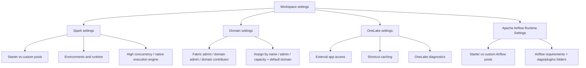

# 01. Fabric Workspace Settings

> **Exam domain:** Domain 1 — Implement and manage an analytics solution (30–35%)
> **Source:** `certification/01-fabric-workspace-settings/` — 5 files condensed
> **Why the exam cares:** This is the "who configures what, at which level, and what breaks if you get it wrong" domain area. Almost every question is a scenario that hands you a symptom (slow session start, a shortcut that never caches, a workspace that won't move domain, an Airflow job that ignores a new package) and expects you to name the exact setting, the exact role, and the exact numeric boundary that explains it.

---

## Orientation — the 60-second version

Microsoft Fabric is a SaaS analytics platform. You buy **capacity** (an F-SKU, e.g. F64), and inside that capacity you create **workspaces** — the container that holds items like lakehouses, notebooks, warehouses and pipelines. A workspace has a **settings** page, and four tabs on that page are what this topic tests.

**Spark settings** control the managed Apache Spark compute that notebooks and Spark job definitions run on: which pool they get (Microsoft's always-warm *starter pool*, or a *custom pool* you size yourself), which **environment** (a reusable bundle of Spark runtime + libraries + small shared files) is the default, and whether two accelerators — *high concurrency mode* and the *native execution engine* — are switched on.

**Domain settings** are governance, not compute. A **domain** is a label you attach to whole workspaces so a business unit (Finance, Marketing) can be found and partly self-governed. Domains never grant or remove data access — workspace roles and item permissions do all of that.

**OneLake settings** govern the storage layer. **OneLake** is the single, tenant-wide data lake every Fabric tenant automatically gets; you can't delete it or make a second one. Per workspace you decide whether tools outside Fabric may reach it, whether reads through external **shortcuts** (pointers to data living elsewhere) get cached, and whether data-access events get logged.

**Apache Airflow job settings** are the July 21 2026 blueprint's one Domain 1 change — Fabric's managed Apache Airflow runtime, with its own starter/custom pool model that deliberately rhymes with Spark's but is a completely separate compute platform.

## New terms in this topic

| Term | What it actually is |
| :--- | :--- |
| **Capacity / SKU** | The compute you buy (e.g. F64). Workspaces are assigned to one. Capacity admins hold settings that gate what workspace admins may do. |
| **Capacity Unit (CU)** | The unit capacity is sold in. 1 CU = 2 Spark vCores before burst. |
| **Starter pool** | A Microsoft-managed, already-running Spark cluster. Zero setup, near-instant sessions — but best-effort, not guaranteed. |
| **Custom pool** | A Spark pool you define in the workspace: node family, node size, autoscale and executor bounds all yours. |
| **Custom live pool** | A custom pool kept warm on a schedule so clusters are hydrated in advance — the fix for SLA-sensitive start times. |
| **Customized workspace pools** | The *capacity-level* toggle a capacity admin must switch on before any workspace admin can create or resize custom Spark pools. |
| **Environment (Spark)** | A Fabric workspace *item* bundling Spark compute (incl. runtime version + session properties), libraries, and resources (small shared files) into one reusable, versioned artifact you attach to notebooks/SJDs. |
| **Workspace default (Spark)** | What a notebook or SJD runs on when no environment is attached: the plain workspace-level Spark settings — unless an environment has been promoted to workspace default, in which case its config is inherited. |
| **Publishing mode** | How a library change is applied to an environment: **Quick mode** (fast publish, libraries install at session start) or **Full mode** (slow publish, stable prebuilt snapshot). |
| **Spark job definition (SJD)** | A Fabric item that runs a compiled/scripted Spark job (not an interactive notebook) on a schedule or on demand. |
| **Fabric Runtime** | The versioned bundle of Apache Spark + Delta Lake + native execution engine + default Java/Scala/Python/R packages. |
| **High concurrency mode** | Lets multiple compatible notebooks/pipeline notebook activities share one warm Spark session instead of each starting its own. |
| **REPL core** | The isolated slot each workload gets inside a shared high concurrency session, keeping its local variables separate from the other workloads in that session. |
| **Native execution engine (NEE)** | A vectorized C++ Spark execution path (Meta's Velox + Apache Gluten) that offloads supported operators off the JVM. No code changes needed. |
| **Domain** | A logical grouping of whole workspaces (and every item in them) around a business area, used for discovery and federated governance. |
| **Subdomain** | A finer grouping under a domain (e.g. Finance → Accounts Payable). Has name and description only — no admins of its own. |
| **Data mesh** | Decentralised architecture organising data by business domain instead of purely centralised IT ownership. Domains are Fabric's implementation of it. |
| **Fabric admin** | Tenant-wide role. The only role that can create, rename or delete a domain, and the only one that can assign domain admins. |
| **Domain admin** | Manages one specific domain: description, contributors, image, workspace assignment, delegated settings. Cannot rename or delete the domain. |
| **Domain contributor** | A workspace Admin authorised to assign *their own* workspaces to a domain, from inside the workspace's own settings. No admin-portal access. |
| **Default domain** | A domain auto-assigned to named users'/groups' *unassigned* and *future* workspaces. |
| **Delegated settings** | Specific tenant-level settings (default sensitivity label, certification) that a domain admin is allowed to override for their own domain. |
| **Domain image** | A picture or solid colour representing a domain in the OneLake catalog's domain filter. Purely cosmetic — no security or governance behaviour. |
| **OneLake** | The single, tenant-wide data lake included automatically with every Fabric tenant. Cannot be deleted or duplicated. |
| **OneLake catalog** | The discovery surface where items are browsed and filtered — including by domain. |
| **Shortcut** | A OneLake object referencing data at another location (internal or external) without copying it. |
| **Shortcut cache** | Per-workspace cache of files read through eligible *external* shortcuts, cutting cross-cloud egress cost and latency. |
| **Retention period** | The 1–28 day window a cached shortcut file stays cached before being purged if unaccessed. Every access resets the countdown. |
| **External app access** | The workspace setting ("Users can access data stored in OneLake with apps external to Fabric") allowing non-Fabric ADLS/Blob-compatible tools to read/write OneLake data. |
| **OneLake diagnostics** | Workspace setting that streams data-access events (who/what/when/how) as logs into a lakehouse you nominate. |
| **Cloud connection** | The credential/authorisation object an ADLS or S3 shortcut binds to. Needs its own permission, separate from workspace/item permissions. |
| **OneLake file explorer** | Windows client app that mounts OneLake inside Windows File Explorer using a placeholder/sync model (like OneDrive Files On-Demand). |
| **OPDG** | On-premises data gateway — the relay that lets Fabric reach on-prem sources. Its shortcuts are cache-eligible. |
| **BCDR** | Business continuity and disaster recovery: opt-in, capacity-level geo-replication to a paired Azure region. |
| **Soft delete** | Always-on, workspace-agnostic retention of deleted OneLake files for 7 days. Protects against human error, not regional failure. |
| **Data residency** | Guaranteeing OneLake requests stay inside one Azure region by targeting that region's dedicated endpoint instead of the global one. |
| **Lifecycle management (OneLake)** | Workspace-level default access tier (`Hot`/`Cool`/`Cold`) and policy status — readable only via the OneLake Settings REST API, not the portal UI. |
| **Apache Airflow job** | Fabric's managed, hosted Apache Airflow runtime for Python DAGs — the next generation of ADF's Workflow Orchestration Manager. |
| **Workflow Orchestration Manager** | The Azure Data Factory managed-Airflow feature that Fabric's Apache Airflow job supersedes. Still has diagnostic logs/metrics and Blob Storage integration that Fabric lacks. |
| **DAG** | Directed Acyclic Graph — Airflow's Python-defined workflow format. |
| **Airflow requirements** | The `requirements.txt`-style dependency declaration for an Airflow job's environment. |
| **`dags` folder** | Fabric-managed storage location for DAG `.py` files. Reserved for DAG definitions only. |
| **`plugins` folder** | Fabric-managed storage location for private/custom packages, operators, hooks and sensors (`.zip`, `.whl`, `.tar.gz`). |
| **`plugins/libs`** | The sub-folder you upload `.whl` files into when no Git repository is connected to the job. |
| **Extra node** | A custom Airflow pool add-on. Each one adds capacity for 3 more concurrent workers. |
| **Dataflows Gen2 staging items** | `DataflowsStagingLakehouse` / `DataflowsStagingWarehouse` — the per-workspace internal staging items Dataflow Gen2's compute engine creates automatically. The subject of the *retired* pre-July-2026 blueprint bullet. |
| **DataFactory MCP server** | `Microsoft.DataFactory.MCP`, a .NET tool exposing Airflow job operations to GitHub Copilot inside VS Code, authenticated via Microsoft Entra ID. |

## How the pieces fit



- **Three configuration levels, and the exam tests which owns what:** tenant (admin portal), capacity (capacity admin), workspace (workspace Admin). Custom Spark pools and custom Airflow pools each need a *capacity-level* toggle before a workspace admin can use them.
- **The starter-vs-custom pool pattern repeats twice** — once for Spark, once for Apache Airflow job — with different numbers. Never cross-apply them.
- **Environments are the reusable unit of Spark config**; the workspace default environment standardises a team.
- **Domains sit above workspaces**: discovery and delegated governance only, access untouched.
- **OneLake sits under everything** — one lake, three independent workspace levers (access, caching, diagnostics).

---

## 1. Spark Workspace Settings
*Source: `01-spark-settings.md`*

Every Fabric workspace ships with managed Apache Spark compute. **Workspace settings → Data Engineering/Science → Spark settings** is where you choose the default pool, set the environment and runtime, and enable accelerators.

### 1.1 Starter pools vs custom pools

**Starter pools** are Microsoft-managed clusters already running, so sessions typically start in 5–10 seconds with no setup. **Custom pools** are workspace-defined pools where you pick node family, node size and scaling behaviour.

| Aspect | Starter Pool | Custom Pool |
| :--- | :--- | :--- |
| Who configures it | Nobody — Microsoft-managed by default | Workspace **Admin**; capacity admin must also enable **Customized workspace pools** for the capacity |
| Node size | **Medium only** (8 vCore / 64 GB) | Small through XX-Large (X-Large / XX-Large require a **non-trial SKU**) |
| Startup latency | 5–10s typical, **best-effort** (prewarmed capacity is not guaranteed) | ~3 minutes on-demand, or ~5s if configured as a **custom live pool** (keeps dedicated clusters warm on a schedule) with a **Full-mode** environment |
| Autoscale / dynamic allocation | Sliders only, both **on by default** | Full control: min/max nodes, min/max executors |
| Networking | **Not supported** with Tenant Private Links or Managed VNets — falls back to on-demand (2–5 min) | Supported |
| Autopause | **20 minutes** of Spark pool inactivity | **2 minutes** of inactivity (default), or always-on as a custom live pool |
| Best for | Ad hoc development, quick iteration | Production workloads, predictable/tuned compute, workloads needing Private Link or Managed VNet |

> 🧠 **Mental model —** A starter pool is a taxi idling at the curb: grab it and go, but on a busy day none may be free and you wait (on-demand fallback). A custom pool is a car you configure and keep in your own garage: setup cost up front, exactly the size you specified, always where you left it.

> ⚠️ **Trap —** Do not assume starter pools always start in 5–10 seconds. That figure holds only when there are **no extra library dependencies**, **no custom Spark properties**, **prewarmed capacity is available in the region**, and the workspace has **no Private Link or Managed VNet**. Any of those pushes startup to **2–5 minutes**, plus a further **30s–5min** for library personalisation.

> 🔑 **Exam fact —** Autoscale and dynamic executor allocation affect scaling **of a running job**, not **session start latency**. High concurrency shares an **already-started** session; it does not make the *first* session start faster. If a scenario asks for predictable *startup*, the answer is a custom live pool + Full-mode environment.

**Distinctive use cases:** starter pools for interactive exploration and ad hoc analysis where start-time variability is fine; custom pools for production SJDs, Private Link/Managed VNet workloads, or any node size other than Medium; custom live pools for scheduled jobs with strict SLA start times.

### 1.2 Node sizes and capacity maths

Both pool types share one node size table. A Spark instance always has **one head node** (running the driver, Livy, and the YARN Resource Manager) and one or more **worker nodes** running the Spark Executor service, in a strict **1:1 node-to-executor ratio**. The exception is single-node pools, where driver and executor resources are split on the one node.

| Size | vCore | Memory |
| :--- | :--- | :--- |
| Small | 4 | 32 GB |
| Medium | 8 | 64 GB |
| Large | 16 | 128 GB |
| X-Large | 32 | 256 GB |
| XX-Large | 64 | 512 GB |

Capacity constrains node count: **1 capacity unit (CU) = 2 Spark vCores** before any burst multiplier. Worked example — an **F64** SKU has 64 CUs → **128 base Spark vCores**; a **3x burst multiplier** raises the ceiling to **384 Spark vCores** available for custom pool nodes.

### 1.3 Autoscale and dynamic executor allocation

Two independent, complementary settings exposed on **both** pool types, configured with sliders in workspace Spark settings, **both enabled by default on starter pools**:

- **Autoscale** — scales node count up/down between a configured **minimum and maximum node count** based on activity. Disabled = fixed node count. `spark.yarn.executor.decommission.enabled` defaults to **`true`**, letting underutilised nodes shut down automatically; set it to **`false`** for less aggressive scale-down.
- **Dynamically allocate executors** — Spark requests more executors as tasks exceed what current executors can handle, and releases them as jobs finish or the application idles. You configure **minimum and maximum executor** bounds; the system reserves executors at submission time based on the **minimum**.

> 📌 **Remember —** Autoscale = min/max **nodes**. Dynamic allocation = min/max **executors**. The exam swaps these deliberately.

### 1.4 Environments

An **environment** is a workspace item packaging **Spark compute** (including runtime version and session-level properties) + **libraries** + **resources** (small shared files) into one reusable, versioned artifact for notebooks and Spark job definitions.

With no environment attached, a notebook or SJD runs on **Workspace default** — plain workspace-level Spark settings. Attaching an environment, or promoting one to workspace default, gives governed reusable defaults instead of per-notebook configuration drift.

**Set an environment as workspace default:** Workspace settings → Data Engineering/Science → Spark settings → **Environment tab** → toggle **Set default environment** On → pick the environment item. Once on:

- Notebooks and SJDs using **Workspace default** inherit that environment's Spark compute and library configuration.
- Only **workspace admins** can subsequently edit the contents of that default environment.

### 1.5 Libraries and publishing mode

Environments manage built-in runtime packages plus ones you add (public sources or custom uploads). Every library addition uses a **publishing mode**:

| Mode | Publish time | Session start impact | Use for |
| :--- | :--- | :--- | :--- |
| **Quick mode** | ~5 seconds | Libraries install at session start (**adds 30s–5min**) | Rapid iteration during development |
| **Full mode** | **3–6 minutes** | Stable snapshot deploys at session start (**adds 1–3 min**), or **~5s** if paired with a custom live pool | Pipelines, scheduled runs, shared/production workloads |

Changes to **Libraries** or **Spark compute** are staged on **Save** and only take effect after **Publish**. Changes under **Resources** are **real-time** and need no publish step. An environment accepts **only one publish operation at a time**.

> ⚠️ **Trap —** Attaching an environment from a **different workspace** silently drops that environment's **compute configuration** — the session uses the *current* workspace's pool and compute settings instead. Only **libraries and resources** carry over. Both workspaces must also share the **same capacity and network security settings**, or the session fails to start.

### 1.6 Runtime versions

Fabric Runtime bundles Apache Spark, Delta Lake, the native execution engine, and default-level Java/Scala/Python/R packages.

| Component | Runtime 1.3 | Runtime 2.0 |
| :--- | :--- | :--- |
| Release stage | **GA** | **Public Preview** |
| Apache Spark | 3.5.5 | 4.1 |
| Operating system | Mariner 2.0 | Mariner 3.0 |
| Java | 11 | 21 |
| Scala | 2.12.17 | 2.13.16 |
| Python | 3.11 | 3.13 |
| Delta Lake | 3.2 | 4.1 |

All new workspaces default to the latest **GA** runtime, currently **Runtime 1.3**. Two places to change it:

- **Workspace level** — Workspace settings → Data Engineering/Science → Spark settings → **Environment tab** → select runtime version → **Save**. Applies to all **system-created items** (lakehouses, Spark job definitions, notebooks) starting from their **next** Spark session; an already-running session keeps its current runtime until it restarts.
- **Environment item level** — open the environment → pick a runtime under the **Runtime** dropdown → **Save** → **Publish**.

On a runtime change Fabric attempts to migrate compatible Spark settings and libraries automatically; **incompatible settings are dropped with a warning**, and **JAR-based libraries are the most likely to break** because of Scala/Java/OS version shifts. Review the library management conflict log after any runtime change.

### 1.7 High concurrency mode

**High concurrency mode** lets compatible workloads share a single running Spark session instead of each starting its own. It applies to both **notebooks** and **pipeline-triggered notebook activities**.

Session sharing requires **all** of the following to match:

- **Single-user boundary** (same user)
- **Same default Lakehouse configuration**
- **Same Spark compute settings**

Each workload gets its own **REPL core** inside the shared session, isolating local variables from other workloads. New workloads are scheduled across REPL cores using **FAIR scheduling**. Because the session is already warm, subsequent workloads start up to **36x faster** than a standalone session on custom pools.

**Billing:** only the notebook or pipeline activity that **initiates** the shared session is billed. Sessions that join and share it are not billed separately, and **Capacity Metrics attributes usage to the initiating notebook only** — identical behaviour for pipeline activities.

**Session limit:** default **5 notebooks** per high concurrency session, raisable to **50** by setting `spark.highConcurrency.max` as a Spark property inside the **Environment** item attached to the notebooks or pipeline → **Save** → **Publish**. All consumers of that environment inherit the new limit.

> 🧠 **Mental model —** A shared conference room instead of a private office per meeting. Everyone gets their own table (REPL core) so nobody's notes get mixed up, but only whoever booked the room first pays the rental fee.

> ⚠️ **Trap —** Raising `spark.highConcurrency.max` improves cost efficiency through higher notebook density but **weakens isolation** between workloads. Raise it deliberately.

### 1.8 Native execution engine (NEE)

A **vectorized C++ execution path** (built on Meta's **Velox** and **Apache Gluten**) that offloads supported Spark operators from the JVM to native code for faster, cheaper execution — **no code changes required**. Works with **Parquet, Delta and CSV**, and supports **both Runtime 1.3 (Spark 3.5) and Runtime 2.0 (Spark 4.1)**.

> ⚠️ **Trap —** NEE's tenant/workspace/environment-level enablement mechanisms are still under active development. Treat the **whole feature as preview** on the exam, even though individual runtime versions it runs on may be GA.

**Enable at environment level** (applies to all jobs/notebooks using that environment): open the environment → **Spark compute → Acceleration** tab → check **Enable native execution engine** → **Save** and **Publish**.

**Enable per notebook or Spark job definition** with a Spark property at the top of the session:

```python
%%configure
{
   "conf": {
       "spark.native.enabled": "true"
   }
}
```

**Disable for a single cell** (e.g. a query using an unsupported operator), then re-enable for later cells — Spark executes cells sequentially, so the setting persists until changed again:

```python
spark.conf.set('spark.native.enabled', 'false')
```

### 1.9 NEE automatic fallback and limitations

If NEE can't execute part of a query — unsupported operator, format, or configuration — execution **automatically falls back to the standard JVM Spark engine** for that portion, with **no interruption to the job**. It never blocks a job outright; it silently costs you the speed-up.

Key limitations:

- **No structured streaming support**
- **JSON and XML are not accelerated** (CSV **is** supported, via a vectorized parser)
- **ANSI SQL mode is not supported** — enabling `spark.sql.ansi.enabled` forces a **full** fallback of the entire query, not a partial one
- **Date comparisons need matching types on both sides** — cast explicitly, e.g. `CAST(order_date AS DATE) = '2026-05-20'`

> 🔑 **Exam fact —** Unsupported **operator** = only that segment falls back, the rest still runs natively. **ANSI mode enabled** = the **entire** query falls back. Neither fails the job.

**Verify whether an operation ran natively** three ways:

- Spark UI / Spark History Server — look for node names ending in `Transformer`, `NativeFileScan`, or `VeloxColumnarToRowExec`
- `df.explain()` — look for the same suffixes
- Real-time **Fabric Spark Advisor** alerts surfaced directly in notebook cell output

**Distinctive use cases:** large Parquet/Delta scans, complex aggregations and joins, cost-sensitive batch and ETL workloads. Pilot it on non-streaming Parquet/Delta workloads before enabling broadly.

### 1.10 Who can change what (Spark)

| Setting | Who can change it |
| :--- | :--- |
| Attach/change an environment on a notebook or SJD | Any user with **edit access to that item** |
| Configure starter pool autoscale / dynamic allocation | Workspace **Admin** |
| Create or resize a **custom** Spark pool | Workspace **Admin** — *and* the **capacity admin** must first enable **Customized workspace pools** for that capacity |
| Set an environment as the workspace default | Workspace **Admin** (only admins can edit the environment's contents afterwards) |
| Change the workspace-level default runtime | Workspace **Admin**, via Spark settings → Environment tab |

> 🔑 **Exam fact —** A **Contributor** cannot create a custom Spark pool, regardless of the capacity setting. Admin role is required first, capacity toggle second.

### 1.11 Common issues and errors (Spark)

| Issue | Cause | Resolution |
| :--- | :--- | :--- |
| Session start much slower than expected | Starter pool with library dependencies, regional capacity exhaustion, or Private Link/Managed VNet enabled | Use a custom live pool for predictable starts, or a Full-mode environment on a hydrated pool |
| Can't create/resize custom pool | Missing workspace Admin role, or capacity admin hasn't enabled Customized workspace pools | Request Admin role; ask capacity admin to enable the capacity setting |
| Environment change didn't take effect | Forgot to **Publish** after **Save**, or an active session hasn't restarted | Publish the environment; start a new session |
| Query silently reverts to JVM performance | NEE hit an unsupported operator/format/ANSI mode | Check Spark UI for fallback nodes; rewrite the query or disable NEE for that cell |
| High concurrency session not shared as expected | Sessions differ in default Lakehouse or Spark compute settings, or exceed the 5-notebook default limit | Align compute/Lakehouse settings; raise `spark.highConcurrency.max` in the environment |
| Library conflict after a runtime change | JAR dependencies incompatible with the new runtime's Scala/Java/OS versions | Review the library management conflict log; update or replace affected JARs |

---

## 2. Domain Workspace Settings
*Source: `02-domain-settings.md`*

### 2.1 Domains and subdomains

A **domain** is a logical grouping of workspaces — and by extension every item inside them — around a business area (Finance, Marketing, HR). Fabric's approach here is a **data mesh**: instead of purely centralised IT-owned governance, each business unit manages its own data by its own rules while some governance stays centralised at the tenant.

When a workspace is assigned to a domain, **every item in that workspace inherits the domain as metadata**. This mainly improves **consumption**: users filter the **OneLake catalog** by domain to find relevant content, and some tenant-level governance settings can be **delegated** to the domain.

A **subdomain** refines the grouping further (e.g. "Finance → Accounts Payable"). Subdomains have **general settings only** — name and description — and critically **a subdomain has no domain admins of its own**; its parent domain's admins manage it.

> ⚠️ **Trap —** Domain assignment does **not** change who can see or access a workspace's items. Discovery, visibility and access still depend entirely on **workspace role and item permissions**. Every tenant user can see **every domain name** in the domain selector regardless of their role in it — domains organise and filter, they don't gate.

### 2.2 Domain roles

| Role | Grants | Scope |
| :--- | :--- | :--- |
| **Fabric admin** (or higher) | Create/edit/delete domains, assign domain admins and contributors, associate any workspace with any domain | Every domain in the tenant |
| **Domain admin** | Update domain description, define/update domain contributors, assign workspaces to the domain, set the domain image, override delegated tenant settings for the domain | Only the domain(s) they administer — **cannot delete the domain, rename it, or manage other domain admins** |
| **Domain contributor** | Assign the workspaces **they are workspace Admin of** to the domain, or change that workspace's current domain assignment | Only workspaces where they hold the workspace **Admin** role — **no access to the admin portal's Domains tab** |

Only a **Fabric admin** can create a new domain: **Admin portal → Domains tab → Create new domain**. Creating a **subdomain** needs Fabric admin **or** domain admin of the parent domain.

> 🧠 **Mental model —** The tenant is a shopping mall. **Fabric admin** = mall management, can open new stores (domains) anywhere. **Domain admin** = store owner, full control of their own store, no say over anyone else's. **Domain contributor** = stockroom manager who can move their own store's inventory (workspaces they admin) between shelves (domains) but can't touch the storefront.

> 🔑 **Exam fact —** Domain contributors assign workspaces from **inside the workspace's own settings**, never from the admin portal.

### 2.3 Assigning workspaces to domains

Fabric admins and domain admins assign from the **Domains** tab in the admin portal, three ways:

| Method | How it works | Notes |
| :--- | :--- | :--- |
| **By workspace name** | Search and multi-select workspaces directly | Useful when naming conventions already encode business context |
| **By workspace admin** | Select users/security groups; every workspace they admin is assigned | **Excludes "My workspaces"**; affects **existing workspaces only**, not future ones the same people create |
| **By capacity** | Select one or more capacities; every workspace on those capacities is assigned | Fits organisations with dedicated capacities per department; **excludes "My workspaces"**; **existing workspaces only** |

If a workspace is already assigned to a different domain, assigning it again triggers a **warning** — the reassignment only proceeds and **overrides** the prior assignment if the tenant setting **Allow tenant and domain admins to override workspace assignments (preview)** is enabled. This is a **tenant-level preview setting**, controlled by a tenant admin from the admin portal's domain management settings page. It is the gatekeeper deciding whether *any* Fabric or domain admin can forcibly move an already-assigned workspace, independent of which of the three assignment methods they use.

**Strict one domain (or subdomain) per workspace.** Reassignment makes a workspace fully leave the old domain — **no dual membership, no inheritance across sibling domains**. If data spans two business areas, either use a shared-ownership workspace assigned to the primary owner's domain, or split it across two workspaces assigned independently. This single-assignment model is what makes **by capacity** and **by workspace admin** bulk assignment safe to re-run: always deterministic and non-overlapping.

### 2.4 Default domain

Defining a domain as the **default domain** for specified users and/or security groups automates future assignment:

1. Fabric scans **existing** workspaces. For any workspace whose admin is a listed user or group member:
   - Already has a domain → that assignment is **preserved** (default domain never silently overrides).
   - Unassigned → assigned to the default domain.
2. Going forward, **any new workspace** created by a listed user or group member is **automatically assigned** to the default domain.

Users covered by a default-domain definition generally also **become domain contributors** on the workspaces assigned to them through this mechanism. Setting a domain as default requires **Fabric admin or that domain's domain admin**.

> ⚠️ **Trap —** Default domain assignment is **one-directional and non-destructive**. It only fills gaps (unassigned workspaces) and governs future workspace creation. It **never** reassigns a workspace already belonging to a different domain — that needs an explicit, override-enabled reassignment.

### 2.5 Delegated settings

Some tenant-level governance settings can be **delegated** to individual domains, letting each business unit set its own rules within a delegation the tenant admin authorised. Configured from **Domain settings → Delegated Settings**:

- **Domain-level default sensitivity label** — if the tenant enables the feature, a domain admin (or Fabric admin) specifies a sensitivity label applied by default to items in workspaces assigned to that domain.
- **Certification settings** — a domain admin can override the tenant's certification configuration for the domain: enable/disable certification for domain items, specify domain-specific certifiers, and link to domain-specific certification documentation. Requires explicitly checking **Override tenant admin selection**.

Other tabs on the Domain settings pane (general settings, image, admins, contributors, default domain) are **domain-management settings in their own right**, not delegated tenant settings.

### 2.6 Domain settings side pane reference

Open a domain → **Domain settings**, or hover a domain on the Domains tab → **More options → Settings**. Six tabs:

| Tab | Configures | Minimum role |
| :--- | :--- | :--- |
| **General settings** | Name and description | Fabric admin (full edit); domain admin (**description only**) |
| **Image** | Domain image/colour shown in the OneLake catalog | Fabric admin or domain admin |
| **Admins** | Who the domain admins are | **Fabric admin only** |
| **Contributors** | Who can assign workspaces to the domain (everyone by default, or restricted to specific users/groups, or tenant+domain admins only) | Fabric admin or that domain's domain admin |
| **Default domain** | Users/groups whose unassigned and future workspaces auto-assign here | Fabric admin or that domain's domain admin |
| **Delegated Settings** | Overrides for tenant-level settings (sensitivity label, certification) | Fabric admin or that domain's domain admin |

**Subdomains expose only the General settings tab.** Every other tab (Admins, Contributors, Default domain, Delegated Settings) is domain-only — reinforcing that a subdomain always inherits its parent's admins and governance.

### 2.7 Domains vs subdomains at a glance

| Aspect | Domain | Subdomain |
| :--- | :--- | :--- |
| Own admins | Yes — assigned by a Fabric admin | **No** — always the parent domain's admins |
| Own contributors | Yes | No — governed by the parent |
| Settings tabs available | All six | General settings only |
| Can be a default domain | Yes | No |
| Can receive delegated tenant settings | Yes | No |
| Created by | Fabric admin | Fabric admin **or** the parent domain's domain admin |

### 2.8 Creating a domain and a subdomain

**Domain** (Fabric admin only):

1. Admin portal → **Domains** tab.
2. Select **Create new domain**.
3. In the **New domain** dialog provide a **name** (mandatory) and optionally specify domain admins — admins can also be added later from domain settings.
4. Select **Create**.

**Subdomain** (Fabric admin or the parent domain's domain admin):

1. Open the parent domain → select **New subdomain**.
2. Provide a name in the **New subdomain** dialog.
3. Select **Create**.

Creating the domain itself **doesn't move or associate any data** — you organise data into it by **assigning workspaces**.

### 2.9 Domain image, auditing and the REST API

- **Domain image** — each domain can be assigned an image (or a solid colour) representing it in the OneLake catalog. When a user filters the catalog to a domain, the image becomes part of the catalog's theme. Purely cosmetic for discovery; **no security or governance behaviour**. Configure via **Domain settings → Image → Select an image**.
- **Auditing** — every domain lifecycle event (creation, edit, deletion) is written to Fabric's **audit log**, viewable through the unified **Microsoft Purview audit log** or the **Fabric activity log**. Domain-specific fields captured include **actor, target domain, and before/after values**. If a workspace unexpectedly changes domains, or delegated settings shift, check the audit trail *before* assuming a bug.
- **REST API** — nearly every admin-portal domain action (create a domain, assign workspaces, update admins/contributors, read delegated settings) is exposed through the **Fabric REST Admin API for domains**. This is the scalable answer for **bulk** reassignment of hundreds of workspaces. The API honours the **same role requirements as the UI** — the caller still needs Fabric admin or domain admin privileges for the actions they attempt.

### 2.10 Worked sequence: standing up governance for a new business unit

1. **Fabric admin** creates the domain and assigns an initial **domain admin** from the business unit.
2. **Domain admin** creates subdomains for finer grouping ("APAC", "EMEA") — they inherit the domain admin, so no per-region admin assignment.
3. Domain admin (or Fabric admin) uses **Assign workspaces → by capacity** to bulk-assign every workspace on the unit's dedicated capacity in one action.
4. Domain admin designates team leads as **domain contributors** so future ad hoc workspaces they admin can self-assign without a Fabric admin.
5. Domain admin sets the domain as **default domain** for the unit's security group, capturing new workspaces going forward.
6. Optionally, if the tenant enabled domain-level default sensitivity labels, the domain admin overrides the tenant default under **Delegated Settings** — that delegation only, not governance broadly.

Everything else — item-level access, audit logging, endorsement — stays governed exactly as before the domain existed.

> 📌 **Remember —** Operating guidance the source stresses: reserve **default-domain automation** for teams with a stable, predictable workspace-creation pattern. Delegate sensitivity-label and certification settings **only to domains with a designated data owner** who understands the org's classification scheme. Enable **Allow tenant and domain admins to override workspace assignments** deliberately, not by default — accidental bulk reassignment disrupts teams relying on their domain's delegated settings. Document who your domain **admins** vs **contributors** are: they have very different blast radii.

### 2.11 Common issues and errors (Domains)

| Issue | Cause | Resolution |
| :--- | :--- | :--- |
| Domain contributor can't assign a workspace | They aren't the workspace **Admin** for that workspace | Grant them the workspace Admin role, or have an actual admin assign it |
| Reassigning a workspace to a new domain silently fails to override | **Allow tenant and domain admins to override workspace assignments (preview)** tenant setting is disabled | Enable the tenant setting, or unassign then reassign manually |
| Expected auto-assignment didn't happen for an existing workspace | The workspace was already assigned to a different domain — default domain never overrides existing assignments | Manually reassign if that's actually desired |
| Domain admin can't rename the domain | Only Fabric admins can rename or delete a domain; domain admins can edit **description only** | Have a Fabric admin perform the rename |
| Subdomain has no admins listed | Subdomains never have their own domain admins — they inherit the parent's | Manage the subdomain via the parent domain's admins |
| A workspace's domain changed unexpectedly and nobody remembers doing it | Bulk assignment (by admin or by capacity) or the Domains REST API reassigned it as a side effect | Check the Fabric/Purview audit log for the domain change event and its actor before assuming a bug |
| User can't see a "Delegated Settings" override option on a domain | The underlying feature (e.g. domain-level default sensitivity label) isn't enabled at the tenant level yet | Ask the tenant admin to enable it tenant-wide before it can be delegated |
| Domain contributor tries to configure Delegated Settings and can't | Contributors can only assign workspaces — Delegated Settings needs domain admin or Fabric admin | Escalate to the domain admin or a Fabric admin |

---

## 3. OneLake Workspace Settings
*Source: `03-onelake-settings.md`*

### 3.1 OneLake availability and workspace-level access

Every Fabric tenant automatically includes **exactly one** OneLake instance — you **cannot delete it or provision a second one**. Data is organised hierarchically: **tenant → workspace → data items** (lakehouses, warehouses, eventhouses, KQL databases, and so on), with domains layered on top purely for grouping and discovery.

"OneLake availability" at the **workspace** level is about whether tools *outside* Fabric can reach that workspace's OneLake data directly. Under **Workspace settings → OneLake**, the setting **Users can access data stored in OneLake with apps external to Fabric** controls this:

- **Off by default in many tenants.** When enabled, external ADLS Gen2-/Blob-compatible tools (Azure Storage Explorer, custom scripts using the ADLS SDK) can read/write that workspace's OneLake data using **standard ADLS Gen2 APIs**.
- Can be scoped to the **entire organisation** or to **specific security groups**, depending on tenant policy.
- Requires the workspace **Admin** role to change.

> ⚠️ **Trap —** Do not conflate **"OneLake external app access"** (a *workspace* setting governing ADLS-API-level reachability) with **"OneLake file explorer access"** (a *tenant* setting governing one specific Windows client app). They are independently controlled and answer different exam questions.

### 3.2 The three workspace OneLake settings

| Setting | What it controls | Who can change it |
| :--- | :--- | :--- |
| **External app access** | Whether non-Fabric ADLS/Blob-compatible tools can read/write this workspace's OneLake data | Workspace Admin |
| **Shortcut cache** | Enable/disable caching for eligible external shortcuts, set retention period, reset cache | Workspace Admin |
| **OneLake diagnostics** | Stream data-access events (who accessed what, when, how) as logs into a lakehouse | Workspace Admin |

**OneLake diagnostics**, when enabled, captures **user actions from the Fabric UI**, **programmatic API/analytics-engine access**, and **cross-workspace access through shortcuts** — all streamed as logs into a lakehouse you designate at enable time. Diagnostics is about **auditability**; caching is about **performance and egress cost**.

Symptom → lever mapping the exam leans on:

| Setting | Solves | Doesn't solve | Configured by |
| :--- | :--- | :--- | :--- |
| **External app access** | Letting non-Fabric ADLS/Blob-compatible tools read/write this workspace's OneLake data | Performance of repeated reads; access auditing | Workspace Admin |
| **Shortcut cache** | Egress cost and latency for repeated reads through eligible external shortcuts (GCS/S3/S3-compatible/OPDG) | External tool access; compliance logging | Workspace Admin |
| **OneLake diagnostics** | Compliance/audit visibility into who accessed what data, when, and how | Performance; external tool access | Workspace Admin (destination lakehouse chosen at enable time) |

> 🔑 **Exam fact —** "Our cross-cloud egress bill is too high" → **shortcut caching**. "Auditors need an access trail" → **diagnostics**. "Our data science team wants to point Azure Storage Explorer at this lakehouse" → **external app access**. Three independent levers, not one "OneLake access" toggle.

**Low-yield REST-API-only surface (skim only):** workspace OneLake settings are also readable via the **OneLake Settings REST API** — `GET /v1/workspaces/{workspaceId}/onelake/settings`, admin workspace role required. It additionally surfaces **lifecycle management** fields — a **default access tier (`Hot` / `Cool` / `Cold`,** mirroring Azure Blob Storage tiering; Cool/Cold trade lower storage cost for higher transaction cost and a minimum storage duration) and whether an **active lifecycle policy** exists — plus **diagnostic-log immutability policy** details (protected scope, minimum retention days). None of this appears in the in-portal settings UI at time of writing.

### 3.3 Cache for shortcuts

Shortcut caching reduces **egress costs** for cross-cloud data access. When OneLake reads a file through an eligible external shortcut it stores that file in a **per-workspace cache**; subsequent reads are served from the cache instead of round-tripping to the remote storage provider.

| Rule | Value |
| :--- | :--- |
| Supported shortcut sources | **Google Cloud Storage (GCS), Amazon S3, S3-compatible, and on-premises data gateway (OPDG) shortcuts only** — including on-prem S3 shortcuts using Microsoft Entra service principal auth |
| Retention period | Configurable **1–28 days**; **resets on every access** |
| Max cacheable file size | Files **> 1 GB are never cached** |
| Freshness | If the remote source has a newer version than the cached copy, OneLake **serves from the source and refreshes the cache** |
| Purge | Auto-purged if unaccessed within the retention window, or manually via **Reset cache** |

**To enable:** **Workspace settings → OneLake tab** → toggle caching **On** → set the **Retention Period**. **Reset cache** on the same page immediately clears **all** cached files for the workspace.

> ⚠️ **Trap —** **ADLS Gen2 and Azure Blob Storage shortcuts are NOT cache-eligible.** Shortcut caching exists specifically to cut cross-cloud egress cost, and Azure-native sources don't have that problem when read from a Fabric workspace on Azure. Never pick an ADLS shortcut as the answer to a "which shortcut benefits from caching" question.

> ⚠️ **Trap —** **Reset cache is workspace-wide**, not per-shortcut. It purges every cached file for that workspace.

> 🧠 **Mental model —** A browser cache for a site you revisit often. First load reaches the remote source; every read inside the retention window serves the local copy, and the window resets each visit. Go unused past the window and it's evicted; a fresher version at the source always wins.

**Item-type coverage:** shortcut caching benefits shortcuts created in **lakehouses** and **KQL databases** — the two item types where OneLake shortcuts can be created at all. **External app access** and **OneLake diagnostics** are workspace-level and apply uniformly to **every** item in the workspace (lakehouse, warehouse, eventhouse, and so on), because they govern the OneLake surface underneath all of them.

**Cloud connections — how external shortcuts authorise.** ADLS and S3 shortcuts do **not** embed credentials; they delegate authorisation through a **cloud connection**. Creating one means creating a new connection or binding to an existing one, and that bind requires **permission on the connection itself**, separate from workspace or item permissions — without it you cannot create the shortcut even with full edit rights on the lakehouse. Caching optimises **reads** through an already-working shortcut; the connection bind governs whether it can be **created** at all.

### 3.4 OneLake file explorer implications

The **OneLake file explorer for Windows** integrates OneLake into Windows File Explorer, letting users drag-and-drop **CSV, Excel and Parquet** files directly into OneLake without the Fabric portal or scripts.

- **Placeholder/sync model, not a full copy.** "Sync" pulls up-to-date **metadata** for files and folders and pushes local changes back to OneLake — it does **not** download file contents automatically. A file downloads to disk only when you **double-click** it. Files synced but not opened stay as lightweight cloud-only placeholders (**blue cloud icon**).
- **One-way automatic sync.** Changes made *inside* File Explorer sync to OneLake automatically. Changes made by someone else, or outside your File Explorer session, are **not** automatically pulled — you must manually **right-click → OneLake → Sync from OneLake**. Double-clicking only downloads the file's current (possibly stale) placeholder content; it does **not** force a metadata refresh from the service.
- **Shortcuts are visible and editable.** All folders in an item, including OneLake shortcuts, appear in the file explorer, and you can view, update and delete files/folders through them — subject to your permissions on the shortcut's target.
- **Case sensitivity mismatch.** Windows File Explorer is **case-insensitive**; OneLake is **case-sensitive**. If two files differ only by case, File Explorer shows **only the oldest one**.
- **Tenant-level kill switch.** A tenant admin can disable OneLake file explorer for the entire organisation from the Fabric admin portal. If disabled while the app is running it **exits immediately** — local placeholders and previously downloaded content **remain on disk**, but no further sync in either direction happens until re-enabled.

> 🧠 **Mental model —** OneDrive's Files On-Demand, not a mapped network drive with everything downloaded upfront. Icons tell you the state: **blue cloud = online-only**, **green check = downloaded locally**, **spinning arrows = syncing**.

### 3.5 Data residency and regional endpoints

External access interacts with **where** OneLake requests route. The default **global endpoint** `https://onelake.dfs.fabric.microsoft.com` can, during endpoint resolution, route a request **through a different region than the workspace's own** — a problem under data-residency requirements. Each workspace's capacity is pinned to a region, and OneLake also exposes **regional endpoints** in the form `https://<region>-onelake.dfs.fabric.microsoft.com` (for example `westus-onelake.dfs.fabric.microsoft.com`). Tools or scripts that must guarantee in-region traffic — relevant once external app access is enabled — should target the **regional** endpoint matching the workspace's capacity region, not the global one.

### 3.6 Disaster recovery and data protection

Automatic, independent of any workspace toggle:

- **Redundancy** — **zone-redundant storage (ZRS)** in regions with availability zones, **locally redundant storage (LRS)** elsewhere.
- **BCDR** — can be enabled at the **capacity** level to geo-replicate data to a **paired Azure region**, protecting against region-wide outages. **Opt-in.**
- **Soft delete** — deleted files retained for **7 days**, giving a recovery window for accidental deletions. Applies regardless of whether shortcut caching or diagnostics are configured. **Always on, workspace-agnostic.**

> 🔑 **Exam fact —** **BCDR** = opt-in, capacity-level, geo-replication, protects against a **whole-region outage**. **Soft delete** = always-on, 7 days, protects against **human error**. Neither is a workspace OneLake setting, but both appear alongside caching and diagnostics under "OneLake data protection and monitoring".

### 3.7 OneLake catalog and governance context

The **OneLake catalog** is the discovery surface: a workspace with external access enabled, caching configured and diagnostics on still surfaces its items through the same catalog used for domain-based filtering. Data owners can review **sensitivity-label coverage, endorsements and data location** there — but access control always resolves through **OneLake security roles** and workspace/item permissions, **not catalog visibility**.

### 3.8 Which level owns which setting

| Level | Setting | Who configures |
| :--- | :--- | :--- |
| **Tenant** | Whether the OneLake file explorer app can run at all in the organisation | Tenant admin, Fabric admin portal |
| **Capacity** | Business continuity / disaster recovery (BCDR) geo-replication | Capacity admin |
| **Workspace** | External app access, shortcut caching, OneLake diagnostics | Workspace Admin |

> 🔑 **Exam fact —** "We need to stop everyone in the company using OneLake file explorer" is a **tenant** setting question, not a workspace OneLake settings question — even though both sound like "OneLake access". Keeping the three levels straight is the most reliable way to eliminate distractors on this topic.

> 📌 **Remember —** Operating guidance the source stresses: review all **three** workspace OneLake settings together at workspace **provisioning** time, not reactively one at a time after an incident. Turn **diagnostics on before**, not after, a compliance requirement lands — it captures nothing retroactively. And **communicate the tenant-level file explorer kill switch to end users before disabling it**, since their local placeholders remain on disk but silently stop syncing.

### 3.9 Common issues and errors (OneLake)

| Issue | Cause | Resolution |
| :--- | :--- | :--- |
| External ADLS tool can't reach workspace data | "Users can access data stored in OneLake with apps external to Fabric" is disabled | Workspace Admin enables it in Workspace settings → OneLake |
| ADLS Gen2 shortcut reads still hit the remote source every time | ADLS shortcuts aren't cache-eligible | Expected behaviour — caching only covers GCS/S3/S3-compatible/OPDG shortcuts |
| Cached shortcut data seems stale | Retention window hasn't expired and source hasn't changed since last read | Use **Reset cache** to force a purge, or wait for the source to actually update |
| OneLake file explorer won't start | Tenant admin disabled the app tenant-wide, or Windows search is disabled | Confirm the tenant setting with a tenant admin; re-enable Windows search |
| File explorer shows only one of two similarly-named files | Case-sensitivity mismatch: OneLake case-sensitive, Windows File Explorer case-insensitive | Rename one file to avoid case-only collisions, or manage it through a case-respecting tool |
| New ADLS/S3 shortcut creation fails despite having Contributor access | Creator lacks permission on the **cloud connection** the shortcut would bind to | Grant permission on the connection, or have a user with connection permission create it |
| Diagnostic logs never arrive in the target lakehouse | Diagnostics enabled but no destination lakehouse selected, or the selected lakehouse was later deleted | Re-open OneLake diagnostics settings and confirm/reselect a valid destination lakehouse |

---

## 4. Apache Airflow Job Workspace Settings
*Source: `04-airflow-settings.md`*

> 🔑 **Exam fact —** This topic is the **July 21, 2026 blueprint's one change to Domain 1**: **"Configure Dataflows Gen2 workspace settings"** was replaced by **"Configure Apache Airflow workspace settings."** Dataflows Gen2 itself has **not** been removed from Fabric — only the workspace-settings *skill bullet* changed. **Every other Domain 1 bullet is unchanged from the April 20, 2026 blueprint.**

### 4.1 Legacy: Dataflows Gen2 workspace settings (pre-July 21, 2026)

The old bullet covered workspace-level **staging and compute** behaviour for Dataflow Gen2 — specifically the internal staging Lakehouse/Warehouse (**`DataflowsStagingLakehouse` / `DataflowsStagingWarehouse`**) that Dataflow Gen2's compute engine creates automatically **per workspace**, plus the staging-related options controlling whether a dataflow's transformations route through that Fabric-managed compute layer before landing in a destination.

**Not tested from July 21, 2026.** If your exam date is on or after that, skip it. If your exam date is **before** July 21, 2026, this older skill may still be in scope for you.

### 4.2 What Apache Airflow job is

Part of Fabric's **Data Factory** experience. You author Python-based **DAGs** — Airflow's native orchestration format — and run them at scale without managing Airflow infrastructure yourself. Aimed at teams who already know Airflow or prefer code-first orchestration; teams wanting no-code should use **pipelines** instead.

| Detail | Value |
| :--- | :--- |
| Supported Apache Airflow version | **2.10.5** — changing versions on an existing job is **not supported**; create a new job instead |
| Supported Python version | **3.12** |
| Workspace requirement | Must have an **assigned capacity**; **Free** and **Premium Per User (PPU)** workspaces do **not** support Apache Airflow jobs |
| Networking | Private networks and virtual networks **not currently supported** |

**Choosing Airflow vs pipelines:** reach for Apache Airflow job when the team already knows Airflow, needs Python-first control flow, or depends on the Airflow provider ecosystem (e.g. `astronomer-cosmos` for dbt). Reach for a **pipeline** when no-code, drag-and-drop authoring is the priority.

### 4.3 Pool settings: starter pool vs custom pool

Same two-tier model as Spark: a **starter pool** configured by default, and **custom pools** you create per workspace.

| Property | Starter Pool (default) | Custom Pool |
| :--- | :--- | :--- |
| Compute node size | **Large** (fixed) | Configurable — **Large** for complex/production DAGs, **Small** for simpler DAGs |
| Startup latency | Instantaneous | Starts from a stopped state |
| Resume latency | Up to **5 minutes** | Up to **5 minutes** |
| Uptime behaviour | Shuts down after **20 minutes** of Airflow environment inactivity | **Always on** until manually paused |
| Suggested environment | Developer | Production |

If the **capacity-level setting for customizing compute configurations is disabled**, the **starter pool is used for all Airflow environments in the workspace**, regardless of what you'd otherwise configure.

> 🧠 **Mental model —** Same pattern as Spark: the starter pool is an always-idling, right-sized loaner that goes away when you stop using it (20-minute inactivity shutdown); a custom pool is a dedicated machine you size and keep running — parked, not put away, until you explicitly pause it.

> ⚠️ **Trap —** Don't confuse Airflow's **20-minute starter-pool inactivity shutdown** with Spark's starter-pool behaviour. The numbers and mechanics are analogous in spirit (auto-deprovision when idle) but they are **separate settings on separate compute platforms**. A scenario naming "Apache Airflow job" is **not** asking about Spark pool settings, even though the vocabulary (starter/custom, autoscale) rhymes.

**Configure a custom pool:**

1. Go to **Workspace settings**.
2. In the **Data Factory** section select **Apache Airflow Runtime Settings**.
3. The **Default Data Workflow Setting** starts as **Starter Pool** — expand it and select **New Pool** to switch.
4. Configure: **Name**; **Compute node size** (`Large` for complex/production DAGs, `Small` for simpler ones); **Enable autoscale** (scales nodes up/down on demand); **Extra nodes** — **each additional node adds capacity for 3 more concurrent workers**.
5. Select **Create**.

### 4.4 Environment configuration and Airflow requirements

Each Apache Airflow job has Fabric-managed file storage with a **`dags`** folder and, when needed, a **`plugins`** folder:

- **DAG files** (`.py`) live in the **`dags`** folder.
- **Airflow requirements** — the dependency list — are declared via a `requirements.txt`-style entry in the job's **Airflow requirements** configuration (example for a dbt-orchestration setup: `astronomer-cosmos` and `dbt-fabric`).
- **Private packages** (your own custom operators, hooks, sensors or plugins) must go in the **`plugins`** folder, **not `dags`** — packaged as **`.zip`, `.whl`, or `.tar.gz`**.

> ⚠️ **Trap —** Putting a private package in the **`dags`** folder instead of **`plugins`** is a documented gotcha. Airflow requirements resolution expects private/custom packages specifically in `plugins`; `dags` is reserved for DAG definition files.

**Adding a private package as a requirement — with a connected Git repository:**

1. Put your DAG file in the repo's `dags` folder and your private package in `plugins`.
2. Connect the Git repository to the Apache Airflow job.
3. Add the package under **Airflow requirements** using the path format:

```text
/opt/airflow/git/<repoName>/<pathToPrivatePackage>
```

For example, a package at `/dags/test/private.whl` in the repo becomes `/opt/airflow/git/<repoName>/dags/test/private.whl`.

**Without a connected Git repository:**

1. Upload the `.whl` file directly to the job's **`plugins/libs`** folder.
2. Reference it as a requirement using the relative path:

```text
plugins/libs/<your-wheel-file>.whl
```

3. **Restart the Apache Airflow job** for the new requirement to take effect.

> 📌 **Remember —** A `plugins/libs` wheel change needs an explicit job **restart**. A **Git-sync** change does **not** need a manual restart. Keep the declared dependencies **minimal and version-pinned** — the environment is rebuilt on restart, so unpinned packages drift between runs.

### 4.5 DAG file storage and the authoring loop

DAG files are Python (`.py`) files stored in the Airflow job's Fabric-managed **`dags`** folder. Create them in the Fabric portal (**New DAG file** → name it → Fabric provides boilerplate you edit), or push them via a **connected Git repository**, the **DataFactory MCP server**, or the **REST API**.

Once saved, DAG files load into the **Apache Airflow UI** — reachable from the job's **Monitor in Apache Airflow** button — where you trigger runs, watch status and inspect logs, separate from the Fabric portal's own monitoring surfaces.

**End-to-end authoring loop:**

1. **Create the item:** in an existing or new workspace, **+ New item** → **Data Factory** section → **Apache Airflow Job** → name the project → **Create**.
2. **Create a DAG file:** select the **New DAG file** card, name it, **Create**. Edit the scaffolded boilerplate, then **Save**.
3. **Run the DAG:** select **Run DAG**. A notification confirms the run started.
4. **Monitor the run:** select **View Details** in the notification to open the native **Apache Airflow UI** (the same web UI as open-source Airflow), or use **Monitor in Apache Airflow** at any time. Saved DAG files are always loaded into this UI.

This loop is **unaffected by pool choice** — pool selection changes compute behaviour only, not the create/save/run/monitor flow.

**Authoring DAGs outside the Fabric portal — two verified alternate paths:**

- **Git-connected workspaces** — connect a repository so `dags` and `plugins` folder contents sync from source control.
- **Visual Studio Code with GitHub Copilot** — the **DataFactory MCP server** (`Microsoft.DataFactory.MCP`, a .NET tool) exposes Airflow job operations (create, list, update, delete jobs; push/read DAG definitions; check run status) as Copilot-callable tools in VS Code, authenticated via **Microsoft Entra ID**. Same prerequisites: a workspace with an **assigned capacity** (Free and PPU unsupported) and permission to create items in it.

Neither path changes the `dags`/`plugins` structure or pool settings.

### 4.6 Fabric Apache Airflow job vs ADF Workflow Orchestration Manager

| Key feature | Apache Airflow Job (Fabric) | Workflow Orchestration Manager (ADF) |
| :--- | :--- | :--- |
| Git sync | Yes | Yes |
| Azure Key Vault (AKV) as backend | Yes | Yes |
| Install private package as requirement | Yes | Yes |
| Diagnostic logs and metrics | **No** | Yes |
| Blob Storage integration | **No** | Yes |
| Autoscale for production spikes | Yes | Partial |
| High availability | Yes | No |
| Deferrable operators (free idle workers) | Yes | No |
| Pause/resume TTL | Yes | No |

> ⚠️ **Trap —** Fabric's Apache Airflow job is **not a strict superset** of ADF's Workflow Orchestration Manager. It gains high availability, deferrable operators and pause/resume TTL, but currently **lacks diagnostic logs/metrics and Blob Storage integration** that ADF has. A "what do you lose in migration" question is answerable straight from this table.

### 4.7 Region availability

Available in most Azure regions where Fabric operates (Australia East, Canada Central, East US, North Europe, UK South, West Europe, and many more), with a handful marked **Coming soon** as of the July 2026 refresh (for example **Indonesia Central, Malaysia West, Qatar Central**). Region availability doesn't change any workspace setting — it only determines whether the item can be created in a workspace tied to a capacity in that region at all.

> 📌 **Remember —** Confirm target **region availability before provisioning a capacity** for an Airflow-heavy workload, since a subset of regions are still "Coming soon". Likewise, pin the Airflow **version expectation at project kickoff** — an existing job can't be upgraded in place, so plan a create-new-job migration path rather than assuming an in-place version bump.

### 4.8 Common issues and errors (Airflow)

| Issue | Cause | Resolution |
| :--- | :--- | :--- |
| Apache Airflow Job option missing from + New item | Workspace is **Free** or **Premium Per User (PPU)** tier | Move the job to a workspace on a supported Fabric capacity |
| Custom pool option greyed out | Capacity-level setting for customizing compute configurations is disabled | Ask the capacity admin to enable custom compute for the capacity |
| Private package import fails in a DAG | Package uploaded to `dags` instead of `plugins`, or path format doesn't match the Git vs no-Git convention | Move the package to `plugins` (or `plugins/libs`); fix the requirement path format |
| New requirement doesn't take effect | Job wasn't restarted after adding a `plugins/libs` wheel reference | Restart the Apache Airflow job |
| DAG runs inconsistently on the starter pool | The 20-minute inactivity shutdown is redeploying the environment between runs | Move to an always-on custom pool for production schedules |
| Can't connect from a private/VNet-restricted network | Private networks and VNets aren't currently supported for Airflow jobs | Use a network path without Private Link/VNet restrictions until supported |
| No native diagnostic logs/metrics export for a job | Fabric's Apache Airflow job doesn't yet offer diagnostic logs/metrics the way ADF's Workflow Orchestration Manager does | Use the Apache Airflow UI's per-task-instance logs until native export ships |
| Can't upgrade an existing job to a newer Apache Airflow version | Version changes on an existing job aren't supported | Create a new Apache Airflow job on the desired version and migrate DAGs to it |

---

## Decision rules — pick the right thing

| Scenario / requirement | Choose | Why |
| :--- | :--- | :--- |
| Ad hoc development, quick notebook iteration | **Starter pool** | Zero setup, 5–10s typical start, Medium node is fine |
| Production Spark workload, tuned/predictable compute | **Custom pool** | Full control of node size, autoscale and executor bounds |
| Strict SLA on session **start time** | **Custom live pool + Full-mode environment** | Keeps dedicated clusters warm on a schedule → consistent ~5s starts with libraries preinstalled |
| Workload needs Tenant Private Link or Managed VNet | **Custom pool** | Starter pools are **not supported** with these — they fall back to on-demand (2–5 min) |
| Node size other than Medium | **Custom pool** | Starter pools are Medium-only (8 vCore / 64 GB) |
| Iterating on libraries during development | **Quick mode publishing** | ~5s publish; libraries install at session start (adds 30s–5min) |
| Pipelines, scheduled runs, shared/production workloads | **Full mode publishing** | Stable snapshot; 3–6 min publish, ~1–3 min at session start (or ~5s on a custom live pool) |
| Standardise runtime + libraries across a whole team | **Workspace default environment** | Governed reusable defaults; only workspace admins can edit its contents afterwards |
| Many small notebook activities fanned out from a pipeline; or an interactive team switching between notebooks | **High concurrency mode** | Shares one warm session; only the initiating activity is billed; up to 36x faster starts on custom pools |
| Need >5 notebooks sharing one session | **Set `spark.highConcurrency.max` in the Environment** (max 50) | Save + Publish; all consumers of the environment inherit it |
| Large Parquet/Delta scans, complex joins/aggregations, cost-sensitive batch ETL | **Native execution engine** | Vectorized C++ path, no code changes, automatic JVM fallback |
| Structured streaming workload, or JSON/XML data, or ANSI SQL mode required | **Do NOT rely on NEE** | Streaming unsupported; JSON/XML unaccelerated; ANSI mode forces a full fallback |
| Group workspaces by business unit for discovery | **Domain** | Data-mesh grouping; every item inherits domain as metadata; filterable in the OneLake catalog |
| Finer grouping within a business unit (regions, sub-teams) | **Subdomain** | Prefer subdomains over many top-level domains that each need their own admin roster |
| Capacities already map 1:1 to departments | **Assign workspaces by capacity** | Scales far better than per-workspace assignment |
| Naming conventions already encode business context | **Assign by workspace name** | Direct search and multi-select |
| A known set of people own the workspaces to be grouped | **Assign by workspace admin** | Excludes "My workspaces"; existing workspaces only |
| Capture **future** workspaces a team creates, without disturbing existing assignments | **Default domain** | Fills gaps + auto-assigns new workspaces; never overrides an existing assignment |
| Forcibly move an already-assigned workspace to a different domain | **Enable "Allow tenant and domain admins to override workspace assignments (preview)"** | Tenant-level gatekeeper; without it, reassignment silently fails to override |
| Reassign hundreds of workspaces | **Fabric REST Admin API for domains** | Portal doesn't scale; API honours the same role requirements |
| A business unit needs its own default sensitivity label or certification policy | **Domain settings → Delegated Settings** | Overrides the tenant default only for items in that domain's workspaces |
| Cross-cloud egress bill from repeated shortcut reads is too high | **Shortcut caching** (GCS/S3/S3-compatible/OPDG only) | Serves repeat reads locally; 1–28 day retention |
| Auditors need a trail of who read what data | **OneLake diagnostics** | Streams UI, API/analytics-engine and cross-workspace shortcut access into a lakehouse |
| Point Azure Storage Explorer or an ADLS SDK script at a lakehouse | **External app access** (workspace) | Enables standard ADLS Gen2 API reachability; scope to security groups where possible |
| Stop the whole company using OneLake file explorer | **Tenant admin setting in the Fabric admin portal** | Tenant-level kill switch, not a workspace setting |
| Guarantee OneLake traffic stays in-region | **Regional endpoint** `https://<region>-onelake.dfs.fabric.microsoft.com` | The global endpoint may resolve through another region |
| Protect against a whole-region outage | **BCDR at the capacity level** | Geo-replicates to a paired Azure region |
| Recover an accidentally deleted file | **Soft delete** (7 days, always on) | Human-error protection, not regional failure protection |
| Code-first orchestration, Python control flow, Airflow provider ecosystem (e.g. `astronomer-cosmos` for dbt) | **Apache Airflow job** | Managed Airflow 2.10.5 / Python 3.12 |
| No-code, drag-and-drop orchestration authoring | **Pipeline** | Airflow is code-first by design |
| Airflow DAG development, simple DAGs | **Starter pool** (Large, dev-suggested) or a **Small-node custom pool** | Instant start; deprovisions after 20 min idle |
| Airflow production schedules with strict uptime | **Large-node custom pool with autoscale** | Always-on until manually paused; extra nodes add 3 concurrent workers each |
| Need a newer Apache Airflow version on an existing job | **Create a new Apache Airflow job and migrate DAGs** | In-place version change is not supported |

## Numbers, limits and defaults to memorise

| Thing | Value | Note |
| :--- | :--- | :--- |
| Starter pool typical session start | **5–10 seconds** | Best-effort only; prewarmed capacity not guaranteed |
| Starter pool degraded start | **2–5 minutes** | With library deps, custom Spark properties, no regional prewarm, or Private Link/Managed VNet |
| Library personalisation additional start cost | **30 seconds – 5 minutes** | On top of the degraded start |
| Custom pool on-demand start | **~3 minutes** | Standard custom pool |
| Custom live pool start | **~5 seconds** | With a Full-mode environment |
| Starter pool node size | **Medium only — 8 vCore / 64 GB** | Not configurable |
| Custom pool node sizes | **Small → XX-Large** | X-Large and XX-Large require a non-trial SKU |
| Small node | **4 vCore / 32 GB** | |
| Medium node | **8 vCore / 64 GB** | |
| Large node | **16 vCore / 128 GB** | |
| X-Large node | **32 vCore / 256 GB** | |
| XX-Large node | **64 vCore / 512 GB** | |
| Node-to-executor ratio | **1:1** | Exception: single-node pools split driver + executor on one node |
| Head nodes per Spark instance | **1** | Runs driver, Livy, YARN Resource Manager |
| Capacity unit conversion | **1 CU = 2 Spark vCores** | Before burst |
| F64 base Spark vCores | **128** | 64 CU × 2 |
| F64 with 3x burst multiplier | **384 Spark vCores** | Ceiling for custom pool nodes |
| Starter pool autopause | **20 minutes** of Spark pool inactivity | |
| Custom pool autopause | **2 minutes** of inactivity (default) | Or always-on as a custom live pool |
| `spark.yarn.executor.decommission.enabled` | Default **`true`** | Set `false` for less aggressive scale-down |
| Quick mode publish time | **~5 seconds** | Libraries install at session start (+30s–5min) |
| Full mode publish time | **3–6 minutes** | Session start +1–3 min, or ~5s with a custom live pool |
| Concurrent publish operations per environment | **1** | One publish at a time |
| Runtime 1.3 | **GA** — Spark 3.5.5, Mariner 2.0, Java 11, Scala 2.12.17, Python 3.11, Delta Lake 3.2 | Default for all new workspaces |
| Runtime 2.0 | **Public Preview** — Spark 4.1, Mariner 3.0, Java 21, Scala 2.13.16, Python 3.13, Delta Lake 4.1 | |
| High concurrency default session limit | **5 notebooks** | |
| High concurrency maximum session limit | **50 notebooks** | Via `spark.highConcurrency.max` in the Environment item |
| High concurrency speed-up | Up to **36x** faster than a standalone session | On custom pools |
| High concurrency billing | **Only the initiating** notebook/pipeline activity is billed | Capacity Metrics attributes usage to it alone |
| Domain roles | **3** — Fabric admin > domain admin > domain contributor | Strictly narrowing scope |
| Workspace-to-domain assignment methods | **3** — by workspace name, by workspace admin, by capacity | Plus default domain for future workspaces |
| Domains per workspace | **Exactly 1** (domain *or* subdomain) | No dual membership, no sibling inheritance |
| Domain settings side-pane tabs | **6** — General, Image, Admins, Contributors, Default domain, Delegated Settings | Subdomains expose **only 1**: General settings |
| Delegated settings available | **2** — domain-level default sensitivity label, certification settings | Nothing else on the pane is a *delegated tenant* setting |
| Domain admin edit rights on General settings | **Description only** | Rename and delete are Fabric admin only |
| OneLake instances per tenant | **Exactly 1** | Cannot be deleted or duplicated |
| OneLake data hierarchy levels | **3** — tenant → workspace → data items | Domains layer on top for grouping/discovery only |
| Workspace OneLake settings | **3** — external app access, shortcut caching, diagnostics | Three independent levers |
| OneLake configuration levels | **3** — tenant (file explorer app), capacity (BCDR), workspace (the three above) | Knowing which level owns which kills distractors |
| Cache-eligible shortcut source types | **4** — GCS, S3, S3-compatible, OPDG | ADLS Gen2 and Blob are **never** eligible |
| Item types that can host OneLake shortcuts | **2** — lakehouses and KQL databases | The only item types shortcut caching can benefit |
| Shortcut cache retention | **1–28 days**, configurable | Resets on every access |
| Shortcut cache file size ceiling | Files **> 1 GB are never cached** | |
| OneLake file explorer drag-and-drop formats | **CSV, Excel, Parquet** | |
| Soft delete retention | **7 days** | Always on |
| Airflow supported version | **Apache Airflow 2.10.5** | In-place version change unsupported |
| Airflow supported Python | **3.12** | |
| Airflow starter pool node size | **Large** (fixed) | |
| Airflow starter pool idle shutdown | **20 minutes** of Airflow environment inactivity | |
| Airflow resume latency (both pool types) | Up to **5 minutes** | |
| Airflow extra node capacity | **+3 concurrent workers per extra node** | Custom pools only |
| Airflow private-package formats accepted | **3** — `.zip`, `.whl`, `.tar.gz` | Must live in `plugins`, never `dags` |

## Traps and common mistakes

**Spark settings**

- Starter pools are **not** guaranteed 5–10s — library deps, custom Spark properties, no regional prewarm, or Private Link/Managed VNet push it to 2–5 min (+30s–5min for library personalisation).
- Autoscale/dynamic allocation tune a **running job**, not session start latency; high concurrency speeds up **subsequent** sessions, never the first one.
- Attaching an environment from a **different workspace** silently drops its **compute configuration** (only libraries and resources carry over) — and both workspaces must share capacity and network security settings or the session won't start at all.
- **Save** stages library/compute changes; nothing applies until **Publish**. **Resources** are the exception — always live.
- A **Contributor** cannot create a custom Spark pool. Needs workspace **Admin** *and* the capacity admin's **Customized workspace pools** toggle.
- Changing runtime applies from the **next** session — a running session keeps its current runtime. JAR libraries are the most likely thing to break.
- High concurrency silently fails to share the session if default Lakehouse or Spark compute settings differ, or the 5-notebook default is exceeded.
- Raising `spark.highConcurrency.max` weakens isolation between workloads.
- **NEE fallback is silent** — the job succeeds, you just lose the acceleration. ANSI mode = **whole query** falls back; an unsupported operator = only that segment falls back.
- NEE does **not** support structured streaming; JSON and XML are not accelerated (CSV is); date comparisons need explicit casts on both sides.
- Treat NEE as **preview** overall even where the runtime it runs on is GA.

**Domain settings**

- Domain assignment **never** grants or restricts access — that is workspace role + item permissions. Every tenant user sees every domain name in the selector.
- **Subdomains have no domain admins of their own** — they inherit the parent's. Frequently tested.
- Default domain **only fills gaps and governs future creation**; it never overrides an existing domain assignment.
- Overriding an existing assignment needs the tenant setting **Allow tenant and domain admins to override workspace assignments (preview)** — without it the reassignment silently fails to override.
- "By workspace admin" and "by capacity" both **exclude "My workspaces"** and affect **existing workspaces only**.
- Domain admins **cannot rename or delete** a domain — description only.
- Domain contributors have **no admin-portal Domains tab access** and cannot touch Delegated Settings; they assign from inside the workspace's own settings.
- A **Delegated Settings** option is invisible until the tenant admin enables the underlying feature tenant-wide.
- Strict **one domain (or subdomain) per workspace** — no dual membership, no sibling inheritance.
- Unexplained domain changes are usually bulk assignment or the Domains REST API — check the audit log before assuming a bug.

**OneLake settings**

- **External app access (workspace)** and **file explorer availability (tenant)** are different controls. Don't merge them.
- **ADLS Gen2 and Blob shortcuts are never cache-eligible.** Only GCS, S3, S3-compatible, and OPDG.
- Files **> 1 GB never cache**, no matter the retention setting.
- **Reset cache is workspace-wide**, not per-shortcut.
- OneLake file explorer **only pushes automatically**. Remote changes need a manual **right-click → OneLake → Sync from OneLake**; double-clicking downloads possibly-stale placeholder content and does **not** refresh metadata.
- OneLake is **case-sensitive**, Windows File Explorer is **case-insensitive** — of two case-only-different files, File Explorer shows only the **oldest**.
- Disabling file explorer tenant-wide exits a running app immediately; local placeholders and downloads **stay on disk** but stop syncing.
- ADLS/S3 shortcut creation fails without **permission on the cloud connection**, even with lakehouse edit rights.
- Diagnostics silently produces nothing if no destination lakehouse was selected, or if the selected lakehouse was later deleted.
- The **global** OneLake endpoint may route through another region — use the **regional** endpoint for data residency.
- **BCDR** (capacity, opt-in, region outage) ≠ **soft delete** (always on, 7 days, human error).

**Apache Airflow job settings**

- Airflow's 20-minute starter-pool idle shutdown is **not** Spark's setting — separate platforms that merely share vocabulary.
- If the **capacity-level customizing-compute setting is disabled**, the starter pool is forced for **all** Airflow environments in the workspace.
- Private packages go in **`plugins`** (or `plugins/libs`), **never** `dags`.
- A `plugins/libs` wheel needs an explicit **job restart**; a Git-sync change does not.
- The `/opt/airflow/git/<repoName>/...` path format applies **only** with a connected Git repo; without Git use the relative `plugins/libs/<file>.whl`.
- **Free and PPU workspaces cannot host Apache Airflow jobs** — the item won't even appear in + New item.
- **Private networks and VNets are not supported** for Airflow jobs.
- Fabric's Airflow job is **not a superset of ADF's** — it lacks diagnostic logs/metrics and Blob Storage integration.
- **You cannot upgrade an existing job's Airflow version** — create a new job and migrate.
- The blueprint change swapped the *tested skill bullet*, not the product — **Dataflows Gen2 still exists in Fabric**.

## Exam tips

- Starter pools = **Medium node only**, best-effort fast start; custom pools = full control, need **workspace Admin + a capacity-level toggle**.
- An **environment** bundles Spark compute (incl. runtime) + libraries + resources. **Save** stages, **Publish** applies; **Resources** are always live.
- **Runtime 1.3 (Spark 3.5.5) is GA and the default; Runtime 2.0 (Spark 4.1) is Public Preview.**
- High concurrency default sharing limit is **5** notebooks, raisable to **50** via `spark.highConcurrency.max`; **only the initiating notebook/activity is billed**.
- The native execution engine is **preview-labelled overall**; no structured streaming, no JSON/XML acceleration, no ANSI mode — and it falls back to JVM Spark **automatically and silently**.
- Domain assignment affects **discovery and delegated governance, never access**. Access is workspace role + item permissions, full stop.
- **Fabric admin** creates domains; **domain admin** manages their own; **domain contributor** only assigns workspaces they admin.
- **Subdomains have no domain admins of their own** — a frequently tested trap.
- **Default domain fills gaps and governs future creation**; it never silently overrides an existing assignment.
- Overriding an existing domain assignment via the admin portal requires the **Allow tenant and domain admins to override workspace assignments (preview)** tenant setting.
- "External app access" (**workspace**) and "file explorer availability" (**tenant**) are two different controls — don't merge them.
- Shortcut caching source list: **GCS, S3, S3-compatible, on-premises data gateway** — **never ADLS/Blob**.
- Cache retention is **1–28 days**, files **> 1 GB never cache**, and **access resets the countdown**.
- OneLake file explorer syncs **metadata as placeholders**, not full downloads, and only pushes local changes automatically — pulling remote changes needs a manual **Sync from OneLake**.
- Apache Airflow workspace settings is the **only** July 21, 2026 Domain 1 blueprint change (it replaced "Configure Dataflows Gen2 workspace settings"). **Dataflows Gen2 the item still exists.**
- Airflow starter pool = **Large node, 20-min inactivity shutdown, dev-suggested**; custom pool = **configurable size + autoscale + extra nodes (3 workers/node), always-on, prod-suggested**.
- DAG files → **`dags`**; private/custom packages → **`plugins`** (or **`plugins/libs`** without Git).
- **Free and PPU workspaces don't support Apache Airflow jobs; private networks/VNets aren't supported yet.**

## Key takeaways

- Starter pools trade guaranteed startup latency for zero setup; custom pools trade setup effort for predictable, tunable compute — and only custom live pools give you a genuine start-time SLA.
- **Environments** are the unit of reusable Spark configuration: attach one per item, or promote one to workspace default and lock editing to admins.
- Runtime version is settable at **workspace level** (applies to system-created items from their next session) or **environment level** (applies wherever that environment is attached).
- High concurrency mode cuts both cost and session-start latency for workloads sharing a **user + default Lakehouse + Spark compute** — and bills only the initiator.
- The native execution engine accelerates supported operators transparently and **falls back automatically** — it never blocks a job outright, it just quietly stops helping.
- **1 CU = 2 Spark vCores**; the burst multiplier is what actually sets your custom pool node ceiling.
- Domains + subdomains implement a data-mesh-style federated governance model **on top of** workspaces — grouping, not gating.
- Three domain roles form a strict hierarchy: **Fabric admin > domain admin > domain contributor**, with strictly narrowing scope.
- Three assignment methods (**by name / by admin / by capacity**) plus **default domain** cover every organisational structure; only default domain automates the future.
- **Delegated settings** are exactly two things: domain-level default sensitivity label, and certification settings.
- OneLake is **one tenant-wide lake** — workspace settings control access and behaviour, never separate lake instances.
- The three workspace OneLake levers are independent: **external app access** (reachability), **shortcut caching** (egress cost/latency), **diagnostics** (audit).
- Shortcut caching is **source-restricted (GCS/S3/S3-compatible/OPDG)** and bounded by **1–28 days** and a **1 GB** file ceiling.
- OneLake file explorer is a **placeholder-sync client**, not a full-copy tool, and can be killed tenant-wide independent of workspace settings.
- Apache Airflow job is Fabric's managed Airflow runtime (**2.10.5 / Python 3.12**), successor to ADF's Workflow Orchestration Manager, with its own starter/custom pool model that mirrors Spark's shape but shares none of its settings.
- **No Free/PPU workspace support and no private network/VNet support** are hard Airflow constraints worth memorising verbatim.

---

## Scenario Questions

> Attempt all of them before opening any toggle. Answers are hidden until you click.

### Q1. The 4-minute morning notebook

Contoso Retail's analytics team runs six scheduled Spark job definitions between 02:00 and 04:00 with a 15-minute SLA per job. The workspace uses the default starter pool. The team has attached an environment containing four PyPI libraries published in Quick mode, and the tenant recently enabled a Managed VNet for the workspace. Session start times now swing between 30 seconds and 6 minutes, and two jobs missed SLA last week.

**Which change gives the most predictable session start time?**

- **A.** Increase the starter pool's autoscale maximum node count from 4 to 10
- **B.** Enable dynamic executor allocation and raise the minimum executor count
- **C.** Move to a custom pool configured as a custom live pool, and republish the environment in Full mode
- **D.** Enable high concurrency mode so all six job definitions share one Spark session

<details>
<summary>👉 Show answer</summary>

**Answer: C**

**Why it is right:** Two things are destroying predictability here, and a custom live pool plus a Full-mode environment fixes both. Starter pools are **not supported with Managed VNets** — they fall back to on-demand provisioning of 2–5 minutes. Separately, Quick-mode libraries install **at session start**, adding 30 seconds to 5 minutes. A custom live pool keeps dedicated clusters warm on a schedule you control (~5s starts), and a Full-mode environment deploys a stable snapshot so libraries are already present on the hydrated cluster.

**Why the others are wrong:**
- **A** — Autoscale governs how a **running** job scales its node count between min and max. It has no effect on how long it takes to obtain a session.
- **B** — Dynamic executor allocation also tunes a running application, requesting and releasing executors as tasks demand. It is not a session-start control.
- **D** — High concurrency shares an **already-started** warm session across up to 5 notebooks. It makes *subsequent* workloads start faster; it does nothing to guarantee the *first* session starts quickly, and these are Spark job definitions on a schedule, not co-timed notebooks under one user.

**Covered in:** §1.1 Starter pools vs custom pools, §1.3 Autoscale and dynamic executor allocation, §1.5 Libraries and publishing mode

</details>

### Q2. Accelerating the nightly aggregation (Choose 2)

Fabrikam Logistics wants to cut compute cost on a nightly batch that reads 2 TB of Delta and Parquet, joins six tables and writes aggregates. They enable the native execution engine on the environment attached to the notebook. The next morning the run finished successfully but Capacity Metrics shows no improvement at all. Investigating, they find the notebook sets `spark.sql.ansi.enabled` to `true` in its first cell, and a separate downstream notebook in the same environment reads a JSON landing folder.

**Which two statements correctly explain what happened? (Choose 2)**

- **A.** The job failed silently and the aggregates written are incomplete
- **B.** Enabling ANSI SQL mode forces the entire query to fall back to the standard JVM Spark engine
- **C.** The native execution engine is unavailable on Runtime 1.3 and requires Runtime 2.0
- **D.** Delta tables are not supported by the native execution engine, only Parquet is
- **E.** JSON is not accelerated by the native execution engine, so the downstream notebook sees no benefit either

<details>
<summary>👉 Show answer</summary>

**Answer: B and E**

**Why it is right:** ANSI SQL mode is not supported by NEE at all — enabling it triggers a **full** fallback of the query to vanilla JVM Spark, silently and without failing the job. That is why the acceleration vanished entirely rather than partially. Separately, JSON and XML are explicitly **not accelerated** by NEE (CSV is, via a vectorized parser), so the downstream JSON reader gains nothing either.

**Why the others are wrong:**
- **A** — NEE fallback never corrupts or truncates results. Execution simply switches to the standard JVM engine for the affected portion with no interruption to the job; the output is correct, just not faster.
- **C** — NEE supports **both** Runtime 1.3 (Spark 3.5) and Runtime 2.0 (Spark 4.1). Runtime version is not the constraint here.
- **D** — NEE works with **Parquet, Delta and CSV**. Delta is fully in scope.

**Covered in:** §1.8 Native execution engine, §1.9 NEE automatic fallback and limitations

</details>

### Q3. The analyst who cannot delegate

Northwind Foods has a "Supply Chain" domain. Priya is a domain admin for it. She needs to (1) rename the domain to "Supply Chain & Procurement", (2) add a second domain admin, (3) set a domain-specific default sensitivity label, and (4) create an "EMEA" subdomain. The tenant has already enabled the domain-level default sensitivity label feature.

**Which of Priya's four tasks can she complete herself?**

- **A.** All four
- **B.** Only (1) and (4)
- **C.** Only (2) and (3)
- **D.** Only (3) and (4)

<details>
<summary>👉 Show answer</summary>

**Answer: D**

**Why it is right:** A domain admin can set a **domain-level default sensitivity label** under Domain settings → Delegated Settings (the tenant has enabled the feature, so it is available), and can **create a subdomain** under their own domain — subdomain creation needs Fabric admin **or** the parent domain's domain admin.

**Why the others are wrong:**
- **A** — Two of the four tasks are out of scope for a domain admin, so "all four" cannot be right.
- **B** — Renaming (1) is a Fabric-admin-only action. On the General settings tab a domain admin can edit the **description only**; renaming and deleting a domain both require Fabric admin.
- **C** — Adding a domain admin (2) is Fabric-admin-only. The **Admins** tab is the one tab on the Domain settings pane restricted to Fabric admin.

**Covered in:** §2.2 Domain roles, §2.5 Delegated settings, §2.6 Domain settings side pane reference

</details>

### Q4. Onboarding a business unit in the right order

Adventure Works is standing up governance for a new "Field Services" business unit. The unit has a dedicated F64 capacity carrying 42 existing workspaces, and its engineers will keep creating new workspaces every week. The tenant admin wants the unit's own lead to run day-to-day domain governance from here on, and wants both the 42 existing workspaces and all future ones captured automatically.

**Which sequence is correct?**

- **A.** Fabric admin creates the domain and assigns a domain admin → domain admin assigns workspaces **by capacity** → domain admin sets the domain as **default domain** for the unit's security group → domain admin designates team leads as **domain contributors**
- **B.** Domain admin creates the domain → Fabric admin sets the default domain → domain contributors assign workspaces by capacity → Fabric admin adds domain admins
- **C.** Fabric admin creates the domain → Fabric admin sets the default domain, which automatically captures all 42 existing workspaces → domain admin assigns a domain admin
- **D.** Fabric admin creates the domain and a subdomain per region → subdomain admins assign workspaces by capacity → Fabric admin sets the default domain on each subdomain

<details>
<summary>👉 Show answer</summary>

**Answer: A**

**Why it is right:** Only a **Fabric admin** can create a domain and assign the initial domain admin. That domain admin can then bulk-assign every workspace on the dedicated capacity in one action using **assign by capacity**, set the domain as **default domain** for the unit's security group (capturing future workspace creation), and designate **domain contributors** so team leads can self-assign ad hoc workspaces later.

**Why the others are wrong:**
- **B** — A domain admin cannot create a domain; only a Fabric admin can. Domain contributors also cannot use the admin portal's assignment methods — they assign only from inside their own workspace's settings.
- **C** — Default domain does **not** capture arbitrary existing workspaces. Its initial scan only assigns workspaces that are currently **unassigned** and whose admin is a listed user or group member — it is not a substitute for a bulk assignment. And a domain admin cannot assign domain admins.
- **D** — **Subdomains have no admins of their own** and cannot be set as a default domain or receive delegated settings. Every one of those steps is invalid at the subdomain level.

**Covered in:** §2.2 Domain roles, §2.3 Assigning workspaces to domains, §2.4 Default domain, §2.10 Worked sequence

</details>

### Q5. Three symptoms, three levers

Tailspin Insurance's platform team receives three tickets in one week for the same Fabric workspace. (1) Finance says the cross-cloud egress bill for a heavily-read Amazon S3 shortcut has tripled. (2) The compliance office needs a record of every user and service that read data from the workspace over the last quarter. (3) A data science team wants to browse the workspace's lakehouse from Azure Storage Explorer without a Fabric login.

**Which combination of workspace-level OneLake settings addresses all three?**

- **A.** External app access for (1), shortcut caching for (2), OneLake diagnostics for (3)
- **B.** Shortcut caching for (1), OneLake diagnostics for (2), external app access for (3)
- **C.** BCDR for (1), OneLake diagnostics for (2), the tenant file explorer setting for (3)
- **D.** Shortcut caching for (1) and (2), and the tenant-level OneLake file explorer setting for (3)

<details>
<summary>👉 Show answer</summary>

**Answer: B**

**Why it is right:** The three workspace OneLake settings are independent levers solving distinct problems. **Shortcut caching** serves repeat reads through eligible external shortcuts (S3 is eligible) from a per-workspace cache, cutting egress cost and latency. **OneLake diagnostics** streams data-access events — Fabric UI actions, programmatic API/analytics-engine access, and cross-workspace shortcut access — as logs into a designated lakehouse. **External app access** ("Users can access data stored in OneLake with apps external to Fabric") is what lets ADLS Gen2-/Blob-compatible tools like Azure Storage Explorer read and write that workspace's OneLake data.

**Why the others are wrong:**
- **A** — Every mapping is scrambled: external app access does nothing for egress cost, caching produces no audit trail, and diagnostics does not grant external tool reachability.
- **C** — BCDR is a **capacity-level** geo-replication setting for whole-region outages; it has no bearing on egress cost. The tenant file explorer setting governs one Windows client app, not ADLS-API-level access from Azure Storage Explorer.
- **D** — Caching is a performance and cost control with no auditing function, and the tenant file explorer kill switch is not what enables ADLS-API access.

**Covered in:** §3.1 OneLake availability and workspace-level access, §3.2 The three workspace OneLake settings, §3.3 Cache for shortcuts

</details>

### Q6. Which will NOT work as expected

Woodgrove Bank's workspace has four shortcuts: one to Amazon S3, one to Google Cloud Storage, one to Azure Data Lake Storage Gen2, and one through an on-premises data gateway. A workspace admin enables shortcut caching with a 21-day retention period. The team also uses OneLake file explorer on Windows to manage files.

**Which statement correctly describes what will NOT work the way the team expects?**

- **A.** All four shortcuts will be cached, since caching is a workspace-wide setting
- **B.** The 21-day retention period will be rejected because the maximum is 14 days
- **C.** The ADLS Gen2 shortcut will never be cached, and any file larger than 1 GB on the other three will never be cached either
- **D.** Files updated by a colleague in the Fabric portal will automatically appear refreshed in OneLake file explorer within the retention window

<details>
<summary>👉 Show answer</summary>

**Answer: C**

**Why it is right:** Shortcut caching is source-restricted to **GCS, S3, S3-compatible and on-premises data gateway** shortcuts. ADLS Gen2 (and Blob Storage) shortcuts are Azure-native and are excluded regardless of the retention setting, because caching exists to cut *cross-cloud* egress cost. Independently, files **larger than 1 GB are never cached** on any eligible source.

**Why the others are wrong:**
- **A** — Caching is enabled workspace-wide, but eligibility is per **source type**. The ADLS Gen2 shortcut is excluded.
- **B** — The configurable retention window is **1–28 days**, so 21 days is perfectly valid. Access resets the countdown each time.
- **D** — OneLake file explorer only pushes local changes **up** automatically. Changes made elsewhere — such as directly in the Fabric portal — require a manual **right-click → OneLake → Sync from OneLake**. Double-clicking merely downloads the current, possibly stale, placeholder content; it does not refresh metadata from the service. Shortcut cache retention is unrelated to file explorer sync.

**Covered in:** §3.3 Cache for shortcuts, §3.4 OneLake file explorer implications

</details>

### Q7. The Airflow package that never installs

Litware Manufacturing runs an Apache Airflow job on a Fabric F32 capacity. The job has **no** Git repository connected. Engineers built an internal wheel, `litware_ops-1.4.0-py3-none-any.whl`, containing custom sensors. They upload it into the job's `dags` folder alongside their DAG files and add the line `litware_ops-1.4.0-py3-none-any.whl` to the Airflow requirements. The DAG import fails with a module-not-found error.

**What is the correct fix?**

- **A.** Add the requirement as `/opt/airflow/git/litware-ops/dags/litware_ops-1.4.0-py3-none-any.whl`
- **B.** Repackage the wheel as a `.tar.gz` and re-upload it to `dags`
- **C.** Connect a Git repository — private packages cannot be installed without one
- **D.** Move the wheel to `plugins/libs`, reference it as `plugins/libs/litware_ops-1.4.0-py3-none-any.whl`, and restart the Apache Airflow job

<details>
<summary>👉 Show answer</summary>

**Answer: D**

**Why it is right:** Without a connected Git repository, the documented path is to upload the `.whl` directly into the job's **`plugins/libs`** folder, reference it in Airflow requirements with the relative path `plugins/libs/<your-wheel-file>.whl`, and then **restart the Apache Airflow job** so the new requirement takes effect. The `dags` folder is reserved for DAG definition files; private packages must live in `plugins`.

**Why the others are wrong:**
- **A** — The `/opt/airflow/git/<repoName>/<pathToPrivatePackage>` format applies **only** when a Git repository is connected to the job. There is no repo here, so the path resolves to nothing.
- **B** — Format is not the problem. `.zip`, `.whl` and `.tar.gz` are all accepted; the **location** (`dags` instead of `plugins`) is what breaks requirements resolution.
- **C** — A Git repo is not required. The `plugins/libs` upload is the documented no-Git alternative.

**Covered in:** §4.4 Environment configuration and Airflow requirements

</details>

### Q8. Migrating orchestration into Fabric (Choose 2)

Fourth Coffee is migrating DAGs off Azure Data Factory's Workflow Orchestration Manager into Fabric Apache Airflow jobs. Their target workspace is currently a Premium Per User workspace. Their existing setup relies on exporting diagnostic logs and metrics to a monitoring platform, and their network team routes all Azure analytics traffic through a virtual network. They also want to move from Airflow 2.10.5 to a newer Airflow version six months after go-live.

**Which two statements correctly identify blockers or losses in this migration? (Choose 2)**

- **A.** The Apache Airflow Job item will not be available in the Premium Per User workspace and must move to a workspace on a supported Fabric capacity
- **B.** Git sync and Azure Key Vault backend support are lost in the move to Fabric
- **C.** Fabric's Apache Airflow job cannot install private packages as requirements
- **D.** High availability and deferrable operators are lost in the move to Fabric
- **E.** Diagnostic logs and metrics export is not available in Fabric's Apache Airflow job, and virtual networks are not currently supported

<details>
<summary>👉 Show answer</summary>

**Answer: A and E**

**Why it is right:** **Free and Premium Per User (PPU) workspaces do not support Apache Airflow jobs** — the item requires a workspace with an assigned Fabric capacity, so the PPU workspace is a hard blocker. And on the feature comparison, Fabric's Apache Airflow job currently **lacks diagnostic logs and metrics** (which ADF's Workflow Orchestration Manager has), while **private networks and virtual networks are not currently supported** for Airflow jobs — both directly hit Fourth Coffee's stated requirements.

**Why the others are wrong:**
- **B** — Both **Git sync** and **Azure Key Vault as a backend** are supported by Fabric's Apache Airflow job, exactly as they are in ADF's Workflow Orchestration Manager. Nothing is lost here.
- **C** — Installing a private package as a requirement is supported in Fabric (via `plugins`, or `plugins/libs` without Git), the same as in ADF.
- **D** — This is backwards: **high availability** and **deferrable operators** are things Fabric **gains** over ADF's Workflow Orchestration Manager, along with autoscale for production spikes and pause/resume TTL. The genuine losses are diagnostic logs/metrics and Blob Storage integration. (The separate Airflow-version point is also real but is not among the options: an existing job **cannot** be upgraded in place — you create a new job and migrate DAGs.)

**Covered in:** §4.2 What Apache Airflow job is, §4.6 Fabric Apache Airflow job vs ADF Workflow Orchestration Manager

</details>
