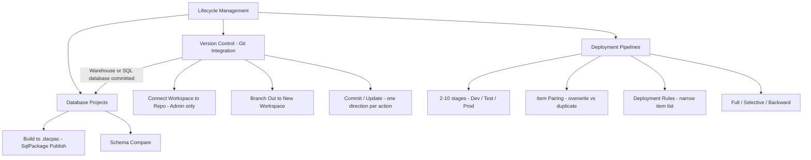

# 02. Lifecycle Management

> **Exam domain:** Domain 1 — Implement and manage an analytics solution (30–35%)
> **Source:** `certification/02-lifecycle-management/` — 4 files condensed
> **Why the exam cares:** Fabric's ALM toolset has three layers that overlap but solve different problems. The exam tests whether you can pick the right one for a scenario, and whether you know the hard constraints (what syncs, what doesn't, who is allowed to press the button, and what silently fails).

---

## Orientation — the 60-second version

Microsoft Fabric is a SaaS analytics platform. Everything you build in it — a Lakehouse, a Notebook, a Warehouse, a Pipeline — is an **item** that lives in a **workspace** (a container of items, backed by a **capacity**, which is the purchased compute the workspace runs on). Because it is SaaS, there is no filesystem to check into git and no `terraform apply`. Fabric therefore ships its own Application Lifecycle Management toolset, and Domain 1 tests all three layers of it.

**Layer 1 — Git integration.** You connect a *workspace* to one branch in Azure DevOps or GitHub. Fabric serialises each supported item's *definition* into files in that branch. You **Commit** (workspace → Git) and **Update** (Git → workspace), one direction at a time. Data is never versioned — only definitions.

**Layer 2 — SQL database projects.** When the item you commit is a Warehouse or a SQL database, Fabric doesn't write an opaque blob: it auto-generates a declarative `.sqlproj` project, one `.sql` file per object. That project builds to a `.dacpac`, which `SqlPackage` publishes by diffing against the live database. This is standard SQL Server tooling, reused.

**Layer 3 — Deployment pipelines.** A Fabric-native release mechanism: 2–10 named stages (default Dev/Test/Prod), each mapped to a workspace. Deploying copies item metadata from one stage to the next, using **item pairing** to decide whether it overwrites or duplicates, and **deployment rules** to let a target stage keep its own connection strings.

The single fact that unifies all three: **none of them ever move data.** Only definitions, schema and metadata.

## New terms in this topic

| Term | What it actually is |
| :--- | :--- |
| **Workspace** | The container that holds Fabric items. It is the unit that connects to Git and the unit assigned to a deployment pipeline stage. |
| **Item** | Any Fabric artifact — Lakehouse, Notebook, Warehouse, Pipeline, semantic model, report. Lifecycle tools version and move item *definitions*. |
| **Capacity** | The purchased compute a workspace runs on. A workspace must sit on a Fabric capacity to be assignable to a pipeline stage. |
| **Git integration** | Workspace-scoped source control against Azure DevOps or GitHub. Versions item definitions, never data. One workspace ↔ one branch ↔ one folder. |
| **Source control panel** | The in-workspace UI (icon at the top of the workspace, badged with the count of uncommitted changes) with **Changes**, **Updates** and **Related branches** tabs. |
| **Branch out to another workspace** | Creates a new Git branch from the connected branch's latest commit and attaches it to a new (or existing) workspace — an isolated dev environment. |
| **Switch branch** | Re-points the *current* workspace at a different branch, overwriting all its items with that branch's content. |
| **Commit to standalone branch** | Creates a brand-new Git branch and commits your current changes to it in one action, without switching the workspace away from its connected branch. |
| **Undo (saved changes)** | Reverts uncommitted workspace changes to the last-synced state. Destructive: a newly added item is permanently deleted, a restored deleted item comes back with fresh metadata. |
| **MyWorkspace** | A user's own personal workspace. It can **never** be connected to Git. |
| **Sensitivity label** | A classification tag applied to an item. **Not exported to Git by default** (a tenant setting enables it), and only conditionally copied by a deployment. |
| **Cross-geo export** | A tenant setting that must be enabled before a workspace can connect to an Azure DevOps repo in a different region. Not required for GitHub. |
| **Template app** | An installable packaged app. A workspace with a template app installed **cannot connect to Git**, and cannot be assigned to a pipeline stage. |
| **SQL database project** | A declarative, file-based representation of one database's schema (`.sqlproj` + one `.sql` file per object). Fabric auto-generates it when a Warehouse or SQL database is committed to Git. |
| **`.dacpac`** | The portable artifact produced by building a database project. Describes the target schema; contains no data. |
| **SqlPackage** | Microsoft's DacFx command-line tool that publishes a `.dacpac` to a target database, computing the minimal differential change. |
| **DacFx / `Microsoft.Build.Sql`** | The underlying library (`Microsoft.SqlServer.DacFx`) and the SDK-style project format Fabric and the VS Code SQL Database Projects extension both use. |
| **Schema Compare** | Interactive diff tool in the VS Code SQL Database Projects extension (also SSMS / Visual Studio for non-Fabric SQL). Diffs a project, a `.dacpac` or a live database against another, and generates a reviewable update script. |
| **Update from source control** | Fabric's Update action for a Warehouse / SQL database. Not a plain file copy: it runs a project **build** (emitting the `.dacpac`) plus a **SqlPackage publish** against the live database, using a fixed set of publish options. |
| **Post-deployment script** | A `.sql` query (usually a `MERGE`) stored under **Shared Queries** and marked as post-deployment. Runs on every Update-from-source-control and every pipeline deployment — the supported way to keep static reference data in sync. |
| **Deployment pipeline** | Fabric's stage-based promotion tool: 2–10 stages, each mapped to a workspace, cloning item metadata forward (or backward, with restrictions). |
| **Stage** | One slot in a pipeline (Development, Test, Production by default), normally mapped to one workspace. Can be marked **public**. |
| **Item pairing** | The link between "the same" item in adjacent stages, derived from name + type (+ folder as tiebreaker). Paired = a deploy overwrites; unpaired = a deploy duplicates. |
| **Deployment rule** | Stage-specific configuration defined in the **target** stage under a specific item, so repeated deployments don't overwrite that stage's own data source / parameter / default lakehouse. |
| **Dataflow Gen1** | The legacy Power BI-era dataflow item. It is on the deployment-rule list; **Dataflow Gen2**, the modern Fabric item, is Git-supported (GA) but is **not** on the deployment-rule list. |
| **Pipeline Admin** | The one and only deployment-pipeline permission. Manages/shares the pipeline; grants zero visibility into workspace content. |
| **Clean deploy** | Deploying an item that has no pair in the target — the deploy creates the item there and establishes the pairing. |

## How the pieces fit



- **Git integration** is the granular layer: per-item definitions, commit history, PR review, rollback.
- **Database projects** are not a separate choice from Git for Warehouse/SQL database — they *are* what Git integration generates for those two item types.
- **Deployment pipelines** are the coarse layer: promote a whole tested workspace state forward on a release cadence.
- Git and pipelines are **complementary**, not competing: Git for "what changed and why", pipelines for "is Prod now what Test verified".
- **Post-deployment scripts are honoured by both** — the one shared mechanism for static reference data.
- **Neither moves data.** Refresh or reload after any promotion.

---

## 1. Version Control (Git Integration)
*Source: `01-version-control.md`*

Connects a workspace to a branch in Azure DevOps or GitHub so item **definitions** — not data — can be versioned, reviewed and collaborated on with standard Git workflows.

- Git integration is **workspace-scoped**: one workspace connects to **one branch in one repo and one folder** at a time.
- **Commit** pushes workspace → Git; **Update** pulls Git → workspace. **One direction per action.**
- **Branch out to a new workspace** creates an isolated dev environment backed by a new Git branch.
- Only a defined, evolving list of item types is supported — some GA, many **preview**.

### Supported Git providers

Cloud-based Git only.

| Provider | Notes |
| :--- | :--- |
| **Azure DevOps** | Cloud-based only; supports OAuth2 **or** a service principal for authentication |
| **GitHub** | Cloud-based only; requires a fine-grained **or** classic personal access token |
| **GitHub Enterprise** | Cloud (`.com` / `ghe.com`) only — **on-premises GitHub Enterprise Server is not supported**, even when publicly accessible |

> ⚠️ **Trap —** "GitHub Enterprise" on the exam does **not** mean any self-hosted GitHub install. A GitHub Enterprise **Server** instance behind a private network, a custom domain, or an IP allowlist is explicitly **not supported**, regardless of public accessibility.

### Connecting a workspace to Git

Only a **workspace Admin** can connect or disconnect a workspace to a repo. Once connected, anyone with adequate permissions can work in the workspace.

1. **Workspace settings → Git integration**.
2. Select the provider (Azure DevOps or GitHub) and sign in / authorize.
3. Specify the target — Azure DevOps: **Organization → Project → Repository → Branch → Folder**; GitHub: **Repository URL → Branch → Folder**. Exactly **one branch** and **one folder**.
4. Select **Connect and sync**.

**Initial sync direction:**

- If either the workspace **or** the Git branch is **empty**, content is copied automatically from the non-empty side.
- If **both** have content, Fabric asks which direction:
  - **Commit workspace → Git** — exports all supported workspace content, **overwriting the Git branch's current content**.
  - **Update workspace ← Git** — overwrites the workspace with Git's content. Because a Git branch can be restored but a workspace state cannot, Fabric asks for **explicit confirmation** before this proceeds.

> 🧠 **Mental model —** The workspace and the Git branch are two rooms joined by a one-way door that flips direction on demand. Commit opens it workspace → Git; Update opens it Git → workspace. It is never open both ways at once.

### Commit, Update, and sync direction

Day-to-day work happens in the **Source control** panel, reached from the icon at the top of the workspace (badged with the number of uncommitted changes).

**Commit changes to Git**

1. **Source control → Changes**. Each changed item shows an icon: *new*, *modified*, *deleted*, *conflict*, or *same change*.
2. Select items to commit (or tick the top box for all), add a commit message (a default is used if left blank), select **Commit**.
3. Committed items flip **Uncommitted → Synced**.

**Commit to standalone branch** spins up a brand-new Git branch and commits your current changes to it in one action, without switching away from the connected branch. The new branch **isn't connected to the workspace**, is based on the workspace's **last synced state**, and **doesn't change the current workspace's state**.

**Update workspace from Git**

1. A notification appears in the workspace whenever someone commits to the connected branch.
2. **Source control → Updates → Update all**. **Update always applies the entire branch** — you **cannot cherry-pick individual items to update**, unlike commit.
3. Confirm; items flip to **Synced**.

**Undo saved changes** reverts uncommitted workspace changes to the last-synced state. It requires ticking *"I understand that workspace items may be deleted and can't be restored."* Undoing a newly **added** item **permanently deletes it**; undoing a **deleted** item recreates it but with **fresh metadata** — sensitivity labels are lost and ownership resets to the current user.

> ⚠️ **Trap —** If commits were made to the Git branch since your last sync, **Commit is disabled** until you Update the workspace first. You cannot commit and update at the same time.

> 📌 **Remember —** Commit **early and often with meaningful messages**. Large, infrequent commits make conflict resolution much harder.

### Git status indicators

The workspace shows a **Git status** column per item:

| Status | Meaning |
| :--- | :--- |
| **Synced** | Item is identical in the workspace and the Git branch |
| **Conflict** | The item changed in **both** the workspace and the Git branch since the last sync — Commit is disabled until resolved |
| **Unsupported item** | Item type isn't on the supported-items list; tracked in the panel but can't be committed or updated |
| **Uncommitted changes** | Workspace has local changes not yet pushed to Git |
| **Update required** | The Git branch has commits not yet pulled into the workspace |
| **Needs re-sync (identical content)** | Content matches but the item still needs to point at the latest commit |

At the bottom of the screen Fabric shows the **connected branch name**, the **time of last sync**, and a **link to the last synced commit**.

### Supported items

Spans Data Engineering, Data Science, Data Factory, Real-Time Intelligence, Data Warehouse, Power BI and Database categories. Representative slice for DP-700:

| Item | Status |
| :--- | :--- |
| Lakehouse, Notebook, Environment, Spark Job Definition, User Data Functions, GraphQL | GA |
| Pipeline, Copy Job, Dataflow Gen2, Mirrored database | GA |
| Eventhouse, EventStream, KQL database, KQL Queryset, Real-time Dashboard | GA |
| Activator, Mirrored Snowflake, Event Schema Set, Anomaly detection | Preview |
| **Warehouse** | **Preview** |
| SQL database | GA |
| Cosmos database | Preview |
| Semantic model, Report, Paginated report, Org app, Metrics Set | Preview (with exclusions — e.g. push datasets, live-connected AS models) |

> ⚠️ **Trap —** This list changes frequently as items graduate from preview to GA — **never memorise a static snapshot**, including this table. If a workspace or Git repo contains an **unsupported** item, the **connection still succeeds**: the unsupported item is **ignored** — visible in the panel, but never committed, updated, or deleted. Verify against the official supported-items list.

> 🔑 **Exam fact —** A **Power BI Dashboard** is *not* a Git integration supported item. The classic scenario: a workspace holds a Lakehouse, a Warehouse and a Dashboard; after connecting to Git the Dashboard is **visible in the source control panel but never syncs** via commit or update. That is expected behaviour — not a broken connection, not an item-limit problem, and not something a separate Azure DevOps project would fix.

### Branching out to a new workspace

**Branch out to another workspace** creates a new Git branch from the source workspace's connected branch's **latest commit**, then either spins up a brand-new workspace or switches an existing one's Git connection to that new branch.

- By default **all** items from the source branch come along. **Select items individually (preview)** narrows this to a chosen subset, plus their required dependencies via **Select related items**.
- The resulting **branched workspace** shows a parent/child relationship to the source workspace in the workspace tree, the breadcrumbs, and the Source control **Related branches** tab.
- Any workspace items **not yet committed to Git are lost** when branching out — **always commit first**.
- Requires **Contributor** role or above in the source workspace, **plus Git branch-create permission**, plus **available capacity** for the new workspace.

**Switch branch** re-syncs the current workspace to a different branch, **overwriting all items** with that branch's content. Allowed for **workspace Admin by default**, or **Contributor+ with write access on all items** when **Allow users with at least Contributor role to change Git branch** is enabled. You **can't switch branches with uncommitted changes pending** — commit or undo them first.

> 🧠 **Mental model —** Branch out = cloning a house to a new address (original untouched). Switch branch = gutting and remodelling the *same* house to a different blueprint (overwritten in place).

> 📌 **Remember —** Use **branch out for all non-trivial feature work** instead of editing the shared connected branch directly. Enable *Allow users with at least Contributor role to change Git branch* **deliberately**, not by default — it widens who can overwrite workspace content via a branch switch.

### Conflict resolution

A **conflict** = the *same item* changed in **both** the workspace and the Git branch since the last sync. Status shows **Conflict**; **Commit is disabled** until resolved. Three paths:

1. **Resolve in the UI** — select **Update all**, then per conflicted item:
   - **Accept incoming changes** — overwrites the workspace item with the Git version; status becomes **Synced**.
   - **Keep current content** — keeps the workspace version; status becomes **Uncommitted** (still needs a commit to push it to Git).
2. **Revert to a previous synced state** — **Undo** to revert the workspace, or `git revert` to roll back the branch. Reconnecting the workspace (disconnect → reconnect, choosing a sync direction) is a blunter variant: it overwrites **all** items in one location with the other's content, not just the conflicted ones.
3. **Resolve in Git** — checkout a new branch from the last synced state, commit your changes there, resolve the conflict with normal Git tooling (PR / merge) against the original branch, then **switch the workspace back** to the original branch.

> ⚠️ **Trap —** A scenario describing "resolve the conflict using a pull request and merge in Azure DevOps" is describing path 3 — not something Fabric does natively. Fabric's UI offers only a **binary accept/keep choice per item**; anything needing a three-way merge or code review must happen on the Git provider's side.

### Permissions

Two permission systems apply **independently**: the Fabric **workspace role** and the **Git repo role**.

**Workspace roles**

| Operation | Required workspace role |
| :--- | :--- |
| Connect / disconnect / sync workspace to Git repo | **Admin** |
| Switch branch or checkout a new branch | Admin (always); Contributor/Member with write access on all items **if** *Allow users with at least Contributor role to change Git branch* is enabled |
| View Git connection details / Git status | Admin, Member, Contributor |
| Commit or update | Contributor (write on all items) — plus item ownership if the tenant blocks non-owner updates, plus **Build** on external dependencies where applicable |
| Branch out to another workspace | Admin, Member, Contributor |

Workspace **Viewers can't see any Git-related information** in the workspace at all.

**Git roles**

- **Azure Repos** — `Read=Allow` covers connecting, syncing and viewing status; **committing** additionally needs `Contribute=Allow` **and a branch policy that permits direct commits**; **creating a branch** needs `Role=Write` + `Create branch=Allow`.
- **GitHub (fine-grained token)** — `Contents=Read` covers connecting/syncing/status; **committing and branch creation** need `Contents=Read and write`.

A workspace **Admin can always do everything a Contributor can**, limited only by their Git role — the workspace role hierarchy is **additive**, not a separate track.

### Limitations

- **Commit size caps** — Azure DevOps: **25 MB** (service principal) / **125 MB** (SSO user). GitHub: **50 MB combined per commit**. Split large commits into several.
- **Sensitivity labels aren't exported by default**; a tenant setting can enable exporting items with applied labels.
- **1,000-item workspace cap** applies to everything Git-managed. If a Git branch exceeds it, syncing to the workspace **fails** — split into more workspaces / branches / folders.
- **Submodules** and **sovereign clouds** are not supported.
- **MyWorkspace can never connect to Git**; workspaces with **template apps installed** can't connect either.
- Folder structure syncs **up to 10 levels deep**; directory/file names have their own character and length restrictions.
- Only **one direction per action** — no simultaneous commit + update.
- Only Git-supported items sync; everything else is **ignored, not deleted**.

### Common issues & errors

| Issue | Cause | Resolution |
| :--- | :--- | :--- |
| Commit button greyed out | Pending updates from Git not yet applied | Update the workspace first, then commit |
| Item stuck as "Unsupported" in the source control panel | Item type isn't on the supported-items list | Confirm status against the official list; it isn't synced in either direction |
| Can't connect workspace to an Azure DevOps repo in a different region | Tenant admin hasn't enabled cross-geo export | Ask the tenant admin to enable **cross-geo export** (not required for GitHub) |
| Update fails with "workspace exceeds item limit" | Git branch has more items than the 1,000-item workspace cap | Split items across more workspaces / branches / folders |
| Branching out loses recent workspace edits | Items weren't committed to Git before branching out | Always commit pending changes before branching out |
| Switch branch is greyed out | User isn't a workspace Admin and the Contributor-branch-switch setting is off, **or** there are uncommitted changes | Enable the setting (Admin), or commit/undo pending changes first |
| Git status shows Conflict and won't clear | Same item changed in both workspace and Git branch since last sync | Resolve via UI accept/keep, revert, or resolve directly in Git (PR/merge) |

**Distinctive use cases:** code review / rollback / audit history on item definitions before production; isolated feature development via branch-out merged back through a normal PR workflow; standardising on one repo as the org's single source of truth across many workspaces; recovering a workspace's prior state by reverting to a previous commit.

---

## 2. Database Projects
*Source: `02-database-projects.md`*

A **SQL database project** is a declarative, file-based representation of a database's schema — tables, views, stored procedures, functions — that Fabric **auto-generates** the moment a **Warehouse** or **SQL database** item is committed to Git.

- Committing a Warehouse or SQL database to Git auto-converts it into a `.sqlproj` project, **one `.sql` file per object**, organised **`Schema/Object Type`**.
- Building the project produces a **`.dacpac`**; **SqlPackage** publishes it to a target database, **calculating only the differential change needed**.
- **Schema Compare** diffs a project against a live database and generates the update script — the interactive counterpart to a scripted SqlPackage publish.
- Projects track **schema, not data**; **pre/post-deployment scripts** are the supported mechanism for small amounts of static reference data.

### What a SQL database project is

A local representation of the SQL objects that make up **a single database's schema** — declarative T-SQL, **one object defined exactly once**. Change a column? Edit the one file that declares that table; you never hand-write `ALTER` scripts. Underlying tooling is Microsoft's **`Microsoft.SqlServer.DacFx`** library, surfaced through the newer **SDK-style project format (`Microsoft.Build.Sql`)** — the format both Fabric's SQL database integration and the VS Code **SQL Database Projects extension** use.

In Fabric you don't set these up manually — they are **generated automatically** the first time you commit a Warehouse or SQL database item to a Git-connected workspace. The folder structure mirrors `Schema/Object Type` (e.g. `dbo/Tables/Orders.sql`), and Fabric keeps the generated `.sqlproj` metadata file in sync on **every commit**.

> ⚠️ **Trap —** Don't hand-edit the auto-generated `.sqlproj` expecting it to persist — Fabric regenerates and **overwrites it on every commit from the service**. If you need custom project settings (e.g. a `master.dacpac` reference for local builds), add them **outside** what Fabric manages, or expect to reapply them after the next commit.

### Build and deploy: SqlPackage and `.dacpac`

```text
sqlpackage /Action:Publish /SourceFile:yourfile.dacpac /TargetConnectionString:{connectionstring}
```

- **New database** — SqlPackage creates every object **in dependency order** (a referenced table before the table with the foreign key to it). You never hand-sequence a folder of `CREATE` scripts.
- **Existing database** — SqlPackage **diffs** the `.dacpac` against the live schema and emits **only the necessary `ALTER` / `CREATE` / `DROP` statements**. A small column addition doesn't rebuild the whole table.

Fabric's **Update from source control** action for a SQL database combines a project **build** (validates syntax/references, emits the `.dacpac`) with a **SqlPackage publish**, using a fixed set of publish options tuned for the service:

| Publish option | Value | Effect |
| :--- | :--- | :--- |
| `ScriptDatabaseOptions` | `false` | Database-level settings (collation, etc.) aren't touched by the publish |
| `DoNotAlterReplicatedObjects` | `false` | Replicated objects can still be altered |
| `IncludeTransactionalScripts` | `true` | Publish wraps changes in transactions where supported |
| `GenerateSmartDefaults` | `true` | Fabric supplies defaults for new `NOT NULL` columns instead of failing the publish |

> 🧠 **Mental model —** A `.dacpac` is a signed shipping *manifest* for a schema, not the cargo. SqlPackage reads the manifest plus the destination's current inventory and works out the minimal set of moves to make them match — it never touches what's on the shelves (the data).

### Schema Compare

The interactive counterpart to a scripted SqlPackage publish, available through the **SQL Database Projects extension in Visual Studio Code** (and SQL Server Management Studio / Visual Studio for non-Fabric SQL targets). It diffs **two schema endpoints** — a project, a `.dacpac`, or a live database — side by side, lets you review each detected difference, **selectively include/exclude individual changes**, then generates (and optionally executes) the update script.

Use it to:

- Validate what a **local** database project build will actually change in a **live** Fabric SQL database or Warehouse **before committing** — catching an unintended `DROP` before it ships.
- Reconcile **drift** after someone modified the live database directly (e.g. via SSMS) instead of through the tracked project. Those changes surface as **uncommitted changes** in Fabric's own source control panel, and Schema Compare shows exactly what differs at the object level.

### Static data: pre- and post-deployment scripts

A database project tracks **schema only** — table structure, not rows. To manage a small amount of static/reference data (colours, status codes) declaratively, Fabric supports **pre-deployment and post-deployment scripts**, stored under **Shared Queries** in the Fabric SQL editor:

1. Write a query — commonly a `MERGE` — that reconciles the target table's rows to the desired state.
2. Rename it (convention: `Post-Deployment-StaticData.sql`) and move it to **Shared Queries**.
3. Mark it via the `...` menu → **Set as Post-deployment Script**.

```sql
merge into dbo.status_codes as target
using (values (1,'Open'),(2,'Closed')) as source (code_id, code_name)
    on target.code_id = source.code_id
when matched then update set target.code_name = source.code_name
when not matched then insert (code_id, code_name) values (source.code_id, source.code_name);
```

This script runs automatically on **every Update from source control** and **every deployment pipeline promotion** — a version-controlled, idempotent way to keep reference data in sync without breaking the "data isn't copied" rule that governs both tools.

### Local development workflow with Visual Studio Code

1. Install VS Code with the **MSSQL** and **SQL Database Projects** extensions.
2. Create the SQL database in Fabric and commit it to source control **with no objects yet** — this seeds the empty project and item metadata in the repo.
3. Clone the repository locally, then check out the branch connected to the target workspace.
4. Author `.sql` files under the generated `<database>.SQLDatabase` folder structure (e.g. a `CREATE TABLE` in `dbo/Tables/MyTable.sql`).
5. **Build** the project in VS Code's Database Projects view to validate syntax and references and emit the `.dacpac`.
6. **Commit** and push through VS Code's own Git tooling.
7. In the Fabric portal, select **Update (Update All)** in the Source control panel — this triggers the build + SqlPackage publish.

**Known quirk:** right after an update the item can briefly show **Uncommitted** again, because Fabric's Git comparison is a **literal file-content diff** and can flag semantically insignificant regenerated attributes. **Committing once more from the Fabric web interface resolves it.**

> 📌 **Remember —** For **larger schema changes**, clone the source-controlled project locally and work in VS Code with the SQL Database Projects extension, rather than editing many objects one at a time in the Fabric portal.

### Branch workspaces and merging database changes

The same **branch out to a new workspace** mechanic (see §1) applies to SQL database projects and is the standard pattern for isolated schema development:

1. From a Git-connected workspace with a committed database project, use **Branch out to new workspace** to create a linked branch + workspace pair. Fabric provisions a **new database** containing whatever objects were committed at that point.
2. Develop and commit schema changes against the branched workspace's database.
3. Open a **pull request** in Azure DevOps or GitHub from the feature branch into the primary branch — the PR diff shows the database code changes for review, exactly like application code.
4. Completing the PR updates source control but **does not** automatically change the primary workspace's live database — an explicit **Update** in the primary workspace's Source control panel is still required.

> ⚠️ **Trap —** Merging a pull request into the primary branch does **not** push the change into the primary workspace's live database. Source control and the live database are reconciled only by an explicit **Update** (or Commit, in the opposite direction). A merged PR just means the *target branch* now has the change.

### Database projects vs. deployment pipelines vs. Git integration

For Warehouse / SQL database specifically, Git integration and database projects **aren't separate choices** — database projects *are* what Git integration generates for these items.

| Dimension | Git Integration (+ Database Projects) | Deployment Pipelines |
| :--- | :--- | :--- |
| **Best for** | Incremental change tracking, code review, commit history at individual-object level | Promoting a tested body of work through Dev → Test → Prod stages |
| **Granularity** | Per-object `.sql` files; diff/review one table or procedure at a time | Whole-item deployment (with selective deployment to choose which items) |
| **Underlying mechanism** | SQL database project build (`.dacpac`) + SqlPackage publish | Item pairing + Fabric-native copy, plus deployment rules for narrow config overrides |
| **Static data handling** | Pre/post-deployment scripts (both mechanisms honour these) | Same scripts run on deployment too — not a separate feature |
| **Stage-specific config** | Not built in — branch or parameterize manually | **Deployment rules** — but only for the narrow set of item types that support them |
| **Support status for Warehouse** | Git integration: **preview**; database project generation: part of that preview | **Preview** |
| **Support status for SQL database** | **GA** | **Preview** |

> 🧠 **Mental model —** Git + database projects is your day-to-day *editor's history* — every small schema edit, reviewed and versioned like application code. Deployment pipelines is the *release manager* — it doesn't care about individual `ALTER` statements, it cares whether Test now holds what Dev approved and Prod now holds what Test verified.

### Integration with Warehouse and SQL database items

- **Warehouse** — committing to Git converts the warehouse to a SQL database project. **Table data and SQL security features (roles, permissions, row-level security) are NOT included** — migrate those via a scripted, post-deployment-script approach. Deployment pipelines don't expose the database project directly; they deploy the **warehouse item as a whole**.
- **SQL database** — the same project generation applies, plus first-class VS Code tooling: clone the repo, edit `.sql` files locally with the MSSQL + SQL Database Projects extensions, build to validate, then commit and let Fabric's **Update from source control** apply the diff.
- **Both share a documented gotcha:** using `ALTER TABLE` to add a constraint or column in the database project currently causes the deployment process to **drop and recreate the table** — a data-loss risk requiring a create-new-table / copy-data / rename workaround.

```sql
-- ALTER TABLE drop-and-recreate workaround
create table dbo.orders_new as select * from dbo.orders;
alter table dbo.orders_new add order_channel varchar(20) null;
drop table dbo.orders;
exec sp_rename 'dbo.orders_new', 'orders';
-- then update the project definition to match
```

### Common issues & errors

| Issue | Cause | Resolution |
| :--- | :--- | :--- |
| Deploying an `ALTER TABLE ... ADD` change drops and recreates the table, losing data | Documented limitation of the current database project deployment process for Warehouse / SQL database | Create a new table with `CREATE TABLE AS SELECT`/clone, apply the `ALTER`, drop the old table, rename via `sp_rename`, then update the project definition to match |
| Item shows "Uncommitted" immediately after an Update from source control | Fabric's file-content comparison flags semantically insignificant differences (e.g. inline column attribute ordering) | Commit again from the Fabric web interface to resync the generated definition |
| Security roles/permissions missing after restoring from a database project | SQL security features aren't included in the database project | Manage security via a scripted, post-deployment-script approach instead |
| `.sqlproj` edits keep disappearing | Fabric regenerates and overwrites the project file on every commit | Don't hand-edit the auto-generated file; add custom settings outside Fabric-managed sections, or reapply after each commit |
| Update from source control fails after a local project edit | Syntax error or unsupported feature in the SQL project | Fix and **revert the change in source control** before retrying — a failed update must be **manually reverted** |
| Static lookup table drifts between environments | No post-deployment script defined for that table | Add a `MERGE`-based post-deployment script under Shared Queries and mark it as the post-deployment script |

**Distinctive use cases:** PR review of every schema change to a shared Dev Warehouse or SQL database; standing up a branch workspace whose schema exactly matches a known-good commit; keeping a lookup table's rows in sync across environments via a post-deployment script; locally validating a build and previewing the diff with Schema Compare to catch a breaking change before commit.

---

## 3. Deployment Pipelines
*Source: `03-deployment-pipelines.md`*

Fabric's stage-based promotion tool: clones content Dev → Test → Prod (or any custom stage set) while preserving item relationships, applying stage-specific **deployment rules**, and **never copying underlying data**.

- A pipeline has **2–10 stages** (default 3: Development / Test / Production). The stage **count and names are permanent** once created.
- **Item pairing** — based on **name, type and folder** — determines whether a deploy **overwrites** an item or creates a **duplicate ("clean deploy")**.
- **Deployment rules** (data source, parameter, default lakehouse) exist for a **narrow, specific list of item types** — not everything deployable supports them.
- **Data is never copied** — only metadata/schema. Refresh or reload data manually after promotion.
- **Backward deployment** (later stage → earlier one) only works when the target stage is **empty**, and only as a **full** (not selective) deploy.

### Pipeline structure and stages

**2 to 10 stages**, defaulting to **Development**, **Test**, **Production**. You can rename, add or delete stages **during creation**, but **the number of stages and their names become permanent once the pipeline is created**. Each stage typically maps to one workspace.

Any stage can optionally be made **public** — a consumer without pipeline access then sees a public stage as an **ordinary workspace, with no stage badge**. By default **only the final stage is public**, but you can make **any number** of stages public, or **none**.

> ⚠️ **Trap —** Don't confuse "changing the public status of a stage" (**changeable anytime**) with "changing the number/names of stages" (**locked in permanently at pipeline creation**). A scenario asking "the team needs a 4th stage after the pipeline is already live" has one answer: **create a new pipeline**. You cannot add a stage to an existing one.

### Assigning workspaces to stages

**Assigning** a workspace to a vacant stage is different from **deploying content** into one:

- **Assign** — attaches an *existing* workspace to an empty stage **as-is**. **No content is copied**; pairing is attempted immediately based on existing items in adjacent stages.
- **Deploy to an empty stage** — creates a **brand-new workspace** for that stage and **copies content** into it from the adjacent stage.

A workspace qualifies for assignment only if **all** of the following hold: you're its **Admin**; it **isn't already assigned to another pipeline**; it sits on a **Fabric capacity**; you have **Contributor+ on the adjacent stages' workspaces**; and it **isn't a template-app or sample-dataset workspace**.

**Unassigning** a workspace **loses that stage's deployment history and any configured deployment rules** — both are gone for good, not just hidden.

> ⚠️ **Trap —** Deleting a workspace that's currently assigned to a pipeline stage **fails outright**. Unassign it from the pipeline first (via **View Deployment Pipeline** from the workspace page), then delete.

### Item pairing

**Pairing** links an item in one stage to "the same" item in the adjacent stage, so a future deploy **overwrites** it rather than duplicating it. **Renaming a paired item doesn't unpair it** — paired items can have **different names across stages**.

| Trigger | Pairing criteria | Failure mode |
| :--- | :--- | :--- |
| **Deploying an unpaired item** | The deploy itself creates the pairing — a "clean deploy" | If a same-name/type item already exists **unpaired** in the target, you end up with **two separate items** (one paired, one not), not an overwrite |
| **Assigning a workspace to a stage** | Item **name** + **type** must match; **folder location** breaks ties when duplicates exist | If two or more items share name+type in either stage, pairing fails **unless folder location also matches** — if folders differ, **pairing fails outright** |

Adding a **new item directly into an already-assigned stage's workspace does NOT auto-pair** it with an identical item elsewhere — you can end up with identical unpaired items sitting in adjacent stages indefinitely.

> 🧠 **Mental model —** Pairing is a name tag, not a memory. It's re-derived each time from name + type (+ folder tiebreaker). Two identical-looking items never paired by an actual deploy or assignment stay strangers forever, even if you rename them to match.

### Deployment methods

**Full deployment** — deploys **all** content from source to target, overwriting paired items and adding unpaired/new items alongside.

**Selective deployment** — choose specific items via **Show more**:

- The default **folder view** only lets you select items **within the same folder level**. Switching to **flat list view** (toggle at the top of the stage) lets you select **across folders** and adds a **Location** column showing full item paths.
- **Select related** auto-selects an item's dependencies (e.g. the semantic model behind a report) so the deployment doesn't break. It **only works in flat list view** — using it from folder view **auto-switches you into flat list view**.
- Deploying an item **without** its dependency **fails** if that dependency doesn't already exist in the target stage.
- **Switching between flat list and folder view, or changing a filter, resets your current selection.**

**Backward deployment** — from a **later** stage back to an **earlier** one (e.g. Production → Test). Two hard constraints:

- Only possible when the **target stage is empty (unassigned)**.
- Only available as a **full** deployment — you **cannot** selectively backward-deploy individual items.

> ⚠️ **Trap —** "Backward deployment" on the exam always implies an **empty target stage** and a **full** deploy. A scenario describing backward-deploying only *some* items, or into a stage that already has content, is describing something Fabric deployment pipelines **don't support**.

Every deployment (any method) shows a **confirmation listing the items about to move**, with an optional **note** — recorded in **deployment history**, and worth adding since it's the main way to make pipeline history legible later.

### Deployment rules

Deployment rules let a **target stage** keep stage-specific configuration (a different database connection, a different query parameter) across repeated deployments instead of being overwritten every time. A rule is defined **in the target stage, under the specific item**, and takes effect starting with the **next** deployment into that stage — **not retroactively**.

| Item | Data source rule | Parameter rule | Default lakehouse rule |
| :--- | :--- | :--- | :--- |
| **Dataflow Gen1** | ✅ | ✅ | ❌ |
| **Semantic model** | ✅ | ✅ | ❌ |
| **Paginated report** | ✅ | ❌ | ❌ |
| **Mirrored database** | ✅ | ❌ | ❌ |
| **Notebook** | ❌ | ❌ | ✅ (sets the target stage's default lakehouse) |

> ⚠️ **Trap —** Deployment rules **don't cover Lakehouse, Warehouse, Pipeline, Eventstream, or most other modern Fabric items** — the table is small and specific to legacy Power BI-era items plus notebooks. A scenario asking to "configure a deployment rule for a Warehouse's connection string" describes something **unsupported**; the right answer for stage-specific Warehouse or Pipeline configuration is **parameterization within the item itself**.

**Data source rules** only work when swapping to a data source **of the same type**, and only for this supported list: **Azure Analysis Services, Azure Synapse, SSAS, Azure/SQL Server, OData Feed, Oracle, SapHana import mode, SharePoint, Teradata**. Anything else should use item-level parameters instead.

Additional constraints:

- Rules **can't be created in the Development stage** (there's nothing "earlier" for a Dev-stage rule to protect against).
- You must be the **owner** of the item to create a rule for it.
- **Deleting the item deletes its rules permanently**; **unassigning/reassigning a workspace also loses its rules**.
- If the underlying data source or parameter is later changed/removed from the **source** item, the rule becomes invalid and **deployment fails**.

### What gets deployed — and what doesn't

The single highest-yield fact list in this topic.

**Copied and overwritten in the target stage:**

- Data sources and parameters (deployment rules, if configured, apply here)
- Report visuals, report pages, dashboard tiles
- Model metadata, item relationships
- **Sensitivity labels** — but **only** when deploying a **new** item, deploying into an **empty stage**, or when the source has a **protected label and the target doesn't** (with a consent prompt)

**Never copied:**

- **Data** — only metadata/schema moves; refresh semantic models or reload tables manually after deployment
- **URL and item ID** — stable across deployments; this is how paired items stay "the same item" even as content changes
- **Permissions** — both per-workspace and per-item
- **Workspace settings** — each stage has its own, independently configured
- **App content/settings** — Power BI apps must be updated separately, even after a successful deployment
- **Personal bookmarks**
- **Semantic-model-specific:** role assignments, refresh schedules, data source credentials, query caching settings, endorsement settings

> 🧠 **Mental model —** A deployment ships the *architectural drawings* (schema, visuals, relationships, parameters), never the *furniture* (data) already sitting there, and never the *keys* (permissions). Someone still has to move the furniture in (refresh) and reissue the keys.

### Backward deployment restrictions (recap)

Tested in isolation: backward deployment (later stage → earlier stage) requires an **empty target stage** and is **full-deploy only** — **no selective backward deployment exists**.

### Pipeline access vs. workspace roles

Two permission layers apply **independently** and **both** must be satisfied for most actions:

- **Pipeline permission** — there is only one: **Pipeline Admin**, granted when someone shares the pipeline with you. It lets you **view/share/edit/delete the pipeline** and see which workspaces are assigned to which stage, but grants **zero visibility into workspace content**.
- **Workspace role** — the ordinary Fabric roles (Admin / Member / Contributor / Viewer), assigned per workspace.

| Role combination | Can do |
| :--- | :--- |
| **Pipeline Admin only** (no workspace role) | View and share the pipeline, see assigned-workspace tags — **cannot** view content or deploy |
| **Pipeline Admin + workspace Viewer** | Consume content; unassign a workspace from a stage |
| **Pipeline Admin + workspace Contributor** | Consume content, compare stages, view semantic models, **deploy items** (must be Contributor+ in **both** source and target workspaces) |
| **Pipeline Admin + workspace Member** | Everything Contributor can, plus update semantic models and configure semantic model rules (if item owner) |
| **Pipeline Admin + workspace Admin** | Everything above, plus **assign workspaces to stages** |

Memorise directly:

- **Deploy to an empty stage** — Pipeline Admin + **source-workspace Contributor**.
- **Deploy items to the next stage** — Pipeline Admin + **Contributor in both source and target** workspaces (**dataflows additionally require item ownership**).
- **Assign a workspace to a stage** — Pipeline Admin + **Admin of the workspace being assigned**.
- **Compare two stages** — Pipeline Admin + Contributor/Member/Admin in **both** stages.
- **Microsoft 365 groups aren't supported as pipeline admins.**

> ⚠️ **Trap —** Pipeline Admin access is **not sufficient on its own** to deploy or even view content — it is a management/sharing permission layered **on top of**, not a substitute for, workspace roles. A Pipeline Admin with no role in either workspace can share the pipeline but can't push a single deployment.

### Common issues & errors

| Issue | Cause | Resolution |
| :--- | :--- | :--- |
| Deploy overwrote the wrong item, or duplicated an item unexpectedly | Item pairing didn't match what was assumed — name/type/folder mismatch | Check the pipeline content list for items shown on **separate lines** (unpaired) vs. the **same line** (paired) before deploying |
| Can't delete a workspace | It's still assigned to a deployment pipeline stage | Open **View Deployment Pipeline** from the workspace, unassign it there, then delete |
| Selective deployment fails on a report | The report's dependent semantic model doesn't exist in the target stage | Use **Select related** to include dependencies, or pre-deploy the semantic model first |
| Deployment rule silently stopped applying | The source item's underlying data source/parameter was changed or removed | Reconfigure the rule against the item's current data source/parameter |
| Tried to add a deployment rule in Development | Rules can't be created in the Development stage | Configure the rule in Test or Production instead |
| Backward deployment button is unavailable | Target (earlier) stage isn't empty, or a selective set of items was chosen | Fully unassign/empty the target stage first, and deploy **all** items |
| Data appears stale or missing after deployment | Deployment never copies data — only metadata/schema | Manually refresh the semantic model or reload source tables in the target stage |
| Rules disappeared after reassigning a workspace | Unassigning a workspace from a stage **permanently deletes** its configured rules | Reconfigure rules after reassignment; there is **no rule-recovery mechanism** |

**Distinctive use cases:** promoting tested Dev content through Test into Production on a release cadence; standing up parallel environments from existing workspaces via **assignment** (no fresh initial deploy); keeping Production pointed at production systems via deployment rules while Dev/Test iterate on sample data; auditing release history via deployment notes and per-stage "last deployed" timestamps.

---

## Decision rules — pick the right thing

| Scenario / requirement | Choose | Why |
| :--- | :--- | :--- |
| Version item definitions with commit history and rollback | **Git integration** | Workspace-scoped source control; versions definitions, never data |
| Self-hosted GitHub Enterprise Server as the repo | **Neither — unsupported** | Only cloud Azure DevOps, GitHub, and GitHub Enterprise cloud (`.com`/`ghe.com`) |
| Isolated feature development without disturbing the shared branch | **Branch out to another workspace** | New branch + new workspace; source workspace untouched |
| Re-point the current workspace to a different branch | **Switch branch** | Overwrites all items in place with that branch's content |
| Commit current changes somewhere safe without leaving the connected branch | **Commit to standalone branch** | New branch from the last synced state; workspace state unchanged |
| Conflict where both sides' changes must be reconciled with code review | **Resolve in Git (branch + PR/merge), then switch back** | Fabric's UI only offers binary accept/keep, no three-way merge |
| Conflict where one version simply wins | **UI: Accept incoming changes** (Git wins → Synced) or **Keep current content** (workspace wins → Uncommitted) | Fastest path when no reconciliation is needed |
| Undo local edits back to the last synced state | **Undo** in Source control | Requires the "items may be deleted and can't be restored" acknowledgement |
| Review every incremental schema change on a Warehouse/SQL database via PR | **Git integration + database projects** | Per-object `.sql` files; object-level diff and PR review |
| Preview the exact `ALTER`/`CREATE`/`DROP` a local project build will run against a live DB | **Schema Compare** (VS Code SQL Database Projects extension) | Diffs project/`.dacpac`/live DB and generates a reviewable update script |
| Deploy a `.dacpac` outside Fabric | **SqlPackage `/Action:Publish`** | Creates in dependency order on a new DB; differential on an existing one |
| Keep a small lookup/reference table consistent across environments | **`MERGE`-based post-deployment script** under Shared Queries | Runs on every Update-from-source-control **and** every pipeline deployment |
| Migrate SQL roles, permissions, or row-level security with a Warehouse | **Scripted post-deployment approach** | SQL security features are **not** in the database project |
| Add a column to a Warehouse table without losing data | **Create new table (`CTAS`) → alter → drop old → `sp_rename`** | `ALTER TABLE ... ADD` in a database project drops and recreates the table |
| Promote a tested body of work Dev → Test → Prod on a release cadence | **Deployment pipeline** | Whole-item stage promotion with item pairing |
| Need a 4th stage on a pipeline that already exists | **Create a new pipeline** | Stage count and names are permanent after creation |
| Attach an existing workspace to a vacant stage without copying anything | **Assign** | Assign attaches as-is; deploy-to-empty-stage creates a new workspace and copies |
| Production must keep its own connection string across deployments | **Data source rule defined on the item in the Production (target) stage** | Rules live in the target stage; can't be created in Development |
| Stage-specific config for a Lakehouse, Warehouse, Pipeline or Eventstream | **Parameterization within the item** | Deployment rules don't support those item types |
| Point a deployed notebook at the right lakehouse per stage | **Default lakehouse rule on the notebook** | The only rule type notebooks support |
| Deploy a report whose semantic model isn't in the target stage yet | **Select related** (in flat list view), or pre-deploy the model | Deploying without the dependency fails |
| Select items across different folders for a selective deploy | **Flat list view** | Folder view restricts selection to one folder level |
| Move approved content from Production back to an emptied Test stage | **Backward deployment (full deploy only)** | Requires an empty target stage; no selective backward deploy |
| Grant someone the ability to share a pipeline but not see content | **Pipeline Admin only** | Pipeline Admin gives zero workspace-content visibility |
| Grant someone the ability to actually deploy Dev → Test | **Pipeline Admin + Contributor in both workspaces** | Both permission layers must be satisfied |
| Grant someone the ability to assign a workspace to a stage | **Pipeline Admin + Admin of that workspace** | Assignment requires workspace Admin |
| Give a group pipeline admin rights | **Not with a Microsoft 365 group** | M365 groups aren't supported as pipeline admins |

## Numbers, limits and defaults to memorise

| Thing | Value | Note |
| :--- | :--- | :--- |
| Exam weight of this domain | **30–35%** | Domain 1 — Implement and manage an analytics solution |
| ALM layers tested | **3** | Git integration, SQL database projects, deployment pipelines |
| Git connection scope | **1 workspace ↔ 1 repo ↔ 1 branch ↔ 1 folder** | At a time |
| Sync directions per action | **1** | Commit **or** Update, never both |
| Update granularity | **Entire branch (Update all)** | Cannot cherry-pick individual items, unlike commit |
| Git status values | **6** | Synced · Conflict · Unsupported item · Uncommitted changes · Update required · Needs re-sync (identical content) |
| Change icons in the Changes tab | **5** | new · modified · deleted · conflict · same change |
| Conflict resolution paths | **3** | UI accept/keep · revert (Undo / `git revert` / reconnect) · resolve in Git (PR/merge) |
| Permission systems governing Git | **2, independent** | Fabric workspace role **and** Git repo role — both must allow the operation |
| Fabric workspace roles | **4** | Admin / Member / Contributor / Viewer — **Viewers see no Git information at all** |
| Commit size cap — Azure DevOps, service principal | **25 MB** | Split large commits |
| Commit size cap — Azure DevOps, SSO user | **125 MB** | Split large commits |
| Commit size cap — GitHub | **50 MB combined per commit** | Split large commits |
| Workspace item cap (Git-managed) | **1,000 items** | Branch exceeding it fails to sync into the workspace |
| Git folder depth synced | **10 levels** | Plus character/length restrictions on directory and file names |
| Branch-out item selection default | **All items** | "Select items individually" is **preview**; "Select related items" pulls dependencies |
| Git provider support | **Azure DevOps + GitHub cloud only** | GitHub Enterprise cloud (`.com`/`ghe.com`) yes; GHES on-prem no |
| Sensitivity label export | **Off by default** | Tenant setting can enable exporting items with applied labels |
| Submodules / sovereign clouds | **Not supported** | — |
| MyWorkspace / template-app workspaces | **Cannot connect to Git** | — |
| `.sqlproj` object files | **1 object per `.sql` file** | Folder layout `Schema/Object Type`, e.g. `dbo/Tables/Orders.sql` |
| Databases per SQL database project | **1** | A project is the schema of exactly one database |
| Schema Compare endpoints | **2 compared, 3 kinds** | A project, a `.dacpac`, or a live database — any two of them |
| Publish options Fabric fixes for Update from source control | **4** | `ScriptDatabaseOptions` · `DoNotAlterReplicatedObjects` · `IncludeTransactionalScripts` · `GenerateSmartDefaults` |
| `ScriptDatabaseOptions` (Fabric publish) | **false** | Database-level settings like collation not touched |
| `DoNotAlterReplicatedObjects` (Fabric publish) | **false** | Replicated objects can be altered |
| `IncludeTransactionalScripts` (Fabric publish) | **true** | Wraps changes in transactions where supported |
| `GenerateSmartDefaults` (Fabric publish) | **true** | Defaults supplied for new `NOT NULL` columns instead of failing |
| Warehouse Git integration status | **Preview** | Database project generation is part of that preview |
| Warehouse deployment pipeline status | **Preview** | — |
| SQL database Git integration status | **GA** | — |
| SQL database deployment pipeline status | **Preview** | — |
| Deployment pipeline stages | **2 minimum, 10 maximum** | Default **3**: Development / Test / Production |
| Stage count and names after creation | **Permanent** | Need a 4th stage → create a new pipeline |
| Public stages by default | **Only the final stage** | Any number (or none) can be public; changeable anytime |
| Workspaces per stage | **1** | Each stage typically maps to one workspace |
| Conditions to qualify a workspace for assignment | **5, all required** | You're its Admin · not already assigned to another pipeline · on a Fabric capacity · you have Contributor+ on adjacent stages' workspaces · not a template-app or sample-dataset workspace |
| Deployment methods | **3** | Full · selective · backward |
| Deployment rule types | **3** | Data source · parameter · default lakehouse |
| Deployment rule item types | **5** — Dataflow Gen1, semantic model, paginated report, mirrored database, notebook | Nothing else |
| Data source rule supported sources | **9** — Azure Analysis Services, Azure Synapse, SSAS, Azure/SQL Server, OData Feed, Oracle, SapHana import mode, SharePoint, Teradata | Same-type swaps only |
| Rules in the Development stage | **Not allowed** | Configure in Test or Production |
| Rule effective from | **The next deployment** | Not retroactive |
| Backward deployment target stage | **Must be empty (unassigned)** | Full deploy only, never selective |
| Pipeline permission types | **1 — Pipeline Admin** | No other pipeline-level role exists; **Microsoft 365 groups can't be pipeline admins** |
| Permission layers gating a deployment | **2, independent** | Pipeline Admin **and** workspace role — both required together |
| Data copied by deployment | **0 — never** | Only metadata/schema |

## Traps and common mistakes

**§1 Version control (Git integration)**

- On-premises GitHub Enterprise **Server** is not supported — private network, custom domain or IP allowlist makes no difference, and neither does public accessibility.
- **Commit is disabled** while the Git branch has commits the workspace hasn't pulled — Update first.
- **Update always applies the whole branch**; you cannot update selected items.
- **Undoing a newly added item permanently deletes it**; undoing a deleted item recreates it with **fresh metadata** — sensitivity labels lost, ownership reset to the current user.
- **Unsupported items are ignored, not deleted** — they stay visible in the source control panel and never sync in either direction. The connection still succeeds.
- Never memorise the supported-items list — it changes as items graduate from preview to GA.
- **Uncommitted items are lost when you branch out** — commit first.
- **Switch branch overwrites the whole workspace in place** and is blocked while uncommitted changes exist.
- Fabric's conflict UI only offers **binary accept/keep**; three-way merge and code review must happen in Git.
- **Viewers see no Git information at all.**
- Disconnect → reconnect as a conflict fix is blunt: it overwrites **all** items in one location, not just the conflicted ones.
- Cross-region Azure DevOps repos need the tenant admin to enable **cross-geo export** (not needed for GitHub).

**§2 Database projects**

- **Don't hand-edit the auto-generated `.sqlproj`** — Fabric regenerates and overwrites it on every commit from the service.
- **Merging a PR does not update the live database** — an explicit **Update** in the workspace's Source control panel is still required.
- `ALTER TABLE ... ADD` in a database project currently **drops and recreates the table** — data loss.
- **SQL security features (roles, permissions, RLS) and table data are not in the database project.**
- An item can show **Uncommitted right after an Update** because the Git comparison is a literal file-content diff — commit again from the Fabric web interface.
- **A failed Update from source control must be manually reverted** — fix and revert the change in source control before retrying.
- Reference data drifts silently unless a `MERGE`-based post-deployment script is defined and marked.

**§3 Deployment pipelines**

- **Stage count and names are permanent** — only public status is changeable later.
- **Deleting a workspace assigned to a stage fails outright** — unassign via **View Deployment Pipeline** first.
- **Unassigning permanently destroys that stage's deployment history and deployment rules** — no recovery.
- **Adding an item directly to an assigned stage's workspace does not auto-pair it** — identical unpaired items can sit in adjacent stages forever.
- Pairing failure produces a **duplicate, not an overwrite** — check the content list for items on separate lines vs. the same line.
- If two items share name+type and the **folders differ, pairing fails outright**.
- **Renaming a paired item does not unpair it.**
- **Select related only works in flat list view**; folder view restricts selection to one folder level; switching view or changing a filter **resets your selection**.
- Deploying an item **without** its dependency **fails** if the dependency isn't already in the target.
- **Backward deployment = empty target stage + full deploy only.**
- **Deployment rules don't exist for Lakehouse, Warehouse, Pipeline, Eventstream** or most modern Fabric items — use item parameterization.
- **Rules can't be created in the Development stage**; you must be the **item owner** to create one.
- If the source item's data source/parameter is changed or removed, the rule becomes invalid and **deployment fails**.
- **Pipeline Admin alone can't deploy or even view content** — a workspace role is also required.
- **Data, permissions, URL/ID, workspace settings, app content, personal bookmarks, and semantic-model role assignments / refresh schedules / credentials / query caching / endorsements are never copied.**

## Exam tips

- Only **Azure DevOps and GitHub cloud** (including GitHub Enterprise **cloud**) are supported — no on-prem GitHub Enterprise Server.
- Sync is **one-directional per action**: Commit (workspace → Git) or Update (Git → workspace), never both.
- **Conflict** = the same item changed in both places since the last sync. Three resolution paths: UI accept/keep, revert, or resolve in Git.
- **Connect/disconnect/sync require workspace Admin**; commit/update require **Contributor+ with write access on all items**.
- **Unsupported items are ignored, not deleted** — still visible in the source control panel.
- Committing a **Warehouse or SQL database** to Git **auto-generates** a SQL database project — you don't author it.
- **Build → `.dacpac` → SqlPackage publish** is the deployment mechanism; SqlPackage diffs against existing databases and sequences creates in dependency order for new ones.
- **Data and SQL security features are not in a database project** — schema only.
- **Git + database projects = incremental, reviewed change; deployment pipelines = stage promotion.** Know which scenario calls for which.
- The **`ALTER TABLE` drop-and-recreate data-loss gotcha** is documented and exam-relevant for both Git integration and deployment pipelines on Warehouse/SQL database.
- Pipelines: **2–10 stages**, count/names **permanent** after creation; **public status changeable anytime**.
- **Item pairing = name + type (+ folder tiebreaker)**; pairing status controls overwrite vs. duplicate.
- **Deployment rules only cover Dataflow Gen1, semantic model, paginated report, mirrored database, and notebook (default lakehouse)** — nothing else.
- **Data is never deployed** — the single most tested fact in this topic; only metadata/schema moves.
- **Backward deployment = empty target stage + full deploy only, never selective.**
- Two independent permission layers: **Pipeline Admin** (sharing/management) and **workspace role** (content access) — both required together for most actions.

## Key takeaways

- Git integration is **workspace-level**, one branch and folder at a time, against **Azure DevOps or GitHub cloud only**.
- **Commit and Update move content in opposite directions and can't happen simultaneously**; Update is all-or-nothing across the branch.
- Git status (**Synced / Conflict / Uncommitted changes / Update required / Unsupported item / Needs re-sync**) drives what actions are available per item.
- **Branch out** creates an isolated workspace linked to a new Git branch; **switch branch** overwrites the current workspace in place.
- Conflicts have **three** resolution paths — UI pick, revert, or Git-side merge — each suited to a different scenario.
- A **SQL database project** is Fabric's auto-generated, declarative schema representation for Git-connected **Warehouse** and **SQL database** items.
- **SqlPackage publish** is the deployment engine underneath both manual `.dacpac` publishing and Fabric's own Update-from-source-control.
- **Schema Compare** gives an interactive, reviewable diff between a project and a live database — use it before committing or deploying.
- Database projects and deployment pipelines are **complementary, not competing**: incremental review vs. stage promotion.
- **Static data uses pre/post-deployment scripts**; SQL security and table data are explicitly out of scope for both tools.
- Deployment pipelines promote content across up to **10 named, permanent stages** using **item pairing** to decide overwrite vs. duplicate.
- **Full, selective, and backward** are the three deployment methods, each with distinct constraints (backward = **empty target + full only**).
- Deployment rules are **narrowly scoped to legacy Power BI items plus notebooks** — Lakehouse/Warehouse/Pipeline differences are handled with **parameters** instead.
- **Data, permissions, URLs/IDs, workspace settings, and app content are never copied** by a deployment.
- **Pipeline Admin and workspace roles are independent layers** that both gate deployment actions.
- **Nothing in this entire topic moves data.** After any promotion, refresh or reload manually.

---

## Scenario Questions

> Attempt all of them before opening any toggle. Answers are hidden until you click.

### Q1. Northwind Logistics standardises on its internal Git

Northwind Logistics runs a self-hosted **GitHub Enterprise Server** instance inside its corporate network. The platform team has published it on a custom domain and opened it to the public internet behind an IP allowlist so that SaaS tools can reach it. They now want to connect their Fabric `ws-analytics-dev` workspace to a branch on that server so notebooks and pipelines are version-controlled. A workspace Admin opens **Workspace settings → Git integration** and cannot find a way to point at the server.

**What is the correct explanation and course of action?**

- **A.** The workspace Admin lacks `Contents=Read and write` on the repo; grant it and the option appears.
- **B.** The connection requires a service principal rather than OAuth2; switch authentication method and retry.
- **C.** The workspace already exceeds the 1,000-item cap, which hides the Git integration option.
- **D.** GitHub Enterprise **Server** is not a supported provider; the repo must move to cloud Git.

<details>
<summary>👉 Show answer</summary>

**Answer: D**

**Why it is right:** Fabric Git integration works with cloud-based Git only. GitHub Enterprise support covers the cloud offering (`.com` / `ghe.com`) exclusively — a GitHub Enterprise **Server** instance behind a private network, a custom domain, or an IP allowlist is explicitly not supported, **even when publicly accessible**. There is no configuration that makes it work.

**Why the others are wrong:**
- **A** — `Contents=Read and write` is a GitHub fine-grained token permission that governs committing and branch creation once a supported provider is connected. It cannot make an unsupported provider appear.
- **B** — Service principal versus OAuth2 is an Azure DevOps authentication choice. It has nothing to do with GitHub Enterprise Server support.
- **C** — The 1,000-item cap causes **syncing** to fail when a Git branch exceeds it; it does not hide the Git integration settings page.

**Covered in:** §1 Version Control (Git Integration) — Supported Git providers

</details>

### Q2. Contoso Retail's blocked commit

At Contoso Retail, a data engineer spends the morning modifying three notebooks in a Git-connected workspace. Overnight, a colleague in another region merged and pushed two commits to the same connected branch. When the engineer opens **Source control → Changes** and selects all three notebooks, the **Commit** button is greyed out. She has Contributor on the workspace with write access to all items and a valid PAT.

**What must she do, and what is the consequence for her local work?**

- **A.** Ask a workspace Admin to disconnect and reconnect the workspace choosing "Commit workspace → Git", which will preserve her three notebooks and push them.
- **B.** Run **Update all** first, then commit; any notebook the colleague also changed will show **Conflict** and must be resolved first.
- **C.** Use **Undo** on the three notebooks to clear the block, then re-apply her edits and commit.
- **D.** Switch to the colleague's branch, commit there, then switch back to the original branch.

<details>
<summary>👉 Show answer</summary>

**Answer: B**

**Why it is right:** Fabric enforces one sync direction per action. When the connected branch has commits the workspace hasn't pulled, **Commit is disabled until the workspace is updated**. Update always applies the **entire** branch (no cherry-picking). Any item changed in both places since the last sync then shows **Conflict**, and Commit stays disabled for it until resolved via accept-incoming / keep-current, revert, or a Git-side merge.

**Why the others are wrong:**
- **A** — Disconnect/reconnect choosing "Commit workspace → Git" is the blunt path: it overwrites **all** content on the Git side with the workspace's, discarding the colleague's two commits. It is a whole-location overwrite, not a targeted unblock.
- **C** — **Undo** reverts uncommitted workspace changes to the last synced state, which destroys her morning's work; newly added items are permanently deleted. It also does not clear the pending-update condition.
- **D** — **Switch branch** is blocked while uncommitted changes are pending, and it overwrites all workspace items with the target branch's content.

**Covered in:** §1 Version Control (Git Integration) — Commit, Update, and sync direction; Conflict resolution

</details>

### Q3. Fabrikam sets up isolated feature development (Choose 2)

Fabrikam Energy has a Git-connected workspace `ws-etl-main` sitting on a Fabric capacity. A developer with the **Contributor** role wants to build a new Dataflow Gen2 in isolation. She has several uncommitted edits to two existing notebooks in `ws-etl-main` that she wants to carry forward. She plans to use **Branch out to another workspace**.

**Which two statements about this operation are correct? (Choose 2)**

- **A.** Contributor is insufficient — branching out requires the workspace Admin role.
- **B.** Her two notebooks' uncommitted edits will be lost unless she commits them before branching out, because the new branch is created from the connected branch's latest commit.
- **C.** Branch out always brings every item across; there is no way to narrow the set.
- **D.** Branching out will automatically also update `ws-etl-main` to the new branch.
- **E.** The operation also requires Git branch-create permission on the provider and available capacity for the new workspace.

<details>
<summary>👉 Show answer</summary>

**Answer: B and E**

**Why it is right:** Branch out creates a new Git branch from the source workspace's connected branch's **latest commit**, so anything not yet committed is lost — commit first. The prerequisites are **Contributor or above** in the source workspace, **Git branch-create permission**, and **available capacity** for the new workspace.

**Why the others are wrong:**
- **A** — Branch out to another workspace is available to Admin, Member and **Contributor**. Admin is required for connect/disconnect/sync and (by default) for switch branch, not for branching out.
- **C** — **Select items individually (preview)** narrows the set to a chosen subset, and **Select related items** pulls in the required dependencies.
- **D** — Branch out leaves the source workspace untouched; it either creates a brand-new workspace or re-points an existing one. Overwriting the current workspace in place is what **Switch branch** does.

**Covered in:** §1 Version Control (Git Integration) — Branching out to a new workspace

</details>

### Q4. Adventure Works adds a column to a Warehouse table

Adventure Works has a Fabric **Warehouse** committed to Git, so Fabric maintains a SQL database project for it. The `dbo.fact_sales` table holds 480 million rows. An engineer edits `dbo/Tables/fact_sales.sql` in the project to add a nullable `order_channel varchar(20)` column, commits, and runs **Update from source control** against the Dev warehouse. The table comes back with the new column but **zero rows**.

**Which explanation and remedy is correct?**

- **A.** `GenerateSmartDefaults` is set to `false` in Fabric's publish options, so the column addition failed and truncated the table; set it to `true`.
- **B.** Deployment pipelines never copy data, so the rows were left behind in the source stage; refresh the warehouse.
- **C.** `ALTER TABLE` in a database project currently makes the deployment **drop and recreate the table**; use the CTAS / `sp_rename` workaround.
- **D.** Table data is included in a database project but SQL security features are not; the rows were dropped because row-level security wasn't migrated.

<details>
<summary>👉 Show answer</summary>

**Answer: C**

**Why it is right:** This is a documented limitation of the current database-project deployment process for Fabric Warehouse and SQL database: an `ALTER TABLE ... ADD` (column or constraint) causes the process to drop and recreate the table, which is a data-loss risk. The prescribed workaround is exactly the create-new-table / copy-data / drop / `sp_rename` sequence, followed by updating the project definition.

**Why the others are wrong:**
- **A** — `GenerateSmartDefaults` is fixed at **`true`** in Fabric's publish options, and its purpose is to supply defaults for new `NOT NULL` columns so the publish doesn't fail. The column here is nullable and the publish succeeded; smart defaults are unrelated to the truncation.
- **B** — No deployment pipeline was involved; this was an Update from source control against a single warehouse. The rows were dropped, not left in another stage.
- **D** — Table data is explicitly **not** included in a database project, and neither are SQL security features (roles, permissions, RLS). RLS filters rows for readers; it does not delete them.

**Covered in:** §2 Database Projects — Integration with Warehouse and SQL database items

</details>

### Q5. Woodgrove Bank merges a stored procedure

Woodgrove Bank's `ws-sqldb-prod` workspace hosts a Fabric **SQL database** connected to the `main` branch in Azure DevOps. A developer branched out, added `dbo.usp_calculate_interest`, and opened a pull request. A reviewer approves and completes the PR into `main`. Twenty minutes later an application calling the procedure in production fails with an object-not-found error. Nobody has touched the production workspace.

**What step was missed?**

- **A.** Select **Update (Update All)** in the primary workspace's Source control panel.
- **B.** Configure a deployment rule on the SQL database in the Production stage so the merged procedure flows through.
- **C.** Re-run **Branch out to new workspace** from the primary workspace, which pulls the merged branch into the live database.
- **D.** Nothing — the procedure exists but the application needs `EXECUTE` permission, because database projects deploy schema and permissions together.

<details>
<summary>👉 Show answer</summary>

**Answer: A**

**Why it is right:** Source control and the live database are reconciled only by an explicit **Update** (Git → workspace) or **Commit** (workspace → Git). Completing a PR just means the target branch now contains the change; Fabric does not push it into the workspace automatically. The Update action performs the project build plus the SqlPackage publish against the live database.

**Why the others are wrong:**
- **B** — Deployment rules apply to deployment-pipeline promotions and exist only for Dataflow Gen1, semantic model, paginated report, mirrored database and notebook. They are not a Git mechanism and do not cover SQL database objects.
- **C** — Branch out creates a **new** branch and workspace pair for isolated development. It provisions a separate database; it does not apply merged content to the primary workspace's live database.
- **D** — SQL security features (roles, permissions, RLS) are explicitly **not** included in a database project, so nothing about permissions is deployed. And the procedure genuinely does not exist yet — the error is object-not-found, not a permission error.

**Covered in:** §2 Database Projects — Branch workspaces and merging database changes

</details>

### Q6. Tailwind Traders' local SQL project workflow

Tailwind Traders wants its two senior engineers to author Fabric SQL database schema locally in Visual Studio Code rather than in the Fabric portal, and have the changes land in the Dev workspace's live database.

**Which sequence is correct?**

- **A.** Clone the repo → author `.sql` files → build → commit and push from VS Code → create the SQL database in Fabric → connect the workspace to Git → Update (Update All) in Fabric.
- **B.** Create the SQL database in Fabric and commit it to source control **with no objects yet** → clone the repo and check out the connected branch → author `.sql` files under `<database>.SQLDatabase` → build in the Database Projects view → commit and push from VS Code → select **Update (Update All)** in Fabric's Source control panel.
- **C.** Create the SQL database in Fabric → author `.sql` files locally → run `sqlpackage /Action:Publish` against the Dev database → commit and push → Fabric auto-detects and marks the items Synced.
- **D.** Create the SQL database in Fabric and commit it → author `.sql` files → **Commit** from Fabric's Source control panel → clone the repo → build in VS Code to apply the change.

<details>
<summary>👉 Show answer</summary>

**Answer: B**

**Why it is right:** This is the documented order. Committing the database to source control **before it has any objects** seeds the empty project and item metadata in the repo, which is what the local clone then works against. Authoring, building (to validate syntax/references and emit the `.dacpac`) and pushing all happen in VS Code, and the change reaches the live database only when **Update (Update All)** is run in Fabric — which runs the build plus SqlPackage publish.

**Why the others are wrong:**
- **A** — You cannot clone a repo containing a Fabric database project before the database exists in Fabric and has been committed; the project and item metadata are generated by that first commit.
- **C** — Publishing the `.dacpac` directly with SqlPackage works outside Fabric entirely, bypassing Fabric's Update action. Fabric does not "auto-detect" such an out-of-band change and mark items Synced; direct changes to the live database surface as **uncommitted changes**.
- **D** — **Commit** pushes workspace → Git; it does not apply local files. And a VS Code **build** validates the project and emits a `.dacpac` — it does not apply anything to the Fabric database.

**Covered in:** §2 Database Projects — Local development workflow with Visual Studio Code

</details>

### Q7. Litware's pipeline requests

Litware Analytics has a 3-stage deployment pipeline (Development / Test / Production). The platform lead collects four requests from the delivery teams:

1. Add a fourth stage named "UAT" between Test and Production.
2. Configure a deployment rule on the **Warehouse** in Production so it always points at the production SQL endpoint.
3. Make the Test stage public so downstream analysts can browse it as an ordinary workspace.
4. Configure a **default lakehouse** deployment rule on a notebook in the Test stage.

**Which of these requests will FAIL because Fabric does not support them?**

- **A.** 1 and 3
- **B.** 2 and 4
- **C.** 3 and 4
- **D.** 1 and 2

<details>
<summary>👉 Show answer</summary>

**Answer: D**

**Why it is right:** Request 1 fails because the **number of stages and their names become permanent once the pipeline is created** — the only remedy is to create a new pipeline. Request 2 fails because deployment rules exist only for **Dataflow Gen1, semantic model, paginated report, mirrored database and notebook**; **Warehouse is not on that list**, so stage-specific Warehouse configuration must be handled by parameterization within the item.

**Why the others are wrong:**
- **A** — Request 3 is supported: **public status is changeable at any time**, and any number of stages (or none) can be public, even though only the final stage is public by default.
- **B** — Request 4 is supported: **notebook** is the one item type with a **default lakehouse** rule, and Test is a valid target stage (only the **Development** stage cannot host rules).
- **C** — Both 3 and 4 are supported, as above.

**Covered in:** §3 Deployment Pipelines — Pipeline structure and stages; Deployment rules

</details>

### Q8. Proseware's post-deployment surprise

Proseware runs a Dev → Test → Prod pipeline. A release engineer holds **Pipeline Admin** and is a workspace **Contributor** in both the Test and Prod workspaces. He deploys a semantic model and its report from Test to Prod. The deployment reports success. Immediately afterwards the Prod business users report that the report opens but shows **no data**, that their Prod-only viewer permissions on the report are unchanged from before (they had expected the Test permissions to carry over), and that the scheduled 06:00 refresh they had configured in Test is nowhere to be found in Prod.

**Which single explanation accounts for all three observations?**

- **A.** The engineer lacked Contributor in the source workspace, so only a partial deployment occurred.
- **B.** Item pairing failed on the report because the folder locations differed, so a duplicate empty report was created.
- **C.** All three are on the never-copied list, so everything observed is expected behaviour.
- **D.** A deployment rule on the semantic model in Prod became invalid, which suppressed the data and the schedule.

<details>
<summary>👉 Show answer</summary>

**Answer: C**

**Why it is right:** All three symptoms are the documented never-copied list. Deployment moves definitions — data sources and parameters, report visuals and pages, dashboard tiles, model metadata and item relationships — but never data, never permissions (per-workspace or per-item), and never the semantic-model-specific settings: role assignments, refresh schedules, data source credentials, query caching and endorsement settings. Refresh manually and configure the schedule and credentials in the target stage.

**Why the others are wrong:**
- **A** — He is Contributor in both source and target, which is exactly the requirement to deploy items to the next stage. A missing role would block the deployment, not produce a "successful" partial one.
- **B** — A pairing failure produces a **duplicate item** sitting alongside the original, which the users would see as a second report — and it would not explain missing permissions or the missing refresh schedule.
- **D** — An invalid deployment rule causes the **deployment to fail**, not to succeed with missing data. Rules also cannot suppress data, because data is never deployed in the first place.

**Covered in:** §3 Deployment Pipelines — What gets deployed and what doesn't; Pipeline access vs. workspace roles

</details>
