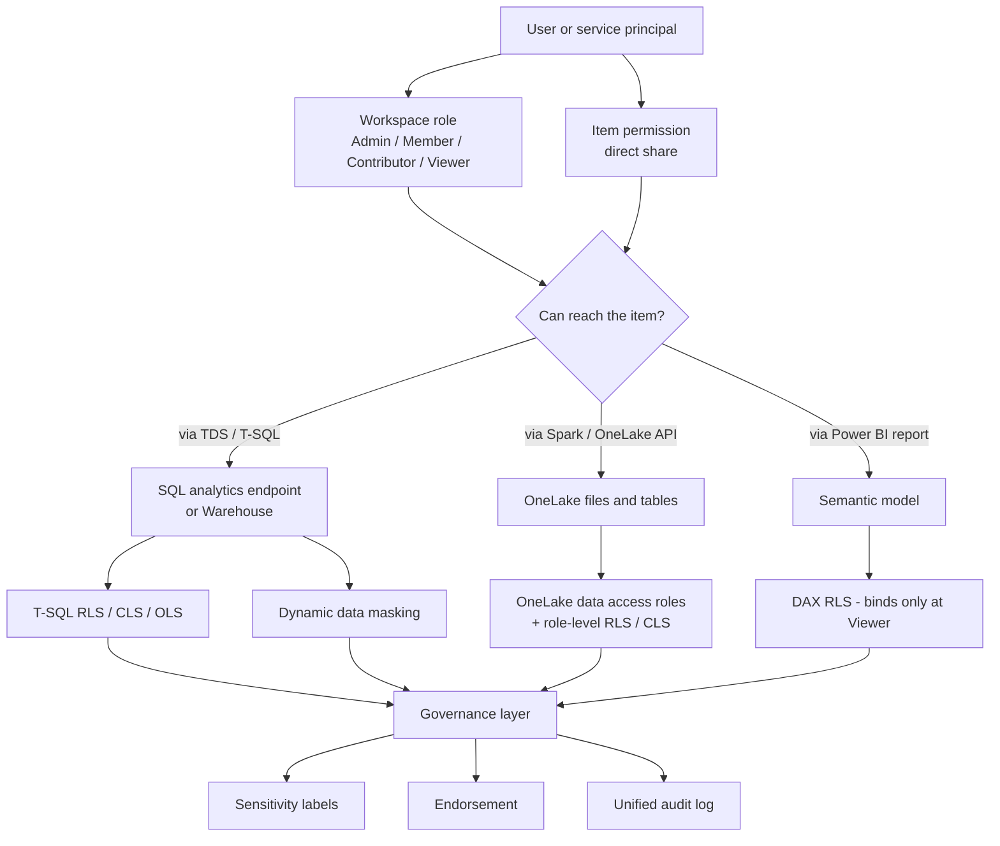

# 03. Security and Governance

> **Exam domain:** Domain 1 — Implement and manage an analytics solution (30–35%)
> **Source:** `certification/03-security-governance/` — 5 files condensed
> **Why the exam cares:** Fabric secures data through **layered, independently-evaluated** mechanisms. The exam almost never asks "what is RLS"; it asks which layer solves a given problem, and — far more often — which workspace role **silently bypasses** the control you just configured. Getting the bypass logic right is most of the marks in this area.

---

## Orientation — the 60-second version

Microsoft Fabric is a single SaaS analytics platform where every artefact (Lakehouse, Warehouse, pipeline, notebook, report) lives inside a **workspace**, and all the data physically lands in one storage layer called **OneLake**. Because many different engines — Spark, a T-SQL endpoint, Power BI — read the *same* files, security has to be answered separately for each path in. That is why this topic has five layers rather than one.

The outermost gate is the **workspace role** (Admin / Member / Contributor / Viewer): broad, workspace-wide, additive. Beside it — not beneath it — sits the **item permission**, a direct share on one single item that works even for someone with no workspace role at all. Both gates are evaluated independently, so revoking one does not revoke access still held through the other.

Once someone is inside, three narrowing mechanisms decide what they actually see. **T-SQL RLS/CLS/OLS** narrow rows, columns and objects, but only for queries arriving through the Warehouse or SQL analytics endpoint. **OneLake data access roles** do the equivalent job directly on OneLake folders and tables, so Spark, the OneLake APIs and Direct Lake all honour one definition. **Dynamic data masking** does something different again: it obscures the displayed value while still returning the row — a usability control, not a security boundary.

Finally, **governance** wraps the whole tenant: **sensitivity labels** (classification and, sometimes, protection), **endorsement** (Promoted / Certified / Master data trust badges), and the **unified audit log** for accountability.

## New terms in this topic

| Term | What it actually is |
| :--- | :--- |
| **OneLake** | The single tenant-wide data lake underneath all of Fabric. Every Lakehouse, Warehouse and mirrored database stores its files here as Delta tables, so multiple engines read the same physical bytes — which is exactly why security has to be answered per access path. |
| **Workspace** | The container for Fabric items and the primary security boundary. Roles are assigned at this level. |
| **Workspace role** | One of Admin / Member / Contributor / Viewer. Grants broad capabilities across every item in the workspace, and is additive (Admin ⊃ Member ⊃ Contributor ⊃ Viewer). |
| **Item permission** | A per-item grant (Read, ReadAll, Write, Reshare, Execute, ViewOutput, ViewLogs) created by sharing a single item. Fully independent of workspace role. |
| **Microsoft Entra ID** | Microsoft's cloud identity directory. Every Fabric principal is an Entra object — user, security group, mail-enabled security group, distribution list, Microsoft 365 group, or **service principal** (an app registration used for CI/CD and unattended automation). Entra is also the only authentication CLS supports. |
| **ReadData vs ReadAll** | Two different read paths. **ReadData** = read via the TDS endpoint using T-SQL. **ReadAll** = read the underlying files via OneLake APIs, Spark and Lakehouse explorer. Viewer gets ReadData but not ReadAll. |
| **Lakehouse** | A Fabric item holding Delta tables (`Tables/`) and raw files (`Files/`) in OneLake, with a free SQL analytics endpoint on top. |
| **Delta table / `_delta_log`** | The open table format OneLake stores tables in: Parquet data files plus a `_delta_log` folder of JSON metadata. A folder under `Tables/` only counts as a securable "table" for OneLake security if it has a valid `_delta_log` and no child shortcuts. |
| **Warehouse** | A Fabric item exposing a full T-SQL relational surface (writeable). Its granular security is T-SQL RLS/CLS/OLS — it is **not** managed by OneLake security roles. |
| **SQL analytics endpoint** | The read-only T-SQL (TDS) interface automatically created over a Lakehouse or mirrored database. This is where RLS/CLS/OLS/DDM apply. |
| **TDS endpoint** | The wire protocol SQL Server clients use (SSMS, VS Code, Power BI DirectQuery). "Connecting over TDS" = a normal SQL client connection. |
| **Shortcut** | A pointer from one OneLake location to data elsewhere (another Fabric item, ADLS, S3, Dataverse) with no data copy. Security is evaluated at the shortcut's *target*, not the shortcut. |
| **Mirroring / Mirrored database** | A continuously replicated, read-only copy of an external database landed into OneLake. Read-only by nature — you cannot write back through Fabric. |
| **Azure Databricks Mirrored Catalog** | A Fabric item that surfaces an Azure Databricks Unity Catalog in OneLake. One of only three item types that support OneLake security roles, and Read-only there. |
| **Eventhouse** | The Fabric item that holds KQL databases for real-time analytics. Relevant here only because its OneLake security support is **preview**, and covers RLS but not CLS. |
| **Direct Lake** | A Power BI semantic model storage mode that reads Delta files in OneLake directly, with no import and no query translation. Two flavours matter here: **Direct Lake over OneLake** (passes the viewer's identity) and **Direct Lake over SQL** (delegates to the item owner's identity). |
| **Semantic model** | The Power BI data model (tables, relationships, DAX measures) that reports sit on. Has its own DAX-defined RLS roles, separate from any SQL or OneLake security. |
| **RLS (row-level security)** | Filters which *rows* a query returns. Two unrelated implementations exist and behave differently: T-SQL `CREATE SECURITY POLICY` on the Warehouse/SQL endpoint, and DAX roles on a semantic model. |
| **CLS (column-level security)** | Blocks whole *columns*. In T-SQL it is nothing more than `GRANT SELECT ON table(cols)` with the sensitive column left out of the list. |
| **OLS (object-level security)** | Standard `GRANT` / `REVOKE` / `DENY` on securables — schemas, tables, views, stored procedures. |
| **DDM (dynamic data masking)** | Obscures a column's displayed *value* while still returning the row. A usability control, not an access boundary, and it exists only on the T-SQL surface. |
| **OneLake data access role** | A named RBAC role scoped to specific OneLake folders/tables, optionally carrying its own RLS/CLS. The only way to get one restriction enforced identically across engines. |
| **`DefaultReader`** | An auto-created OneLake security role whose membership is **virtual** — everyone holding the item's ReadAll permission is implicitly in it. The single most common reason a "restriction" does nothing. |
| **Virtual membership** | Role membership computed dynamically from Fabric item permissions rather than a manual member list. |
| **Passthrough vs delegated identity** | Passthrough (SSO) evaluates the *querying user's* identity at the target. Delegated evaluates the *item owner's* identity instead — which silently defeats per-user security. |
| **User's identity vs delegated identity access mode** | The SQL analytics endpoint's two evaluation modes. **Delegated** is the default and ignores OneLake security roles entirely; **User's identity** evaluates the querying user and honours them. A one-time per-endpoint setting. |
| **On-premises data gateway** | The connector that lets Fabric reach data behind a corporate firewall. Its permissions are administered outside the workspace-role system entirely, so a Contributor can still be unable to schedule a refresh. |
| **Domain** | A logical grouping of workspaces (e.g. Finance, Sales) used for federated governance — including a domain-level default sensitivity label. |
| **Power BI app** | A packaged, curated set of reports/dashboards from a workspace distributed to named **audiences**. A separate distribution layer that grants no workspace or item access. |
| **Microsoft Purview** | Microsoft's compliance and governance suite. Two parts matter here: **Purview Information Protection**, which defines sensitivity labels, and the **Purview portal**, where the unified audit log is searched. |
| **Sensitivity label** | A Microsoft Purview Information Protection classification (e.g. "Highly Confidential") applied to Fabric/Power BI items, sometimes carrying an access-restricting protection policy. |
| **Protection policy vs publishing policy** | The two Purview policy types that let a label actually *restrict* access rather than just classify: a **protection policy** covers the item inside the tenant where the label was applied; a **publishing policy** covers a `.pbix` or a file from a supported export path. |
| **Azure Information Protection (AIP)** | The legacy labelling platform that predates Purview unified labelling. AIP labels must be migrated to unified labelling before they work in Fabric at all. |
| **Endorsement** | A trust badge on an item: Promoted, Certified, or Master data. Raises the item's visibility as well as signalling trust. |
| **Unified audit log** | The Microsoft 365 activity log (viewed in the Microsoft Purview portal) recording who did what to which Fabric item. |
| **Administrative unit** | An Entra scoping container assigned to a Purview admin. An admin with **none** assigned is *unrestricted* and sees all audit activity; one with any assigned is *restricted* and sees only users inside it. |
| **Capacity Metrics app** | The Fabric app showing capacity usage; used to cross-reference capacity ID/name when an audit record leaves that field blank. |

## How the pieces fit



- **Two independent doors** get you to an item at all: workspace role and item permission. Neither is a parent of the other.
- **All four workspace roles** can connect to the SQL analytics endpoint and read over TDS (ReadData); only Admin/Member/Contributor get ReadAll (OneLake APIs/Spark).
- **T-SQL RLS/CLS/OLS** narrow what a SQL query returns — and nothing else. Spark is untouched by them.
- **OneLake data access roles** narrow what OneLake returns, and are the only single-definition, cross-engine mechanism.
- **DDM** sits on the SQL surface only, masks values rather than blocking access, and has no OneLake equivalent.
- **DAX RLS** on a semantic model is a reporting-layer control that only binds at Viewer.
- Every mechanism has its **own** bypass rule — three different rules across four mechanisms. Never generalise one to another.
- **Governance** (labels, endorsement, audit) runs across the whole tenant and is orthogonal to all of the above.

---

## 1. Workspace and Item Access
*Source: `01-workspace-item-access.md`*

Fabric layers two independent access mechanisms: **workspace roles** grant broad workspace-wide capabilities; **item permissions** grant fine-grained access to a single item regardless of workspace role.

### Workspace roles — capability matrix

Roles are assigned to individuals, security groups, Microsoft 365 groups, distribution lists, or Microsoft Entra ID service principals. A user in multiple groups gets the **highest** permission level across all their group memberships.

| Capability | Admin | Member | Contributor | Viewer |
| :--- | :---: | :---: | :---: | :---: |
| Update and delete the workspace | ✅ | | | |
| Add or remove people, including other admins | ✅ | | | |
| Add members or others with lower permissions | ✅ | ✅ | | |
| Allow others to reshare items ¹ | ✅ | ✅ | | |
| Create or modify database items (Warehouse, mirroring) | ✅ | ✅ | ✅ | |
| Create workspace identity | ✅ | | | |
| Connect workspace to a Git repository | ✅ | | | |
| View and read pipelines, notebooks, Spark job definitions, ML items, eventstreams | ✅ | ✅ | ✅ | ✅ |
| **Connect to SQL analytics endpoint of Lakehouse or Warehouse** | ✅ | ✅ | ✅ | ✅ |
| Read Lakehouse/Warehouse data via T-SQL through the TDS endpoint (**ReadData**) | ✅ | ✅ | ✅ | ✅ |
| Read Lakehouse/Warehouse data via OneLake APIs and Spark (**ReadAll**) | ✅ | ✅ | ✅ | |
| Read Lakehouse data through Lakehouse explorer (ReadAll) | ✅ | ✅ | ✅ | |
| Subscribe to OneLake events | ✅ | ✅ | ✅ | |
| Write or delete pipelines, notebooks, Spark job definitions, ML items | ✅ | ✅ | ✅ | |
| Write/delete schema and data of Lakehouses, Warehouses, and shortcuts | ✅ | ✅ | ✅ | |
| Execute or cancel pipelines, notebooks, Spark job definitions | ✅ | ✅ | ✅ | |
| View execution output of pipelines, notebooks, ML items | ✅ | ✅ | ✅ | ✅ |
| Schedule data refreshes / modify gateway connection settings ² | ✅ | ✅ | ✅ | |

¹ Contributors and Viewers can also reshare items if individually granted **Reshare** on that item.
² Requires separate gateway-level permissions, managed outside workspace roles.

> 📌 **Remember —** Workspace creators are automatically assigned **Admin**. Each workspace supports a maximum of **1,000 users or groups** in workspace roles (a group's internal membership is not counted against this limit).

> 🔑 **Exam fact —** All 4 roles get **ReadData** (TDS/T-SQL). Only Admin/Member/Contributor get **ReadAll** (OneLake APIs/Spark/Lakehouse explorer). This split is the single most tested fact in the subtopic.

### Assigning roles

Access is granted from the workspace's **Manage access** panel (Admin/Member only): search for a user, security group, mail-enabled security group, distribution list, or Microsoft 365 group, then pick a role. There is **no way to cap** a user's effective access below what any single group grants them — the highest role always wins.

- **Members can only add others at Member level or below** (Member, Contributor, Viewer). Only an **Admin** can grant or remove the Admin role.
- Access changes take effect **the next time the affected user logs into Fabric** — not instantly for an already-open session.
- **Microsoft Entra ID service principals** (app registrations) can hold workspace roles exactly like users, inheriting the same permissions for API-driven operations (**Items REST API**, **Job Scheduler API**) — the standard pattern for CI/CD and unattended automation.
- To enforce **RLS on Power BI items** for Fabric Pro users browsing a workspace, they must hold the **Viewer** role. Contributor+ sees unfiltered data regardless of any RLS on the semantic model, because higher roles already view/modify all workspace content.

> ⚠️ **Trap —** Assigning a Pro user **Contributor** instead of Viewer to a workspace containing an RLS-protected semantic model **defeats the RLS**. If a scenario asks how to make DAX RLS actually apply to workspace browsers, the answer is always **Viewer**, never higher.

**Gateway permissions are separate.** Scheduling refreshes through an **on-premises data gateway**, or modifying a gateway's connection settings, requires Admin/Member/Contributor in the workspace **plus** a matching permission on the gateway itself — managed independently, outside the Fabric workspace-role system (typically by whoever administers the gateway cluster). A user can be Contributor everywhere and still be unable to configure a refresh schedule.

**Worked example — assigning a data team**

| Role in org | Requirement | Workspace role setup |
| :--- | :--- | :--- |
| Manager | View/modify all department content across regions | Member on every regional workspace |
| Team lead | View/modify all content for one region only | Member on that region's workspace |
| Team member | View only their own figures; edit their own report | No workspace role; item-level share on their specific report, with RLS on the underlying semantic model scoping it further |
| Cross-department analyst | Read-only visibility across every workspace, no edit rights | Viewer on every relevant workspace |

Role assignment controls **whether** someone can reach the workspace/item at all; RLS controls **what** they see once there. Layering RLS on a shared semantic model lets each team member see only their own rows from the *same* report.

### Item-level permissions and sharing

| Permission | Grants |
| :--- | :--- |
| **Read** | View item metadata and any associated reports; does **not** grant access to underlying data in OneLake or SQL |
| **ReadAll** | Read underlying data via OneLake APIs, Spark, and Lakehouse explorer (subject to the item's `DefaultReader` OneLake security role) |
| **Write** | Full read/write on the item's data and definition, including through the SQL analytics endpoint |
| Reshare | Lets the grantee share the item further — cannot be granted standalone; layers on Read/Write |
| Execute | Run/trigger the item (e.g. a pipeline or notebook) — cannot be granted standalone |
| ViewOutput / ViewLogs | See execution output/logs of runs — cannot be granted standalone |

Sharing an item grants **Read** by default; the sharer chooses whether to add Write, Reshare, etc. during the share flow. Item permissions and workspace roles are **evaluated independently** — an item can be shared with someone holding no workspace role at all, and a workspace role can grant access that item sharing alone would not.

> ⚠️ **Trap —** Removing someone's **item** permission does not revoke access if they still hold a **workspace** role covering that item (Contributor+ sees all workspace content). To fully block a user, remove the **workspace role** too.

> 🧠 **Mental model —** Two independent doors, not a hierarchy: the workspace role is the front door to the whole building; item sharing is a side door cut into one room for someone who is never otherwise in the building. Closing the side door does nothing if they can still walk in the front.

### Permission differences by item type

Permission names are consistent; their practical effect is not — each item type documents its own sharing model.

| Item type | Notable permission behaviour |
| :--- | :--- |
| Semantic model | Read grants viewing reports built on it; a separate **Build** permission is needed to create new reports or connect Excel directly to the model |
| Warehouse | Read/Write map onto the SQL analytics endpoint's own T-SQL permission surface once connected (see §2) |
| Lakehouse | ReadAll (via OneLake security's `DefaultReader`) governs Lakehouse explorer and Spark/OneLake API access; ReadData (via workspace role or item Read) governs SQL analytics endpoint access |
| SQL database | Same Entra-based connection model as Warehouse, with its own row/column security surface |
| Mirrored database | **Read-only by nature** — mirrored data cannot be written back through Fabric |

> 🧠 **Mental model —** Same permission name, different lock mechanism. "Read" on a semantic model, a Warehouse and a Lakehouse wires into DAX-level report viewing, T-SQL connection rights, and OneLake file listing respectively. Never assume identical behaviour from an identical name.

### SQL analytics endpoint access vs workspace role

Connecting to a Lakehouse or Warehouse SQL analytics endpoint is open to **all four workspace roles** — and item **Read** alone suffices for a user with no workspace role. What they can *read* splits along the ReadData/ReadAll line:

| Access path | Who gets it | Notes |
| :--- | :--- | :--- |
| TDS endpoint / T-SQL (**ReadData**) | All 4 workspace roles; item Read+ | Standard SQL client connections (SSMS, VS Code, Power BI DirectQuery) |
| OneLake APIs / Spark (**ReadAll**) | Admin, Member, Contributor only | Viewer needs an explicit OneLake security grant (§3) for equivalent access |

If **OneLake security** is enabled on the SQL analytics endpoint (**User's identity access mode**), table/row/column restrictions defined there apply on top of this baseline — a user can hold ReadData and still see **zero rows** in a table they are not granted OneLake security access to.

### Removing and auditing access

Fully removing a user's access to an item requires checking **both** layers, in this order:

1. **Item permission** — remove the direct share on the item, if one exists.
2. **Workspace role** — remove or downgrade the role if it is Contributor+ (which would still expose the item regardless of step 1).

| Starting access | Item permission removed | Workspace role removed | Net result |
| :--- | :---: | :---: | :--- |
| Item share only, no workspace role | ✅ | n/a | Access revoked |
| Workspace role only (Contributor+), no item share | n/a | ✅ | Access revoked |
| Both item share and Contributor+ workspace role | ❌ (item share only) | — | **Access retained** via workspace role |
| Both item share and Contributor+ workspace role | ✅ | ✅ | Access revoked |

If the user reached the item only via a workspace role, step 1 is a no-op and step 2 alone suffices.

> ⚠️ **Trap —** Auditing "who has access to this report" by reviewing only its item-level share list **misses** everyone reaching it through a workspace role — Contributor+ users never appear on the share list because they need no explicit item grant. A complete audit checks both the item's share list **and** the workspace's role assignments.

### App audiences vs direct sharing

A **Power BI app** packages reports/dashboards from a workspace into a separate curated consumption surface, distributed to defined **audiences** — named subsets of installed users, each potentially seeing different content. Installing an app grants access **only to the packaged content**.

| | Direct item sharing | App audience |
| :--- | :--- | :--- |
| Grants workspace access? | No | No |
| Grants access to other workspace items? | No (item-scoped) | No (app-scoped) |
| Supports per-recipient content variation? | No — same item for everyone shared | Yes — different audiences see different report/dashboard subsets |
| Typical use | One-off access to a single item for a specific person | Broad, governed distribution to a business audience |

> ⚠️ **Trap —** Installing an app does **not** give a user Viewer access to the source workspace. They cannot browse other items, use the OneLake catalog to find related data, or connect to the SQL analytics endpoint through the app alone.

**Distinctive uses:** Viewer for a broad analyst team that browses dashboards and queries via SQL client but must not modify pipelines; sharing a single sensitive report with an external stakeholder; app audiences "Sales - EMEA" / "Sales - APAC" seeing region-filtered pages from one workspace; Contributor (not Member) for engineers who must not reshare or manage membership; a CI/CD service principal so deployments do not depend on a human's credentials.

### Common issues and errors

| Issue | Cause | Resolution |
| :--- | :--- | :--- |
| Viewer can query via SQL client but gets "access denied" from a Spark notebook on the same Lakehouse | Viewer grants ReadData (TDS) but not ReadAll (OneLake APIs/Spark) | Grant explicit OneLake security read access, or elevate to Contributor+ |
| Removing item sharing didn't block a user | User still holds a workspace role (Contributor+) covering all workspace content | Remove the workspace role as well |
| App installer can't see other workspace items | Apps expose only the packaged content | Share the additional item directly, or grant a workspace role |
| A resharer can't share an item further | User has Read/Write but not **Reshare** specifically | Grant Reshare explicitly, or use workspace Admin/Member (who can always reshare) |
| RLS on a semantic model doesn't filter a workspace browser's results | The browser holds Contributor+ rather than Viewer | Reassign the user/group to **Viewer** |
| A reassigned member still has old access | Access changes apply on next login, not the current session | Sign out and back in, or wait for session refresh |
| Service principal can't do notebook CRUD via the Items REST API | It was assigned **Viewer**, which the API treats the same as the UI (no create/modify) | Assign **Contributor** or higher |

---

## 2. Granular Access Controls (RLS / CLS / OLS)
*Source: `02-granular-access-controls.md`*

The Fabric **Warehouse and SQL analytics endpoint** support standard T-SQL granular security: **RLS** filters rows, **CLS** blocks columns, **OLS** governs GRANT/DENY on tables, views, schemas and other securables. A separate mechanism, **OneLake data access roles**, applies folder/table control directly in OneLake, independent of SQL.

### Who bypasses what — role × security mechanism

Every granular layer has its own, independent answer to "which workspace roles see everything anyway?"

| Mechanism | Viewer | Contributor | Member | Admin | Why |
| :--- | :---: | :---: | :---: | :---: | :--- |
| Semantic model **DAX RLS** | **filtered** | sees all | sees all | sees all | DAX RLS binds only at the **Viewer** role — Contributor+ has blanket view/modify access to all workspace content, which supersedes row filtering |
| Warehouse **T-SQL RLS** | **filtered** | **filtered** | **filtered** | **filtered** | `CREATE SECURITY POLICY` filter predicates apply to **every** querying principal, including `dbo` and `db_owner` members — no workspace role is exempt |
| Warehouse **DDM** | **masked** | sees all | sees all | sees all | Contributor/Member/Admin carry implicit `CONTROL` on the Warehouse database, which bundles `UNMASK`; only Viewer lacks it unless explicitly granted `UNMASK` |
| **OneLake security** data access roles | **filtered** | sees all | sees all | sees all | Admin/Member/Contributor's implicit workspace **Write** permission overrides the role's Read restriction; Viewer has no such override |

> 🧠 **Mental model —** Three different bypass rules. **SQL-layer RLS ignores `CONTROL` entirely** — a query-execution-time filter that catches even `db_owner`. **DDM and OneLake security honour the workspace role's implicit permissions** (`CONTROL` for DDM, **Write** for OneLake security) — Contributor+ sails through both. **DAX RLS only binds at Viewer** — a reporting-layer control a higher role simply outranks.

### Row-Level Security (RLS)

Same `CREATE SECURITY POLICY` mechanism as SQL Server: a **filter predicate**, defined as a schema-bound inline table-valued function, silently filters rows from `SELECT`, `UPDATE` and `DELETE`. Power BI queries against a warehouse in **Direct Lake mode automatically fall back to DirectQuery** to respect it.

> 🔑 **Exam fact —** **Fabric Warehouse RLS supports FILTER predicates only** — there is no BLOCK predicate type as in on-premises Azure SQL / SQL Server. An option describing a "block predicate" for Fabric Warehouse RLS is a reliable distractor.

```sql
-- Sample table sales.Orders (SaleID, SalesRep, ProductName, SaleAmount, SaleDate)
-- seeded with rows for sales1@contoso.com and sales2@contoso.com.

CREATE SCHEMA Security;
GO

CREATE FUNCTION Security.tvf_securitypredicate(@SalesRep AS nvarchar(50))
    RETURNS TABLE
WITH SCHEMABINDING
AS
    RETURN SELECT 1 AS tvf_securitypredicate_result
    WHERE @SalesRep = USER_NAME() OR USER_NAME() = 'manager@contoso.com';
GO

CREATE SECURITY POLICY SalesFilter
ADD FILTER PREDICATE Security.tvf_securitypredicate(SalesRep)
ON sales.Orders
WITH (STATE = ON);
GO
```

To change the predicate function you must **drop the policy first**, alter the function, then recreate the policy:

```sql
DROP SECURITY POLICY SalesFilter;
GO

ALTER FUNCTION Security.tvf_securitypredicate(@SalesRep AS nvarchar(50))
    RETURNS TABLE
WITH SCHEMABINDING
AS
    RETURN SELECT 1 AS tvf_securitypredicate_result
    WHERE @SalesRep = USER_NAME() OR USER_NAME() = 'president@contoso.com';
GO

CREATE SECURITY POLICY SalesFilter
ADD FILTER PREDICATE Security.tvf_securitypredicate(SalesRep)
ON sales.Orders
WITH (STATE = ON);
GO
```

> 🔑 **Exam fact —** A schema-bound security policy **blocks `ALTER FUNCTION`** on its predicate function for as long as the policy exists — Fabric enforces this so the security logic cannot be silently changed underneath an active policy. **Drop → alter → recreate** is the only supported sequence. Setting the policy to `STATE = OFF` and altering the function in place is **not** a valid workaround, and neither is leaving the old policy beside a brand-new function.

Key behaviour:

- The application is **unaware** which rows were filtered — a fully-filtered result comes back **empty, not as an error**.
- Filter predicates apply on every `SELECT`, `UPDATE` and `DELETE`; users can still `INSERT` rows that are immediately filtered on any subsequent read.
- With `SCHEMABINDING = ON` (the default), permission checks on the predicate function and any tables/views it references are **bypassed** for callers of the protected table — this is what lets one centrally-managed function secure a table without granting broad permissions to every user.
- **RLS applies even to `dbo` users and members of `db_owner`**, unless the predicate explicitly exempts them (as the example does for `manager@contoso.com`).
- Creating/altering/dropping a security policy requires `ALTER ANY SECURITY POLICY` plus schema `ALTER`; the predicate function needs `SELECT`/`REFERENCES` permissions per Fabric's documented list.

> ⚠️ **Trap —** RLS is **not immune to side-channel inference**. `SELECT 1/(SaleAmount-1000) FROM sales.Orders` can leak whether a filtered-out row exists via a divide-by-zero error, even though the row is never returned. Treat RLS as row *visibility* control, not airtight confidentiality — pair it with monitoring for unusual query patterns.

### Column-Level Security (CLS)

CLS restricts which **columns** a user can select using standard T-SQL `GRANT` — no separate DDL construct. Simpler than building masking views, and applies to both Warehouse and SQL analytics endpoint. **Only Microsoft Entra authentication is supported.**

```sql
CREATE TABLE dbo.Customers (
    CustomerID int,
    FirstName  varchar(100) NULL,
    CreditCard char(16)     NOT NULL,
    LastName   varchar(100) NOT NULL,
    Phone      varchar(12)  NULL,
    Email      varchar(100) NULL
);
GO

-- Grant Charlie every column except CreditCard
GRANT SELECT ON dbo.Customers(CustomerID, FirstName, LastName, Phone, Email)
    TO [charlie@contoso.com];
```

A query touching the un-granted column **fails outright** — a hard error, not a silently omitted column:

```sql
-- Run as charlie@contoso.com
SELECT * FROM dbo.Customers;
```

```text
Msg 230, Level 14, State 1, Line 1
The SELECT permission was denied on the column 'CreditCard' of the object
'Customers', database 'ContosoSales', schema 'dbo'.
```

> 🧠 **Mental model —** CLS is a guest list per column. `SELECT *` where you are missing one column's list does not quietly drop that column — it rejects the whole statement. Fix by granting the missing columns, or by enumerating only the permitted ones (`SELECT CustomerID, FirstName FROM ...`).

> ⚠️ **Trap —** Assigning CLS grants to **individual users** does not scale. Fabric's guidance is to grant column permissions to a **SQL role** and add/remove users from that role. A scenario describing dozens of per-user `GRANT` statements for the same column set is an **anti-pattern**, not a best practice.

### Object-Level Security (OLS)

Standard `GRANT`, `REVOKE`, `DENY` on any securable — schemas, tables, views, stored procedures — assigned to individual users or (preferred) custom/built-in SQL roles.

```sql
-- Grant read access on an entire schema
GRANT SELECT ON SCHEMA::Reports TO [AnalystRole];

-- Grant on a single object
GRANT SELECT, INSERT, UPDATE ON dbo.Orders TO [ETLRole];

-- DENY overrides any GRANT, including one inherited through role membership
DENY SELECT ON dbo.CustomerPayments TO [AnalystRole];

-- REVOKE removes a prior GRANT or DENY entry — it does not itself block access
REVOKE SELECT ON dbo.Customers FROM [FormerContractor];
```

You **cannot run `CREATE USER`** explicitly in a Fabric warehouse or SQL analytics endpoint — running `GRANT` or `DENY` against a principal **creates the database user automatically**. That user still cannot connect until they also have sufficient workspace-level rights (a workspace role, or item **Read** at minimum).

```sql
-- Check effective permissions
SELECT * FROM sys.fn_my_permissions(NULL, 'Database');       -- database-scoped
SELECT * FROM sys.fn_my_permissions('dbo.Orders', 'Object'); -- object-scoped
```

> ⚠️ **Trap —** `REVOKE` is not `DENY`. `REVOKE` erases a permission entry (falling back to whatever else the user has, e.g. through a role); `DENY` is an explicit, overriding block. If access must be **guaranteed** blocked regardless of role membership, use `DENY`.

### DDM interplay

DDM (§4) obscures column *values* for unprivileged users while still returning the row — a usability/accidental-exposure control, not an access-blocking one. RLS, CLS and OLS all **block** access outright (no rows, no columns, permission errors); DDM returns a masked value and lets the query succeed. Layer DDM alongside RLS/CLS/OLS for defence in depth — masking a column does not substitute for restricting who can query it.

### Lakehouse folder/file control via OneLake data access roles

Everything above is **Warehouse and SQL analytics endpoint only** — T-SQL constructs on a relational surface. A **Lakehouse's** raw files and folders in OneLake (outside the SQL analytics endpoint) are instead secured with **OneLake data access roles**: named roles scoped to specific folders or tables, with optional RLS/CLS defined *within* the role (§3).

### Decision matrix — which granular control, at which layer?

| Scenario | Right layer | Why |
| :--- | :--- | :--- |
| Restrict rows returned from a Warehouse table for SQL clients / Power BI DirectQuery | RLS (SQL endpoint) | `CREATE SECURITY POLICY` is native to the Warehouse's T-SQL surface |
| Block an entire sensitive column from a subset of SQL users | CLS (SQL endpoint) | `GRANT SELECT ON table(cols)` is the simplest, most direct mechanism |
| Restrict which tables/schemas a SQL principal can even see | OLS (SQL endpoint) | Standard `GRANT`/`DENY` on schema or object |
| Restrict which **folders/tables** a Spark notebook or OneLake API caller can read in a Lakehouse | OneLake data access role | SQL-layer RLS/CLS/OLS do not apply outside the SQL analytics endpoint |
| Restrict rows/columns for **all** engines (Spark, SQL endpoint, Direct Lake) uniformly from one place | OneLake security role with RLS/CLS defined in the role | Defined once in OneLake, enforced across every supported engine |
| Restrict what a Power BI report viewer sees, independent of any warehouse/lakehouse security | Semantic model RLS (DAX roles) | Applies at the reporting layer even for imported/cached data with no live SQL/OneLake connection |
| Obscure PII values without blocking access outright (e.g. support agents on prod data) | DDM | Values masked, query still succeeds — not an access-blocking control |

> 🧠 **Mental model —** Layers of a house, not competing locks. The **SQL endpoint's** RLS/CLS/OLS lock the dining room's chairs (rows) and place settings (columns); **OneLake security** locks the pantry (raw files) regardless of which door you use; the **semantic model's** RLS locks what one guest sees once seated. None substitutes for another — someone blocked at one door may reach the same data through an unlocked one.

**Distinctive uses:** multi-tenant SaaS warehouse where each customer's analysts see only their tenant's rows (RLS); hiding `CreditCard`/`SSN` from all but a finance role while the rest of the table stays queryable (CLS); preventing a reporting role from ever seeing an ETL-only staging schema (OLS); one OneLake role definition so Spark, SQL endpoint and Direct Lake enforce identically.

### Common issues and errors

| Issue | Cause | Resolution |
| :--- | :--- | :--- |
| `ALTER FUNCTION` fails on an RLS predicate function | An active schema-bound security policy still references it | Drop the security policy, alter the function, recreate the policy |
| `SELECT *` fails with a permission error on one column | CLS grant doesn't include that column | Grant the missing column explicitly, or query only permitted columns |
| A user still sees data after a `REVOKE` | `REVOKE` only removes a direct grant; role-inherited access remains | Use `DENY` if access must be blocked regardless of role membership |
| Power BI report against a warehouse falls back to DirectQuery unexpectedly | RLS or CLS is defined on the underlying Warehouse/SQL analytics endpoint | Expected — Direct Lake can't honour SQL-layer RLS/CLS in-memory, so it falls back automatically |
| Spark notebook still sees rows SQL endpoint users don't | Restriction defined only as SQL-endpoint RLS, not a OneLake security role | Move the restriction into a OneLake data access role for cross-engine enforcement |

---

## 3. OneLake Security
*Source: `03-onelake-security.md`*

**OneLake security** applies role-based access control directly to tables and folders in OneLake, independent of the SQL analytics endpoint's T-SQL surface. It lets Spark notebooks, OneLake APIs, Lakehouse explorer and (optionally) the SQL analytics endpoint enforce the *same* row/column/table restrictions from one definition. Status verified against Microsoft Learn as of **July 2026**.

OneLake security is **deny-by-default**: a user gets zero data access in an item unless a role explicitly grants it.

### Data access roles

A role is made of four parts:

- **Type** — only `GRANT` roles are supported (**no `DENY` role type**)
- **Permission** — `Read` or `ReadWrite` (ReadWrite is only meaningful for Viewers/Read-permission users; a no-op for Admin/Member/Contributor, who already have Write implicitly)
- **Scope** — the tables/folders the role applies to (all data, or a selected subset)
- **Members** — Microsoft Entra users, groups, or non-user identities

| Fabric item | Supported permissions |
| :--- | :--- |
| **Lakehouse** | Read, ReadWrite |
| Azure Databricks Mirrored Catalog | Read |
| Mirrored Database | Read |

> 🔑 **Exam fact —** **Warehouse is absent** from this list. Warehouse and SQL analytics endpoint granular security uses T-SQL RLS/CLS/OLS instead (§2).

### `DefaultReader` and other default roles

Every new supported item is created with default roles so privileged users keep a working baseline. Most get a `DefaultReader` built with **virtual membership** — members computed dynamically from item permissions, not manually assigned.

| Fabric item | Role name | Permission | Scope | Assigned members |
| :--- | :--- | :--- | :--- | :--- |
| Lakehouse | `DefaultReader` | Read | All folders under `Tables/` and `Files/` | All users with **ReadAll** permission |
| Lakehouse | `DefaultReadWriter` | Read | All folders | All users with **Write** permission |
| Azure Databricks Mirrored Catalog | `DefaultReader` | Read | `Tables/` and `Files/` | All users with **Read** permission |
| Mirrored Database | `DefaultReader` | Read | `Tables/` and `Files/` | All users with **ReadAll** permission |

> ⚠️ **Trap —** **Adding a user to a custom, restricted OneLake security role does not restrict them if they remain a member of `DefaultReader`.** Because `DefaultReader`'s membership is virtual (anyone with ReadAll), the user keeps full unrestricted read access regardless of what the new role says. To actually restrict them you must **delete `DefaultReader`** or **remove the underlying ReadAll permission**.

### Creating a custom role

Role creation happens in the item's **Manage OneLake security** UX (requires Fabric **Write** or **Reshare** permission — generally Admin/Member workspace users):

1. Name the role — alphanumeric, starts with a letter, case-insensitive, unique, **≤128 characters**.
2. Choose **Grant** as the role type, and select **Read** (and optionally **ReadWrite**, for supported item types).
3. Scope the role: **All data**, or **Selected data** — pick specific tables and folders.
4. For any selected table, optionally attach **row-level** or **column-level** security.
5. Add members: manually by name/email, or via **virtual membership** (anyone holding a chosen combination of Fabric item permissions — Read, Write, Reshare, Execute, ReadAll).
6. Save — role creation and membership changes take effect immediately; role **definition** changes take **~5 minutes** to propagate; **group membership** changes to a role can take **up to an hour**, plus additional engine-specific caching delay.

```text
Maximum OneLake security roles per item:      250 (increasable to 1,000 via support request)
Maximum members per role:                     500 users or groups
Maximum permissions per role:                 500
```

### Row-level and column-level security within a role

Defined at role-creation/edit time via the table's **Data access** option:

- **RLS** — a SQL predicate showing rows where it evaluates `true`. String comparisons are **case-insensitive** (`Latin1_General_100_CI_AS_KS_WS_SC_UTF8` collation) — avoid string-equality predicates on data with inconsistent casing/accents; **prefer integer comparisons**.
- **CLS** — hides (removes) specific columns; a hidden column behaves as having no permission at all, so queries touching it return no data for that column. In the **SQL analytics endpoint** specifically, CLS uses **deny/intersection** semantics rather than union.
- **`ReadWrite` roles cannot carry RLS or CLS constraints** — write access requires seeing and being able to modify the full row/column set.

**Evaluating multiple roles.** A user can belong to several roles. Table/folder-level access **unions** (least-restrictive: any role granting TableA means the user sees TableA). But *within* a single role, RLS/CLS constraints **intersect**:

```text
Effective role = ( (R1_tables ∩ R1_cls ∩ R1_rls) ∪ (R2_tables ∩ R2_cls ∩ R2_rls) )
```

The exception: **CLS on the SQL analytics endpoint intersects across all of a user's roles** instead of unioning — a `DENY`-equivalent semantic where being blocked from a column in *any* role blocks it everywhere, even if another role would have granted it.

> 🧠 **Mental model —** Each role is a visitor badge. Badge A *or* badge B gets you into any room either unlocks (union at the table level). But within one badge, which rows and columns you get is exactly what that badge says (intersection). The twist: on the SQL analytics endpoint, a column blocked by *any one* badge stays blocked no matter how many other badges would have allowed it.

### Table-level security and metadata

Not every folder under `Tables/` counts as a securable "table". To qualify, a folder must:

- Live in the `Tables/` directory of the item (or a valid schema folder, for schema-enabled items)
- Contain a `_delta_log` folder with valid Delta metadata JSON files
- Contain **no child shortcuts**

Any folder failing these checks is **denied access outright** if table-level security is configured on it — it simply does not resolve as a securable table.

**Metadata security** has a narrower guarantee than data security: Read grants data and metadata access together, and a user with **no** access sees neither. However, OneLake security does **not** guarantee that column *names* stay fully hidden in every surface — some error messages and tooling experiences may still reveal a column name even when its data is inaccessible.

### `ReadWrite` permission

Extends `Read` with the ability to modify data — but only for **Viewer**-tier or Read-permission users; a no-op for Admin/Member/Contributor.

- Includes all `Read` privileges, plus: create/delete/rename a folder or table, upload/edit a file, create/delete/rename a shortcut
- Enabled through Spark notebooks, the OneLake file explorer, or OneLake APIs — **not** through the Lakehouse UX's viewer-facing surface (write operations there still require Contributor+)
- **A `ReadWrite` role cannot carry RLS or CLS constraints**
- Because Fabric only supports single-engine writes to a given piece of data, a `ReadWrite` grant lets a user write **only through OneLake** — but read access is enforced consistently by every engine

> ⚠️ **Trap —** "Grant `ReadWrite` with row-level security so the analyst can edit only their region's rows" is an **unsupported** configuration. If partial-write access with row restriction is genuinely required, the write path must go through a governed pipeline/notebook process instead.

### OneLake security and workspace permissions

Workspace roles are the **first** security boundary — OneLake security layers on top, and workspace roles can **override** it.

| Permission | Admin | Member | Contributor | Viewer |
| :--- | :---: | :---: | :---: | :---: |
| View files in OneLake | Always ✅ | Always ✅ | Always ✅ | No by default — use OneLake security |
| Write files in OneLake | Always ✅ | Always ✅ | Always ✅ | No by default — use OneLake security |
| Can edit OneLake security roles | Always ✅ | Always ✅ | ❌ | ❌ |

> ⚠️ **Trap —** Admin, Member and Contributor all get **implicit Write** to OneLake, and Write always includes Read, so **OneLake security Read restrictions have zero effect on those three roles**. "The Contributor still sees data they were restricted from" is not a bug — restricting Admin/Member/Contributor via OneLake security **does not work**. Only Viewer's default-no-access baseline is meaningfully shaped by OneLake security roles.

### OneLake security and item permissions

| Item permission | View files in OneLake | Write files in OneLake | Read via SQL analytics endpoint |
| :--- | :---: | :---: | :---: |
| Read | No by default — use OneLake security | No | No |
| ReadAll | Yes, via `DefaultReader` (restrictable) | No | Depends on SQL analytics endpoint mode |
| Write | Yes | Yes | Yes |
| Execute, Reshare, ViewOutput, ViewLogs | N/A — can't be granted standalone | N/A | N/A |

### Enabling OneLake security for the SQL analytics endpoint

By default a SQL analytics endpoint uses a **delegated identity** — OneLake security roles have **no effect** until you switch it to **User's identity access mode**, a one-time setting per endpoint:

1. Open the Lakehouse's SQL analytics endpoint → **Security** tab.
2. **View data access mode** → **Data access mode settings**.
3. Select **Use OneLake security for tables (User's identity access mode)** → **Apply** → **Continue**.

Once enabled, RLS/CLS/table filtering defined in OneLake security roles is enforced for that endpoint's SQL queries too.

### Shortcuts — permission delegation

**Passthrough shortcuts (SSO).** The **querying user's own identity** is evaluated against the shortcut's **target**. Reading through an internal shortcut requires OneLake security permission **at the target**, not the shortcut item — you **cannot define OneLake security directly on an internal shortcut**; security must live on the target folder in the target item.

> ⚠️ **Trap —** **Power BI semantic models using Direct Lake over *SQL*** and **T-SQL in *Delegated* identity mode** do **not** pass the calling user's identity through a shortcut — they delegate to the **item owner's** identity. If a scenario requires per-user OneLake security enforcement through a shortcut, switch to **Direct Lake over OneLake mode** or **T-SQL User's identity mode**; delegated modes silently bypass per-user shortcut security.

If the shortcut's target item type does not support OneLake security at all, access falls back to whether the user has Fabric **ReadAll** on the target item — and the user **does not need Fabric Read permission on the target item itself** to use the shortcut.

**Delegated shortcuts (ADLS, S3, Dataverse).** Access requires **both** the delegated connection's own authorization for the shortcut **creator** **and** the requesting user's OneLake security grant:

| Delegated connection authorizes creator? | OneLake security authorizes requester? | Requester gets access? |
| :---: | :---: | :---: |
| Yes | Yes | ✅ |
| Yes | No | ❌ |
| No | Yes | ❌ |
| No | No | ❌ |

Unlike passthrough shortcuts, a user accessing a delegated (external) shortcut **does** need Fabric **Read** permission on the item where the shortcut resides, to securely resolve the external connection.

**Listing vs access.** Listing a directory always shows internal shortcuts regardless of the user's access to the target — the **access check only happens when the user tries to open the shortcut**, at which point target permissions apply. Nested shortcuts (a shortcut pointing at another shortcut) still ultimately require access to the *original* external target.

### GA / Preview status by engine (as of July 2026)

| Engine | RLS/CLS filtering | Status |
| :--- | :--- | :--- |
| Lakehouse (browsing/explorer) | Yes | **GA** |
| Spark notebooks | Yes | **GA** |
| SQL analytics endpoint, User's identity access mode | Yes | **GA** |
| Semantic models, Direct Lake on **OneLake** mode | Yes | **GA** |
| Eventhouse | **RLS only (no CLS)** | Preview |
| Authorized third-party engines (via OneLake authorized engine APIs) | Yes, if implemented by the engine | Preview |

> 📌 **Remember —** This table reflects Microsoft Learn's OneLake security documentation as last verified in **July 2026**. This surface has evolved quickly through 2026; re-check the official access control model doc before relying on GA/preview status in a real deployment decision.

### Limitations

- B2B guest users need **Guest users have the same access as members** enabled in Entra External ID collaboration settings before they can be assigned a OneLake security role.
- **Distribution lists** added to a role are **not resolvable by the SQL analytics endpoint** (or Direct Lake on SQL) — those users appear as non-members there even though they are in the list.
- **Data preview for RLS/CLS-secured tables is not supported on non-schema-enabled Lakehouses** — use schema-enabled Lakehouses with OneLake security.
- OneLake security **does not work with Azure Data Share or Purview Data Share**.

**Distinctive uses:** one row-level restriction definition honoured identically by Spark, the SQL endpoint and Direct Lake instead of three separate definitions; restricting Viewer-role users to specific folders while Admin/Member/Contributor are unaffected; granting a downstream workspace read access to a shortcut's source data without duplicating files; delegating fine-grained access to security groups via virtual membership tied to item permissions.

### Common issues and errors

| Issue | Cause | Resolution |
| :--- | :--- | :--- |
| A user in a restricted custom role still sees everything | They remain a member of `DefaultReader` via ReadAll permission | Delete `DefaultReader` or remove the user's ReadAll permission |
| Restricting Admin/Member/Contributor via OneLake security has no effect | Those roles carry implicit Write, which always includes Read | OneLake security can only meaningfully restrict Viewer-tier access |
| SQL analytics endpoint ignores a OneLake security role | Endpoint is still in default **delegated identity mode** | Switch to **User's identity access mode** in the endpoint's Security settings |
| Per-user restriction not enforced through a shortcut in a Power BI report | Direct Lake over SQL / Delegated T-SQL mode delegates to item owner identity | Use Direct Lake over OneLake mode or T-SQL User's identity mode |
| Role changes seem to take effect slowly | Group membership propagation can take up to an hour, plus engine caching | Expected latency — role **definition** ~5 minutes, **group membership** up to ~1 hour |

---

## 4. Dynamic Data Masking
*Source: `04-dynamic-data-masking.md`*

**DDM** obfuscates sensitive column values in query results for unprivileged users **without changing the stored data**. It works on the Fabric **Warehouse and SQL analytics endpoint** using standard `MASKED WITH` column syntax and `UNMASK` permission grants.

### Masking functions

| Function | Description | Example |
| :--- | :--- | :--- |
| **`default()`** | Full masking by data type: strings → `XXXX` (or shorter); numerics → `0`; dates → `1900-01-01 00:00:00.0000000`; binary → a single zero byte | `Gender char(1) MASKED WITH (FUNCTION = 'default()')` |
| **`email()`** | Exposes the first letter and a constant `.com` suffix, in email shape | `aXXX@XXXX.com` |
| **`random(m, n)`** | Random numeric value in a specified range — **numeric types only** | `MASKED WITH (FUNCTION = 'random(1, 100)')` |
| **`partial(prefix, "padding", suffix)`** ("Custom String") | Exposes a configurable number of leading/trailing characters, with a custom padding string in between | `partial(1,"XXXXXXX",0)` turns `555.123.1234` into `5XXXXXXX` |

If the underlying value is too short to satisfy the full prefix/suffix length, `partial()` exposes what it can and pads the rest.

> ⚠️ **Trap —** On-premises SQL Server also documents a `datetime()` masking function for partial date reveal — **Fabric Data Warehouse's masking-functions reference lists only four**: `default()`, `email()`, `random(m,n)`, `partial()`. Do not port a `datetime()` example from generic SQL Server material into a Fabric scenario. Date columns in Fabric are masked with `default()`, which fully replaces the value with a fixed date.

### Applying masks

```sql
CREATE TABLE dbo.EmployeeData (
    EmployeeID  INT,
    FirstName   VARCHAR(50)  MASKED WITH (FUNCTION = 'partial(1,"-",2)') NULL,
    LastName    VARCHAR(50)  MASKED WITH (FUNCTION = 'default()') NULL,
    SSN         CHAR(11)     MASKED WITH (FUNCTION = 'partial(0,"XXX-XX-",4)') NULL,
    Email       VARCHAR(256) NULL
);
GO
INSERT INTO dbo.EmployeeData
VALUES (1, 'TestFirstName', 'TestLastName', '123-45-6789', 'email@youremail.com');
GO
```

`FirstName` shows only the first and last two characters with `-` in between; `LastName` shows `XXXX`; `SSN` shows `XXX-XX-` followed by the last four digits; `Email` has no mask yet.

```sql
-- Add a mask to an existing (previously unmasked) column
ALTER TABLE dbo.EmployeeData ALTER COLUMN Email ADD MASKED WITH (FUNCTION = 'email()');
GO

-- Remove a mask
ALTER TABLE dbo.EmployeeData ALTER COLUMN Email DROP MASKED;
GO
```

### Permissions and `UNMASK`

| Operation | Required permission |
| :--- | :--- |
| Create a table with masked columns | `CREATE TABLE` + `ALTER` on the schema |
| Add, replace, or remove a mask on a column | `ALTER ANY MASK` + `ALTER` on the table |
| View masked data (default behaviour) | `SELECT` on the table |
| **View unmasked data** | `UNMASK` on the column, or `CONTROL` on the database |

```sql
-- Grant a specific user the ability to see real values on this table
GRANT UNMASK ON dbo.EmployeeData TO [TestUser@contoso.com];
REVOKE UNMASK ON dbo.EmployeeData FROM [TestUser@contoso.com];

-- Grant/revoke to a role instead of an individual user (preferred at scale)
GRANT UNMASK ON dbo.EmployeeData TO [TestRole];
REVOKE UNMASK ON dbo.EmployeeData FROM [TestRole];
```

`CONTROL` on the database bundles both `ALTER ANY MASK` and `UNMASK` — anyone with `CONTROL` sees unmasked data automatically, with no separate `UNMASK` grant.

> ⚠️ **Trap —** **Fabric workspace Admin, Member and Contributor carry `CONTROL` on the Warehouse database by design** — they see unmasked data by default, without ever being granted `UNMASK`. This differs from on-premises SQL Server where only `db_owner`/`sysadmin` bypass masking. "Does a workspace Contributor need `GRANT UNMASK` to see real values?" → **No.** Only users **without** Admin/Member/Contributor and without elevated Warehouse permissions actually see masked output.

### Exam trap — masking is not encryption

DDM changes what a **query result** displays; it never touches the bytes on disk. Any user with `SELECT` access can still infer real values through **inference/brute force**, because the `WHERE` clause still evaluates against real data:

```sql
-- Salary is MASKED WITH (FUNCTION = 'default()') — displays as 0 to unprivileged users
SELECT ID, Name, Salary FROM Employees
WHERE Salary > 99999 AND Salary < 100001;
```

```text
ID     Name        Salary
62543  Jane Doe    0
91245  John Smith  0
```

`Salary` still shows `0`, but the `WHERE` clause confirms both employees earn between $99,999 and $100,001. Repeating with narrower ranges eventually pins down the exact value.

> ⚠️ **Trap —** "DDM fully protects sensitive data from users with query access" is something DDM explicitly does **not** do. Microsoft's own guidance is not to use dynamic data masking alone to fully secure sensitive data from users with query access to the Warehouse or SQL analytics endpoint. Pair DDM with RLS, CLS or OLS (§2) for actual access control — DDM only helps against **accidental** exposure, not a determined or malicious query author.

> 🧠 **Mental model —** Frosted glass, not a locked door. You cannot read the fine print through it, but you can shine a precisely-aimed light (a crafted range query) and infer what is behind it. A locked door (RLS/CLS/OLS) prevents entry outright.

### DDM vs RLS/CLS at a glance

| Aspect | Dynamic Data Masking | RLS / CLS / OLS |
| :--- | :--- | :--- |
| What's hidden | Column **values** (row still returned) | Entire **rows** (RLS) or **columns** (CLS), or object access outright (OLS) |
| Enforcement point | Presentation of query results | Query execution itself — restricted data is never retrieved |
| Blocks inference? | **No** | Yes — a blocked row/column simply isn't queryable |
| Bypassed by | `UNMASK` grant, or database `CONTROL` (implicit for Admin/Member/Contributor) | Explicit `GRANT`, or exemption logic in the RLS predicate function |
| Typical pairing | Layered **on top of** RLS/CLS/OLS for defence in depth | The actual access-blocking layer DDM complements |

### Managing and cleaning up masks

```sql
SELECT * FROM sys.masked_columns;   -- audit which columns are currently masked
DROP TABLE dbo.EmployeeData;
```

Hands-on prerequisites: masking rules are defined via ordinary SQL script in the Warehouse's **New SQL query** editor; testing requires **two accounts** — an "admin" account (Admin/Member/Contributor, or elevated Warehouse permission) to configure masks and grant/revoke `UNMASK`, and a "test user" account *without* those roles to observe masked behaviour.

**Canonical six-step test walkthrough** (mirrors how Microsoft's own documentation demonstrates DDM, and how a scenario question is likely to walk through it):

1. *(admin)* Create and populate the table with masked columns.
2. *(test user, no elevated role)* `SELECT * FROM dbo.EmployeeData;` → `FirstName: T-------e` | `LastName: XXXX` | `SSN: XXX-XX-6789`
3. *(admin)* `GRANT UNMASK ON dbo.EmployeeData TO [TestUser@contoso.com];`
4. *(test user)* Confirm real values are now visible.
5. *(admin)* `REVOKE UNMASK ON dbo.EmployeeData FROM [TestUser@contoso.com];`
6. *(test user)* Confirm masked output has returned.

### Fabric vs on-premises SQL Server DDM

| Aspect | On-premises SQL Server | Fabric Warehouse / SQL analytics endpoint |
| :--- | :--- | :--- |
| Mask functions available | `default()`, `email()`, `random()`, `partial()`, plus `datetime()` on some versions | `default()`, `email()`, `random()`, `partial()` **only** |
| Who bypasses masking by default | `db_owner` members, `sysadmin` | Workspace **Admin/Member/Contributor** (via implicit `CONTROL`), or anyone with elevated Warehouse permission |
| `CREATE USER` for a masked-table principal | Explicit `CREATE USER` statement | Not supported directly — `GRANT`/`DENY` auto-creates the database user |
| Applies to | Any SQL Server database | **Only Warehouse and SQL analytics endpoint** — not Lakehouse files accessed via Spark/OneLake APIs |

> 🔑 **Exam fact —** DDM has **no OneLake-security equivalent**. A Spark notebook reading the same underlying Delta table directly through OneLake sees the **real, unmasked values** regardless of any DDM on the Warehouse/SQL endpoint. Masking-equivalent protection for Spark consumers must be implemented in notebook logic or via a governed, pre-masked copy.

**Distinctive uses:** masking customer PII (SSN, credit card, phone) in a Warehouse shared by privileged engineers and lower-trust analysts; letting support agents confirm an account exists from a masked `Email` without seeing the full address; developers running realistic queries against masked production copies without exposing real values in results or screenshots.

### Common issues and errors

| Issue | Cause | Resolution |
| :--- | :--- | :--- |
| A Contributor sees unmasked data despite no explicit UNMASK grant | Admin/Member/Contributor carry implicit `CONTROL` on the database | Expected — restrict via workspace role assignment, not DDM |
| `ALTER COLUMN ... ADD MASKED` fails | Missing `ALTER ANY MASK` and/or `ALTER` on the table | Grant both permissions to the user applying the mask |
| A "restricted" user can still infer real values | DDM doesn't prevent inference via crafted range queries | Layer RLS/CLS/OLS on the column/table; don't rely on DDM alone |
| `GRANT UNMASK` doesn't seem to apply | Grant targeted the wrong principal (user vs role), or the user still lacks basic `SELECT` | Confirm the grantee and that base `SELECT` on the table is present |

---

## 5. Governance — Labels, Endorsement, Audit Logs
*Source: `05-governance.md`*

Three related but distinct mechanisms: **sensitivity labels** classify and protect content (via Microsoft Purview Information Protection), **endorsement** signals quality and trust, and the **unified audit log** records who did what. Verified against Microsoft Learn as of **July 2026**.

### Sensitivity labels — applying

Labels come from **Microsoft Purview Information Protection**. They can be applied:

- **Manually** — by any user on the tenant's list of users authorized to apply labels (labels must also be *published* to that user via a Purview label policy)
- **By default** — a default label policy applies automatically on create/edit if the user does not choose one
- **Programmatically** — via **Power BI admin REST APIs**

> 🔑 **Exam fact —** Organizations still on legacy **Azure Information Protection (AIP)** labels must complete migration to the **Purview unified labeling platform** before those labels are usable in Fabric/Power BI. There is no interchangeable dual-support and no automatic just-in-time conversion.

### Downstream inheritance

| Direction | Supported? |
| :--- | :---: |
| Power BI item → Power BI item | ✅ |
| Fabric item → Fabric item | ✅ |
| Fabric item → Power BI item | ✅ |
| **Power BI item → Fabric item** | ❌ Not supported |

> ⚠️ **Trap —** Inheritance is **one-directional between Power BI and Fabric**. A Fabric item's label flows to a downstream Power BI report or semantic model; a Power BI item's label does **not** flow back upstream into a Fabric item. "A labeled semantic model automatically labels the Lakehouse it was built from" is not supported.

- **Autogenerated items** from a Lakehouse or Warehouse (e.g. its SQL analytics endpoint) take their label from the **immediate parent**, not further upstream.
- **Inheritance upon creation** — a *new* item created from an existing one inherits that item's label — works for **all Power BI items** and specific non-Power BI patterns: a **Pipeline or Notebook created from a Lakehouse**, a **shortcut created from a Lakehouse**, a **Queryset or Pipeline created from a KQL Database**.
- **Inheritance from data sources** (a Fabric item ingesting from an already-labeled source) is currently supported **only for Power BI semantic models** — it does not extend to Lakehouse/Warehouse ingestion from a labeled source.

### Export

Labels and any attached protection travel with content through specific **supported export paths**: export to **Excel / PDF / PowerPoint**, **Analyze in Excel**, **PivotTable in Excel (M365 E3+)**, and **download to Power BI Desktop (`.pbix`)**. Export to **`.csv` / `.txt`**, and any Fabric experience export not on this list, does **not** carry the label — though a warning is shown if the exported item had one.

### Labeling modes and licensing

| Mode | Behaviour | Support |
| :--- | :--- | :--- |
| Manual labeling | A user on the tenant's authorized-labeler list applies a label directly | Supported for all Fabric items |
| Default labeling | An unlabeled item gets a default label automatically on creation/edit | Supported for all items, with limitations on which UI paths trigger it |
| Mandatory labeling | An item can't be saved without a label | **Fully supported for Power BI items only**; partial support elsewhere |
| Programmatic labeling | Labels set/changed/removed via Power BI admin REST APIs | Supported for all Fabric items |

Applying labels to Power BI items also requires a **Power BI Pro or Premium Per-User (PPU)** license, on top of the tenant's Microsoft Purview Information Protection licensing. Sensitivity labels in **Power BI Desktop require the December 2020 release or later** — an older Desktop build **fails outright** when opening a protected `.pbix` rather than silently ignoring the label.

> 📌 **Remember —** For **mandatory labeling on non-Power BI Fabric items** (Lakehouses, pipelines, Warehouses) enforcement is currently **soft**: if mandatory labeling is on but default labeling is off, a user *can* select a label in the UI, but nothing blocks saving the item unlabeled. Only the Power BI side is a hard block today.

### Access control via sensitivity labels

Labels can restrict access outright — not just classify — but only in three specific scenarios:

| Scenario | Policy type | Effect |
| :--- | :--- | :--- |
| Accessing an item **in the tenant where the label was applied** | Protection policy | Access governed by the protection policy attached to the label |
| Opening a **Power BI Desktop (`.pbix`) file** with a protection-linked label | Publishing policy | Access depends on the opener's permissions under that publishing policy |
| Opening a file from a **supported export path** carrying a labeled item's protection | Publishing policy | Same publishing-policy-driven access check as the `.pbix` case |

All other scenarios — including **cross-tenant access** (e.g. external data sharing) and any export path not on the supported list (`.csv`, `.txt`) — get **no access control** from the label, even if the label is still visibly attached.

### Domain vs tenant default labels

A tenant-wide default label policy can be **delegated to the domain level** if the *domain-level default sensitivity label* feature is enabled by the tenant admin. When enabled, a domain admin (or Fabric admin) sets **Delegated Settings → Information protection → Set a default label for this domain**, and that label applies by default to items in workspaces assigned to the domain — **overriding the tenant-wide default** for that domain's scope.

> 🧠 **Mental model —** Tenant default = the building's general dress code; domain default = one floor's stricter code. On that floor you follow the floor's rule; the building's rule still applies everywhere else. The floor can only set a local rule if building management (the tenant admin) has enabled floor-level overrides.

### Endorsement

| Tier | Meaning | Who can apply |
| :--- | :--- | :--- |
| **Promoted** | "Worth using" — encourages collaborative reuse | Any item owner, or anyone with **write permission** on the item |
| **Certified** | Meets the organization's quality/reliability bar | Only reviewers **authorized by the Fabric admin**, and only with write permission on the item |
| **Master data** | Core, single-source-of-truth data (e.g. customer lists, product codes) — **data items only** | Only reviewers **authorized by the Fabric admin**, and only with write permission on the item |

- All Fabric and Power BI items can be Promoted or Certified **except Power BI dashboards**.
- The **Master data** badge is restricted to items that actually contain data (Lakehouses, semantic models and similar) — not reports or pipelines.
- If an owner wants Certified or Master data but is not an authorized reviewer, they must **request** it through the org's process — the button is **greyed out** in item settings, with a link the Fabric admin configures pointing at internal request instructions.

> ⚠️ **Trap —** Do not conflate "who can *apply* an endorsement" with "who can *see* it applied." Any write-permission holder can **Promote**, but **Certified** and **Master data** are gated by tenant-admin-designated authorization — a report owner trying to self-certify without being on the authorized-reviewers list sees the option greyed out, not a silent success.

**Endorsement UI flow** — the same place regardless of tier:

1. Open the item's settings and expand **Endorsement**.
2. Choose **Promoted**, **Certified**, or **Master data** (only authorized options are selectable; others appear greyed out with a request link).
3. For a Power BI semantic model, an optional **Make discoverable** checkbox lets users without direct access find (but not open) the model in search.
4. Select **Apply**.

Microsoft's guidance frames certification and master-data designation as a genuine review responsibility, to be taken only when the reviewer feels qualified and has actually reviewed the item — not a rubber stamp.

### Fabric audit logs

Fabric activity — item creation/deletion, sharing changes, sensitivity label changes, domain administration and more — is recorded in Microsoft 365's **unified audit log**, accessed through the **Microsoft Purview portal** (`https://purview.microsoft.com/audit`).

**Accessing and searching** requires the **Audit Logs** or **View-Only Audit Logs** role (via Exchange admin center role assignment, or a custom Purview role group). Search supports filtering by:

- **Date/time range** — UTC; **default last 7 days**; **max 180 days per search**
- **Activities** — friendly names, grouped — or exact operation names
- **Users** — blank = all users and service accounts
- **File, folder, or site**
- **Record type** — e.g. filter to sensitivity-label record types like `MIPLabel`

```powershell
# Query the audit log programmatically (Exchange Online PowerShell)
Search-UnifiedAuditLog -StartDate (Get-Date).AddDays(-7) -EndDate (Get-Date) `
    -RecordType PowerBI -UserIds analyst@contoso.com
```

> 📌 **Remember —** To see **Power BI/Fabric-specific** activities in audit search results, auditing must first be enabled in the **Power BI admin portal → Audit logs** setting. It is **not** automatically captured just because unified audit logging is on for the tenant.

**Administrative units and scoped access.** Search access is scoped by the searching admin's assigned **administrative units** in the Purview portal:

| Admin type | Scope available |
| :--- | :--- |
| Unrestricted admin (no admin units assigned — the default) | All activity logs, from any user, non-user, or system account |
| Restricted admin (one or more admin units assigned) | Only activity logs from users matching an assigned administrative unit |

A handful of activities — **Azure Information Protection `Discover`, several Exchange/Dynamics 365 operations, endpoint DLP file events** — are visible **only to unrestricted admins**, regardless of scoped-search permissions; a restricted admin's search simply omits them.

When **capacity ID/name** is not available directly in an audit record, cross-reference it against the **Microsoft Fabric Capacity Metrics app** rather than assuming the data is missing.

**Retention**

| License / record type | Default retention |
| :--- | :--- |
| Entra ID, Exchange, SharePoint activity (any license) | **1 year** (default policy, non-editable) |
| All other activity — Office 365 / Microsoft 365 **E5** (or Purview Suite / E5 Compliance / E5 eDiscovery add-on) | **1 year** |
| All other activity — **non-E5** license | **180 days** |
| Custom retention (any activity, via retention policy) | Up to **1 year** with E5; up to **10 years** with the 10-year retention add-on |

Custom **audit log retention policies** (Purview `Organization Configuration` role required) extend retention for specific record types/activities/users beyond the defaults and **always take priority over the default policy**. Manage them via the Purview portal or PowerShell: `New-UnifiedAuditLogRetentionPolicy`, `Get-UnifiedAuditLogRetentionPolicy`, `Set-UnifiedAuditLogRetentionPolicy`.

> ⚠️ **Trap —** A flat **"90-day"** retention figure for Fabric audit activity is **outdated** — Audit (Standard)'s default changed from 90 to **180 days** for logs generated on or after **October 17, 2023**. Know the current defaults (180 days standard / 1 year E5 / up to 10 years with the add-on).

**Distinctive uses:** applying a "Highly Confidential" domain-level default label to all Finance-domain workspaces distinct from the tenant default; certifying a small set of gold-standard semantic models so analysts trust them over ad hoc self-service reports; labeling a canonical `dim_Customer` Lakehouse table as Master data; auditing who deleted a sensitive Warehouse item via `Search-UnifiedAuditLog` scoped to that record type.

### Common issues and errors

| Issue | Cause | Resolution |
| :--- | :--- | :--- |
| A Power BI report's label didn't propagate to its source Lakehouse | Inheritance doesn't flow Power BI → Fabric | Apply the label directly on the Lakehouse |
| User can't certify an item despite write permission | Not on the Fabric admin's authorized-reviewers list | Request certification through the org's documented process |
| Domain-level default label isn't applying | The domain-level default sensitivity label feature isn't enabled tenant-wide, or the domain's delegated setting wasn't configured | Confirm the tenant feature is on, then set the label under the domain's **Delegated Settings** |
| Power BI/Fabric activities missing from audit search results | Auditing wasn't enabled in the Power BI admin portal | Enable **Audit logs** in the Power BI admin portal, then re-run the search |
| Audit search returns nothing beyond 180 days | License doesn't qualify for extended retention and no custom retention policy exists | Assign an E5/Purview Suite license, or create a custom audit log retention policy |
| A restricted admin's search is missing expected activity | Some activities (AIP `Discover`, some Exchange/Dynamics 365 operations) are visible only to unrestricted admins | Have an unrestricted admin (no administrative units assigned) run the search |
| Capacity ID/name is blank in an audit record | Not all audit records populate this field | Cross-reference timestamp/user against the Microsoft Fabric Capacity Metrics app |
| An item was certified but the requester wasn't authorized | Certification requires write permission **and** tenant-admin authorization as a reviewer | Confirm both — write permission alone is never sufficient for Certified or Master data |

---

## Decision rules — pick the right thing

| Scenario / requirement | Choose | Why |
| :--- | :--- | :--- |
| Ongoing work in a workspace by a team | Workspace role | Item-level sharing is for one-off, single-item needs only |
| Team builds content but must not manage membership or reshare freely | **Contributor**, not Member | Member can add others and allow reshare; Contributor cannot |
| DAX RLS on a semantic model must actually filter workspace browsers | **Viewer** role | DAX RLS binds only at Viewer; Contributor+ sees unfiltered data |
| Distribute governed content to a large, segmented business audience | **Power BI app audiences** | Per-audience content variation without granting workspace/item access |
| One-off access to a single item for someone outside the workspace | Direct item share | Grants item permission with no workspace access |
| CI/CD and unattended automation | **Entra service principal** with a workspace role (Contributor+) | Assign like a user; drives Items REST API / Job Scheduler API without human credentials |
| Fully revoke a user's access to one item | Remove **item permission AND workspace role** | Both layers are evaluated independently |
| Restrict rows for SQL clients / Power BI DirectQuery on a Warehouse | **T-SQL RLS** (`CREATE SECURITY POLICY`) | Native to the Warehouse's T-SQL surface |
| Block a whole sensitive column from some SQL users | **CLS** (`GRANT SELECT ON table(cols)`) | Simplest direct mechanism; no masking views needed |
| Restrict which tables/schemas a SQL principal can see | **OLS** (`GRANT`/`DENY`) | Standard securable-level permissions |
| Access must be blocked regardless of any role membership | **`DENY`**, not `REVOKE` | `DENY` overrides every `GRANT`, including inherited ones |
| Writing an RLS predicate function | Keep **`WITH SCHEMABINDING`** (the default) unless there is a specific reason not to | It bypasses permission checks on the function and the tables it references, so one central function secures the table without broad grants |
| An existing RLS predicate function must change | **Drop the policy → `ALTER FUNCTION` → recreate the policy** | The schema-bound policy blocks `ALTER FUNCTION` while it exists; `STATE = OFF` does not release it |
| Restrict folders/tables a Spark notebook or OneLake API caller reads | **OneLake data access role** | SQL RLS/CLS/OLS do not apply outside the SQL analytics endpoint |
| One restriction enforced identically by Spark, SQL endpoint and Direct Lake | **OneLake security role with RLS/CLS in the role** | Single definition point; avoids triplicated logic |
| Restrict a report viewer independent of warehouse/lakehouse security | **Semantic model DAX RLS** | Applies at the reporting layer even for imported/cached data |
| Obscure PII values without blocking access | **DDM** | Values masked, query still succeeds |
| Genuinely prevent a determined user from learning a value | **RLS / CLS / OLS**, not DDM | DDM cannot stop inference via crafted `WHERE` predicates |
| Manage CLS / OLS / `UNMASK` grants at scale | Grant to a **SQL role**, not individual users | Per-user grants are an unmanageable anti-pattern |
| OneLake security roles must apply to SQL endpoint queries | Switch the endpoint to **User's identity access mode** | Default delegated identity mode ignores OneLake security roles |
| Per-user OneLake security must be enforced through a shortcut in Power BI | **Direct Lake over OneLake** mode (or T-SQL User's identity mode) | Direct Lake over SQL and delegated T-SQL use the item owner's identity |
| Custom OneLake role must actually narrow a user's access | Delete `DefaultReader` or remove their ReadAll | Virtual membership silently restores full read access |
| Restriction target is an Admin/Member/Contributor | Change the **workspace role assignment** | Their implicit Write/`CONTROL` bypasses OneLake security and DDM |
| Role membership should track Fabric item permission changes automatically | **Virtual membership** on the OneLake role | Permission-group-based rather than a manual member list |
| Planning to rely on OneLake security RLS/CLS previews | Use a **schema-enabled Lakehouse** | Data preview for RLS/CLS-secured tables is unsupported on non-schema-enabled Lakehouses |
| Analyst needs write access to only their own region's rows | **Not** a OneLake `ReadWrite` role — use a governed pipeline/notebook | `ReadWrite` roles cannot carry RLS or CLS |
| A domain needs a stricter default label than the tenant | **Domain-level default sensitivity label** (tenant feature must be enabled first) | Overrides the tenant default within that domain's scope |
| Signal "worth using" on an item you own | **Promoted** | Any owner / write-permission holder can apply it |
| Signal organizational quality bar, or single-source-of-truth data | **Certified** / **Master data** | Requires tenant-admin-authorized reviewer status on top of write permission |
| Investigate who deleted or shared an item | **Unified audit log** in the Purview portal, or `Search-UnifiedAuditLog` | Records Fabric activity — but Power BI admin portal auditing must be on |
| Audit records must survive beyond the default window | **Custom audit log retention policy** (or an E5 license) | Retroactive extension of already-expired records is impossible |

## Numbers, limits and defaults to memorise

| Thing | Value | Note |
| :--- | :--- | :--- |
| Workspace roles | **4** — Admin, Member, Contributor, Viewer | Additive: Admin ⊃ Member ⊃ Contributor ⊃ Viewer |
| Max users or groups in workspace roles | **1,000** per workspace | A group's internal membership is not counted |
| Item permissions | **7** — Read, ReadAll, Write, Reshare, Execute, ViewOutput, ViewLogs | Reshare/Execute/ViewOutput/ViewLogs cannot be granted standalone |
| Default permission when sharing an item | **Read** | Sharer may add Write, Reshare, etc. |
| Roles with ReadData (TDS/T-SQL) | **All 4** | Item Read+ also suffices with no workspace role |
| Roles with ReadAll (OneLake APIs/Spark/Lakehouse explorer) | **Admin, Member, Contributor only** | Viewer excluded by default |
| Workspace access change latency | Effective at the user's **next login** | Not instant for an open session |
| Fabric Warehouse RLS predicate types | **FILTER only** | No BLOCK predicate (SQL Server / Azure SQL only) |
| Statements an RLS filter predicate applies to | **3** — `SELECT`, `UPDATE`, `DELETE` | `INSERT` is not filtered; inserted rows just vanish on the next read |
| RLS `SCHEMABINDING` default | **ON** | Bypasses permission checks on the predicate function for callers |
| Permission to create/alter/drop a security policy | `ALTER ANY SECURITY POLICY` + schema `ALTER` | Predicate function additionally needs `SELECT`/`REFERENCES` |
| Steps to change an RLS predicate function | **3** — drop policy → alter function → recreate policy | `STATE = OFF` is not a valid substitute |
| CLS authentication supported | **Microsoft Entra only** | — |
| CLS violation error | **Msg 230, Level 14, State 1** — SELECT permission denied on the column | Hard error, not a dropped column |
| OneLake security role types supported | **`GRANT` only** | No `DENY` role type |
| Parts of a OneLake security role | **4** — Type, Permission, Scope, Members | Members = Entra users, groups, or non-user identities |
| Default roles auto-created on a Lakehouse | **2** — `DefaultReader` (Read, all of `Tables/`+`Files/`, everyone with ReadAll), `DefaultReadWriter` (everyone with Write) | ADB Mirrored Catalog and Mirrored Database get `DefaultReader` only |
| Permission needed to create/edit OneLake security roles | Fabric **Write** or **Reshare** on the item | Generally Admin/Member workspace users; Contributor and Viewer cannot |
| OneLake role permissions | **Read**, **ReadWrite** | ReadWrite is a no-op for Admin/Member/Contributor |
| Fabric items supporting OneLake security roles | **3** — Lakehouse (Read, ReadWrite), Azure Databricks Mirrored Catalog (Read), Mirrored Database (Read) | Warehouse **not** supported |
| OneLake role name length | **≤128 characters** | Alphanumeric, starts with a letter, case-insensitive, unique |
| Max OneLake security roles per item | **250** | Increasable to **1,000** via support request |
| Max members per OneLake role | **500** users or groups | — |
| Max permissions per OneLake role | **500** | — |
| OneLake role **definition** change propagation | **~5 minutes** | — |
| OneLake role **group membership** change propagation | **Up to 1 hour** | Plus additional engine-specific caching delay |
| OneLake RLS string collation | `Latin1_General_100_CI_AS_KS_WS_SC_UTF8` | Case-insensitive; prefer integer comparisons |
| Table qualification for OneLake table-level security | **3 conditions** — in `Tables/` (or a valid schema folder) + `_delta_log` with valid Delta JSON + **no child shortcuts** | Fail any one and the folder is denied outright |
| Delegated shortcut (ADLS/S3/Dataverse) access | **1 of 4** combinations grants access — delegated connection authorizes the **creator** AND OneLake security authorizes the **requester** | Requester also needs Fabric **Read** on the item holding the shortcut (passthrough shortcuts do not require this) |
| GA engines for OneLake RLS/CLS (July 2026) | Lakehouse explorer, Spark notebooks, SQL analytics endpoint (User's identity mode), Direct Lake on OneLake mode | — |
| Preview engines for OneLake security (July 2026) | **Eventhouse** (RLS only, no CLS), authorized third-party engines | — |
| DDM mask functions in Fabric | **4** — `default()`, `email()`, `random(m,n)`, `partial()` | `datetime()` is SQL Server only |
| `default()` masked output | strings → `XXXX`; numerics → `0`; dates → `1900-01-01 00:00:00.0000000`; binary → single zero byte | — |
| `email()` masked output | `aXXX@XXXX.com` | First letter + constant `.com` |
| `partial(1,"XXXXXXX",0)` on `555.123.1234` | `5XXXXXXX` | Short values expose what they can and pad the rest |
| `partial(0,"XXX-XX-",4)` on `123-45-6789` | `XXX-XX-6789` | Prefix 0, suffix 4 |
| `partial(1,"-",2)` on `TestFirstName` | `T-------e` | Prefix 1, suffix 2 |
| Permission to create a table with masked columns | `CREATE TABLE` + `ALTER` on the schema | — |
| Permission to add/replace/remove a mask | `ALTER ANY MASK` + `ALTER` on the table | Missing either is why `ADD MASKED` fails |
| Permission to view unmasked data | `UNMASK` on the column, or `CONTROL` on the database | `CONTROL` bundles `ALTER ANY MASK` + `UNMASK` |
| Roles with implicit `CONTROL` on a Warehouse | **Admin, Member, Contributor** | See unmasked data with no explicit grant |
| DDM test accounts required | **2** — one admin, one non-elevated test user | Canonical 6-step walkthrough |
| Sensitivity label inheritance directions supported | **3 of 4** — PBI→PBI, Fabric→Fabric, Fabric→PBI | **Power BI → Fabric is not supported** |
| Labeling modes | **4** — manual, default, mandatory, programmatic | Mandatory is a hard block for Power BI items only |
| Scenarios where a label actually restricts access | **3** — in-tenant item (protection policy), `.pbix` open (publishing policy), supported-export file open (publishing policy) | Everything else, including cross-tenant, gets classification only |
| Export paths that carry a label and its protection | Excel, PDF, PowerPoint, Analyze in Excel, PivotTable in Excel, `.pbix` download | `.csv` / `.txt` and any unlisted path do **not** — a warning is shown |
| Power BI Desktop minimum for sensitivity labels | **December 2020 release** | Older builds fail outright on a protected `.pbix` |
| License needed to label Power BI items | **Power BI Pro or PPU** | Plus tenant Purview Information Protection licensing |
| PivotTable in Excel export path licensing | **M365 E3+** | — |
| Endorsement tiers | **3** — Promoted, Certified, Master data | Promoted = write permission; Certified/Master data = authorized reviewers |
| Items that cannot be Promoted or Certified | **Power BI dashboards** | Master data is limited to data-bearing items |
| Audit search default date range | **Last 7 days** (UTC) | — |
| Audit search maximum range per search | **180 days** | — |
| Audit retention — non-E5 | **180 days** | Changed from 90 days for logs on/after **2023-10-17** |
| Audit retention — E5 (or Purview Suite / E5 Compliance / E5 eDiscovery add-on) | **1 year** | — |
| Audit retention — Entra ID / Exchange / SharePoint | **1 year** by default, non-editable | Any license |
| Audit retention — maximum with add-on | **10 years** | Via the 10-year retention add-on and a custom policy |
| Purview audit portal URL | `https://purview.microsoft.com/audit` | Requires **Audit Logs** or **View-Only Audit Logs** role (Exchange admin center, or a custom Purview role group) |
| Role needed to manage custom audit retention policies | Purview **`Organization Configuration`** | Cmdlets: `New-` / `Get-` / `Set-UnifiedAuditLogRetentionPolicy`; custom policies always beat the default |

## Traps and common mistakes

**§1 Workspace and item access**

- Giving a Pro user **Contributor** instead of **Viewer** defeats DAX RLS on a semantic model entirely.
- Removing an **item** permission does not revoke access held through a **workspace** role (Contributor+ sees all workspace content).
- Auditing access by reading only the item's share list **misses** every Contributor+ user — they never appear there.
- Installing a **Power BI app** grants no workspace or item access: no browsing other items, no OneLake catalog, no SQL analytics endpoint.
- A Viewer that queries fine over SQL will get **access denied** from a Spark notebook — Viewer has ReadData, not ReadAll.
- Gateway refresh scheduling silently fails without a **separate gateway permission**, even for a Contributor.
- Role changes only take effect at the user's **next login** — an open session keeps the old access.
- A service principal assigned **Viewer** cannot create or modify items through the Items REST API.
- **Reshare, Execute, ViewOutput and ViewLogs cannot be granted standalone** — they layer on Read or Write.

**§2 Granular access controls**

- **T-SQL RLS filters everyone**, including `dbo` and `db_owner` — no workspace role is exempt (unlike DDM, OneLake security and DAX RLS).
- **DAX RLS binds only at Viewer**; **DDM is bypassed by implicit `CONTROL`**; **OneLake security is bypassed by implicit Write**. Three mechanisms, three different bypass rules.
- Fabric Warehouse RLS has **no BLOCK predicate** — that is a SQL Server / Azure SQL feature.
- `ALTER FUNCTION` on an RLS predicate **fails** while an active schema-bound policy references it — drop, alter, recreate. Setting the policy to **`STATE = OFF` is not a valid workaround**, and neither is creating a parallel new function/policy pair.
- A fully-filtered RLS result returns **empty, not an error** — the application never knows rows were filtered.
- RLS leaks via **side-channel inference** (e.g. a divide-by-zero on a filtered row) — it is visibility control, not confidentiality.
- CLS makes `SELECT *` **fail with a hard error**; it does not silently drop the column.
- Per-user `GRANT` statements for CLS/OLS are an **anti-pattern** — grant to a SQL role.
- **`REVOKE` is not `DENY`** — REVOKE leaves role-inherited access fully intact.
- `CREATE USER` is **not runnable** in a Fabric warehouse/SQL endpoint; `GRANT`/`DENY` auto-creates the user, who still cannot connect without workspace rights.
- Defining a restriction only as SQL-endpoint RLS leaves **Spark notebooks seeing everything**.
- A Power BI report falling back from Direct Lake to **DirectQuery** when RLS/CLS exists is expected behaviour, not a fault.

**§3 OneLake security**

- **`DefaultReader`'s virtual membership** silently defeats any new restrictive custom role — delete it or remove ReadAll.
- There is **no `DENY` role type** in OneLake security — only `GRANT` roles exist, so you cannot subtract access with a role; you narrow it by removing the broader roles that grant it.
- **Contributor and Viewer cannot create or edit OneLake security roles** — that needs Fabric **Write** or **Reshare** on the item (Admin/Member in practice).
- Access through a **delegated (external) shortcut** needs Fabric **Read** on the item holding the shortcut; a **passthrough** shortcut does not need Read on the target item at all.
- **Restricting Admin/Member/Contributor via OneLake security does not work** — their implicit Write always includes Read.
- The SQL analytics endpoint **ignores OneLake security roles** until switched to **User's identity access mode**.
- **Direct Lake over SQL** and **T-SQL Delegated identity mode** pass the **item owner's** identity through shortcuts, silently bypassing per-user security.
- You **cannot define OneLake security on an internal shortcut** — it must live on the target folder in the target item.
- A **`ReadWrite` role cannot carry RLS or CLS** — "ReadWrite with row-level security" is an unsupported configuration.
- A folder under `Tables/` with **child shortcuts** or **no valid `_delta_log`** is denied outright as a securable table.
- Column **names** may still leak through error messages and tooling even when the data is inaccessible.
- **Distribution lists** in a role are not resolvable by the SQL analytics endpoint or Direct Lake on SQL.
- Data preview for RLS/CLS-secured tables **is not supported on non-schema-enabled Lakehouses**.
- OneLake security **does not work with Azure Data Share or Purview Data Share**.
- B2B guests need **"Guest users have the same access as members"** enabled in Entra before role assignment.
- Slow-looking role changes are expected: **~5 minutes** for definitions, **up to an hour** for group membership.
- Listing a directory **always shows internal shortcuts** — the access check happens only on open.

**§4 Dynamic data masking**

- **Admin/Member/Contributor see unmasked data by default** via implicit `CONTROL` — no `GRANT UNMASK` needed.
- **DDM is not encryption** and does not stop inference — a range or equality `WHERE` clause evaluates against real values.
- "DDM fully protects sensitive data from users with query access" is explicitly false.
- **`datetime()` is not a Fabric mask function** — only `default()`, `email()`, `random(m,n)`, `partial()`.
- **DDM has no OneLake equivalent** — a Spark notebook on the same Delta table sees the real values.
- `ALTER COLUMN ... ADD MASKED` fails without both **`ALTER ANY MASK`** and **`ALTER` on the table**.
- A `GRANT UNMASK` that "doesn't work" usually targeted the wrong principal, or the grantee lacks base `SELECT`.

**§5 Governance**

- Sensitivity labels **never flow Power BI → Fabric** — a labeled semantic model does not label its source Lakehouse.
- **Inheritance from data sources** works **only for Power BI semantic models**, not Lakehouse/Warehouse ingestion.
- Export to **`.csv` / `.txt`** does not carry the label or its protection (a warning is shown).
- **Cross-tenant access** gets no access control from a label even though the label is still attached.
- **Mandatory labeling is a hard block only for Power BI items**; on other Fabric items it does not actually prevent saving unlabeled.
- Legacy **AIP labels must be migrated** to Purview unified labeling before use in Fabric — no dual support, no auto-conversion.
- Power BI Desktop **older than December 2020 fails outright** on a protected `.pbix`.
- **Write permission alone never grants Certified or Master data** — tenant-admin reviewer authorization is also required; the option greys out.
- A **domain-level default label needs the tenant feature enabled** before a domain admin can set one.
- **Power BI/Fabric activities are missing from audit search** unless auditing is enabled in the Power BI admin portal.
- A **restricted admin** (with administrative units assigned) silently misses AIP `Discover`, some Exchange/Dynamics 365 operations, and endpoint DLP file events.
- A flat **90-day audit retention** figure is outdated — it is 180 days since 2023-10-17.
- Blank **capacity ID/name** in an audit record is normal — cross-reference the Capacity Metrics app.

## Exam tips

- Workspace roles are additive: **Admin ⊃ Member ⊃ Contributor ⊃ Viewer** for nearly every capability.
- **All 4 roles get ReadData (TDS/T-SQL); only Admin/Member/Contributor get ReadAll (OneLake APIs/Spark)** — the single most tested fact in §1.
- Item permission and workspace role are **independent grants** — removing one doesn't remove access held via the other.
- **Reshare, Execute, ViewOutput, ViewLogs cannot be granted standalone.**
- Apps distribute packaged content to **audiences**; they never grant workspace or item access.
- **RLS** = `CREATE SECURITY POLICY` + filter predicate (schema-bound inline TVF); applies to SELECT/UPDATE/DELETE; invisible to the application; **FILTER predicates only**.
- **CLS** = `GRANT SELECT ON table(columns)`; a missing column causes a **hard permission error**, not a silently dropped column.
- **OLS** = standard `GRANT`/`REVOKE`/`DENY`; **`DENY` always wins**, including over role-inherited grants.
- SQL-endpoint RLS/CLS/OLS apply **only** to SQL analytics endpoint / Warehouse queries — Spark and OneLake API access need a **OneLake data access role**.
- **DDM masks values but doesn't block access** — a complement to RLS/CLS/OLS, never a substitute.
- **`DefaultReader` uses virtual membership** (anyone with ReadAll) — must be deleted or restricted to actually narrow access.
- **Admin/Member/Contributor's implicit Write overrides any OneLake security Read restriction**; only Viewer is meaningfully restricted.
- Only **Lakehouse, Azure Databricks Mirrored Catalog, and Mirrored Database** support OneLake security roles — **not Warehouse**.
- **Passthrough shortcuts** pass the querying user's identity to the target; **delegated modes** (Direct Lake over SQL, T-SQL Delegated identity) pass the item owner's.
- **Table access unions across roles; RLS/CLS intersect within a role** — except SQL-endpoint CLS, which intersects across all of a user's roles.
- Four DDM mask functions: `default()`, `email()`, `random(m,n)`, `partial()` (a.k.a. Custom String).
- `ALTER TABLE ... ALTER COLUMN ... ADD MASKED WITH (FUNCTION = '...')` adds a mask; `DROP MASKED` removes it.
- `UNMASK` on the column, or `CONTROL` on the database, reveals real values — **Admin/Member/Contributor have `CONTROL` implicitly**.
- **DDM is not encryption and does not prevent inference via crafted `WHERE`-clause range queries** — the single most tested fact in §4.
- Sensitivity label inheritance: **Fabric → Fabric ✅, Fabric → Power BI ✅, Power BI → Fabric ❌** — memorise the unsupported direction.
- Endorsement: **Promoted** (any write-permission holder) < **Certified** (authorized reviewers only) < **Master data** (authorized reviewers only, data items only).
- **Domain-level default labels** need a tenant-wide feature flag first, and override the tenant default within that domain's scope.
- Fabric audit activity lives in the **unified audit log** (Purview portal), searchable via UI or `Search-UnifiedAuditLog`; **enable Power BI admin portal auditing** to capture Fabric/Power BI events.
- Default audit retention: **180 days (non-E5), 1 year (E5), up to 10 years (add-on)** — not the older 90-day figure.

## Key takeaways

- Fabric has **two independent access doors** — workspace role and item permission. Fully revoking access means closing both.
- **ReadData ≠ ReadAll.** Viewer can run T-SQL over TDS but cannot read files via Spark or OneLake APIs.
- **T-SQL RLS filters everyone**, including `dbo`/`db_owner`; there is no workspace-role exemption.
- **DDM and OneLake security are both bypassed by Contributor+** (implicit `CONTROL` and implicit Write respectively); **DAX RLS binds only at Viewer**. Three different bypass rules.
- RLS/CLS/OLS are **SQL-surface-only**. Spark and OneLake API callers are unaffected by them.
- **OneLake data access roles** are the only single-definition mechanism enforced across Lakehouse, Spark, SQL endpoint (User's identity mode) and Direct Lake on OneLake.
- **`DefaultReader`** is the number-one reason a OneLake restriction "does nothing" — check it first.
- **Warehouse is not a OneLake-security item type**; only Lakehouse, ADB Mirrored Catalog and Mirrored Database are.
- **`ReadWrite` roles cannot carry RLS or CLS** — that combination is unsupported.
- **Shortcut security is evaluated at the target**, and delegated identity modes silently defeat per-user enforcement.
- **`DENY` beats every `GRANT`**; `REVOKE` only deletes an entry and leaves inherited access alive.
- **DDM is frosted glass, not a locked door** — inference through `WHERE` predicates always works, and Spark sees the real values anyway.
- **Sensitivity labels flow downstream only** — never Power BI → Fabric.
- **Promoted needs write permission; Certified and Master data need tenant-admin reviewer authorization on top.**
- Audit lives in **Purview's unified audit log**; Power BI admin portal auditing must be switched on, and default retention is **180 days / 1 year (E5) / up to 10 years**.
- Every layer answers a different question: *can you reach it* (roles/permissions), *what do you see* (RLS/CLS/OLS/OneLake roles), *what does it look like* (DDM), *what is it and who touched it* (governance).

---

## Scenario Questions

> Attempt all of them before opening any toggle. Answers are hidden until you click.

### Q1. Northwind Logistics — the analyst who can query but cannot read

Northwind Logistics has a `LH_Freight` Lakehouse in the **Ops-Analytics** workspace. A data analyst, Priya, is assigned the **Viewer** workspace role. She connects SSMS to the Lakehouse's SQL analytics endpoint and runs `SELECT TOP 100 * FROM dbo.shipments` successfully. She then opens a Fabric notebook and runs `spark.read.format("delta").load("Tables/shipments")` against the same table and receives an access-denied error. No OneLake security roles have been created on the Lakehouse.

**What explains this behaviour?**

- **A.** Spark cannot read Delta tables that are exposed through a SQL analytics endpoint; she must use the endpoint.
- **B.** Her Viewer role was assigned less than an hour ago and has not propagated to the Spark engine.
- **C.** Viewer grants ReadData (TDS/T-SQL) but not ReadAll, which is what OneLake API and Spark access requires.
- **D.** The Lakehouse's `DefaultReader` role was deleted, removing her Spark access.

<details>
<summary>👉 Show answer</summary>

**Answer: C**

**Why it is right:** The workspace-role capability matrix splits reading into two rows. "Read Lakehouse/Warehouse data via T-SQL through the TDS endpoint (**ReadData**)" is granted to all four roles including Viewer. "Read Lakehouse/Warehouse data via OneLake APIs and Spark (**ReadAll**)" is granted to Admin, Member and Contributor only. Viewer therefore queries fine over TDS and fails over Spark. The fix is an explicit OneLake security read grant, or elevation to Contributor+.

**Why the others are wrong:**
- **A** — Spark reads Delta tables in OneLake directly; the SQL analytics endpoint is an additional surface, not an exclusive one.
- **B** — Workspace access changes take effect at the user's next login, not on an hourly propagation timer, and her SQL access already works, proving the role is live. The ~1 hour figure applies to OneLake role *group membership*, which is not in play here.
- **D** — No OneLake security roles exist on this Lakehouse, so `DefaultReader` is not the mechanism at work. Even if it were, a Viewer has no ReadAll permission to make her a virtual member of it.

**Covered in:** §1 Workspace and Item Access

</details>

### Q2. Meridian Health — the report that would not go away

Meridian Health's compliance officer asks for a contractor, Sam, to be fully cut off from the `Patient Volumes` report in the **Clinical-Reporting** workspace. Sam was originally given the **Contributor** workspace role, and separately the report was shared with him directly with Read permission. An administrator removes the direct share on the report and confirms Sam no longer appears in the report's share list. Sam still opens the report the next morning.

**What must the administrator do, and why did the share-list check mislead them?**

- **A.** Wait 24 hours for the item-permission cache to expire; the share list is accurate and the removal will take effect.
- **B.** Remove or downgrade Sam's Contributor workspace role — the share list never shows workspace-role holders, who reach the item without an explicit item grant.
- **C.** Apply a `DENY SELECT` on the report's underlying semantic model, since item permissions cannot be revoked once granted.
- **D.** Republish the report into a Power BI app with an audience that excludes Sam, which supersedes his workspace role.

<details>
<summary>👉 Show answer</summary>

**Answer: B**

**Why it is right:** Workspace role and item permission are two independent doors. Contributor+ sees all workspace content by default, so removing the item share alone leaves the workspace path open. Complete revocation requires step 1 (remove the item permission) **and** step 2 (remove/downgrade the workspace role). The share list is misleading because Contributor+ users need no explicit item grant and therefore never appear on it — a complete access audit must check both the item's share list and the workspace's role assignments.

**Why the others are wrong:**
- **A** — There is no item-permission cache that eventually blocks him; access changes apply at next login, and Sam's access is coming from a live workspace role, not a stale grant.
- **C** — `DENY` is a T-SQL construct for Warehouse/SQL analytics endpoint securables, not a mechanism for Power BI report access, and item permissions are perfectly revocable.
- **D** — Publishing an app is a separate distribution layer that grants no workspace or item access and removes none either; Sam's Contributor role still lets him browse to the original report in the workspace.

**Covered in:** §1 Workspace and Item Access

</details>

### Q3. Vantage Retail — one table, two controls, one Contributor

Vantage Retail's `wh_Sales` Warehouse has a table `dbo.Commissions`. A T-SQL security policy with a filter predicate restricts each sales rep to their own region's rows. The `CommissionAmount` column is masked with `default()`. Dana holds the **Contributor** workspace role on the workspace and has never been granted `UNMASK` explicitly.

**What does Dana see when she runs `SELECT Region, CommissionAmount FROM dbo.Commissions`?**

- **A.** Only her own region's rows, with `CommissionAmount` shown as real values.
- **B.** All regions' rows, with `CommissionAmount` shown as real values.
- **C.** All regions' rows, with `CommissionAmount` shown as `0`.
- **D.** Only her own region's rows, with `CommissionAmount` shown as `0`.

<details>
<summary>👉 Show answer</summary>

**Answer: A**

**Why it is right:** The two mechanisms have **opposite** bypass behaviour. T-SQL RLS filter predicates apply to every querying principal, including `dbo` and `db_owner` members — no workspace role is exempt — so Dana still sees only her own region. DDM, by contrast, is bypassed by the implicit `CONTROL` permission that Admin, Member and Contributor all carry on the Warehouse database, and `CONTROL` bundles `UNMASK` — so `CommissionAmount` displays unmasked with no explicit grant.

**Why the others are wrong:**
- **B** — Assumes Contributor bypasses T-SQL RLS. It does not; that bypass rule belongs to DAX RLS on semantic models, which binds only at Viewer.
- **C** — Inverts both rules at once: it has Contributor bypassing RLS (wrong) and being caught by DDM (wrong).
- **D** — Correct on RLS but wrong on DDM; it assumes Contributor needs an explicit `GRANT UNMASK`, which the implicit `CONTROL` already provides.

**Covered in:** §2 Granular Access Controls

</details>

### Q4. Cobalt Bank — locking down a payments schema (Choose 2)

Cobalt Bank's `wh_Finance` Warehouse has a `dbo.CustomerPayments` table and a `Reports` schema. The `AnalystRole` SQL role currently has `SELECT` on `SCHEMA::Reports`, which includes a view over `dbo.CustomerPayments`. Security requires that (a) nobody in `AnalystRole` can read `dbo.CustomerPayments` under any circumstance, including through role membership, and (b) the `CreditCard` column on `dbo.Customers` is unreadable by the individual analyst `charlie@contoso.com` while the rest of that table stays queryable for him.

**Which two statements are correct? (Choose 2)**

- **A.** `REVOKE SELECT ON dbo.CustomerPayments FROM [AnalystRole];` guarantees the block, because REVOKE removes the permission entirely.
- **B.** `DENY SELECT ON dbo.CustomerPayments TO [AnalystRole];` guarantees the block, because DENY overrides any GRANT including role-inherited ones.
- **C.** Dynamic data masking on `CreditCard` with `partial(0,"XXXX-XXXX-XXXX-",4)` satisfies requirement (b) because it prevents Charlie reading the column.
- **D.** Charlie running `SELECT * FROM dbo.Customers` after CLS is applied will silently receive the table without the `CreditCard` column.
- **E.** `GRANT SELECT ON dbo.Customers(CustomerID, FirstName, LastName, Phone, Email) TO [charlie@contoso.com];` satisfies requirement (b), and his `SELECT *` will fail with a hard permission error.

<details>
<summary>👉 Show answer</summary>

**Answer: B and E**

**Why they are right:** **B** — `REVOKE` only erases a permission entry and falls back to whatever else the principal holds, so role-inherited access survives it; `DENY` is an explicit, overriding block and is the only way to guarantee the restriction regardless of role membership. **E** — CLS in Fabric is simply `GRANT SELECT ON table(columns)`, omitting the sensitive column, and a query that touches an un-granted column fails outright with `Msg 230, Level 14, State 1 — The SELECT permission was denied on the column 'CreditCard'`.

**Why the others are wrong:**
- **A** — This is the exact `REVOKE` vs `DENY` trap: REVOKE leaves role-inherited access fully intact, so it cannot "guarantee" the block.
- **C** — DDM masks the displayed value but never blocks access; the row is still returned and the real value is still inferable through crafted `WHERE` predicates. It is a complement to CLS, not a substitute.
- **D** — CLS does not silently drop columns from `SELECT *`; it rejects the whole statement with a hard permission error.

**Covered in:** §2 Granular Access Controls

</details>

### Q5. Helios Energy — the OneLake role that changed nothing

Helios Energy's `LH_Wells` Lakehouse holds `Finance/`, `Ops/` and `Field/` folders. An administrator creates a OneLake security role `FinanceOnly`, type Grant, permission Read, scoped to **Selected data → `Finance/`**, and adds `alice@contoso.com` as a member. Alice holds the item's **ReadAll** permission and no workspace role. Fifteen minutes later Alice browses the Lakehouse and still sees `Ops/` and `Field/`.

**What is the cause, and what fixes it?**

- **A.** Role definition changes take up to an hour to propagate; waiting longer will resolve it.
- **B.** OneLake security roles cannot be scoped to a single folder — only "All data" is supported.
- **C.** Alice needs `ReadWrite` rather than `Read` on the role for folder scoping to be evaluated.
- **D.** Alice is also a virtual member of `DefaultReader`, which grants Read across all folders under `Tables/` and `Files/` to everyone with ReadAll; delete `DefaultReader` or remove her ReadAll permission.

<details>
<summary>👉 Show answer</summary>

**Answer: D**

**Why it is right:** `DefaultReader` is auto-created on a Lakehouse with **virtual membership** — its members are computed dynamically as "all users with ReadAll permission". Because table/folder access **unions** across a user's roles, Alice's broad `DefaultReader` access is added to her narrow `FinanceOnly` access, leaving her unrestricted. The only fixes are deleting `DefaultReader` or removing the underlying ReadAll permission that makes her a member.

**Why the others are wrong:**
- **A** — Role **definition** changes propagate in ~5 minutes; only **group membership** changes take up to an hour, and Alice was added by name, not via a group. Waiting changes nothing here.
- **B** — Scoping is explicitly supported: step 3 of role creation offers **All data** or **Selected data** with specific tables and folders.
- **C** — `ReadWrite` adds modification rights (and cannot carry RLS/CLS at all); it has nothing to do with whether folder scoping is evaluated.

**Covered in:** §3 OneLake Security

</details>

### Q6. Aurora Media — sequencing a cross-engine restriction

Aurora Media wants row-level restrictions on `LH_Subscribers` to be honoured identically by Spark notebooks and by SQL clients hitting the Lakehouse's SQL analytics endpoint. The endpoint has never had its data access mode changed since the Lakehouse was created, and `DefaultReader` is still present. Analysts hold the item's ReadAll permission and Viewer on the workspace.

**Which sequence produces a working configuration?**

- **A.** Switch the SQL analytics endpoint to User's identity access mode → create a T-SQL security policy with a filter predicate on the endpoint → verify with an analyst account.
- **B.** Delete `DefaultReader` → create the custom role with RLS → verify with an analyst account. No endpoint change is required, because OneLake security applies to all engines automatically.
- **C.** Create the custom role scoped to the table with RLS defined on it → delete `DefaultReader` (or remove analysts' ReadAll) → switch the SQL analytics endpoint to User's identity access mode → verify with an analyst account.
- **D.** Create a T-SQL security policy with a filter predicate on the SQL analytics endpoint → create a matching OneLake role → delete `DefaultReader` → verify with an analyst account.

<details>
<summary>👉 Show answer</summary>

**Answer: C**

**Why it is right:** All three required actions are present and each is genuinely necessary. The **OneLake data access role with RLS** is the single definition point enforced across engines. **`DefaultReader` must be deleted** (or ReadAll removed) or the union of roles restores full access. And the SQL analytics endpoint uses a **delegated identity by default**, so OneLake security roles have no effect on it until it is switched to **User's identity access mode** via Security tab → View data access mode → Data access mode settings. Verifying with a genuine Viewer-tier account matters because Admin/Member/Contributor bypass OneLake security entirely.

**Why the others are wrong:**
- **A** — Defines the restriction as a T-SQL security policy on the SQL analytics endpoint. SQL-endpoint RLS applies only to Warehouse/SQL analytics endpoint queries and never reaches Spark notebooks, so the cross-engine requirement fails; switching the endpoint's identity mode does nothing when no OneLake role exists to enforce.
- **B** — Explicitly asserts that no endpoint change is required. That is false: the endpoint ignores OneLake security roles while it remains in default delegated identity mode.
- **D** — Duplicates the logic in two places, which is exactly what a single OneLake definition avoids; it also never switches the endpoint mode, so the OneLake role remains inert there.

**Covered in:** §3 OneLake Security

</details>

### Q7. Sentinel Insurance — the salary that leaked anyway

Sentinel Insurance masks `Salary` on `dbo.Employees` in its Warehouse with `MASKED WITH (FUNCTION = 'default()')`. An analyst, Tom, holds only item **Read** on the Warehouse, no workspace role, and no `UNMASK` grant. He is confirmed to see `0` in the `Salary` column. The compliance team is satisfied. A week later Tom is able to state a named employee's salary to within a few dollars.

**How did he do it, and what would actually have prevented it?**

- **A.** He ran narrowing range predicates such as `WHERE Salary > 99999 AND Salary < 100001`, because the `WHERE` clause evaluates against the real stored value; only CLS, RLS or OLS blocking the column or rows would have prevented it.
- **B.** He connected via a Spark notebook, because DDM does not apply to OneLake; granting him `UNMASK` and revoking it later would have prevented it.
- **C.** The `default()` function leaks numerics; switching to `random(1, 100)` would have prevented it.
- **D.** His item Read permission implicitly includes `CONTROL`; downgrading him to ReadAll would have prevented it.

<details>
<summary>👉 Show answer</summary>

**Answer: A**

**Why it is right:** DDM changes only what a **query result displays** — it never touches the stored bytes and never restricts which rows satisfy a predicate. A user with `SELECT` access can iteratively narrow a range filter (or use an equality predicate) and confirm the real value while the displayed column still shows `0`. Microsoft's own guidance is not to rely on DDM alone to secure sensitive data from users with query access; genuine prevention requires blocking the column or rows with CLS, RLS or OLS.

**Why the others are wrong:**
- **B** — It is true that DDM has no OneLake equivalent and Spark would see real values, but Tom holds only item **Read**, which grants no OneLake file access at all (ReadAll or a OneLake security grant would be needed), and granting then revoking `UNMASK` would have *shown* him the values, not prevented anything.
- **C** — No mask function prevents inference; `random(m,n)` changes the displayed value but the `WHERE` clause still evaluates on real data. Switching functions solves nothing.
- **D** — Item **Read** does not carry `CONTROL`; implicit `CONTROL` comes from the **workspace** Admin/Member/Contributor roles, which Tom does not hold — and "downgrading" Read to ReadAll would be an upgrade, not a restriction.

**Covered in:** §4 Dynamic Data Masking

</details>

### Q8. Baltic Freight — the governance plan that will not work

Baltic Freight's governance lead writes a four-point plan for the Finance domain: (1) label the `sem_FinanceP&L` semantic model "Highly Confidential" so the upstream `LH_Finance` Lakehouse it was built from picks up the same label automatically; (2) set a domain-level default label for the Finance domain that is stricter than the tenant default, after the tenant admin enables the delegated feature; (3) have the Lakehouse owner, who holds write permission but is not on the Fabric admin's authorized-reviewers list, mark `LH_Finance` as **Certified**; (4) rely on the unified audit log to show who deleted a Warehouse item eight months ago, on the tenant's standard non-E5 licensing with no custom retention policy.

**Which points will FAIL as written? (Choose the option that lists every failing point.)**

- **A.** Point 2 only.
- **B.** Points 1 and 2.
- **C.** Points 3 and 4 only.
- **D.** Points 1, 3 and 4.

<details>
<summary>👉 Show answer</summary>

**Answer: D**

**Why it is right:** **Point 1 fails** — sensitivity label downstream inheritance supports Power BI → Power BI, Fabric → Fabric and Fabric → Power BI, but **Power BI item → Fabric item is explicitly not supported**; a labeled semantic model never labels its source Lakehouse. **Point 3 fails** — Certified (and Master data) requires write permission **and** tenant-admin-designated reviewer authorization; without it the option is greyed out with a request link. **Point 4 fails** — default audit retention for non-E5 licensing is **180 days**, so an eight-month-old (roughly 240-day) record is gone unless a custom retention policy or an E5/Purview Suite license extended it.

**Why the others are wrong:**
- **A** — Point 2 is the one point that actually works: a domain-level default sensitivity label can override the tenant default within the domain's scope, provided the tenant admin has enabled the domain-level default sensitivity label feature, which the scenario states.
- **B** — Correctly flags point 1 but wrongly condemns point 2 and misses the two genuine failures in points 3 and 4.
- **C** — Correctly flags points 3 and 4 but misses point 1, the Power BI → Fabric inheritance direction that is not supported.

**Covered in:** §5 Governance — Labels, Endorsement, Audit Logs

</details>
