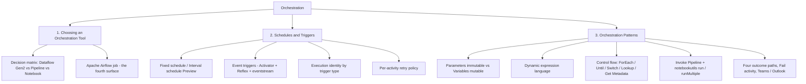

# 04. Orchestration

> **Exam domain:** Domain 1 — Implement and manage an analytics solution (30–35%)
> **Source:** `certification/04-orchestration/` — 4 files condensed
> **Why the exam cares:** This area tests whether you can read a scenario's constraints (author skill level, transform complexity, trigger style, failure handling) and pick the right authoring surface, start it the right way, and wire the activities together without losing a failure path. Wrong tool choice and missing retry/failure branches are the two most common trap shapes in this domain.

---

## Orientation — the 60-second version

Fabric is a single SaaS analytics platform where every artefact (pipeline, notebook, dataflow, lakehouse) lives inside a **workspace** and all data lands in **OneLake**, the one storage layer shared by everything. Orchestration is how those individual artefacts become one coordinated, schedulable, monitorable workflow.

There are three overlapping authoring surfaces. **Dataflow Gen2** is Power Query in the browser — a low-code, visual ETL tool with a big catalogue of pre-built transforms; it is what a Power BI-literate analyst reaches for. A **pipeline** is Fabric's Data Factory-style drag-and-drop canvas of *activities* — it does no row-level transformation itself, it sequences, branches, loops, schedules, retries, and reacts to events. A **notebook** is Spark code (PySpark, Scala, Spark SQL, R) — unlimited power, but you write it. A fourth surface, **Apache Airflow job**, exists for teams with existing Python Airflow DAGs.

These are not either/or. A production run typically has a pipeline as conductor, calling a Dataflow Gen2 activity for the easy cleansing and a Notebook activity for the hard logic.

Runs start three ways: on-demand, on a **schedule** (time-based), or on an **event** (a file lands, an item changes) — events are implemented under the hood by **Data Activator**, Fabric's rules-and-alerts engine, which creates a **Reflex** item as the actual trigger artefact. Once running, values flow through the pipeline via immutable **parameters** and mutable **variables**, referenced with an `@`-prefixed expression language.

## New terms in this topic

| Term | What it actually is |
| :--- | :--- |
| **OneLake** | The single, tenant-wide data lake underneath all of Fabric. Every lakehouse, warehouse and dataflow output physically lands here, so items can reference each other without copying. |
| **Workspace** | The container that holds Fabric items (pipelines, notebooks, dataflows, lakehouses) and defines who can see them. Cross-workspace calls are a permission and feature question, not a given. |
| **Lakehouse / Warehouse** | The two table-holding destinations orchestration writes into. A Lakehouse stores Delta tables over files in OneLake; a Warehouse is the T-SQL relational store. Both appear as sinks in this topic (Lakehouse Tables, Warehouse table). |
| **Power Query** | Microsoft's visual data-preparation language and editor (the same one in Excel and Power BI). Its step-by-step "Applied Steps" model is exactly what Dataflow Gen2 exposes, and its transform catalogue is the ceiling that forces a notebook when exceeded. |
| **Dataflow Gen2** | Power Query as a Fabric item: connect to sources, click through Applied Steps, write the result to a destination. Solves "an analyst needs real ETL without code or a cluster." |
| **Pipeline** | A canvas of activities with control flow, scheduling and event triggers — Fabric's Data Factory orchestrator. Solves "these five things must run in this order, with retries and a failure branch." |
| **Notebook** | Code cells executing on a Spark pool. Solves "the transform is an algorithm, not a menu item." |
| **Spark pool / driver cores** | The cluster a notebook session runs on. The *driver* node's core count is the load-bearing number here: each concurrently running notebook in a `runMultiple` DAG consumes one driver core, so driver cores — not the `concurrency` setting — cap real parallelism. |
| **Apache Airflow job** | A Fabric item that runs Python Airflow DAGs with the Airflow provider ecosystem (e.g. `astronomer-cosmos` for dbt). Solves "our orchestration is already written as Airflow DAGs." |
| **Activity** | One node on a pipeline canvas (Copy data, Notebook, Dataflow, Lookup, ForEach, Fail, Teams…). Each has its own timeout and retry settings. |
| **Copy activity / Copy job** | The two movement-focused surfaces that reach the same **170+ connector** library — this is where a pipeline's "connectors" number comes from, since a pipeline has no transform library of its own. |
| **Refresh SQL Endpoint activity** | A pipeline activity that exposes freshly written Lakehouse tables to SQL consumers — the last step in the nightly medallion pattern (Copy → Notebook → Refresh SQL Endpoint). |
| **Data Activator** | Fabric's no-code detect-and-react engine. It watches event/data streams and fires an action when a condition matches. It is what actually implements pipeline event triggers. |
| **Reflex** | The underlying item type Data Activator creates. When you add a storage event trigger to a pipeline, the trigger you just made *is* a Reflex item sitting in the workspace list. |
| **Eventstream** | A Fabric item that ingests and routes streaming events. Auto-created for you when a trigger listens to an external source such as Azure Blob Storage. |
| **Monitoring Hub** | The tenant-wide run-history screen: every pipeline, notebook and dataflow run with status and duration. |
| **Variable library** | A Fabric item holding centrally-managed named values, referenceable from a schedule's parameters so Dev/Test/Prod use the same config with different values. |
| **CU (Capacity Unit)** | The billing/consumption unit of a Fabric capacity. Every activity run, dataflow refresh and Spark session burns CU. |
| **CI/CD (deployment pipeline)** | Fabric's promote-content-between-workspaces mechanism (Dev → Test → Prod). Some connection-based activities go inactive on arrival in the target workspace. |
| **Base parameters** | The Notebook activity's section for passing values from a pipeline into a notebook's parameters cell. |
| **Parameters cell** | A notebook cell tagged via **Toggle parameter cell**; Fabric injects an override cell directly beneath it at run time. |
| **`notebookutils`** | The Fabric notebook utility library (successor naming to MSSparkUtils). `notebookutils.notebook.run/runMultiple/exit` give code-first notebook orchestration. |
| **Pipeline return value** | A named output a child pipeline emits via a `Set Variable` activity, which the parent reads from its `Invoke Pipeline` result — a function-style return. |

## How the pieces fit



- **Pick the surface** by transform complexity and author skill; only a pipeline orchestrates *other* items.
- **Start the run** on-demand, by schedule, or by event — schedules and event triggers live on the pipeline; notebooks and dataflows also have their own native schedules.
- **Wire the run** with parameters (fixed per run) and variables (mutable), joined by `@` expressions.
- **Compose hierarchies** with `Invoke Pipeline` at pipeline level and `notebookutils.notebook.runMultiple` at notebook level.
- **Handle failure** with per-activity retries, the four outcome paths, a `Fail` activity, and Teams/Outlook notifications.
- **Identity follows the trigger**, not the item — the same notebook runs as three different users depending on how it started.

---

## 1. Choosing an Orchestration Tool
*Source: `01-choosing-orchestration-tool.md`*

Fabric's Data Factory experience frames the choice as **ETL vs ELT**: Dataflow Gen2 transforms *before* loading (classic ETL, Power Query-based); pipelines and notebooks favour **ELT** — land raw data in OneLake first, then transform with Spark or SQL compute. Real solutions blend both, with a pipeline tying them together.

### The three orchestration surfaces

| Tool | What it is | Primary strength |
| :--- | :--- | :--- |
| **Dataflow Gen2** | Power Query editor: connect, clean, transform, load to a destination | Low-code, visual, 300+ built-in transformations, no cluster to manage |
| **Pipeline** | Drag-and-drop canvas of activities with control flow, scheduling and triggers | Orchestration: sequencing, branching, looping, coordinating other items |
| **Notebook** | Code cells on a Spark pool (PySpark, Scala, Spark SQL, R) | Full programmability — anything Power Query can't express, at Spark scale |

### Decision matrix

| Dimension | Dataflow Gen2 | Pipeline | Notebook |
| :--- | :--- | :--- | :--- |
| **Authoring skill level** | Low-code — Power Query, familiar from Excel/Power BI | Low-code — drag-and-drop canvas, minimal scripting | Code-first — Python/Scala/SQL/R required |
| **Sources / connectors** | **170+ connectors** via Get Data (databases, files, web services, Fabric items) | **170+ connectors** via Copy activity/Copy job — same connector library, movement-focused | Whatever the Spark runtime and installed libraries reach; typically OneLake, JDBC, APIs via code |
| **Transform power** | **300+ built-in transformations** (joins, aggregations, pivots, cleansing) via visual Applied Steps | **None natively** — activities call *other* tools (Copy, Notebook, Stored Procedure) to transform | Unlimited — arbitrary PySpark/Scala/SQL/R, custom libraries, ML models |
| **Compute / cost model** | Fabric-managed compute; creates internal `DataflowsStagingLakehouse` / `DataflowsStagingWarehouse` items; consumes CU per refresh | Consumption-based CU per activity run + data movement; orchestration-only activities are cheap, compute-heavy activities (Notebook, Dataflow) cost what *they* cost | Spark pool consumption — CU based on node size/count and session duration; can be the most expensive per-run if oversized |
| **Orchestration capabilities** | **None** — no native scheduling of *other* items, no control flow; can be scheduled itself or invoked from a pipeline | **Full** — schedules, event triggers, ForEach/If/Switch/Until, Invoke Pipeline, Fail activity, retries | Can call other notebooks via `notebookutils.notebook.run`/`runMultiple`, but no schedule/event-trigger UI of its own beyond a direct notebook schedule |
| **Git support** | GA with CI/CD (all new Dataflow Gen2 items since **April 2026** default to CI/CD-enabled; classic non-CI/CD dataflows still work but are no longer creatable) | GA | GA (`.ipynb` source-controlled) |
| **Parameterization** | **Public parameters is Preview** — required/optional typed parameters settable via REST API or a pipeline's Dataflow activity, but a dataflow with *required* public parameters can't be scheduled or manually triggered | Full — pipeline parameters (immutable per run) + variables (mutable via Set/Append Variable) + full expression language | Parameter cell + Base parameters from a pipeline Notebook activity, or `args` dict via `notebookutils.notebook.run`/`runMultiple` |
| **When NOT to use** | Row-by-row custom logic, ML, anything outside the 300+ transform catalogue, or any scenario needing a required parameter *and* a schedule/trigger (Preview limitation) | Heavy in-activity transformation — a pipeline should call a notebook/dataflow, not do it with Copy/Lookup gymnastics | Business-user self-service (requires code literacy); also overkill for a simple single-source copy-and-load |

> 🧠 **Mental model —** Dataflow Gen2 is a power-user kitchen appliance (point it at ingredients, pick from a big menu of pre-built techniques). A pipeline is the conductor: it plays no instrument, it decides *when* each player starts and what happens if one misses a note. A notebook is the workshop — full tools, full freedom, but you operate the equipment.

### Worked scenario 1 — analyst, multiple cloud sources, no cluster management

An analyst strong in Excel/Power Query, no coding, combines a SharePoint list + Snowflake table + Azure SQL database, applies ~12 cleansing/join steps, lands the result in a Lakehouse table nightly, with no coordination with any other workflow.

**Choose: Dataflow Gen2, scheduled directly to refresh nightly (no pipeline).** Skill level and transform complexity both sit inside the 300+ transform library; all three sources are supported connectors and Lakehouse Tables is a supported destination. With nothing else to coordinate and no required parameter, a pipeline would only add machinery.

### Worked scenario 2 — complex dedup feeding a Warehouse, multi-step nightly run

Ingest daily files from a storage account → apply a custom multi-pass fuzzy-deduplication routine with configurable thresholds (too complex for Power Query) → write to a Warehouse table → send a Teams notification if any step fails. Must run nightly and allow re-running only the failed step.

**Choose: a pipeline as orchestrator, invoking a Notebook (PySpark) for the dedup, with a Fail activity and a Teams activity on the failure path; schedule on the pipeline.** The dedup exceeds Power Query's catalogue (hard signal for a notebook), but the scenario also needs sequencing, retry/failure handling and notification — pipeline-only capabilities. The correct architecture composes both.

### Worked scenario 3 — team migrating from Azure Data Factory, Python-first culture

Dozens of ADF pipelines moving to Fabric. Most is straightforward copy-and-transform that maps onto pipeline activities, but a subset are Python-authored **Apache Airflow DAGs** calling third-party Airflow operators unavailable in Fabric's activity catalogue.

**Choose: pipelines for the ADF-equivalent copy/transform workloads; an Apache Airflow job for the Python-DAG subset** — not a forced migration of everything into one tool. Fabric's orchestration surface is not limited to the three tools in the matrix. Apache Airflow job is a fourth, code-first surface purpose-built for existing Airflow DAGs or a dependency on the Airflow provider ecosystem (for example `astronomer-cosmos` for dbt orchestration). Hand-translating provider-specific DAG logic into pipeline activities that may not exist ignores a real constraint.

> 🧠 **Mental model —** Apache Airflow job is a fourth appliance: a bread machine that only makes bread but does it exactly the way an experienced baker expects. It isn't competing with the pipeline "conductor" for general orchestration; it's right specifically when the team's investment is already Airflow-shaped.

### Distinctive use cases

- Self-service analyst combining SharePoint + SQL + SaaS connectors with visual transforms on a simple schedule — Dataflow Gen2 alone.
- Nightly medallion run: Copy activity lands raw files → Notebook activity does bronze→silver→gold → **Refresh SQL Endpoint activity** exposes the result — pipeline orchestrating a notebook.
- Pipeline calls a Dataflow Gen2 activity for a known cleansing step, then a notebook for a custom scoring model — all three tools in one run.
- Data science team iterating weekly on unit-testable, source-controlled feature engineering — notebook, ad hoc or via pipeline schedule.

### Common exam distractor patterns

> ⚠️ **Trap —** "Dataflow Gen2 can schedule other pipelines/notebooks." It can't. Dataflow Gen2 has no control flow and no scheduling-of-other-items. Only a pipeline orchestrates other items.

> ⚠️ **Trap —** "A notebook has a built-in visual drag-and-drop transform canvas like Power Query." It doesn't — a notebook is code cells; the pipeline canvas is drag-and-drop for *activities*, not row-level transforms.

> ⚠️ **Trap —** "Dataflow Gen2 public parameters let you fully parameterize a scheduled, triggered dataflow today." Public parameters is **Preview**, and a dataflow with *required* public parameters explicitly **can't** be scheduled or manually triggered. A scenario combining "must run on a schedule" with "must accept a required runtime parameter" describes an unsupported Dataflow Gen2 configuration.

> ⚠️ **Trap —** "Pick the cheapest tool" without checking the transform requirement first. If the transform exceeds the low-code ceiling, the cheap choice simply doesn't work. Cost is a tiebreaker among viable options, not the first filter.

> ⚠️ **Trap —** "Notebooks can't be scheduled without a pipeline." They can — a notebook has its own native schedule, distinct from a pipeline's Notebook activity. The exam-relevant nuance is the *identity* each run executes as, not whether native scheduling exists.

### Common issues & errors

| Issue | Cause | Resolution |
| :--- | :--- | :--- |
| A parameterized Dataflow Gen2 won't accept a schedule or manual trigger | Required public parameters set; public parameter mode blocks scheduling/manual triggering while any required parameter exists | Make the parameter optional with a default, or move the run-with-parameter logic into a pipeline's Dataflow activity |
| A "simple" Dataflow Gen2 transform silently caps out on complex logic | The needed transform (multi-condition fuzzy matching, iterative algorithms) isn't in the 300+ catalogue | Move that step to a Notebook activity called from a pipeline; keep the rest in Dataflow Gen2 if it still fits |
| Pipeline Copy/Lookup activities stretched to do row-level transformation | Team defaulted to "pipeline for everything" without evaluating transform complexity | Insert a Notebook or Dataflow Gen2 activity for the transform; keep the pipeline focused on orchestration |
| Unexpected internal `DataflowsStagingLakehouse` / `DataflowsStagingWarehouse` items appear in the workspace | Dataflow Gen2's high-performance compute engine creates these automatically for staging | Expected behaviour — don't delete or modify them; they're internal to Dataflow Gen2 execution |
| A notebook scheduled independently runs with unexpected permissions | Notebook scheduler runs as whoever created/last updated the *schedule*, not the pipeline caller or notebook owner | Confirm the schedule owner has the correct data-access permissions before relying on a native notebook schedule |

> 📌 **Remember —** Default to the **lowest-code tool that can express the required transform** — Dataflow Gen2 before notebook — but never force a transform past the 300+ ceiling just to avoid writing code. Use a pipeline as the coordination layer whenever more than one item needs to run in sequence, share parameters, or share a failure-handling path. And keep custom, testable, source-controllable logic **in notebooks**, not in deeply nested pipeline expressions: **expressions are for wiring, not business logic**.

---

## 2. Schedules & Triggers
*Source: `02-schedules-triggers.md`*

A pipeline run starts one of three ways: **on-demand** (manual), **scheduled** (time-based), or **event-based**.

### Pipeline schedules

A pipeline can have **up to 20 schedules**, each with an independent frequency, start/end window and time zone. Configure from **Schedule** on the pipeline's **Home** tab.

**Fixed schedule** — pick a frequency (**by minute, hourly, daily, weekly, monthly**), a start date/time, an **end date/time**, and a time zone.

> ⚠️ **Trap —** A fixed schedule has **no open-ended option**: a start date *and* an end date are both required. "Schedule this pipeline to run forever, starting tomorrow" needs an end date set far in the future (Microsoft's own example: `01/01/2099 12:00 AM`). There is no toggle that removes the end-date requirement — Fabric scheduling is not a bare cron entry.

**Interval-based schedule (Preview)** — configures fixed, **non-overlapping** run windows using a **Window start time** / **Window end time** pair, exposed to the pipeline as two automatic trigger parameters under **Trigger parameters**. Unlike a fixed schedule it **can't be enabled, disabled, or edited** after creation — delete and recreate to change it. **Time-slice monitoring and backfill aren't available** for interval-based schedules.

**Schedule parameters** — a scheduled pipeline can pass parameter values at each run, provided the **parameter names match exactly** what's defined on the pipeline.

> ⚠️ **Trap —** Mismatched schedule parameter names are **silently ignored at runtime**, not rejected with an error. Values come from either a **direct static value** entered in the schedule, or a reference to a centrally-managed **Variable library** item (useful for promoting one schedule config across Dev/Test/Prod with environment-specific values).

**Failure notifications** — configure **email notifications** under a schedule's **Failure notifications** setting to alert specific users/groups when a *scheduled* run fails.

> 🔑 **Exam fact —** On-demand runs **never** trigger failure notification emails. Only scheduled runs do.

### Event-based triggers

Event triggers start a pipeline when something happens — a file lands or is deleted in storage, a database changes, or a Fabric/Azure platform event fires. Fabric implements these using **Data Activator** underneath the pipeline's **Trigger** UI: creating a storage event trigger from the pipeline canvas creates a **Reflex** item (Activator's underlying object type) and, for external sources such as Azure Blob, an **auto-created eventstream** to ingest the events.

**Supported sources**

- **OneLake events** — file created/deleted within a Lakehouse
- **Azure Blob Storage events** — the familiar source for anyone coming from Azure Data Factory
- **Fabric events** — workspace item created/updated/deleted, pipeline/job status changes
- **Business events** and **Fabric Ontology business entities** (**Preview**) — Data Activator carries the full event-source catalogue beyond storage

**Setting up a storage event trigger**

1. Select **Trigger** on the pipeline canvas's **Home** ribbon — this opens the **Set alert** panel (Data Activator's alert authoring surface).
2. Choose the event source type: `OneLake` for OneLake file events, or an external source such as Azure Blob Storage.
3. For Azure Blob, select the subscription and storage account — Fabric **auto-creates an eventstream** object in the workspace to carry the events.
4. Choose specific **event types** (file created, file deleted, and others beyond that pair).
5. **Filter events** using the `Subject` field — folder name, file name, file type and container are **all part of `Subject`**, not separate top-level fields.
6. Choose the workspace, target pipeline and pipeline action; name the trigger (this creates the Reflex item).

An event carries this top-level shape (CloudEvents-based): `source`, `subject`, `type` (e.g. `Microsoft.Storage.BlobCreated`), `time`, `id`, `data`, `specversion`.

**Trigger parameters in expressions** — Fabric automatically parses the file name and folder path out of the triggering event's `Subject`/`Topic` fields and exposes them as built-in trigger parameters:

```text
@pipeline()?.TriggerEvent?.FileName
```

> ⚠️ **Trap —** Note the `?` after `pipeline()` and after `TriggerEvent`. This is the null-safe accessor, required because during a **manual test run** no triggering event exists, so `TriggerEvent` is `NULL`. Without the `?`, a manual test run of an event-triggered pipeline **throws an expression evaluation error** instead of evaluating to an empty value.

**Viewing and managing triggers** — the trigger itself is a **Reflex** object, visible in the workspace item list by name. Open it directly to edit the underlying rule, or use **Triggers → View triggers** from the pipeline menu to see triggers scoped to that specific pipeline.

### Notebook and Dataflow Gen2 scheduling

Both notebooks and Dataflow Gen2 items support **native scheduling**, independent of any pipeline — you don't need to wrap either in a pipeline just to run it on a timer.

**Notebook execution identity — the security context differs by trigger type:**

| Trigger type | Runs as |
| :--- | :--- |
| Interactive run (manual, UI or REST) | The current user |
| Pipeline Notebook activity | The **pipeline's last-modified user** — not the pipeline owner, not the notebook owner |
| Native notebook schedule | Whoever **created or last updated that schedule** |

> ⚠️ **Trap —** Don't assume a scheduled or pipeline-invoked notebook runs with *your* permissions or the notebook owner's. A notebook that works interactively but fails on its schedule with a permissions error is almost always the schedule owner (or, for pipeline-invoked runs, whoever last edited the pipeline) lacking the data access — check *that* identity's permissions, not the notebook author's.

> 🧠 **Mental model —** Whoever holds the remote drives the car. Interactive: you're driving. Pipeline-invoked: whoever last touched the pipeline's controls is driving, even if they never opened the notebook. Scheduled: whoever set (or most recently reset) the alarm clock is driving.

**Dataflow Gen2 scheduling** — scheduled directly from the item, similar to a pipeline's schedule UI. The constraint from §1 applies regardless of scheduling surface: a dataflow with **required public parameters** can't be scheduled or manually triggered at all.

### Trigger and schedule monitoring

Pipeline runs — on-demand, scheduled or event-triggered — surface in the **Monitoring Hub** and the pipeline's own **Output** tab, showing status progression through each activity as it completes. Dataflow Gen2 refreshes have their own **Refresh History** view, also integrated with Monitoring Hub.

> 🔑 **Exam fact —** Monitoring Hub does **not** display the specific parameter values used during a Dataflow Gen2 public-parameter run — only that a run happened.

### Activity retry policies

Retry is configured **per activity**, not per pipeline or per trigger. Every activity's **General** tab exposes:

| Setting | Behavior |
| :--- | :--- |
| Timeout | Default **12 hours**; max **7 days**; format `D.HH:MM:SS` |
| Enable retries | Toggles retry behaviour on for that activity |
| Retry | Number of retry attempts, **1–1000** (default **1**) |
| Retry conditions (Preview) | Restrict retries to specific error code / message / failure type matches, combined with AND/OR |
| Retry interval (sec) | Wait time between attempts (default **30 seconds**) |

By default (no retry conditions specified), an activity **retries on any failure**. Retry conditions narrow that — e.g. matching only `Error code` `Contains` `429` to retry solely on rate-limiting and fail fast on anything else (such as an authentication error a retry won't fix).

> ⚠️ **Trap —** The **retry interval always runs before the condition is evaluated**. An activity with a 1-hour retry interval whose retry condition *doesn't* match the actual failure still waits the full hour before moving on — the condition check does not short-circuit the wait. A non-matching retry condition does not fail fast; it fails only after the full interval elapses.

> 📌 **Remember —** Conditional retries (the Preview **Retry conditions** feature) are supported only for **Copy data, Notebook, Dataflow, and Stored procedure** activities. Other activity types still get basic retry count/interval, just not condition-based filtering.

> 📌 **Remember —** Scope retry conditions **narrowly** — specific error codes — rather than leaving retries blanket-enabled for every failure, especially for expensive activities like **Notebook** and **Dataflow**. Set **failure notifications on every production schedule**: they are the only built-in "someone tell me if this breaks overnight" mechanism.

### Distinctive use cases

- Nightly ELT on a fixed schedule with a far-future end date, since the workload runs indefinitely.
- File-arrival-driven ingestion: a Blob/OneLake event trigger starts the pipeline the moment a new export lands, instead of tight polling.
- A notebook scheduled natively (no pipeline) for a self-contained daily aggregation, under a dedicated service-account-owned schedule for consistent permissions.
- Retrying a flaky external API call (Web/Copy activity) up to 5 times with a short interval and a retry condition scoped to `429`/`5xx`, failing fast on `401`/`403`.

### Common issues & errors

| Issue | Cause | Resolution |
| :--- | :--- | :--- |
| Schedule save fails or behaves unexpectedly with no end date set | Fixed schedules require both start and end dates | Set an explicit end date, far in the future if it should run indefinitely |
| Interval-based schedule can't be toggled off temporarily | Interval-based schedules (Preview) don't support enable/disable/edit in place | Delete the schedule and recreate it to change or pause it |
| Scheduled parameter values are ignored at runtime | Parameter names in the schedule don't exactly match the pipeline's defined parameter names | Correct the names in the schedule configuration to match exactly |
| Manual test run of an event-triggered pipeline throws an expression error | Expression references `TriggerEvent` fields without the `?` null-safe operator; `TriggerEvent` is `NULL` outside a real event | Use `@pipeline()?.TriggerEvent?.FileName` (and similar `?`-guarded paths) throughout |
| A scheduled notebook fails with a permissions error despite working interactively | The schedule's creator/last-updater identity lacks the data access the notebook needs | Grant permissions to that identity, or have an appropriately-permissioned user update the schedule |
| A dataflow won't accept a schedule or manual trigger at all | Public parameters mode enabled with one or more required parameters | Make parameters optional with defaults, or drive the parameterized run from a pipeline's Dataflow activity |
| Failure notification emails never arrive for a failed run | The run was on-demand, not scheduled — failure notifications only fire for scheduled runs | Use Monitoring Hub for on-demand run status, or wrap the logic in a scheduled trigger if email alerts are required |

---

## 3. Orchestration Patterns
*Source: `03-orchestration-patterns.md`*

### Pipeline parameters vs variables

| Aspect | Parameters | Variables |
| :--- | :--- | :--- |
| **Mutability** | **Immutable** — set once when the run starts, never change during that run | **Mutable** — updated mid-run via `Set Variable` / `Append Variable` activities |
| **Defined where** | Pipeline canvas background → **Parameters** tab; requires name, type, default value | Pipeline canvas background → **Variables** tab; types: `String`, `Bool`, `Array` |
| **Set by** | The caller — a schedule, a trigger, a manual run, or a parent pipeline's `Invoke Pipeline` activity | Activities inside the pipeline itself, as it executes |
| **Typical use** | Configuration fixed for the whole run (environment name, target table, region code) | Accumulating or evolving state (a running total, a list built in a loop, a computed flag that changes which branch runs next) |
| **Referenced as** | `@pipeline().parameters.<name>` | `@variables('<name>')` |

> ⚠️ **Trap —** "The pipeline needs to update a tracking value partway through its run based on an activity's output, then use that updated value later in the same run" describes a **variable**, not a parameter — parameters are read-only once the run starts. Conversely, "the same pipeline runs against a different target table depending on which schedule triggered it" describes a **parameter**, set once at trigger time.

The `Set Variable` activity can also set a **pipeline return value** — one or more named output values a parent pipeline reads from a child's `Invoke Pipeline` result, letting a child pipeline "return" data the way a function does.

### Dynamic expression language

Every dynamic value is an **expression** starting with `@`. A bare `@expression` returns the expression's native type (number, boolean, object); wrapping it as `@{expression}` inside a string forces **string interpolation** and always returns a string.

```text
@pipeline().parameters.myNumber        → 42            (number)
@{pipeline().parameters.myNumber}      → "42"          (string)
"Answer is: @{pipeline().parameters.myNumber}"  → "Answer is: 42"
```

**Pipeline system variables**

| Expression | Returns |
| :--- | :--- |
| `@pipeline().DataFactory` | Workspace name |
| `@pipeline().Pipeline` | Pipeline name |
| `@pipeline().RunId` | This run's unique ID |
| `@pipeline().TriggerName` | Name of the trigger that started this run |
| `@pipeline().TriggerTime` | UTC, ISO 8601 timestamp the trigger fired |
| `@pipeline()?.TriggeredByPipelineName` | Parent pipeline's name, if started via `Invoke Pipeline` — nullable, hence the `?` |
| `@pipeline()?.TriggeredByPipelineRunId` | Parent pipeline's run ID — also nullable |

**Referencing activity output**

```text
@activity('Copy1').output
@activity('Lookup1').output.firstRow.CustomerId
@activity('A').output.subfield1.subfield2[pipeline().parameters.subfield3].subfield4
```

Use bracket `[]` syntax (not dot `.`) when a subfield reference itself needs to be parameterized, as in the last example.

**Key functions**

| Function | Syntax | Example → Result |
| :--- | :--- | :--- |
| `concat` | `concat('<a>', '<b>', ...)` | `concat('Test_', 'run')` → `"Test_run"` |
| `utcNow` | `utcNow('<format>'?)` | `utcNow()` → `"2026-07-10T13:00:00.0000000Z"` |
| `formatDateTime` | `formatDateTime('<ts>', '<format>'?)` | `formatDateTime(utcNow(), 'yyyy-MM-dd')` → `"2026-07-10"` |
| `addDays` | `addDays('<ts>', <days>, '<format>'?)` | `addDays(utcNow(), -1, 'yyyy-MM-dd')` → yesterday's date |
| `if` | `if(<expr>, <true>, <false>)` | `if(equals(1,1), 'yes', 'no')` → `"yes"` |
| `coalesce` | `coalesce(<v1>, <v2>, ...)` | Returns the first non-null value |

**Dynamic file naming pattern** — a very common exam scenario:

```text
@concat('sales_export_', formatDateTime(utcNow(), 'yyyy-MM-dd'), '.parquet')
// → "sales_export_2026-07-10.parquet"
```

> 🧠 **Mental model —** `@` means "compute this"; bare text means "use this literally". `@{ }` inside a larger string is a small window that says "compute *this part*, then paste the result into the surrounding literal text." If a value comes out as the literal text `@pipeline().parameters.env` instead of the resolved value, the `@` was missing or escaped (`@@`).

> 📌 **Remember —** Keep dynamic expressions readable: extract a deeply nested `concat`/`if` chain into a **`Set Variable` step with a clear name** rather than leaving one unreadable inline expression on the activity.

### Control-flow activities

Five activities provide the looping, branching and metadata-probing logic expressions alone can't: **ForEach**, **Until**, **Switch**, **Lookup**, **Get Metadata**. These are the building blocks of the metadata-driven pipeline pattern — discover *what* to process at runtime, then loop over it.

**ForEach** iterates a JSON array bound to its **Items** property, running child activities once per item. The array most commonly comes from a `Lookup`:

```text
Items: @activity('Lookup_TableList').output.value
```

Inside the loop, `@item()` is the current element and `@item().<field>` accesses a property when elements are objects rather than scalars.

| Property | Description | Values |
| :--- | :--- | :--- |
| `isSequential` | Whether items process one at a time or concurrently | `true` (default: `false`) |
| `batchCount` | Upper concurrency limit when `isSequential = false` — a ceiling on parallelism, not a guarantee every run hits it | Integer, default **20**, maximum **50** |
| `items` | The array to iterate over | Expression returning a JSON array |

> ⚠️ **Trap —** `ForEach` **can't be nested directly inside another `ForEach` (or an `Until`)**, and a single `ForEach` tops out at **100,000 items** regardless of `batchCount`. Nested iteration requires the outer `ForEach` to call a **child pipeline** via `Invoke Pipeline`, with the inner loop living in the child — the same two-level pattern works around the nesting restriction and the item ceiling together.

**Until** is a do-while loop: it repeats its child activities until an **expression** evaluates to `true`, checking the condition *after* each iteration rather than before. An inner activity failing doesn't stop the loop on its own — only the exit expression or the optional **timeout** ends it.

```text
Expression: @equals(variables('RetryCount'), 3)
Timeout: 0.12:00:00   // 12 hours, in dd.hh:mm:ss format
```

A `Set Variable` inside the loop body is what moves the exit condition toward `true` — an `Until` with no variable mutation inside never terminates on its own and depends entirely on the timeout.

**Switch** evaluates one expression once, then runs the child activities in whichever **case** matches — the low-code `switch`/`case`. An unmatched result falls through to **Default** (which can be left empty to mean "do nothing").

```text
Expression: @pipeline().parameters.region
Cases: "EU" → Load_EU_Activities | "US" → Load_US_Activities | Default → Fail activity ("Unrecognized region")
```

`Switch` is the natural fit whenever a `ForEach`-driven scenario needs *different* handling per item rather than the same activity per item — put a `Switch` inside the `ForEach`'s child activities, keyed on `@item().sourceType` or similar.

**Lookup and Get Metadata** don't move or transform data — they **read** it, producing output that downstream control-flow activities consume.

| Activity | Returns | Key setting |
| :--- | :--- | :--- |
| `Lookup` | Result of a query, stored procedure or file read — a single row/value or an array of rows | **First row only** toggles output shape: on → a single object at `.output.firstRow`; off (default) → an array at `.output.value`, consumed directly by `ForEach`'s **Items** |
| `Get Metadata` | Requested metadata fields about a file, folder or table — e.g. `itemName`, `itemType`, `columnCount`, `structure`, `size`, `exists`, `lastModified` | The specific fields are chosen explicitly in the activity's settings, not returned in bulk |

> 📌 **Remember —** `Lookup` caps at **5,000 rows** (larger result sets are **silently truncated** to the first 5,000) and **4 MB** of output (exceeding the size cap **fails the activity outright** rather than truncating). Max run time before timeout is **24 hours**. A query or stored procedure used in a `Lookup` must return **exactly one result set**, or the activity fails.

**Worked example — metadata-driven copy pattern.** The canonical pattern: a `Lookup` reads a control table listing which source tables to copy, then a `ForEach` fans out a parameterized `Copy` once per table — adding a row to the control table extends the pipeline without touching its activities.

```json
{
  "name": "Lookup_TableList", "type": "Lookup",
  "typeProperties": { "table": "control.TablesToCopy", "firstRowOnly": false }
},
{
  "name": "ForEach_Table", "type": "ForEach",
  "dependsOn": [ { "activity": "Lookup_TableList", "dependencyConditions": ["Succeeded"] } ],
  "typeProperties": {
    "isSequential": false,
    "batchCount": 10,
    "items": { "value": "@activity('Lookup_TableList').output.value", "type": "Expression" },
    "activities": [ { "name": "Copy_Table", "type": "Copy",
      "typeProperties": {
        "source": { "type": "LakehouseTableSource", "tableName": "@item().SourceTableName" },
        "sink":   { "type": "LakehouseTableSink",   "tableName": "@item().SinkTableName" } } } ]
  }
}
```

*(Shown without the surrounding `{"name": "MetadataDriven_CopyAllTables", "properties": { "activities": [ … ] }}` pipeline envelope; the real Lookup also carries `"source": { "type": "LakehouseTableSource" }`.)*

Swapping the `Copy` for a `Notebook` activity turns the same pattern into a metadata-driven Spark run — each iteration passes `@item()`'s fields as **Base parameters**, so one notebook handles every table without hardcoding:

```text
Notebook activity Base parameters:
  source_table = @item().SourceTableName
  sink_table   = @item().SinkTableName
```

### Invoke Pipeline activity: parent-child parameter passing

The **Invoke Pipeline activity** runs another pipeline from within a parent — the standard way to build modular, reusable pipeline patterns. Fabric has two versions:

| Version | Scope | Monitoring |
| :--- | :--- | :--- |
| **Invoke pipeline (Legacy)** | Same workspace only; **can't** invoke ADF/Synapse pipelines | Parent pipeline only |
| **Invoke pipeline** (current) | Cross-workspace, and can invoke ADF or Synapse pipelines too | Both parent **and** child pipeline runs are monitorable |

Configuring it:

1. **Settings** tab → choose **Type** (Fabric, ADF, or Synapse), a **Connection**, the target **Workspace**, and the **Pipeline** to invoke.
2. Pass values into the child's parameters using the same `@`-expression language — a parent expression like `@pipeline().parameters.region` feeds the child's `region` parameter directly.
3. Choose **wait on completion** (synchronous — parent blocks until the child finishes and can then read the child's `Set Variable` pipeline return values) or **don't wait** (child runs in parallel with whatever comes next in the parent).

> ⚠️ **Trap —** The **Legacy** Invoke Pipeline activity **cannot** call a pipeline in another workspace. Cross-workspace pipeline composition needs the *current* Invoke Pipeline activity, and if the scenario also needs to call an ADF or Synapse pipeline, Legacy is disqualified outright.

### Notebook activity: parameter passing from a pipeline

A pipeline's **Notebook activity** passes values into a notebook's designated **parameters cell** (toggled via **Toggle parameter cell** in the notebook editor) through the activity's **Base parameters** section on the **Settings** tab.

- Supported parameter types: `int`, `float`, `bool`, `string` **only** — **not** `list` or `dict`.
- To pass a complex structure, serialize it to a JSON string on the pipeline side and `json.loads()` it inside the notebook.
- The **parameter name in Base parameters must exactly match the variable name** in the notebook's parameters cell — Fabric's execution engine inserts a new cell beneath the parameters cell that overwrites the defaults with the pipeline-supplied values.

```python
# Inside the notebook — deserializing a JSON string parameter passed from a pipeline
import json
params = json.loads(json_string_param)
region = params.get("region")
threshold = params.get("threshold")
```

### `notebookutils.notebook.run` and `runMultiple`

Where `Invoke Pipeline` and the Notebook activity are the *pipeline-level* way to compose items, `notebookutils.notebook` is the **code-first** equivalent, called from inside a running notebook.

**Single notebook: `run()`**

```python
notebookutils.notebook.run("Sample1", 90, {"input": 20})
# args: notebook name, timeoutSeconds, parameter map, optional workspaceId for cross-workspace
```

- Runs on the **same Spark pool session** as the calling notebook.
- Returns the referenced notebook's **exit value as a string**.
- Cross-workspace reference (4th argument, a workspace ID) is supported on **runtime v1.2+**.

**Multiple notebooks as a DAG: `runMultiple()` (Preview)** — submits several notebooks to run **in parallel or with dependencies**, each on its **own isolated REPL instance** sharing the session's Spark compute:

```python
DAG = {
    "activities": [
        {
            "name": "Bronze_Ingest",          # unique activity name
            "path": "Bronze_Ingest",          # notebook path
            "timeoutPerCellInSeconds": 90,    # default 90s per cell
            "args": {"source": "sales"}
        },
        {
            "name": "Bronze_Ingest_Inventory",
            "path": "Bronze_Ingest",
            "timeoutPerCellInSeconds": 90,
            "args": {"source": "inventory"}
        },
        {
            "name": "Silver_Transform",
            "path": "Silver_Transform",
            "timeoutPerCellInSeconds": 120,
            "retry": 1,
            "retryIntervalInSeconds": 10,
            "dependencies": ["Bronze_Ingest", "Bronze_Ingest_Inventory"]  # runs after both
        }
    ],
    "timeoutInSeconds": 43200,   # 12-hour default for the entire DAG
    "concurrency": 50            # default; capped by the driver's core count in practice
}

notebookutils.notebook.runMultiple(DAG, {"displayDAGViaGraphviz": False})
```

> ⚠️ **Trap —** The **`concurrency` field defaults to 50**, but the *actual* number of notebooks running simultaneously is capped by the Spark pool's **driver core count** — each concurrent notebook consumes one driver core for its REPL instance. A **Medium node (8 driver cores) tops out at 8** truly concurrent notebooks no matter what `concurrency` says. "Why didn't all 20 notebooks run at once despite `concurrency: 50`?" tests exactly this.

**Exiting a notebook: `exit()`**

```python
notebookutils.notebook.exit("value string")
```

| Invocation context | What happens on `exit()` |
| :--- | :--- |
| Interactive run | Raises a `NotebookExit` exception in the UI, skips remaining cells, **keeps the Spark session alive** |
| Pipeline Notebook activity | Notebook activity completes with the exit value; **do not** wrap `exit()` in `try/except` — the exception must propagate for the pipeline to capture the return value |
| Referenced via `notebookutils.notebook.run()` | Only the **referenced** notebook stops; the **calling** notebook continues executing its own remaining cells |

```python
exitVal = notebookutils.notebook.run("Sample1", 90, {"input": 20})
print(exitVal)
# → "Notebook executed successfully with exit value 20"
```

### `%run` vs `notebookutils.notebook.run` / `runMultiple`

| Aspect | `%run` magic command | `notebookutils.notebook.run` / `runMultiple` |
| :--- | :--- | :--- |
| **Effect** | **Inlines** the referenced notebook — all its variables become directly available in the **calling notebook's** namespace | Runs the referenced notebook as an **isolated child**, returning only its exit value; variables stay encapsulated |
| **Parallelism** | None — always sequential, one reference at a time | `runMultiple()` runs several notebooks concurrently with a dependency DAG |
| **Nesting limit** | **Max nesting depth of 5** — throws an exception beyond that; recursive (self-referencing) calls aren't supported | No documented depth limit comparable to `%run`; concurrency is bounded by driver cores instead |
| **Parameter types** | Only `int`, `float`, `bool`, `string`; no variable substitution | `run()`/`runMultiple()` accept the same scalar types via a parameter dict / `args` map |
| **Cross-workspace** | Not supported — same workspace only | `run()` supports a 4th `workspaceId` argument on runtime v1.2+ |
| **Typical use** | Sharing helper functions/config across notebooks as if they were one file (a "module" pattern) | Orchestrating separate, independently-scoped notebook jobs — especially in parallel or with explicit dependencies |

> 🧠 **Mental model —** `%run` is copy-paste: you inherit the referenced notebook's variables and its mess, and only five layers deep before Fabric refuses. `notebookutils.notebook.run`/`runMultiple` is subcontracting: a self-contained job with its own parameters, running in its own isolated space, handing back only what it deliberately returns through `exit()`.

### Parent-child pipeline patterns

- **Fan-out** — a parent `Invoke Pipeline`s several children in parallel (don't wait on completion) for independent workloads (one child per source system), then a downstream activity waits on all of them via dependency conditions before proceeding.
- **Fan-in via return values** — children each set a `Set Variable` **pipeline return value**; the parent reads each child's return value after `Invoke Pipeline` (wait on completion) to decide its next branch.
- **Reusable utility pipeline** — a small pipeline that does one thing well (e.g. "send a notification email via Outlook activity") called by many parents via `Invoke Pipeline`, parameterized with subject/body/recipients. This is the documented pattern for sharing Outlook/Teams connections across authors, **since those connections are scoped per-user and can't be shared directly**.
- **Notebook-level parent-child** — inside a single notebook, `runMultiple`'s DAG plays the same fan-out/fan-in role `Invoke Pipeline` plays at pipeline level, entirely in code and without leaving the Spark session.

### Error handling

**The four outcome paths.** Every activity-to-activity connector represents one of four outcome conditions, and an activity can have multiple outgoing paths of different types simultaneously:

| Path | Fires when the upstream activity... |
| :--- | :--- |
| **Upon Success** | Succeeded |
| **Upon Failure** | Failed |
| **Upon Completion** | Finished regardless of outcome (success or failure) |
| **Upon Skip** | Was skipped (e.g. an upstream branch never executed it) |

> ⚠️ **Trap —** Multiple activities feeding one downstream activity on the **same** path type must **all** satisfy that condition before it fires. Two Copy activities both connected to a Teams activity on Upon Failure only trigger the Teams message if **both** Copy activities fail; if only one fails, the Teams activity doesn't run. Use separate Upon Failure connectors (or separate downstream activities) if "any one fails" is the intended semantics.

**Fail activity** — deliberately throws a custom error with a configurable **error message** and **error code**, recorded in run history and logs. Typically wired behind an **If Condition** activity's `True` branch to fail the pipeline explicitly when a validation, business-rule or dependency check doesn't pass, rather than letting the pipeline "succeed" despite bad data.

```text
If Condition: @less(activity('RowCountCheck').output.firstRow.rowCount, 1)
  True branch  → Fail activity
                   Message: "Source returned zero rows — refusing to proceed"
                   Error code: "EMPTY_SOURCE"
  False branch → (continue normal pipeline flow)
```

**Notification activities.** Both post/send from the **Upon Failure** path of the activities they monitor, using dynamic expressions to include run details:

| Activity | Sends | Key config |
| :--- | :--- | :--- |
| **Teams activity** | A message to a Teams channel or group chat | Connection, **Post in** (channel vs group chat), **Message** (supports expressions), optional **Subject** (channel posts only) |
| **Office 365 Outlook activity** | An email from the authoring user's own Office 365 account | Connection, recipients, subject, body (all expression-capable); advanced: CC/BCC, custom from/reply-to |

> ⚠️ **Trap —** Both Teams and Outlook activities are documented as **inactive under CI/CD deployment** until a new **user-authentication connection** is created in the target workspace. "Worked in Dev but silently stopped notifying after deployment to Prod via CI/CD" is this exact documented gotcha, not a pipeline-logic bug. The Outlook activity also **doesn't support Workspace Identity or Service Principal** authentication — a fully unattended service-principal-driven CI/CD pipeline can't use it as-is.

### Complete example: parameterized parent-child pipeline

Parameters, expressions, `Invoke Pipeline` and error handling tied together — a parent invoking a child load pipeline per region with failure notification (one region shown; the outer `{"name": "Parent_LoadAllRegions", "properties": { … }}` envelope is omitted):

```json
{
  "parameters": { "runDate": { "type": "string", "defaultValue": "@utcNow()" } },
  "variables":  { "failedRegions": { "type": "Array" } },
  "activities": [
    { "name": "Invoke_LoadRegion_EU", "type": "InvokePipeline",
      "typeProperties": { "pipelineId": "<child-pipeline-guid>", "waitOnCompletion": true,
        "parameters": { "region": "EU", "runDate": "@pipeline().parameters.runDate" } } },
    { "name": "AppendFailure_EU", "type": "AppendVariable",
      "dependsOn": [ { "activity": "Invoke_LoadRegion_EU", "dependencyConditions": ["Failed"] } ],
      "typeProperties": { "variableName": "failedRegions", "value": "EU" } },
    { "name": "Fail_IfAnyRegionFailed", "type": "IfCondition",
      "dependsOn": [ { "activity": "AppendFailure_EU", "dependencyConditions": ["Completed"] } ],
      "typeProperties": {
        "expression": { "value": "@greater(length(variables('failedRegions')), 0)", "type": "Expression" },
        "ifTrueActivities": [
          { "name": "Fail_Run", "type": "Fail", "typeProperties": {
              "message": "@concat('Regions failed to load: ', string(variables('failedRegions')))",
              "errorCode": "REGION_LOAD_FAILURE" } },
          { "name": "NotifyTeams", "type": "TeamsNotification", "typeProperties": {
              "message": "@concat('Load failed for: ', string(variables('failedRegions')), ' — run: ', pipeline().RunId)" } }
        ] } }
  ]
}
```

The equivalent notebook-side DAG for the same fan-out, run entirely in Spark:

```python
DAG = {
    "activities": [
        {"name": "Load_EU",   "path": "Load_Region", "args": {"region": "EU"}},
        {"name": "Load_US",   "path": "Load_Region", "args": {"region": "US"}},
        {"name": "Load_APAC", "path": "Load_Region", "args": {"region": "APAC"}},
        {"name": "Reconcile", "path": "Reconcile_All_Regions",
         "dependencies": ["Load_EU", "Load_US", "Load_APAC"]}
    ],
    "timeoutInSeconds": 7200,
    "concurrency": 3
}
results = notebookutils.notebook.runMultiple(DAG)
```

### Distinctive use cases

- Dynamic file naming (`concat` + `formatDateTime` + `utcNow`) for date-partitioned exports, so every run's output is uniquely and predictably named.
- Parent fans out one child pipeline per source system via `Invoke Pipeline` (don't wait), then a downstream activity aggregates once all children reach `Upon Completion`.
- Notebook-side nightly ingestion DAG via `runMultiple`, running independent source notebooks in parallel and gating a shared "reconcile" notebook on all of them.
- Validation gate: `If Condition` checks a row count or data-quality expression, routing to a `Fail` activity plus a Teams notification only when the check fails.

### Common issues & errors

| Issue | Cause | Resolution |
| :--- | :--- | :--- |
| A value mutated mid-pipeline doesn't reflect in a later parameter reference | Parameters are immutable per run; the value was meant to be a variable | Switch to a pipeline variable updated via `Set Variable`/`Append Variable` |
| `runMultiple` doesn't run all configured notebooks simultaneously despite `concurrency: 50` | Actual concurrency is capped by the Spark pool's driver core count, not the `concurrency` field | Size the driver node for the desired concurrency, or reduce the DAG's parallel branch count |
| `Invoke Pipeline (Legacy)` fails when targeting another workspace | Legacy only supports same-workspace pipelines | Switch to the current (non-legacy) Invoke Pipeline activity for cross-workspace or ADF/Synapse targets |
| `%run`-chained notebooks throw an exception at a certain depth | `%run` supports nesting only to depth 5; recursive self-reference isn't supported at all | Flatten the chain, or switch part of it to `notebookutils.notebook.run`, which doesn't share `%run`'s depth ceiling |
| A pipeline Notebook activity's parameter never overrides the notebook's default | Base parameter name doesn't exactly match the notebook parameters-cell variable name | Correct the name to match exactly on both sides |
| `exit()` inside a pipeline-invoked notebook doesn't return a value to the pipeline | The `exit()` call was wrapped in `try/except`, swallowing the required `NotebookExit` exception | Remove the try/except around `exit()` so the exception propagates and the activity captures the exit value |
| A Teams/Outlook failure notification silently stops firing after CI/CD deployment | User-authentication connections are scoped per-workspace; the activity goes inactive in the target workspace until reconnected | Create a new user-authentication connection for the Teams/Outlook activity in the deployed-to workspace |
| Two upstream activities on one Upon-Failure-connected downstream activity don't trigger it when only one fails | All activities sharing one outcome-path connection must satisfy that condition together | Use separate Upon Failure connectors (or separate downstream activities) if "any one fails" should notify |

---

## Decision rules — pick the right thing

| Scenario / requirement | Choose | Why |
| :--- | :--- | :--- |
| "No-code", "citizen developer", "Power Query / Excel background" | **Dataflow Gen2** | Visual Applied Steps, 300+ transforms, no cluster to manage |
| "Custom algorithm", "machine learning", "logic beyond built-in transforms" | **Notebook** | Only Spark code can express it; Power Query's catalogue caps out |
| Multiple items must run in sequence, share parameters, or share a failure path | **Pipeline** | Only the pipeline has control flow, scheduling of other items, retries and failure branches |
| Both orchestration needs *and* transform-complexity needs | **Pipeline + Notebook (+ Dataflow Gen2)** composed | A composed solution is often the correct answer over any single tool |
| Team already has Python Airflow DAGs / needs Airflow provider ecosystem (e.g. `astronomer-cosmos` for dbt) | **Apache Airflow job** | Fourth orchestration surface; avoids hand-translating provider-specific DAG logic |
| Single connector-supported source set, visual transforms, no downstream coordination | **Dataflow Gen2 scheduled directly** | A pipeline adds orchestration machinery the scenario doesn't need |
| Needs a *required* runtime parameter **and** an unattended schedule on a dataflow | **Not possible directly** — drive it from a pipeline's Dataflow activity, or make the parameter optional with a default | Required public parameters block scheduling and manual triggering (Preview limitation) |
| Pipeline must "run forever" | **Fixed schedule with a far-future end date** (e.g. `01/01/2099 12:00 AM`) | No open-ended option exists |
| Need fixed, non-overlapping run windows exposed as Window start/end trigger parameters | **Interval-based schedule (Preview)** | Only it provides window parameters — but no edit/disable, no time-slice monitoring, no backfill |
| React to a file landing in storage | **Event trigger (OneLake or Azure Blob)** | Lower latency and lower run volume than tight polling |
| Same schedule config promoted across Dev/Test/Prod with different values | **Variable library reference** in the schedule's parameters | Centrally-managed, environment-specific values |
| Need email alerting when an overnight run breaks | **Failure notifications on a scheduled trigger** | The only built-in mechanism; on-demand runs never fire them |
| Retry only on rate limiting, fail fast on auth errors | **Retry conditions (Preview)** on Copy data / Notebook / Dataflow / Stored procedure | Condition filtering isn't available on other activity types |
| Notebook must run unattended with stable permissions | **Native notebook schedule owned by a dedicated service account** | The run executes as the schedule's creator/last-updater |
| Value fixed for the whole run, supplied by the caller | **Parameter** | Immutable per run, auditable |
| Value that changes mid-run (running total, accumulated list, computed flag) | **Variable** via `Set Variable`/`Append Variable` | Parameters are read-only once the run starts |
| Child pipeline must "return" data to its parent | **`Set Variable` pipeline return value** + `Invoke Pipeline` with **wait on completion** | Function-style return read from the child's result |
| Cross-workspace pipeline call, or calling an ADF/Synapse pipeline | **Invoke pipeline (current, non-legacy)** | Legacy is same-workspace only and can't call ADF/Synapse |
| Nested iteration, or more than 100,000 items | **Outer ForEach → Invoke Pipeline → inner ForEach in the child** | ForEach can't nest in ForEach/Until; 100,000-item ceiling per ForEach |
| Different handling per item in a loop | **Switch inside the ForEach**, keyed on `@item().<field>` | Switch runs the matching case's activities; Default catches the rest |
| Loop until a condition becomes true | **Until** + a `Set Variable` in the body | Condition checked after each iteration; without mutation it only ends on timeout |
| Feed a ForEach with a list of tables | **Lookup with First row only OFF** → `@activity('X').output.value` | Off returns the array; on returns a single `.output.firstRow` object |
| Need file/folder/table attributes (exists, size, lastModified, columnCount) | **Get Metadata** | Choose the specific fields explicitly |
| Shared Python helper functions across many notebooks, edited in one place | **`%run`** | Inlines the namespace — the module pattern |
| Run several notebooks in parallel with dependency ordering | **`notebookutils.notebook.runMultiple` DAG** | `dependencies` field; `%run` has no parallelism or dependency concept |
| Call one notebook from another and read back a single result | **`notebookutils.notebook.run()`** → returns the `exit()` string | Isolated child; caller continues its own remaining cells |
| Deliberately fail a run on a business-rule/validation check | **If Condition → Fail activity** with a specific `errorCode` | Makes triage from run history greppable instead of log-reading |
| Notify only when a single specific activity fails | **A dedicated Upon Failure connector per critical activity** | Multiple activities on one shared path must *all* fail to fire it |
| Fully unattended, service-principal-driven CI/CD notification | **Not Outlook** — it supports neither Workspace Identity nor Service Principal | Teams/Outlook also go inactive after CI/CD until reconnected in the target workspace |

## Numbers, limits and defaults to memorise

| Thing | Value | Note |
| :--- | :--- | :--- |
| Dataflow Gen2 connectors | **170+** | Via Get Data |
| Pipeline connectors | **170+** | Same library, via Copy activity / Copy job |
| Dataflow Gen2 transformations | **300+** built-in | Visual Applied Steps |
| Dataflow Gen2 CI/CD default | All new items since **April 2026** default to CI/CD-enabled | Classic non-CI/CD dataflows still work but are no longer creatable |
| Orchestration surfaces | **3** compared (Dataflow Gen2, Pipeline, Notebook) + **1** more (Apache Airflow job) | Airflow job is the fourth, code-first surface outside the decision matrix |
| Ways to start a pipeline run | **3** — on-demand, scheduled, event-based | Schedules and event triggers are pipeline-level; dataflows and notebooks schedule themselves |
| Notebook execution identities | **3** — interactive, pipeline-invoked, scheduled | Current user / pipeline's last-modified user / schedule's creator-last-updater |
| Event-source categories | **4** — OneLake events, Azure Blob Storage events, Fabric events, Business events + Fabric Ontology business entities (**Preview**) | Fabric events = workspace item created/updated/deleted, pipeline/job status changes |
| Schedules per pipeline | **Up to 20** | Each with own frequency, start/end window, time zone |
| Fixed schedule frequencies | by minute, hourly, daily, weekly, monthly | Start **and** end date both mandatory |
| "Run forever" end date | Microsoft's example: **`01/01/2099 12:00 AM`** | No open-ended toggle exists |
| Activity timeout default | **12 hours** | Format `D.HH:MM:SS` |
| Activity timeout maximum | **7 days** | |
| Activity retry count | **1–1000**, default **1** | Per activity, not per pipeline |
| Retry interval default | **30 seconds** | Interval elapses *before* the condition is evaluated |
| Retry conditions (Preview) support | **Copy data, Notebook, Dataflow, Stored procedure** only | Other types get count/interval only |
| Control-flow activities | **5** — ForEach, Until, Switch, Lookup, Get Metadata | The building blocks of the metadata-driven pipeline pattern |
| Pipeline variable types | **3** — `String`, `Bool`, `Array` | Declared on the canvas background's **Variables** tab |
| `Invoke Pipeline` versions | **2** — Legacy and current | Legacy = same workspace only, no ADF/Synapse, parent-only monitoring |
| `ForEach` `batchCount` | Default **20**, maximum **50** | Ceiling on parallelism, not a guarantee |
| `ForEach` `isSequential` | Default **false** | `true` forces one-at-a-time |
| `ForEach` item ceiling | **100,000 items** | Regardless of `batchCount`; can't nest ForEach in ForEach/Until |
| `Until` timeout example | `0.12:00:00` = **12 hours** | Format `dd.hh:mm:ss` |
| `Lookup` row cap | **5,000 rows** | Larger sets are **silently truncated** |
| `Lookup` output size cap | **4 MB** | Exceeding it **fails** the activity |
| `Lookup` max duration | **24 hours** | Must return exactly one result set |
| Notebook Base parameter types | `int`, `float`, `bool`, `string` | **Not** `list` or `dict` — serialize to JSON string |
| `notebookutils.notebook.run` signature | `(name, timeoutSeconds, paramMap, [workspaceId])` | Example: `("Sample1", 90, {"input": 20})` |
| Cross-workspace `run()` | Runtime **v1.2+** | 4th `workspaceId` argument |
| `runMultiple` `timeoutPerCellInSeconds` | Default **90** seconds | Per activity in the DAG |
| `runMultiple` `timeoutInSeconds` | Default **43200** (12 hours) | Whole DAG |
| `runMultiple` `concurrency` | Default **50** | Actual parallelism capped by Spark **driver core count** |
| `runMultiple` DAG activity fields | `name`, `path`, `timeoutPerCellInSeconds`, `args`, `retry`, `retryIntervalInSeconds`, `dependencies` | `name` must be unique; `dependencies` lists the activity names that must finish first |
| Medium node driver cores | **8** → max 8 truly concurrent notebooks | Even with `concurrency: 50` |
| `%run` nesting depth | **Max 5** | Exception beyond that; recursion unsupported |
| `%run` parameter types | `int`, `float`, `bool`, `string` | No variable substitution; same workspace only |
| Outcome paths | **4** — Upon Success / Failure / Completion / Skip | Multiple on one path must *all* satisfy it |
| CloudEvents top-level fields | `source`, `subject`, `type`, `time`, `id`, `data`, `specversion` | e.g. `type = Microsoft.Storage.BlobCreated` |

## Traps and common mistakes

**§1 Choosing an orchestration tool**

- Dataflow Gen2 **cannot** schedule or orchestrate other items — no control flow, no scheduling of pipelines/notebooks.
- A notebook has **no** visual drag-and-drop transform canvas; the pipeline canvas is for activities, not row-level transforms.
- Dataflow Gen2 **public parameters is Preview**; a dataflow with **required** public parameters can't be scheduled *or* manually triggered — the "schedule it + required runtime parameter" scenario is unsupported as described.
- Don't filter on cost first — if the transform exceeds the low-code ceiling, the cheap tool doesn't work at all.
- Notebooks **can** be scheduled without a pipeline; the real nuance is execution identity.
- Internal `DataflowsStagingLakehouse` / `DataflowsStagingWarehouse` items are expected — never delete or modify them.
- Stretching Copy/Lookup activities to do row-level transformation is the "pipeline for everything" anti-pattern.

**§2 Schedules & triggers**

- A fixed schedule requires **both** a start and an end date — no blank/open-ended option.
- Interval-based schedules (Preview) **cannot** be enabled, disabled or edited in place; delete and recreate. No time-slice monitoring, no backfill.
- Schedule parameter names that don't exactly match the pipeline's are **silently ignored at runtime** — no error.
- Failure-notification emails fire **only** for scheduled runs, never on-demand runs.
- Event filtering happens through the **`Subject`** field — folder, file name, file type and container are all inside `Subject`, not separate fields.
- Omitting the `?` null-safe operator on `@pipeline()?.TriggerEvent?.FileName` makes a **manual test run throw an expression error** because `TriggerEvent` is NULL outside a real event.
- Notebook runs execute as three different identities depending on trigger type — a scheduled notebook failing on permissions while working interactively is a schedule-owner permission problem.
- Monitoring Hub does **not** show the parameter values used in a Dataflow Gen2 public-parameter run.
- The **retry interval always elapses before the retry condition is evaluated** — a non-matching condition still costs the full wait.
- Retry conditions are Preview and cover only Copy data, Notebook, Dataflow and Stored procedure activities.

**§3 Orchestration patterns**

- Parameters are **immutable** per run — a mid-run mutable value must be a variable.
- A missing or escaped (`@@`) `@` makes the expression render as literal text instead of evaluating.
- `ForEach` **can't nest** inside another `ForEach` or an `Until`, and caps at **100,000 items** — use a child pipeline for the inner loop.
- `Lookup` **silently truncates** past 5,000 rows but **fails outright** past 4 MB — two different failure modes.
- A `Lookup` query/stored procedure returning more than one result set fails the activity.
- An `Until` with no `Set Variable` inside never terminates except by timeout; a failing inner activity does **not** stop the loop.
- **Invoke Pipeline (Legacy)** can't target another workspace and can't call ADF/Synapse pipelines.
- Notebook Base parameters accept only `int`/`float`/`bool`/`string` — no `list`/`dict`; names must match the parameters-cell variables **exactly** or the default silently wins.
- `runMultiple`'s `concurrency: 50` is a ceiling; real parallelism is bounded by **driver core count** (Medium node = 8).
- Never wrap `notebookutils.notebook.exit()` in `try/except` in a pipeline-invoked notebook — the `NotebookExit` exception must propagate for the activity to capture the value.
- `%run` breaks past nesting depth **5** and doesn't support recursion or cross-workspace references.
- Multiple activities sharing one outcome-path connector must **all** satisfy the condition — two Copy activities on one Upon Failure link to a Teams activity only notify if **both** fail.
- Teams and Outlook activities go **inactive after CI/CD deployment** until a new user-authentication connection is created in the target workspace; Outlook supports **neither Workspace Identity nor Service Principal**.

## Exam tips

- "No-code"/"citizen developer" → Dataflow Gen2. "Custom algorithm"/"ML"/"beyond built-in transforms" → notebook.
- Only a **pipeline** schedules/triggers *other items* and provides control flow and failure-branch orchestration. Dataflow Gen2 and notebooks each schedule themselves but orchestrate nothing else.
- Dataflow Gen2 **public parameters = Preview**; required public parameters block scheduling and manual triggering — a frequently tested conflict.
- A composed solution (pipeline + dataflow + notebook in one run) is often the *correct* answer over any single tool.
- Notebook execution identity: interactive = you; pipeline-invoked = pipeline's **last-modified user**; scheduled = the **schedule's creator/last-updater**.
- Fixed schedule = mandatory start **and** end date. Interval-based = Preview, not editable in place, exposes Window start/end time trigger parameters.
- Storage event triggers run through **Data Activator + an auto-created eventstream**; the **Reflex** item is the actual trigger artefact.
- Memorise `@pipeline()?.TriggerEvent?.FileName` — the `?` exists specifically because manual test runs have no trigger event.
- Retry interval always elapses *before* the retry condition is checked; conditional retry (Preview) covers only Copy data, Notebook, Dataflow and Stored procedure.
- Parameters = immutable per run; variables = mutable via Set/Append Variable. This distinction alone resolves a large share of orchestration questions.
- `@activity('name').output` and `@pipeline().parameters.x` are the two expression roots to know cold; bracket `[]` syntax handles parameterized subfield access.
- `runMultiple`'s `concurrency` is a ceiling, not a guarantee — driver cores decide.
- `%run` = shared namespace, max depth 5, no recursion, same workspace only. `notebookutils.notebook.run`/`runMultiple` = isolated child execution, cross-workspace capable, DAG-aware.
- `exit()` behaviour differs by caller: interactive keeps the session alive; pipeline-invoked completes the activity with the exit value (never wrap in try/except); referenced via `run()` stops only the *referenced* notebook.
- Four outcome paths — Upon Success/Failure/Completion/Skip — and multiple activities on one path must **all** satisfy the condition to fire the downstream activity.

## Key takeaways

- Dataflow Gen2 = low-code Power Query ETL, 170+ connectors, 300+ transforms, no orchestration of other items.
- Pipeline = the only tool with scheduling, event triggers, control flow and failure-branch orchestration across items; it coordinates, it doesn't do heavy row-level transformation.
- Notebook = unrestricted Spark code; the answer whenever transform complexity exceeds Power Query's catalogue.
- Apache Airflow job is a fourth, code-first surface for teams already invested in Python Airflow DAGs and the Airflow provider ecosystem.
- Real solutions frequently compose all three main tools — the exam rewards recognising *when to combine*, not just picking one.
- Dataflow Gen2 public parameters is Preview with a documented scheduling/triggering restriction on required parameters.
- Three ways to start a pipeline run: on-demand, scheduled (fixed with mandatory end date, or Preview interval-based), event-based via Data Activator.
- Event triggers are Data Activator under the hood — a **Reflex** item plus, for external sources, an auto-created eventstream.
- Notebook execution identity depends entirely on *how* the run was triggered — three different security contexts for one notebook.
- Retry is per-activity: up to 1000 attempts, 30-second default interval, 12-hour default timeout (7-day max), and the interval always precedes condition evaluation.
- Parameters are set once at trigger time and stay fixed; variables mutate during the run via Set/Append Variable.
- The `@` expression language covers system variables, activity output references, and `concat`/`utcNow`/`formatDateTime`/`addDays`/`if`/`coalesce`.
- `Invoke Pipeline` composes pipelines (use the current, not Legacy, version for cross-workspace/ADF/Synapse); `runMultiple` composes notebooks as a DAG with driver-core-bounded concurrency.
- `%run` inlines a notebook's namespace with a max depth of 5 and no recursion; `notebookutils.notebook.run` isolates the child and returns only its `exit()` value.
- Metadata-driven pipelines = `Lookup` a control table → `ForEach` over `.output.value` → parameterized Copy/Notebook per item.
- Robust error handling combines the four outcome paths, a `Fail` activity with a greppable error code, and Teams/Outlook notifications — watch the CI/CD connection-reset gotcha on both.

---

## Scenario Questions

> Attempt all of them before opening any toggle. Answers are hidden until you click.

### Q1. Northwind Foods nightly deduplication

Northwind Foods receives daily supplier files into a storage account. Their engineering team must apply a multi-pass fuzzy-matching deduplication routine with configurable thresholds — logic that has no equivalent in Power Query's built-in transform catalogue — then write the result to a Warehouse table. The whole sequence must run automatically every night, and a Teams channel must be notified only if the deduplication step fails.

**Which design correctly assigns responsibility to each Fabric component?**

- **A.** A Dataflow Gen2 performing the matching, using the dataflow's own failure setting to post to Teams.
- **B.** A pipeline scheduled nightly that invokes a Notebook activity for the deduplication, with a Teams activity connected to the Notebook activity's Upon Failure path.
- **C.** A notebook on its own native schedule that runs the deduplication and posts to Teams from a `try/except` block via REST.
- **D.** A pipeline with a Copy activity using complex column mappings for the deduplication and a Web activity for the Teams notification.

<details>
<summary>👉 Show answer</summary>

**Answer: B**

**Why it is right:** Multi-pass fuzzy matching with configurable thresholds exceeds Dataflow Gen2's 300+ transform ceiling, which is the hard signal for a notebook. The scenario also needs sequencing, a nightly schedule and a conditional failure notification — all pipeline-only capabilities. The correct architecture composes both: pipeline as conductor, notebook as the workshop, Teams activity on the Upon Failure path.

**Why the others are wrong:**
- **A** — Dataflow Gen2's transform catalogue can't express multi-pass fuzzy matching, and Dataflow Gen2 has no failure-branch orchestration to trigger a Teams post.
- **C** — Notebooks can be scheduled natively, but burying notification logic inside notebook code hides it from the pipeline, makes it non-reusable, and gives up the pipeline's visible Upon Failure branch. Conditional notification is a pipeline-level concern.
- **D** — A Copy activity's column mappings cap out far short of a multi-pass matching algorithm; a pipeline should call a notebook for that, not do Copy/Lookup gymnastics.

**Covered in:** §1 Choosing an Orchestration Tool

</details>

### Q2. Contoso Logistics indefinite daily run

Contoso Logistics has a Fabric pipeline that must run every day at 02:00 Gulf Standard Time, starting next Monday, and continue indefinitely with no planned end. The platform team wants the simplest supported configuration and is creating a **fixed** schedule from the pipeline's Home tab.

**How should they configure it?**

- **A.** Leave the End date field blank — Fabric treats a blank end date as "no end".
- **B.** Switch to an interval-based schedule, the only schedule type that supports open-ended runs.
- **C.** Create 20 consecutive fixed schedules and chain them to cover the coming years.
- **D.** Set the end date to a far-future value such as `01/01/2099 12:00 AM`.

<details>
<summary>👉 Show answer</summary>

**Answer: D**

**Why it is right:** A Fabric fixed schedule always requires **both** a start and an end date/time — there is no open-ended toggle. The documented workaround for an effectively indefinite schedule is a far-future end date; Microsoft's own example is `01/01/2099 12:00 AM`.

**Why the others are wrong:**
- **A** — The end date is mandatory; blank is not accepted and the schedule save fails or behaves unexpectedly.
- **B** — Interval-based schedules (Preview) don't remove the date-window requirement; they add fixed non-overlapping Window start/end parameters and can't even be edited or disabled after creation.
- **C** — A pipeline supports up to 20 schedules, but they run independently; chaining them isn't a supported "continue forever" mechanism and adds pointless maintenance.

**Covered in:** §2 Schedules & Triggers

</details>

### Q3. Fabrikam blob-triggered ingestion, first test run

Fabrikam built a pipeline triggered by an Azure Blob Storage `BlobCreated` event. Inside it, a Set Variable activity assigns `@pipeline().TriggerEvent.FileName` so downstream activities can name the target table after the incoming file. Before enabling the trigger, the author clicks **Run** on the canvas to test the logic manually.

**What happens on that manual test run?**

- **A.** The expression evaluates to an empty string and the run completes normally.
- **B.** Fabric substitutes a placeholder file name so manual test runs can proceed.
- **C.** The run fails with an expression evaluation error, because `TriggerEvent` is NULL when no event fired; the expression needs the null-safe form `@pipeline()?.TriggerEvent?.FileName`.
- **D.** Manual runs are blocked entirely on pipelines that have an event trigger attached.

<details>
<summary>👉 Show answer</summary>

**Answer: C**

**Why it is right:** `TriggerEvent` and its nested fields are populated only when a matching storage event actually invokes the pipeline. During a manual test there is no event, so `TriggerEvent` is `NULL`, and accessing `.FileName` on it without the `?` null-safe accessor throws an expression evaluation error. The guarded form `@pipeline()?.TriggerEvent?.FileName` evaluates to an empty value instead.

**Why the others are wrong:**
- **A** — That is the behaviour *with* the `?` operators; without them the reference errors rather than returning empty.
- **B** — Fabric supplies no placeholder trigger event for manual runs.
- **D** — Manual runs of event-triggered pipelines are allowed; that's exactly why the null-safe pattern matters.

**Covered in:** §2 Schedules & Triggers

</details>

### Q4. Adventure Works rate-limit retry

Adventure Works has a Copy data activity calling a partner REST API. It is configured with **Enable retries** on, **Retry** = 5, **Retry interval** = 1800 seconds, and a Preview **retry condition** matching only `Error code Contains 429`. One night the API returns `401 Unauthorized`, which does not match the condition.

**What does the pipeline do?**

- **A.** It waits the full 1800 seconds once, then proceeds to the activity's failure path without retrying.
- **B.** It skips the wait entirely and moves to the failure path immediately, because the condition doesn't match.
- **C.** It retries 5 times at 1800-second intervals, ignoring the retry condition.
- **D.** It fails the whole pipeline immediately and marks the retry configuration as invalid.

<details>
<summary>👉 Show answer</summary>

**Answer: A**

**Why it is right:** The documented ordering is that the **retry interval elapses before the retry condition is evaluated**. The 401 doesn't match the `429`-only condition, so no retry occurs — but the pipeline still burns the full 1800-second interval before recognising that and moving on.

**Why the others are wrong:**
- **B** — A non-matching condition does not short-circuit the wait; that is precisely the trap.
- **C** — Retry conditions do narrow retries; they aren't ignored. (Only when *no* condition is specified does an activity retry on any failure.)
- **D** — The configuration is valid; Copy data is one of the four activity types that support Preview retry conditions (with Notebook, Dataflow and Stored procedure).

**Covered in:** §2 Schedules & Triggers

</details>

### Q5. Litware metadata-driven nested loop

Litware has a control table listing 40 source systems; each system has its own list of tables, discovered at runtime. A single pipeline must iterate the 40 systems and, for each one, iterate that system's tables and run a parameterized Copy activity per table. The combined table count across all systems exceeds 100,000.

**Which design will actually work in Fabric?**

- **A.** Nest a second ForEach inside the first, setting `batchCount` to 50 on both.
- **B.** Put an Until activity inside the outer ForEach and a second ForEach inside the Until.
- **C.** Set `isSequential = true` on the outer ForEach, which permits a nested ForEach inside it.
- **D.** Keep the outer ForEach in a parent pipeline that calls a child pipeline via Invoke Pipeline; the inner ForEach lives in the child.

<details>
<summary>👉 Show answer</summary>

**Answer: D**

**Why it is right:** A `ForEach` cannot be nested directly inside another `ForEach` (or inside an `Until`), and a single `ForEach` caps at 100,000 items regardless of `batchCount`. The documented workaround is the two-level parent-child pattern — the outer loop calls a child pipeline via `Invoke Pipeline`, and the inner loop lives in that child. That solves the nesting restriction and the item ceiling together.

**Why the others are wrong:**
- **A** — Direct ForEach-in-ForEach nesting isn't supported, and `batchCount` maxes at 50 anyway; it changes concurrency, not the nesting rule or the 100,000-item ceiling.
- **B** — `Until` is equally disallowed as a container for a nested `ForEach`.
- **C** — `isSequential` only controls whether items run one at a time; it has no bearing on the nesting restriction.

**Covered in:** §3 Orchestration Patterns

</details>

### Q6. Woodgrove notebook composition (Choose 2)

Woodgrove Bank's data engineering team has two separate needs. First, a shared library of Python helper functions used identically across a dozen notebooks, edited in one place, with changes reflected everywhere and no code copying. Second, four independent ingestion notebooks that must run in parallel every night, with three of them finishing before a fourth aggregation notebook starts.

**Which two mechanisms fit these two needs? (Choose 2)**

- **A.** `notebookutils.notebook.run` called inside a sequential Python for-loop for the nightly ingestion.
- **B.** `%run` for the shared helper library.
- **C.** `notebookutils.notebook.exit()` to publish helper functions from one notebook to the others.
- **D.** `notebookutils.notebook.runMultiple` with a `dependencies` DAG for the nightly ingestion.
- **E.** `%run` chained across the four ingestion notebooks, relying on its default parallelism.

<details>
<summary>👉 Show answer</summary>

**Answer: B and D**

**Why it is right:** `%run` inlines the referenced notebook's variables and functions into the caller's namespace — exactly the shared-helper-module pattern (subject to its max nesting depth of 5 and no recursion). The nightly job needs isolated parallel execution with explicit ordering, which is what `runMultiple`'s DAG `dependencies` field provides.

**Why the others are wrong:**
- **A** — `run()` executes one notebook at a time and returns its exit value; looping it is sequential, giving no parallelism and no dependency graph.
- **C** — `exit()` stops the referenced notebook and returns a single string; it cannot share functions into another notebook's namespace.
- **E** — `%run` has no parallelism and no dependency concept at all; it is always sequential, one reference at a time.

**Covered in:** §3 Orchestration Patterns

</details>

### Q7. Tailspin Traders storage event trigger setup

Tailspin Traders wants a pipeline to start the moment a new export file is created in a specific container of an Azure Blob Storage account. An engineer is configuring this from the pipeline canvas for the first time. These are the six configuration steps, listed out of order:

1. Filter events using the `Subject` field
2. Choose the workspace, target pipeline and pipeline action, then name the trigger
3. Select **Trigger** on the pipeline's **Home** ribbon
4. Select the subscription and storage account
5. Choose the event source type
6. Choose the specific event types

**Which order is correct?**

- **A.** 3 → 5 → 6 → 4 → 1 → 2
- **B.** 3 → 5 → 4 → 6 → 1 → 2
- **C.** 5 → 3 → 4 → 1 → 6 → 2
- **D.** 3 → 2 → 5 → 4 → 6 → 1

<details>
<summary>👉 Show answer</summary>

**Answer: B**

**Why it is right:** **Trigger** on the Home ribbon opens Data Activator's **Set alert** panel (3). You pick the source type — `OneLake`, or an external source such as Azure Blob Storage (5). For Blob you then select the subscription and storage account (4), at which point Fabric **auto-creates an eventstream** in the workspace to carry the events. Then you choose the specific event types such as file created / file deleted (6), filter them on the `Subject` field (1), and finally choose the workspace, target pipeline and action and name the trigger (2) — which is what creates the **Reflex** item.

**Why the others are wrong:**
- **A** — Puts event types (6) before the storage account (4). The account has to be selected first; it is that selection that provisions the eventstream and scopes which event types are on offer.
- **C** — The flow starts by selecting **Trigger** on the pipeline's Home ribbon, not by choosing a source type — there is no source-type picker until the Set alert panel is open. It also filters before the event types are chosen.
- **D** — Naming the trigger and picking the target pipeline come **last**, not second; that step is what creates the Reflex item, so nothing can follow it. Filtering on `Subject` is not the final step.

**Covered in:** §2 Schedules & Triggers

</details>

### Q8. Proseware unattended CI/CD promotion

Proseware promotes its orchestration workspace from Dev to Prod using a Fabric deployment pipeline, and every Prod run is driven by a service principal with no interactive user involved. The pipeline uses parameters, expressions, a Fail activity with a custom error code, child pipelines returning values to the parent, and an email notification on failure.

**Which component will NOT work as-is in the Prod workspace?**

- **A.** The Office 365 Outlook activity used for the failure emails.
- **B.** The Fail activity with its custom error message and error code.
- **C.** The child pipelines' `Set Variable` pipeline return values read by the parent's Invoke Pipeline.
- **D.** The `@concat(...)` expression embedding `@pipeline().RunId` in the failure message.

<details>
<summary>👉 Show answer</summary>

**Answer: A**

**Why it is right:** Teams and Outlook activities are documented as **inactive under CI/CD deployment** until a new user-authentication connection is created in the target workspace — the classic "worked in Dev, silently stopped notifying in Prod" symptom. Worse for this scenario, the Outlook activity **does not support Workspace Identity or Service Principal** authentication, so a fully unattended service-principal-driven pipeline cannot use it as-is.

**Why the others are wrong:**
- **B** — The Fail activity just raises a custom message and error code into run history and logs; it needs no external connection.
- **C** — `Set Variable` pipeline return values are read by the parent's Invoke Pipeline activity (with wait on completion) entirely inside Fabric; no user-scoped connection is involved.
- **D** — Expressions and system variables such as `@pipeline().RunId` evaluate at run time with no authentication dependency.

**Covered in:** §3 Orchestration Patterns

</details>
