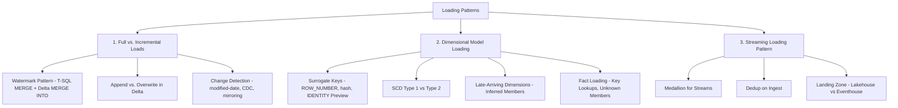

# 05. Loading Patterns

> **Exam domain:** Domain 2 — Ingest and transform data (30–35%)
> **Source:** `certification/05-loading-patterns/` — 4 files condensed
> **Why the exam cares:** This area tests whether a load is *correct when it runs twice*. Almost every question here is really asking about idempotency, ordering, or a change signal you cannot trust — duplicated rows after a retry, rows silently skipped by a watermark, history destroyed by the wrong SCD type, or fact rows vanishing behind a `NULL` foreign key.

---

## Orientation — the 60-second version

Microsoft Fabric is a single SaaS analytics platform whose storage layer is **OneLake** — one tenant-wide data lake where every engine (Spark, T-SQL, KQL, Power BI) reads and writes the same open **Delta Parquet** files. Inside it you build items: a **Lakehouse** (files + Delta tables, driven from Spark notebooks) or a **Warehouse** (full T-SQL surface, also storing Delta underneath). Loading patterns are the mechanics of getting data into either one correctly, repeatedly, and without duplicating or losing rows.

Three overlapping skills are tested. First, **full vs. incremental loads**: reload everything (simple, self-healing, expensive) or reload only what changed since a **watermark** — a durable pointer to the last successfully processed point, kept in a control table and advanced only *after* the load commits. Second, **dimensional model loading**: dimensions must be loaded before the facts that reference them, because a fact row needs a dimension's surrogate key to exist; on top of that sit surrogate-key generation, SCD Type 1 vs Type 2, late-arriving dimensions, and fact-side key lookups. Third, **streaming loading patterns**: medallion architecture applied continuously, append-only bronze writes, dedup on ingest, and the difference between at-least-once delivery and exactly-once-at-the-sink.

The thread joining all three is **idempotency**. `MERGE` (T-SQL) and `MERGE INTO` (Delta) key on a business key, so a re-run upserts instead of duplicating. Blind `INSERT`/`append` does not. Getting that wrong is the most common exam trap pattern in this domain.

## New terms in this topic

| Term | What it actually is |
| :--- | :--- |
| **OneLake** | The single, tenant-wide data lake underneath all of Fabric. Every workspace and item stores its data here in open Delta Parquet format, so one copy serves every engine. Solves the "five copies of the same table in five systems" problem. |
| **Lakehouse** | A Fabric item holding files plus Delta tables, worked on primarily from Spark notebooks. The Spark-native landing/refinement target. |
| **Fabric Data Warehouse (Warehouse)** | A Fabric item with a full T-SQL surface (DDL, DML, stored procedures, explicit transactions), storing its data as Delta in OneLake. The T-SQL-native target. |
| **Delta table / Delta Lake** | The open table format Fabric stores everything in: Parquet data files plus a transaction log that gives ACID commits, so `MERGE INTO`, `overwrite` and time-tracked batch IDs are possible on a data lake. |
| **`MERGE INTO`** | Delta's upsert statement (PySpark `DeltaTable.merge(...)`). Matches source to target on a join key and updates or inserts accordingly — the Lakehouse equivalent of T-SQL `MERGE`. |
| **Watermark control table** | A small persistent table (Warehouse table or Delta table) that stores, per source/target pair, the highest source value already loaded. Survives failures, so a retry resumes from the last known-good point. |
| **Database Mirroring** | A Fabric feature that continuously replicates an entire supported source database into OneLake as Delta tables, near-real-time. Removes the need to build an extraction pipeline at all — the replica *is* the incremental feed. |
| **CDC feed** | A source database's change data capture stream (or a mirrored database's change feed) supplying inserts, updates **and deletes** explicitly, rather than inferring change from a column. |
| **`IDENTITY` column (Preview)** | Fabric Warehouse's auto-incrementing key column. **Preview** as of the July 2026 blueprint; `bigint`-only, no `IDENTITY_INSERT`, no custom seed/increment, cannot be added to an existing table with `ALTER TABLE`. |
| **CTAS (`CREATE TABLE AS SELECT`) / `SELECT…INTO`** | The Warehouse way to rebuild a table from a query — the workaround for adding an `IDENTITY` column, since `ALTER TABLE ADD` cannot. |
| **`SEQUENCE` object** | A SQL Server key-generator object (`NEXT VALUE FOR`). **Not supported in Fabric Warehouse** — explicitly listed as an unsupported table feature. |
| **Eventstream** | A no-code Fabric item that ingests a live event feed and routes it to destinations (Lakehouse, Eventhouse, …). The front door for streaming data. |
| **Eventhouse / KQL database** | Fabric's real-time store, queried with KQL. Optimised for sub-second time-series and high-cardinality event queries. An Eventhouse contains one or more KQL databases. |
| **KQL materialized view** | An Eventhouse object that continuously maintains an aggregated/deduplicated result set over a raw ingestion table (e.g. `arg_max` per key), immediately queryable. The Eventhouse dedup mechanism. |
| **Update policy (Eventhouse)** | A KQL rule that automatically transforms rows landing in a raw table into a derived, conformed table — the Eventhouse silver-layer mechanism. |
| **OneLake shortcut** | A pointer that makes data stored elsewhere appear inside a Fabric item without copying it (a symlink for data). |
| **Query acceleration (for OneLake shortcuts)** | An Eventhouse feature that speeds up queries over shortcut data. Accelerated external delta tables keep external-table limitations — **materialized views and update policies are not supported on them**. |
| **Spark Structured Streaming** | Spark's streaming API (`readStream` / `writeStream`). In Fabric it reads Eventstream/Event Hubs and writes Delta tables continuously. |
| **`checkpointLocation`** | The folder where a Structured Streaming job records progress (committed batch IDs, dedup state). Enables restart without reprocessing and gives exactly-once at an idempotent sink. |
| **`foreachBatch`** | A Structured Streaming hook that hands each micro-batch to normal batch code — where a Delta `MERGE` is run, since the streaming write itself is append-only. |
| **Inferred member** | A placeholder dimension row (business key + surrogate key, `IsInferred = 1`) inserted so a fact load isn't blocked by a dimension that hasn't arrived yet. |
| **Unknown member** | A reserved dimension row with a fixed surrogate key (commonly `-1` or `0`, named `'Unknown'`) used as the fallback foreign key when a dimension lookup misses. |

## How the pieces fit



- A **watermark is a durable pointer, not a variable** — it lives in a control table (or a small Delta table) and is advanced only *after* a load commits, so a failed run safely retries from the last known-good point.
- **`MERGE` is the idempotency mechanism** — both T-SQL `MERGE` (Warehouse) and Delta `MERGE INTO` (Lakehouse) key on a business/natural key, so re-running the same batch upserts instead of duplicating; naive `INSERT`/append has no such property.
- **Dimensions load before facts** — a fact row needs a dimension's surrogate key (or an inferred placeholder) to exist before it can carry a valid foreign key.
- **Fabric Warehouse `IDENTITY` columns are Preview** (verified against Microsoft Learn, July 2026) — `bigint`-only, no custom seed/increment, can't `ALTER TABLE ADD` onto an existing table. `ROW_NUMBER()`-based and hash-based surrogate keys are the exam-relevant fallbacks.
- **Streaming loads default to append-only** — bronze and most silver streaming writes use `outputMode("append")`; upserts and aggregation happen in a downstream micro-batch (`foreachBatch` + `MERGE`) or in an Eventhouse materialized view, never in the streaming write itself.
- Subtopic 1 supplies the idempotency mechanics that subtopics 2 and 3 both reuse: SCD loading is `MERGE` with history rules bolted on; streaming silver/gold is `MERGE` run per micro-batch.

---

## 1. Full vs. Incremental Loads
*Source: `01-full-incremental-loads.md`*

Every load design starts with one question: reload everything, or reload only what changed?

### 1.1 Choosing full vs. incremental — decision factors

| Factor | Favors Full Load | Favors Incremental Load |
| :--- | :--- | :--- |
| **Data volume** | Small to medium tables (dimension-sized) where a full re-read is cheap | Large fact-sized tables where re-reading everything is slow and costly |
| **Source change-tracking** | Source can't reliably signal what changed (no modified-date, no CDC) | Source has a trustworthy modified-date, CDC, or mirroring feed |
| **Freshness SLA** | Nightly/weekly batch windows with slack time | Near-real-time or frequent (hourly/sub-hourly) refresh requirements |
| **Data integrity risk** | Any drift or missed update in a prior run is silently self-corrected on the next full reload | Drift from a missed watermark update can compound across runs if not monitored |
| **Delete handling** | Source deletes disappear automatically — the reload just doesn't include them | Hard deletes are invisible to a modified-date-only feed; needs CDC or a reconciliation pass |
| **Compute cost** | **Higher** per run, but simpler to reason about and operate | **Lower** per run once the watermark plumbing exists, but more moving parts to maintain |

> 🧠 **Mental model —** A full load **repaints the whole canvas** every time: correct by construction, but you repay every brushstroke even for pixels that never changed. An incremental load **only touches up what changed since the last coat**: cheap and fast, but only as correct as your ability to know exactly what changed — which is the entire reason the watermark pattern exists.

### 1.2 The watermark pattern

A **watermark** is a durable value — usually a timestamp or a monotonically increasing ID — marking the last point in the source already successfully loaded. It lives in a **control table**, not in application memory or a pipeline variable, so it survives across runs and failures.

Minimal watermark control table — four columns:

| Column | Purpose |
| :--- | :--- |
| `SourceTableName` | Which source/target pair this watermark tracks |
| `WatermarkColumn` | The column being watched (e.g. `LastModifiedUtc`) |
| `LastWatermarkValue` | The highest value successfully loaded so far |
| `LastRunUtc` | Audit timestamp of the last successful update |

The load sequence is always: **read the old watermark → extract rows past it → load them → advance the watermark, only after the load commits.**

> ⚠️ **Trap —** Advancing the watermark *before* confirming the load succeeded, or storing it somewhere non-durable like a pipeline variable that resets, means a failed load **silently skips the missed rows** on the next run instead of retrying them. The watermark update must be the **last** step, and ideally in the **same transaction** as the load it tracks.

**T-SQL: watermark table + `MERGE` (Warehouse)**

```sql
CREATE TABLE control.WatermarkTable (
    SourceTableName      VARCHAR(128) NOT NULL,
    WatermarkColumn      VARCHAR(128) NOT NULL,
    LastWatermarkValue   DATETIME2(3) NOT NULL,
    LastRunUtc           DATETIME2(3) NOT NULL
);

INSERT INTO control.WatermarkTable VALUES
    ('fact.Sales', 'LastModifiedUtc', '1900-01-01', SYSUTCDATETIME());
```

```sql
-- Extract, upsert, advance watermark — one transaction
DECLARE @OldWatermark DATETIME2(3), @NewWatermark DATETIME2(3);

SELECT @OldWatermark = LastWatermarkValue
FROM control.WatermarkTable WHERE SourceTableName = 'fact.Sales';

BEGIN TRAN;

SELECT * INTO #StagingSales
FROM Source.dbo.Sales
WHERE LastModifiedUtc > @OldWatermark;          -- rows changed since last watermark

SELECT @NewWatermark = MAX(LastModifiedUtc) FROM #StagingSales;

MERGE fact.Sales AS tgt
USING #StagingSales AS src
    ON tgt.SalesOrderId = src.SalesOrderId       -- business key => idempotent re-run
WHEN MATCHED THEN
    UPDATE SET tgt.Amount = src.Amount, tgt.LastModifiedUtc = src.LastModifiedUtc
WHEN NOT MATCHED THEN
    INSERT (SalesOrderId, Amount, LastModifiedUtc)
    VALUES (src.SalesOrderId, src.Amount, src.LastModifiedUtc);

IF @NewWatermark IS NOT NULL
    UPDATE control.WatermarkTable
    SET LastWatermarkValue = @NewWatermark, LastRunUtc = SYSUTCDATETIME()
    WHERE SourceTableName = 'fact.Sales';        -- last step, same transaction

COMMIT;
```

*(The full source wraps this in `CREATE OR ALTER PROCEDURE dbo.Load_FactSales_Incremental`.)*

Fabric Data Warehouse supports grouping schema and data changes into a single **explicit transaction** (`BEGIN TRAN` / `COMMIT` / `ROLLBACK`), and `MERGE` takes an **Intent Exclusive lock** like other DML — so the staging load, the `MERGE`, and the watermark update either all land together or all roll back together.

**PySpark: watermark table + Delta `MERGE INTO` (Lakehouse)**

```python
from delta.tables import DeltaTable
from pyspark.sql import functions as F

# Watermark lives in a small Delta control table, not a notebook variable
watermark_df = spark.table("control.watermark_table") \
    .filter("source_table_name = 'fact_sales'")
old_watermark = watermark_df.collect()[0]["last_watermark_value"]

staged = spark.table("source.sales") \
    .filter(F.col("last_modified_utc") > old_watermark)
new_watermark = staged.agg(F.max("last_modified_utc")).collect()[0][0]

if new_watermark is not None:
    target = DeltaTable.forName(spark, "fact.sales")
    (target.alias("tgt")
        .merge(staged.alias("src"), "tgt.sales_order_id = src.sales_order_id")
        .whenMatchedUpdate(set={"amount": "src.amount",
                                "last_modified_utc": "src.last_modified_utc"})
        .whenNotMatchedInsert(values={"sales_order_id": "src.sales_order_id",
                                      "amount": "src.amount",
                                      "last_modified_utc": "src.last_modified_utc"})
        .execute())

    spark.sql(f"""
        UPDATE control.watermark_table
        SET last_watermark_value = TIMESTAMP'{new_watermark}',
            last_run_utc = current_timestamp()
        WHERE source_table_name = 'fact_sales'
    """)   # advance only after the MERGE INTO commits
```

Each Delta `MERGE INTO` is its **own ACID transaction** against the target table, so the following watermark `UPDATE` is a separate statement. If the notebook fails between the two, the next run's `MERGE INTO` re-processes the same rows harmlessly (still keyed on `sales_order_id`) — the pattern stays safe even without one enclosing transaction.

### 1.3 Append vs. overwrite semantics in Delta

| Mode | Behavior | Idempotent on re-run? |
| :--- | :--- | :--- |
| `mode("append")` | Adds new files to the table; existing rows untouched | ❌ No — re-running the same batch duplicates every row |
| `mode("overwrite")` | Replaces the entire table's data (or the matched partitions with `replaceWhere`) | ✅ Yes — re-running produces the same end state |
| `.merge(...).execute()` (`MERGE INTO`) | Upserts row-by-row on a join key; unmatched target rows untouched unless a `whenNotMatchedBySource` clause is added | ✅ Yes — keyed on the business key |

```python
# Overwrite only the affected partition(s) — safe to re-run for that partition
(spark.read.table("staging.daily_sales")
    .write.format("delta")
    .mode("overwrite")
    .option("replaceWhere", "sales_date = '2026-07-10'")
    .saveAsTable("fact.sales"))
```

`replaceWhere` scopes an overwrite to matching partitions instead of the whole table — a simpler "reload today's partition" alternative to `MERGE INTO` when the source naturally partitions by load date and a full day always reloads together.

> ⚠️ **Trap —** Using plain `append` as the *only* write step in an incremental pipeline. Append has no concept of "this row already exists": retry after a partial failure, or run the same extract window twice, and every row lands twice. Append is safe only as the raw bronze-layer ingestion step (§3); anything meant to be queried as a clean, deduplicated table needs `MERGE INTO`, `overwrite`, or a downstream dedup step.

### 1.4 Idempotency

A load is **idempotent** if running it twice with the same inputs produces the same end state as running it once. This is what makes retries safe.

| Technique | Idempotent? | Why |
| :--- | :--- | :--- |
| `INSERT` / `append` on every run | ❌ No | No matching logic — every re-run adds duplicate rows |
| `MERGE` / `MERGE INTO` keyed on business key | ✅ Yes | Matched rows update in place; only genuinely new keys insert |
| `overwrite` of an entire table or partition | ✅ Yes | End state depends only on the source data for that scope, not on how many times the write ran |
| Watermark boundary using `>` on the last value | ✅ Yes, **if** paired with `MERGE`/overwrite | Re-extracting the same window and re-`MERGE`-ing changes nothing; re-extracting with plain append duplicates it |

### 1.5 Change detection options

| Option | How it works | Strengths | Weaknesses |
| :--- | :--- | :--- | :--- |
| **Modified-date column** | Source maintains a `LastModifiedUtc`-style column; incremental extract filters `> watermark` | Simplest to implement; works with almost any source | Misses hard deletes entirely; vulnerable to clock skew and to source updates that don't touch the modified-date column |
| **CDC-fed** | Source database's change data capture feed (or a Fabric mirrored database's change feed) supplies inserts/updates/**deletes** explicitly | Captures deletes and every change, including columns not covered by a modified-date | Requires CDC enabled on the source; more moving parts than a simple column filter |
| **Mirroring-fed** | Fabric Database Mirroring continuously replicates the entire source database into OneLake as Delta tables, near-real-time | No extraction pipeline to build at all; the replica *is* the incremental feed | Only available for mirroring-supported source types |

> 🧠 **Mental model —** A modified-date column is a **sticky note the source leaves on each row** ("I was touched at this time") — reliable only if every write actually updates the note. CDC is a **security camera on the whole table**: it records every change, including the ones that would otherwise leave the room unnoticed (deletes). Mirroring skips extraction entirely — the incremental feed is the continuously-replicated table already sitting in OneLake.

> 📌 **Remember —** This is the *decision* only. Pipeline-side CDC ingestion patterns and the full set of mirroring flavours and setup steps live in Topic 06 (Batch Ingestion).

**Distinctive use cases:** nightly incremental load of a large fact table via watermark + `MERGE`; a tiny reference table reloaded in full because engineering a watermark isn't worth it; reloading one day's partition with `overwrite` + `replaceWhere` when the source delivers a full day as one batch; switching to CDC/mirroring specifically to catch source-side deletes.

### 1.6 Common issues & errors

| Issue | Cause | Resolution |
| :--- | :--- | :--- |
| Rows loaded twice after a pipeline retry | Load step used `append` instead of `MERGE`/`MERGE INTO`, so a retried attempt duplicates rows already written | Switch to `MERGE INTO` (Delta) or `MERGE` (T-SQL) keyed on the business key, or use partition `overwrite` |
| Rows silently missing after a failed run | Watermark advanced before (or independent of) confirming the load committed | Move the watermark update to the last step of the same transaction/unit of work as the load |
| Deleted source rows still appear in the target | Change detection relies solely on a modified-date column, which has no signal for deletes | Switch to a CDC-fed or mirroring-fed option, or add a periodic full reconciliation pass |
| `overwrite` unexpectedly wipes more data than intended | `replaceWhere` omitted, so `overwrite` replaced the entire table instead of one partition | Add a `replaceWhere` predicate scoped to the exact partition(s) being reloaded |
| Incremental extract silently returns zero new rows every run | Source isn't updating the watermark column on every relevant write, so `> watermark` never matches | Confirm the source stamps the watermark column on every insert/update, or switch to a CDC-fed feed |

---

## 2. Dimensional Model Loading
*Source: `02-dimensional-model-loading.md`*

### 2.1 Star schema, oriented to loading

A star schema separates **dimensions** (small, descriptive — customer, product, date, region) from **facts** (large, numeric, event-grained — sales, orders, page views). Facts reference dimensions by **surrogate key** — an internally-generated integer that stays stable even when the dimension's business/natural key or attributes change.

| | Dimension | Fact |
| :--- | :--- | :--- |
| **Row count** | Small to medium | Large, often the majority of total data volume |
| **Loaded** | **First** — before any fact that references it | **Second** — after the dimensions it references have current surrogate keys |
| **Keyed by** | A generated surrogate key (`CustomerKey`) plus a business key (`CustomerBusinessKey`) | Foreign keys to each dimension's surrogate key, plus measures |
| **Change pattern** | Attributes change slowly (SCD1/SCD2) | Append/insert-heavy; rarely updated once loaded |

A fact load that runs before its dimensions are current either fails its foreign key lookups or — worse — **silently attaches fact rows to stale or missing dimension keys**. That ordering dependency is why star-schema pipelines are built as dimensions, then facts, never as one flat parallel load.

### 2.2 Surrogate key generation in Fabric

> 🔑 **Exam fact —** Verified against Microsoft Learn, July 2026: Fabric Data Warehouse `IDENTITY` columns are **in Preview**. They support **only `bigint`**, do **not** support `IDENTITY_INSERT` or a custom seed/increment, and **cannot be added to an existing table with `ALTER TABLE`** (use CTAS / `SELECT…INTO` instead). Because this is Preview rather than GA, the exam-safe default remains `ROW_NUMBER()`-based or hash-based keys — know both.

**`IDENTITY` column (Preview):**

```sql
CREATE TABLE dim.Customer (
    CustomerKey          BIGINT IDENTITY,
    CustomerBusinessKey  VARCHAR(20) NOT NULL,
    CustomerName         VARCHAR(100),
    Address              VARCHAR(200),
    IsCurrent            BIT
);
-- CustomerKey assigned automatically on INSERT; values are unique but gaps can
-- appear and allocation order isn't guaranteed across distributed compute nodes.
```

**`ROW_NUMBER()`-based surrogate key (long-standing, GA-safe):**

```sql
DECLARE @MaxKey BIGINT = ISNULL((SELECT MAX(CustomerKey) FROM dim.Customer), 0);

INSERT INTO dim.Customer (CustomerKey, CustomerBusinessKey, CustomerName, Address, IsCurrent)
SELECT
    @MaxKey + ROW_NUMBER() OVER (ORDER BY src.CustomerBusinessKey) AS CustomerKey,
    src.CustomerBusinessKey, src.CustomerName, src.Address, 1
FROM #StagingNewCustomers AS src;
```

**Hash-based surrogate key** — deterministic, derived from the business key:

```sql
SELECT
    CAST(HASHBYTES('SHA2_256', CustomerBusinessKey) AS VARBINARY(32)) AS CustomerKey,
    CustomerBusinessKey, CustomerName, Address
FROM #StagingNewCustomers;
```

Hash keys are idempotent by construction (the same business key always hashes to the same value, even generated independently across environments) and need **no key-lookup roundtrip** during fact loading if the fact stream can compute the same hash. But they carry no ordering information, and a hash collision — astronomically unlikely with SHA-256 — is a real if negligible risk that `ROW_NUMBER()`/`IDENTITY` don't have.

**Lakehouse: `monotonically_increasing_id()` caveats**

```python
from pyspark.sql import functions as F
from pyspark.sql.window import Window

# Naive — do NOT use for a real surrogate key
df.withColumn("customer_key", F.monotonically_increasing_id())
```

> ⚠️ **Trap —** `monotonically_increasing_id()` produces values unique and increasing **within a single DataFrame execution**, but they are **not contiguous**, they **encode the Spark partition ID in their high-order bits**, and they are **not stable across re-runs** — re-executing the same transformation (e.g. after a stage retry) can produce different values for the same rows. It is not a substitute for a real surrogate key generator.

Safer Spark pattern — mirror the T-SQL approach with a single ordered, offset row number:

```python
max_key_row = spark.table("dim.customer").agg(F.max("customer_key")).collect()[0][0]
max_key = max_key_row if max_key_row is not None else 0

window = Window.orderBy("customer_business_key")   # no partitionBy -> a real total order
new_customers = staged_new_customers.withColumn(
    "customer_key", max_key + F.row_number().over(window))
```

`Window.orderBy(...)` with no `partitionBy` **collapses the computation to a single partition** to guarantee a true, stable total order — acceptable at dimension-sized volumes, but a scalability tradeoff for very large key-generation batches (a distributed hash key avoids the single-partition bottleneck entirely).

| Technique | Where | Idempotent/stable? | Notes |
| :--- | :--- | :--- | :--- |
| `IDENTITY` column | Warehouse | Unique, not stable order (gaps, distributed allocation) | **Preview** as of July 2026; `bigint` only, no reseed |
| `ROW_NUMBER()` + max-key offset | Warehouse or Spark | Stable if computed the same way each time | GA-safe long-standing pattern |
| Hash key (`HASHBYTES` / `sha2`) | Warehouse or Spark | ✅ Fully deterministic | No key-lookup needed if fact stream can hash independently |
| `monotonically_increasing_id()` | Spark | ❌ Not stable across re-runs | Don't use for surrogate keys |

> 🧠 **Mental model —** A surrogate key generator is a **deli-counter ticket dispenser**: everyone needs a number before they can be served (loaded into the fact table), and numbers must never repeat or change once handed out. `IDENTITY` and `ROW_NUMBER()` print the next number in a running sequence; a hash key is a number computed from your name — no dispenser needed, but you'd better trust the hash never collides.

### 2.3 SCD Type 1 vs. Type 2

| | SCD Type 1 | SCD Type 2 |
| :--- | :--- | :--- |
| **On a changed attribute** | **Overwrite** the existing row in place | **Insert a new row** (new surrogate key) and close out the old one |
| **History preserved?** | ❌ No — only the current value survives | ✅ Yes — every historical version is queryable |
| **Extra columns needed** | None | `EffectiveDate`, `EndDate`, `IsCurrent` (or equivalent) |
| **Typical use** | Correcting an error, or an attribute where history genuinely doesn't matter (a typo fix) | An attribute where "what was true at the time of the fact" matters (a customer's address at the time of a sale) |

> 🧠 **Mental model —** SCD1 is a **whiteboard eraser** — the old value is gone the moment the new one is written. SCD2 is a **filing cabinet** — the old version stays in its own correctly-dated folder while a new folder holds the current one, so "what was true on this date" can always be pulled.

**SCD Type 1 — T-SQL `MERGE` (two steps, and here's why):** a `MERGE`'s `WHEN NOT MATCHED THEN INSERT … VALUES` clause can only insert literal or source-column values per row — it **cannot compute a `ROW_NUMBER()` over the whole unmatched set**, so a `ROW_NUMBER()`-based surrogate key can't be generated inline inside the `MERGE`.

```sql
-- Step 1: update existing rows in place (SCD1 overwrite semantics)
MERGE dim.Product AS tgt
USING #StagingProduct AS src
    ON tgt.ProductBusinessKey = src.ProductBusinessKey
WHEN MATCHED THEN
    UPDATE SET tgt.ProductName = src.ProductName, tgt.Category = src.Category;

-- Step 2: insert brand-new rows with a ROW_NUMBER()-based surrogate key
DECLARE @MaxProductKey BIGINT = ISNULL((SELECT MAX(ProductKey) FROM dim.Product), 0);

INSERT INTO dim.Product (ProductKey, ProductBusinessKey, ProductName, Category)
SELECT
    @MaxProductKey + ROW_NUMBER() OVER (ORDER BY src.ProductBusinessKey) AS ProductKey,
    src.ProductBusinessKey, src.ProductName, src.Category
FROM #StagingProduct AS src
WHERE NOT EXISTS (SELECT 1 FROM dim.Product AS tgt
                  WHERE tgt.ProductBusinessKey = src.ProductBusinessKey);
```

> ⚠️ **Trap —** Reaching for `NEXT VALUE FOR` against a `SEQUENCE` object to generate a surrogate key. **`SEQUENCE` objects are not supported in Fabric Warehouse** — explicitly listed as an unsupported table feature. Use the `ROW_NUMBER()` + max-key-offset pattern instead.

**SCD Type 1 — PySpark Delta `MERGE INTO`:**

```python
target = DeltaTable.forName(spark, "dim.product")

(target.alias("tgt")
    .merge(staged_products.alias("src"),
           "tgt.product_business_key = src.product_business_key")
    .whenMatchedUpdate(set={"product_name": "src.product_name",
                            "category": "src.category"})
    .whenNotMatchedInsert(values={"product_key": "src.product_key",
                                  "product_business_key": "src.product_business_key",
                                  "product_name": "src.product_name",
                                  "category": "src.category"})
    .execute())
```

**SCD Type 2 — T-SQL two-step `MERGE` + `INSERT`.** A single T-SQL `MERGE` can perform exactly **one action** — update, delete, or insert — per matched row. It cannot both close out the old version *and* insert a new versioned row for the same key in one `WHEN MATCHED` clause. So T-SQL SCD2 is always: close changed rows with `MERGE`, then insert their new versions.

```sql
BEGIN TRAN;

CREATE TABLE #ClosedKeys (CustomerBusinessKey VARCHAR(20));

-- Step 1: close out rows whose tracked attributes changed
MERGE dim.Customer AS tgt
USING #StagingCustomer AS src
    ON tgt.CustomerBusinessKey = src.CustomerBusinessKey
   AND tgt.IsCurrent = 1
WHEN MATCHED AND (tgt.Address <> src.Address OR tgt.Segment <> src.Segment) THEN
    UPDATE SET tgt.IsCurrent = 0, tgt.EndDate = CAST(SYSUTCDATETIME() AS date)
OUTPUT src.CustomerBusinessKey INTO #ClosedKeys;

-- Step 2: insert current-version rows for brand-new keys AND keys just closed
DECLARE @MaxCustomerKey BIGINT = ISNULL((SELECT MAX(CustomerKey) FROM dim.Customer), 0);

INSERT INTO dim.Customer (CustomerKey, CustomerBusinessKey, Address, Segment,
                          EffectiveDate, EndDate, IsCurrent)
SELECT
    @MaxCustomerKey + ROW_NUMBER() OVER (ORDER BY src.CustomerBusinessKey) AS CustomerKey,
    src.CustomerBusinessKey, src.Address, src.Segment,
    CAST(SYSUTCDATETIME() AS date), NULL, 1
FROM #StagingCustomer AS src
WHERE src.CustomerBusinessKey IN (SELECT CustomerBusinessKey FROM #ClosedKeys)
   OR NOT EXISTS (SELECT 1 FROM dim.Customer tgt
                  WHERE tgt.CustomerBusinessKey = src.CustomerBusinessKey
                    AND tgt.IsCurrent = 1);

DROP TABLE #ClosedKeys;
COMMIT;
```

The `OUTPUT` clause on the closing `MERGE` captures exactly which business keys changed, so the follow-up `INSERT` creates new versions **only** for rows actually closed (plus genuinely new keys) — not for every staged row. A `#temp` table is used rather than a table variable (`DECLARE @x TABLE`) as `OUTPUT INTO`'s target: **table variables carry unverified support risk in Fabric Warehouse, while session-scoped `#temp` tables are docs-confirmed supported.**

**SCD Type 2 — PySpark Delta `MERGE INTO`, single-statement `mergeKey` pattern.** Rows needing a new version are tagged with a `NULL` merge key so they can never match an existing row (forcing an insert), while the same staged batch also carries the real business key so it *can* match and close the old version.

```python
from delta.tables import DeltaTable
from pyspark.sql import functions as F

customers = DeltaTable.forName(spark, "dim.customer")

changed = (staged_customers.alias("updates")
    .join(customers.toDF().alias("customers"), "customer_business_key")
    .where("customers.is_current = true AND (updates.address <> customers.address "
           "OR updates.segment <> customers.segment)")
    .select("updates.*"))

# NULL mergeKey rows can never match -> they always insert as new current versions
staged_updates = (changed.selectExpr("NULL as merge_key", "*")
    .union(staged_customers.selectExpr("customer_business_key as merge_key", "*")))

(customers.alias("customers")
    .merge(staged_updates.alias("staged"),
           "customers.customer_business_key = staged.merge_key")
    .whenMatchedUpdate(
        condition="customers.is_current = true AND (customers.address <> staged.address "
                  "OR customers.segment <> staged.segment)",
        set={"is_current": "false", "end_date": "staged.effective_date"})
    .whenNotMatchedInsert(values={
        "customer_key": "staged.customer_key",
        "customer_business_key": "staged.customer_business_key",
        "address": "staged.address",
        "segment": "staged.segment",
        "is_current": "true",
        "effective_date": "staged.effective_date",
        "end_date": "expr(null)"})
    .execute())
```

### 2.4 Late-arriving dimensions: inferred members

A fact row sometimes arrives before its dimension row exists — a sale for a customer whose profile hasn't loaded yet. Blocking the fact load until the real record shows up isn't acceptable for most SLAs, so insert an **inferred member**: a placeholder dimension row with just the business key and a generated surrogate key, flagged `IsInferred = 1`, so the fact load has a valid key to reference.

```sql
DECLARE @MaxCustomerKey BIGINT = ISNULL((SELECT MAX(CustomerKey) FROM dim.Customer), 0);

INSERT INTO dim.Customer (CustomerKey, CustomerBusinessKey, CustomerName, Address,
                          IsCurrent, IsInferred)
SELECT
    @MaxCustomerKey + ROW_NUMBER() OVER (ORDER BY f.CustomerBusinessKey) AS CustomerKey,
    f.CustomerBusinessKey, NULL, NULL, 1, 1
FROM #StagingFactSales AS f
WHERE NOT EXISTS (SELECT 1 FROM dim.Customer d
                  WHERE d.CustomerBusinessKey = f.CustomerBusinessKey AND d.IsCurrent = 1);
```

When the real dimension record later arrives it **updates the inferred row in place (SCD1-style)** rather than creating a new SCD2 version — the inferred row never represented a genuine "known" prior state worth preserving.

```sql
UPDATE dim.Customer
SET CustomerName = src.CustomerName, Address = src.Address, IsInferred = 0
FROM #StagingCustomer AS src
WHERE dim.Customer.CustomerBusinessKey = src.CustomerBusinessKey
  AND dim.Customer.IsInferred = 1;
```

The PySpark equivalent uses the same two phases: a `whenNotMatchedInsert` to stub the dimension during fact load, and a plain `whenMatchedUpdate` (**not** the SCD2 `mergeKey` pattern) to backfill the inferred row once real attributes arrive.

### 2.5 Fact-table loading

Loading a fact table means resolving every incoming business key to its dimension's **current** surrogate key, then loading the fact rows with those resolved foreign keys.

```sql
INSERT INTO fact.Sales (CustomerKey, ProductKey, SalesDate, Amount)
SELECT
    ISNULL(c.CustomerKey, -1),   -- fallback to Unknown Member if no match
    ISNULL(p.ProductKey, -1),
    s.SalesDate, s.Amount
FROM #StagingSales AS s
LEFT JOIN dim.Customer AS c
    ON c.CustomerBusinessKey = s.CustomerBusinessKey AND c.IsCurrent = 1
LEFT JOIN dim.Product AS p
    ON p.ProductBusinessKey = s.ProductBusinessKey AND p.IsCurrent = 1;
```

```python
# PySpark equivalent — broadcast join against the (small) current-version dimension
from pyspark.sql import functions as F

current_customers = spark.table("dim.customer").filter("is_current = true")

fact_with_keys = (staged_sales.alias("s")
    .join(F.broadcast(current_customers).alias("c"),
          on="customer_business_key", how="left")
    .withColumn("customer_key", F.coalesce(F.col("c.customer_key"), F.lit(-1)))
    .select("s.*", "customer_key"))
```

| Fallback pattern | When to use | Tradeoff |
| :--- | :--- | :--- |
| **Unknown Member row** (reserved key, e.g. `-1`) | A dimension lookup misses and the late-arriving-dimension pattern isn't implemented for this source | Fact row loads immediately with a stable, joinable key, but the true dimension attributes stay permanently unresolved unless reprocessed |
| **Inferred Member row** | The dimension is expected to catch up soon (late-arriving pattern implemented) | Fact row's key later resolves to full attributes once the real dimension record backfills the stub |
| **Reject/quarantine row** | The business rule requires flagging unresolvable references rather than loading them | No orphaned fact row, but requires a separate remediation/replay process |

> ⚠️ **Trap —** Loading a fact row's foreign key as `NULL` when a dimension lookup misses, instead of a reserved **Unknown Member** key. `INNER JOIN`-based reports **silently drop** `NULL`-keyed fact rows from every dimension-joined query — the row still exists in the fact table but effectively disappears from analysis, with **no error raised anywhere**. A reserved key (commonly `-1` or `0`, with a corresponding `dim.Customer` row named `'Unknown'`) keeps the fact row joinable and visible.

> 📌 **Remember —** Default to the **Unknown Member** for anything that should stay visible in reports; reserve the reject/quarantine path only for business-mandated cases.

**Distinctive use cases:** generating stable, GA-safe surrogate keys for a new Warehouse dimension with `ROW_NUMBER()` + max-key offset while `IDENTITY` remains Preview; implementing SCD Type 2 on `dim.Customer` so historical fact rows report the segment/address that applied at the time of the sale; stubbing an inferred-member row so a same-day fact load isn't blocked waiting on a slower dimension feed; substituting an Unknown Member key for lookups that genuinely can't be resolved, keeping those fact rows visible downstream.

### 2.6 Common issues & errors

| Issue | Cause | Resolution |
| :--- | :--- | :--- |
| Duplicate or unstable surrogate keys after a Spark job retry | `monotonically_increasing_id()` used as the key generator | Switch to `row_number()` + max-key-offset, or a deterministic hash key |
| An `ALTER TABLE ADD` for an `IDENTITY` column fails in Warehouse | `IDENTITY` can't be added to an existing table via `ALTER TABLE` | Use `CREATE TABLE AS SELECT (CTAS)` or `SELECT…INTO` to rebuild the table with `IDENTITY` defined at creation |
| A dimension attribute change silently loses history | The load uses SCD Type 1 (`MERGE … WHEN MATCHED THEN UPDATE`) overwrite semantics where SCD Type 2 was required | Implement the two-step T-SQL `MERGE` + `INSERT` pattern, or the Delta `mergeKey` single-`MERGE INTO` pattern |
| Fact rows vanish from dimension-joined reports | `NULL` foreign keys from unresolved dimension lookups | Substitute a reserved Unknown Member surrogate key instead of `NULL` |
| A late-arriving dimension's real attributes never appear | The inferred-member backfill update step was never implemented, or matches on the wrong flag/key | Add a backfill `UPDATE`/`MERGE` keyed on `IsInferred = 1` that updates in place when the real record arrives |

---

## 3. Streaming Loading Pattern
*Source: `03-streaming-loading-pattern.md`*

Streaming data still needs a loading pattern — it just applies medallion architecture continuously instead of per-batch.

### 3.1 Medallion architecture applied to streams

| Layer | Streaming role | Typical Fabric technology |
| :--- | :--- | :--- |
| **Bronze** | Raw events landed as received, minimal parsing, append-only | Eventstream default destination into a Lakehouse Delta table, or a raw Eventhouse table |
| **Silver** | Cleansed, conformed, **deduplicated** — still near-real-time | Spark Structured Streaming with watermark + `dropDuplicates`, or an Eventhouse update policy transforming raw → conformed |
| **Gold** | Aggregated, business-level, ready for consumption | A scheduled/triggered Delta `MERGE` aggregation job, or a KQL **materialized view** in Eventhouse |

Real-Time Intelligence in Fabric documents this same bronze/silver/gold refinement explicitly for Eventhouse-based pipelines: raw ingested tables refine into update-policy-derived tables, which refine again into materialized views for consumption.

> 🧠 **Mental model —** Medallion for streams is the same **refinery** as medallion for batch: crude data in one end, progressively cleaned at each stage, only the refined product at the far end meant for direct consumption. The only difference is that the refinery never stops running.

### 3.2 Append-only ingestion

Streaming writes into Delta use `outputMode("append")` — matching/upserting is deliberately **not** part of the streaming write itself.

```python
rawEvents = spark.readStream.format("eventhubs").options(**ehConf).load()

parsed = (rawEvents
    .withColumn("bodyAsString", F.col("body").cast("string"))
    .select(F.from_json("bodyAsString", eventSchema).alias("e"))
    .select("e.*"))

(parsed.writeStream
    .format("delta")
    .option("checkpointLocation", "Files/checkpoints/bronze_events")
    .outputMode("append")
    .toTable("bronze.raw_events"))
```

Bronze stays append-only by design — it is the raw, replayable record. Any upsert or aggregation a business scenario needs is applied **downstream** of the streaming write: typically a `foreachBatch` callback running a Delta `MERGE` against silver/gold, or an Eventhouse update policy / materialized view layered on a raw table.

### 3.3 Dedup on ingest

**Spark Structured Streaming: watermark + `dropDuplicates`**

```python
from pyspark.sql import functions as F

deduped = (parsed
    .withWatermark("event_time", "10 minutes")    # bounds how long state is retained
    .dropDuplicates(["event_id", "event_time"]))  # dedup key, scoped by the watermark

(deduped.writeStream
    .format("delta")
    .option("checkpointLocation", "Files/checkpoints/silver_events")
    .outputMode("append")
    .toTable("silver.events"))
```

The watermark tells Structured Streaming how long to keep dedup state before discarding it. Without one, `dropDuplicates` on an unbounded stream keeps **every seen key in state forever**, growing without limit. A **10-minute** watermark means a duplicate arriving more than 10 minutes late (relative to the latest seen `event_time`) is no longer guaranteed to be caught.

**Eventhouse: materialized-view dedup**

```kusto
.create materialized-view DedupedEvents on table RawEvents
{
    RawEvents
    | summarize arg_max(ingestion_time(), *) by event_id
}
```

`arg_max(ingestion_time(), *)` keeps only the latest-ingested row per `event_id` — the KQL equivalent of `dropDuplicates`. The difference: a materialized view **continuously maintains** this deduplicated result set as new rows land, rather than deduplicating within a bounded streaming window.

> ⚠️ **Trap —** Enabling **query acceleration** on a OneLake shortcut into an Eventhouse and then trying to layer a materialized view or update policy on top. Accelerated external delta tables behave like standard external tables with the same limitations — **materialized views and update policies aren't supported on them**. Dedup against shortcut-accelerated data must happen **at query time** (e.g. `arg_max` in the query itself), not via a materialized view.

### 3.4 Landing-zone patterns: Eventstream destination

Eventstream can route the same incoming data to different destinations depending on what the consumer needs.

| Destination | Best for | Tradeoff |
| :--- | :--- | :--- |
| **Lakehouse** (Delta table) | Batch analytics, ML feature engineering, anything consumed by Spark/notebooks downstream | Query latency is Spark-job-scale (seconds to minutes), not sub-second |
| **Eventhouse** (KQL database) | Sub-second time-series queries, high-cardinality event exploration, dashboards | KQL-specific skillset; not the natural fit for heavy Spark/ML workloads |

This is a preview of the choice only — the full decision matrix by source type, latency requirement, and transform complexity lives in Section 08 (Choosing a Streaming Engine).

### 3.5 Micro-batch vs. continuous

By default Structured Streaming processes data in **micro-batches**, starting the next as soon as the previous completes. It's tunable:

| Trigger | Behavior |
| :--- | :--- |
| Default (no `.trigger(...)` call) | Micro-batch, as fast as the previous batch allows |
| `.trigger(processingTime="1 minute")` | Fixed-interval micro-batch — accumulates data and writes in fewer, larger operations |
| `.trigger(availableNow=True)` | Processes all currently-available data as a bounded set of micro-batches, then stops — a batch-like "catch up and finish" run |
| Continuous processing mode | An **experimental**, low-latency mode with a much smaller supported operator set; not the primary documented pattern for Fabric streaming workloads |

```python
(deduped.writeStream
    .format("delta")
    .option("checkpointLocation", "Files/checkpoints/silver_events")
    .outputMode("append")
    .trigger(processingTime="1 minute")
    .toTable("silver.events"))
```

Batching writes with a fixed `processingTime` interval trades a small amount of latency for materially **larger, better-compacted Delta files**, reducing the small-file overhead that unbatched micro-batch writes accumulate.

### 3.6 Exactly-once vs. at-least-once semantics

| Layer | Default delivery guarantee | How to reach effectively-once |
| :--- | :--- | :--- |
| **Eventstream / Event Hubs ingestion** | At-least-once — a redelivered or retried event can be re-ingested | Dedup downstream: `dropDuplicates` (Spark) or `arg_max` materialized view (Eventhouse) |
| **Spark Structured Streaming → Delta** | Exactly-once **at the sink**, when checkpointing is enabled and the sink write is idempotent (Delta's transaction log tracks committed batch IDs) | Always set `checkpointLocation`; never write to a non-idempotent sink without additional dedup |
| **Eventhouse raw ingestion** | At-least-once | Materialized view dedup, or `arg_max` in the consuming query |

> 🧠 **Mental model —** At-least-once is a **postal service that occasionally delivers the same letter twice** rather than losing it: safe by default, but the recipient (your dedup step) must recognise and discard the duplicate. Exactly-once at the Delta sink works because the **checkpoint is the recipient's receipt log** — Spark records which batch IDs it already committed, so a replayed batch after a failure is recognised and skipped rather than double-applied.

> ⚠️ **Trap —** Assuming "exactly-once" describes the whole pipeline end-to-end. Structured Streaming's guarantee is specifically about the **checkpoint-to-sink** relationship for a supported idempotent sink like Delta. It says nothing about whether the *source* (Eventstream, Event Hubs, Kafka) redelivered the same event twice upstream. A scenario describing duplicate events reaching a Delta table despite checkpointing almost always means the **dedup step is missing**, not that checkpointing failed.

**Distinctive use cases:** landing IoT telemetry into bronze with `outputMode("append")` then deduping into silver with `withWatermark` + `dropDuplicates`; a KQL materialized view over a raw Eventhouse table serving a real-time dashboard; choosing `trigger(processingTime="1 minute")` over the default to produce fewer, larger, better-compacted Delta files; reading a duplicate-row audit finding as a missing dedup step rather than a checkpointing failure.

### 3.7 Common issues & errors

| Issue | Cause | Resolution |
| :--- | :--- | :--- |
| Streaming dedup state store grows unbounded | `dropDuplicates` used with no preceding `withWatermark` call | Add a watermark on an event-time column so old dedup state can expire |
| Duplicate rows in a Delta sink despite checkpointing | Checkpointing guarantees exactly-once at the sink, not upstream — the source redelivered the same event | Add `dropDuplicates`/watermark, or a downstream `MERGE` keyed on the business event ID |
| Materialized view creation fails on an accelerated OneLake shortcut | Materialized views and update policies aren't supported on query-acceleration-enabled external tables | Deduplicate at query time (`arg_max` in the query), or ingest natively into Eventhouse instead of shortcut-accelerating |
| Streaming write produces many small Delta files | No trigger interval set, so each micro-batch writes a small, unbatched file | Add `trigger(processingTime="<interval>")` to batch writes into fewer, larger files |
| A silver streaming table has upsert/aggregation logic embedded directly in the streaming write | Confusing the streaming write step with the downstream refinement step | Keep the streaming write append-only; apply `MERGE`/aggregation in a separate `foreachBatch` step or scheduled job |

---

## Decision rules — pick the right thing

| Scenario / requirement | Choose | Why |
| :--- | :--- | :--- |
| Small table, no modified-date, no CDC | **Full load** | Cheapest and safest when there is no trustworthy change signal; self-corrects prior drift |
| Large table, reliable `LastModifiedUtc`, hourly SLA | **Incremental load + watermark** | Full reload every hour would be prohibitively expensive |
| Load must survive automatic retries without duplicating | **`MERGE` / `MERGE INTO` keyed on the business key** | Matched rows update in place; only new keys insert |
| Source delivers one complete, self-contained partition per run | **`overwrite` + `replaceWhere`** | Simpler than `MERGE INTO` and equally idempotent for that scope |
| Raw, never-reprocessed bronze ingestion | **`append`** | Bronze is the replayable record; dedup belongs downstream |
| Deletes at the source must be captured | **CDC-fed or mirroring-fed change detection** | A modified-date column has no signal for hard deletes |
| No extraction pipeline wanted, source type is supported | **Database Mirroring** | The continuously-replicated OneLake replica *is* the incremental feed |
| Surrogate keys in a Warehouse, GA-safe | **`ROW_NUMBER()` + max-key offset** | `IDENTITY` is Preview; `SEQUENCE` is unsupported. Prefer `ROW_NUMBER()`/hash until `IDENTITY` reaches GA, unless the workload can tolerate Preview SLAs |
| Surrogate keys generated independently across environments, or fact stream can compute them itself | **Hash key (`HASHBYTES 'SHA2_256'` / `sha2`)** | Fully deterministic; removes the fact-load key-lookup roundtrip; avoids Spark's single-partition bottleneck |
| Surrogate keys in Spark that must survive stage retries | **`row_number()` over `Window.orderBy(...)` + max-key offset** | `monotonically_increasing_id()` is not stable across re-runs |
| Attribute change where history doesn't matter (typo fix) | **SCD Type 1** — overwrite in place | No versioning columns needed |
| "What was true at the time of the fact" must be reportable | **SCD Type 2** — new versioned row + `EffectiveDate`/`EndDate`/`IsCurrent` | Only Type 2 preserves history |
| SCD2 in Warehouse T-SQL | **Two steps: `MERGE` to close (with `OUTPUT INTO #temp`), then `INSERT` new versions** | One `MERGE` can perform only one action per matched row |
| SCD2 in a Lakehouse | **Single Delta `MERGE INTO` with the `NULL mergeKey` trick** | `NULL` merge keys never match, so they always insert as new current versions |
| Fact arrives before its dimension, and the dimension will catch up | **Inferred member stub** (`IsInferred = 1`), backfilled in place | Fact load isn't blocked; attributes resolve later |
| Dimension lookup misses and no late-arriving pattern exists | **Unknown Member reserved key (`-1` / `0`)** | `NULL` FKs silently disappear from join-based reports |
| Business rule demands unresolvable references be flagged, not loaded | **Reject / quarantine** | No orphaned fact rows, at the cost of a replay process |
| Streaming bronze that's cheap, replayable, never rejects or transforms | **`outputMode("append")`, no dedup or transformation** | Bronze's whole purpose is the raw record of what arrived |
| Streaming dedup in Spark | **`withWatermark(...)` then `dropDuplicates([...])`** | The watermark bounds state so it can expire |
| Streaming dedup in Eventhouse | **Materialized view with `summarize arg_max(ingestion_time(), *) by key`** | Continuously maintains a deduplicated, immediately queryable set |
| Dedup over a query-acceleration-enabled OneLake shortcut | **Query-time `arg_max`** (or ingest natively into Eventhouse) | Materialized views and update policies aren't supported on accelerated external tables |
| Streaming destination: Spark/ML/batch analytics downstream | **Eventstream → Lakehouse (Delta)** | Spark-native; accepts seconds-to-minutes query latency |
| Streaming destination: sub-second time-series / dashboards | **Eventstream → Eventhouse (KQL)** | Sub-second, high-cardinality event querying |
| Too many small Delta files from a streaming write | **`.trigger(processingTime="<interval>")`** | Fewer, larger, better-compacted files for a small latency cost |
| "Catch up on everything available, then stop" | **`.trigger(availableNow=True)`** | Bounded set of micro-batches, batch-like finish |
| Effectively-once when the source can redeliver | **Checkpointing + an explicit dedup step (`dropDuplicates` or business-key `MERGE`)** | Checkpointing only guarantees exactly-once at the sink |

## Numbers, limits and defaults to memorise

| Thing | Value | Note |
| :--- | :--- | :--- |
| Domain 2 exam weight | **30–35%** | Ingest and transform data |
| Blueprint the notes track | **July 21, 2026** | `IDENTITY` Preview status verified against Microsoft Learn, July 2026 |
| Fabric Warehouse `IDENTITY` data type | **`bigint` only** | Preview; no `IDENTITY_INSERT`, no custom seed/increment |
| `IDENTITY` on an existing table | **Not possible via `ALTER TABLE`** | Rebuild with CTAS or `SELECT…INTO` |
| `SEQUENCE` objects in Fabric Warehouse | **Not supported** | Listed as an unsupported table feature |
| Watermark control table columns | **4** | `SourceTableName`, `WatermarkColumn`, `LastWatermarkValue`, `LastRunUtc` |
| Change-detection options to recognise | **3** | Modified-date column, CDC-fed, mirroring-fed |
| Delta write modes compared | **3** | `append` (not idempotent), `overwrite` (± `replaceWhere`), `MERGE INTO` |
| Watermark seed value in the example | **`'1900-01-01'`** | So the first run picks up everything |
| Watermark column types in the example | `VARCHAR(128)` names, `DATETIME2(3)` values | Control-table DDL |
| T-SQL `MERGE` lock type | **Intent Exclusive** | Same as other DML in Fabric Warehouse |
| Actions a single T-SQL `MERGE` can take per matched row | **Exactly 1** (update, delete, or insert) | Why SCD2 needs two steps |
| Hash surrogate key algorithm / width | **`HASHBYTES('SHA2_256', …)` cast to `VARBINARY(32)`** | Deterministic; collision risk negligible but non-zero |
| Surrogate-key techniques compared | **4** | `IDENTITY` (Preview), `ROW_NUMBER()` + offset, hash, `monotonically_increasing_id()` (unsafe) |
| Reserved Unknown Member key | **`-1`** (commonly `-1` or `0`) | Paired with a dimension row named `'Unknown'` |
| Inferred member flag | **`IsInferred = 1`** | Set to `0` on backfill |
| Fact-load fallback patterns on a missed lookup | **3** | Unknown Member, Inferred Member, reject/quarantine |
| SCD2 tracking columns | **3** — `EffectiveDate`, `EndDate`, `IsCurrent` | Or equivalent |
| Dimension lookup filter during fact load | **`IsCurrent = 1`** (`is_current = true`) | Resolve to the current version, not a historical one |
| Spark `Window.orderBy` with no `partitionBy` | **Collapses to 1 partition** | Guarantees total order; scalability tradeoff at large volume |
| Example decision scenario sizes | **40-row `dim.Region`**, **900-million-row `fact.Sales`** | Full load vs. hourly incremental |
| Example pipeline retry policy | **Up to 3 automatic retries** | The scenario that turns `append` into duplicates |
| Example decoupled watermark job delay | **10 minutes after the load** | The anti-pattern: watermark not in the load's unit of work |
| Structured Streaming example watermark | **`.withWatermark("event_time", "10 minutes")`** | Duplicates arriving >10 min late aren't guaranteed caught |
| Example fixed micro-batch trigger | **`.trigger(processingTime="1 minute")`** | Fewer, larger, better-compacted Delta files |
| Example `replaceWhere` predicate | **`sales_date = '2026-07-10'`** | Scopes overwrite to one partition |
| Streaming output mode for bronze/silver writes | **`append`** | Upserts/aggregation happen downstream |
| Eventstream / Event Hubs delivery guarantee | **At-least-once** | Needs downstream dedup |
| Eventhouse raw ingestion delivery guarantee | **At-least-once** | Needs materialized view or query-time `arg_max` |
| Spark Structured Streaming → Delta guarantee | **Exactly-once at the sink** (with checkpointing + idempotent sink) | Delta's log tracks committed batch IDs |
| Continuous processing mode status | **Experimental**, smaller supported operator set | Not the primary documented Fabric pattern |
| Medallion layers | **3** | Bronze (raw append-only), silver (deduped/conformed), gold (aggregated) |
| Lakehouse streaming destination query latency | **Seconds to minutes** (Spark-job scale) | Spark-native; batch analytics and ML feature engineering |
| Eventhouse streaming destination query latency | **Sub-second** | Time-series and high-cardinality event exploration, dashboards |

## Traps and common mistakes

**§1 Full vs. incremental loads**

- Advancing the watermark *before* the load commits, or on a separate schedule — a failed load then permanently skips those rows on every future run, silently.
- Storing the watermark in a pipeline variable or notebook-local variable that resets between runs, instead of a durable control table.
- Using plain `append` as the only write step in an incremental load — a retry after partial failure, or a repeated extract window, duplicates every row.
- Omitting `replaceWhere` on an `overwrite`, which wipes the whole table instead of one partition.
- Relying on a modified-date column when hard deletes matter — deleted source rows stay in the target forever.
- A source that doesn't stamp its modified-date column on every write makes `> watermark` silently return zero rows every run.

**§2 Dimensional model loading**

- Loading facts before dimensions — lookups fail, or worse, fact rows silently attach to stale/missing dimension keys.
- `monotonically_increasing_id()` as a surrogate key — not contiguous, encodes partition ID, not stable across re-runs/stage retries.
- `NEXT VALUE FOR` / `SEQUENCE` objects — not supported in Fabric Warehouse.
- `ALTER TABLE ADD` for an `IDENTITY` column — fails; rebuild with CTAS or `SELECT…INTO`.
- Trying to compute a `ROW_NUMBER()` surrogate key inside a `MERGE`'s `WHEN NOT MATCHED THEN INSERT … VALUES` — it can only insert literals or source columns.
- Using a single `MERGE … WHEN MATCHED THEN UPDATE` where SCD2 was required — that's SCD1 and it destroys history silently.
- Using a table variable (`DECLARE @x TABLE`) as the `OUTPUT INTO` target — unverified support risk in Fabric Warehouse; use a `#temp` table.
- Backfilling a late-arriving dimension as a new SCD2 version instead of an in-place update — the stub was never a real historical state.
- Forgetting the inferred-member backfill step entirely, or matching it on the wrong flag/key — real attributes never appear.
- Leaving a fact foreign key `NULL` on a missed lookup — join-based reports silently drop those rows, undercounting totals with no error anywhere.
- Not filtering dimension lookups on `IsCurrent = 1` — facts resolve to a historical SCD2 version.

**§3 Streaming loading pattern**

- `dropDuplicates` with no preceding `withWatermark` — dedup state grows unbounded forever.
- Layering a materialized view or update policy on a query-acceleration-enabled OneLake shortcut — not supported; dedup at query time instead.
- Claiming "exactly-once end to end" — the guarantee is checkpoint-to-idempotent-sink only; upstream at-least-once redelivery still produces duplicates.
- No trigger interval on a streaming write — every micro-batch writes a small file, accumulating small-file overhead.
- Embedding upsert/aggregation logic directly in the streaming write instead of a downstream `foreachBatch` + `MERGE` or scheduled job.

## Exam tips

- Full load = simple, self-correcting, expensive at scale. Incremental load = cheap per run, but only as correct as its change-detection signal.
- The watermark sequence is always: read old value → extract past it → load → **advance the watermark last**, in the same unit of work as the load.
- `MERGE` / `MERGE INTO` are the idempotency mechanism; `append` / `INSERT` alone are not. A scenario describing "duplicated rows after a retry" almost always points to a missing `MERGE`.
- `overwrite` + `replaceWhere` scopes a Delta overwrite to matching partitions — don't confuse it with a full-table `overwrite`.
- Modified-date columns miss hard deletes; CDC and mirroring-fed feeds capture them.
- Fabric Warehouse `IDENTITY` columns are **Preview** (bigint-only, no reseed, can't `ALTER TABLE ADD`) — know the `ROW_NUMBER()` and hash-key fallbacks cold. `SEQUENCE` is unsupported.
- `monotonically_increasing_id()` is not stable across retries or re-execution — never use it as a real surrogate key generator.
- SCD1 overwrites in place; SCD2 preserves history via new versioned rows. A single `MERGE … WHEN MATCHED THEN UPDATE` clause can only do SCD1.
- T-SQL SCD2 requires two steps (`MERGE` to close, `INSERT` to add new versions); Delta `MERGE INTO` can do SCD2 in one statement using the `mergeKey`-is-`NULL` trick.
- `NULL` foreign keys silently drop fact rows from join-based reports — use a reserved Unknown Member key instead.
- Medallion for streams: bronze = raw append-only, silver = deduped/conformed, gold = aggregated/business-level.
- Streaming writes to Delta default to `outputMode("append")`; `MERGE`/aggregation happen downstream, not in the streaming write.
- `dropDuplicates` needs a preceding `withWatermark` to bound state — without one, state grows unbounded.
- Eventhouse materialized views dedup via `arg_max`-style `summarize`; they are **not** supported on query-acceleration-enabled OneLake shortcuts.
- Checkpointing gives exactly-once at the Delta sink, **not** end-to-end — upstream at-least-once redelivery still needs an explicit dedup step.

## Key takeaways

- Choose full loads for small, low-change, hard-to-track sources; incremental loads for large, high-freshness sources with a reliable change signal.
- A watermark is a durable control-table value, advanced only after a successful commit, in the same transaction/unit of work as the load.
- T-SQL `MERGE` and PySpark Delta `MERGE INTO` both give idempotent, business-key-based upserts — the correct default for retry-safe incremental loads.
- Delta `append` is not idempotent; `overwrite` (optionally scoped with `replaceWhere`) and `MERGE INTO` are.
- Change detection trades simplicity against delete-capture: modified-date is simplest but misses deletes; CDC and mirroring capture them at the cost of setup.
- Fabric Warehouse supports explicit transactions (`BEGIN TRAN`/`COMMIT`/`ROLLBACK`) spanning schema and data changes; each Delta `MERGE INTO` is its own ACID transaction.
- Star schema loads run dimensions first, then facts, because fact rows need dimension surrogate keys to exist.
- `IDENTITY` in Fabric Warehouse is Preview; `ROW_NUMBER()`-based and hash-based keys are the GA-safe patterns; `SEQUENCE` is unsupported; `monotonically_increasing_id()` is unsafe in Spark.
- SCD Type 1 overwrites; SCD Type 2 versions. T-SQL needs a two-step `MERGE` + `INSERT`; Delta can do it in one `MERGE INTO` with the `mergeKey` trick.
- Late-arriving dimensions get an inferred-member stub so fact loads aren't blocked, backfilled **in place** (not as a new SCD2 version) when the real record arrives.
- Fact loads substitute a reserved Unknown Member key for unresolved dimension lookups, never leave the foreign key `NULL`, and always filter dimension lookups on `IsCurrent = 1`.
- Medallion applies to streams the same way as batch, just continuously — append-only landing, deduped/conformed silver, business-level gold.
- Streaming writes default to append; upserts and aggregation are downstream, via `foreachBatch` + `MERGE` or an Eventhouse materialized view.
- Dedup on ingest needs watermark + `dropDuplicates` in Spark, or an `arg_max` materialized view in Eventhouse — the latter unsupported on accelerated shortcuts.
- Eventstream lands in a Lakehouse (Spark/batch/ML, seconds-to-minutes latency) or an Eventhouse (KQL, sub-second, high-cardinality).
- Fabric's streaming surfaces are at-least-once by default; exactly-once is a checkpoint-to-idempotent-sink property, not an end-to-end guarantee.

---

## Scenario Questions

> Attempt all of them before opening any toggle. Answers are hidden until you click.

### Q1. Northwind Foods nightly refresh

Northwind Foods refreshes two tables into a Fabric Warehouse. `dim.Region` holds 40 rows and comes from a legacy system with no modified-date column and no change tracking of any kind. `fact.Sales` holds 900 million rows and comes from an order platform that reliably stamps `LastModifiedUtc` on every insert and update; the business needs it refreshed hourly.

**Which load strategy fits each table?**

- **A.** Full load for both tables
- **B.** `dim.Region` full load; `fact.Sales` incremental load keyed on `LastModifiedUtc`
- **C.** `dim.Region` incremental load; `fact.Sales` full load
- **D.** Incremental load for both tables

<details>
<summary>👉 Show answer</summary>

**Answer: B**

**Why it is right:** A 40-row table with no way to detect what changed is cheapest and safest to reload in full every run — the compute difference is negligible and a full reload silently self-corrects any prior drift. A 900-million-row table with an hourly SLA and a trustworthy modified-date column is exactly the incremental + watermark scenario; reloading it in full every hour would be prohibitively expensive.

**Why the others are wrong:**
- **A** — Full-loading 900 million rows every hour blows the freshness SLA and the compute budget.
- **C** — Backwards on both counts: there is no change signal on `dim.Region` to build an incremental load on, and full-loading the fact table hourly is the expensive option.
- **D** — An incremental load on `dim.Region` is impossible to implement correctly with no modified-date and no CDC, and pointless for 40 rows.

**Covered in:** §1.1 Choosing full vs. incremental — decision factors

</details>

### Q2. Contoso Logistics decoupled watermark job

Contoso Logistics runs a nightly incremental load that extracts changed rows, `MERGE`s them into `fact.Shipments`, and then updates the watermark control table. The watermark update was moved into a **separate, unrelated batch job scheduled to run 10 minutes later** — not inside the same transaction or notebook run as the load.

**What is the risk of this design?**

- **A.** No risk — watermark updates never need to be tied to the load that produced them
- **B.** If the load succeeds but the separate watermark job fails or is skipped, the next run re-reads and re-`MERGE`s the same rows — wasteful but not incorrect, since `MERGE` is idempotent
- **C.** If the load fails partway through, the watermark still advances on schedule, permanently skipping the unprocessed rows on every future run
- **D.** Both B and C are real risks, but C is the more dangerous failure mode

<details>
<summary>👉 Show answer</summary>

**Answer: D**

**Why it is right:** Decoupling the watermark update from the load creates two distinct failure modes. If the load fails but the separately-scheduled watermark job still runs, the watermark advances past rows never actually loaded — silent, permanent data loss on every subsequent run. If the load succeeds but the watermark update is delayed or skipped, the next run reprocesses the same window — wasteful, but `MERGE`'s idempotency prevents duplication. The watermark update belongs in the same unit of work as the load.

**Why the others are wrong:**
- **A** — Directly contradicts the rule: the watermark update must be the last step of the same transaction/unit of work.
- **B** — True on its own, but it names only the harmless failure mode and misses the data-loss one.
- **C** — True and the more serious risk, but incomplete as an answer; the question asks what the risk of the design is, and both modes exist.

**Covered in:** §1.2 The watermark pattern

</details>

### Q3. Fabrikam Retail nightly star-schema sequence

Fabrikam Retail loads a `dim.Customer` SCD Type 2 dimension and a `fact.Sales` table into a Fabric Warehouse from one nightly staging batch. Some sales arrive for customers whose profile record has not yet been delivered, and the SLA does not allow blocking the fact load. The pipeline must also be safe to retry.

**Which sequence is correct?**

- **A.** Load facts with `NULL` dimension keys → load dimensions → advance the watermark → backfill the fact foreign keys
- **B.** Advance the watermark → load dimensions → insert inferred members → load facts
- **C.** Read the watermark → load/version the dimensions (SCD2 close + insert) → insert inferred-member stubs for unmatched fact business keys → load facts resolving to current surrogate keys → advance the watermark
- **D.** Read the watermark → load facts → insert inferred members → load/version the dimensions → advance the watermark

<details>
<summary>👉 Show answer</summary>

**Answer: C**

**Why it is right:** The watermark is read first and advanced **last**, after the load commits. Dimensions load before facts because every fact row needs a dimension surrogate key to exist. Inferred-member stubs are created for any fact business key with no matching current dimension row, so the fact load has a valid key rather than being blocked. Then facts resolve their foreign keys against `IsCurrent = 1` dimension rows.

**Why the others are wrong:**
- **A** — Loading facts with `NULL` foreign keys is the exact trap: those rows silently vanish from every dimension-joined report, and a later backfill is a repair job, not a design.
- **B** — Advancing the watermark first means a failed load permanently skips its rows on every future run.
- **D** — Loading facts before dimensions breaks the ordering dependency: the surrogate keys the fact rows need do not exist yet.

**Covered in:** §1.2 The watermark pattern, §2.1 Star schema oriented to loading, §2.4 Late-arriving dimensions

</details>

### Q4. Tailwind Traders surrogate keys after an executor failure

A Tailwind Traders engineer generates surrogate keys for a new Lakehouse dimension inside a PySpark notebook with `df.withColumn("dim_key", F.monotonically_increasing_id())`. On the next scheduled run a transient executor failure causes one stage to retry.

**What is the most likely consequence for the generated keys?**

- **A.** The retried stage may produce different `dim_key` values for the same rows than the first attempt, because the function's output depends on partition and task execution order rather than row identity
- **B.** No consequence — `monotonically_increasing_id()` always produces the same value for the same row
- **C.** The job fails outright, because `monotonically_increasing_id()` cannot be retried
- **D.** Spark automatically substitutes `row_number()` semantics on retry to guarantee stability

<details>
<summary>👉 Show answer</summary>

**Answer: A**

**Why it is right:** `monotonically_increasing_id()` guarantees uniqueness and monotonicity within one execution, but the actual values are a function of the Spark partition ID (encoded in the high-order bits) and the per-partition row offset — not a property of the row's data. A retried stage can re-partition or re-order tasks, producing different IDs for the same logical rows. That is exactly why it is unsafe for surrogate keys, which must be stable identifiers.

**Why the others are wrong:**
- **B** — The values are not derived from row content at all, so stability across executions is not guaranteed.
- **C** — The function retries fine; there is no error. The damage is silent instability, which is worse.
- **D** — Spark performs no such substitution; nothing rewrites the expression on retry.

**Covered in:** §2.2 Surrogate key generation in Fabric

</details>

### Q5. Woodgrove Bank customer segment history (Choose 2)

Woodgrove Bank must be able to report the customer segment that applied **at the time of each historical transaction**. Today a junior engineer implements the `dim.Customer` load in a Fabric Warehouse with a single T-SQL `MERGE` whose `WHEN MATCHED THEN UPDATE` clause overwrites `CustomerSegment` in place. Reports of historical segments are now wrong.

**Which two statements correctly describe the problem and its fix?**

- **A.** `MERGE` cannot be used for dimension loads in Fabric Warehouse at all, so the load must be rewritten as `INSERT` only
- **B.** The current implementation is SCD Type 1 (overwrite in place), which destroys the history the requirement needs
- **C.** Adding a `SEQUENCE` object with `NEXT VALUE FOR` will generate the new version keys required
- **D.** The fix is SCD Type 2: close the changed row with a `MERGE`, then `INSERT` a new versioned row, tracking `EffectiveDate`, `EndDate` and `IsCurrent`
- **E.** A single T-SQL `MERGE` statement can both close the old version and insert the new version for the same key in one `WHEN MATCHED` clause

<details>
<summary>👉 Show answer</summary>

**Answer: B and D**

**Why it is right:** A `WHEN MATCHED THEN UPDATE` that overwrites the changed attribute is the definition of SCD Type 1 — the prior value is gone. A requirement to report "what was true at the time of the fact" is a Type 2 requirement, which in T-SQL needs the two-step close-then-insert pattern plus `EffectiveDate` / `EndDate` / `IsCurrent` version-tracking columns.

**Why the others are wrong:**
- **A** — `MERGE` is the standard dimension-load mechanism in Fabric Warehouse; the problem is which SCD semantics it implements, not the statement itself.
- **C** — `SEQUENCE` objects are **not supported** in Fabric Warehouse; use `ROW_NUMBER()` plus a max-key offset.
- **E** — False, and it is precisely why SCD2 is a two-step pattern: a single `MERGE` performs exactly one action per matched row.

**Covered in:** §2.3 SCD Type 1 vs. Type 2

</details>

### Q6. Adventure Works Warehouse DDL review

An Adventure Works engineer is preparing changes against an existing Fabric Data Warehouse dimension table and an Eventhouse fed by a query-acceleration-enabled OneLake shortcut.

**Which of the following actions will FAIL?**

- **A.** Creating a new Warehouse table with a `BIGINT IDENTITY` surrogate key column
- **B.** Generating surrogate keys with `HASHBYTES('SHA2_256', CustomerBusinessKey)` cast to `VARBINARY(32)`
- **C.** Running `ALTER TABLE dim.Customer ADD CustomerKey BIGINT IDENTITY`, and creating a materialized view over the query-acceleration-enabled shortcut table
- **D.** Capturing changed business keys with `OUTPUT src.CustomerBusinessKey INTO #ClosedKeys` on a `MERGE`

<details>
<summary>👉 Show answer</summary>

**Answer: C**

**Why it is right:** Both actions in C are explicitly unsupported. `IDENTITY` cannot be added to an existing table with `ALTER TABLE` — the table must be rebuilt with CTAS or `SELECT…INTO` with the `IDENTITY` column defined at creation. And accelerated external delta tables carry standard external-table limitations: **materialized views and update policies are not supported on them**, so dedup must happen at query time with `arg_max`.

**Why the others are wrong:**
- **A** — Defining `BIGINT IDENTITY` at `CREATE TABLE` time is supported (Preview), as long as you accept bigint-only, no reseed, no `IDENTITY_INSERT`.
- **B** — Hash-based surrogate keys are a fully supported, deterministic pattern in Warehouse.
- **D** — `OUTPUT … INTO` a session-scoped `#temp` table is the docs-confirmed supported approach for the SCD2 closing `MERGE`; it is table variables that carry unverified support risk.

**Covered in:** §2.2 Surrogate key generation, §2.3 SCD Type 1 vs. Type 2, §3.3 Dedup on ingest

</details>

### Q7. Litware Telemetry small-file explosion

Litware ingests device telemetry with Spark Structured Streaming into a silver Delta table. The job has `checkpointLocation` set, uses `outputMode("append")`, and no `.trigger(...)` call. After two weeks the table contains hundreds of thousands of tiny Parquet files and downstream queries have slowed noticeably. A latency of about a minute is acceptable to the business.

**Which change addresses this?**

- **A.** Switch `outputMode` to `complete` so each batch rewrites the table
- **B.** Remove the `checkpointLocation` so Spark stops committing per micro-batch
- **C.** Enable continuous processing mode for lower latency
- **D.** Add `.trigger(processingTime="1 minute")` so writes accumulate into fewer, larger operations

<details>
<summary>👉 Show answer</summary>

**Answer: D**

**Why it is right:** With no trigger, Structured Streaming starts the next micro-batch as soon as the previous one finishes, so each tiny batch writes its own small file. A fixed `processingTime` interval accumulates data and writes in fewer, larger operations, trading a small amount of latency — which the business has said is acceptable — for materially better-compacted Delta files.

**Why the others are wrong:**
- **A** — `complete` output mode is for full aggregations, not raw appends; it does not solve small files and changes the table's semantics entirely.
- **B** — Removing `checkpointLocation` destroys the exactly-once-at-the-sink guarantee and restart safety, and does nothing about file size.
- **C** — Continuous processing is an experimental, low-latency mode with a much smaller supported operator set; lower latency means *more* small files, not fewer.

**Covered in:** §3.5 Micro-batch vs. continuous

</details>

### Q8. Proseware duplicate event IDs (Choose 2)

Proseware reads from an Eventstream and writes to a Delta table with `checkpointLocation` configured and `outputMode("append")`. The team asserts the pipeline is "exactly-once end to end." A downstream audit finds a small number of duplicate `event_id` values in the Delta table. The team must fix this while keeping state growth bounded.

**Which two statements are correct?**

- **A.** Eventstream delivers at-least-once, so the same logical event can be redelivered as two distinct messages; checkpointing does not prevent this
- **B.** The checkpoint location is misconfigured and must point at the Delta table's own path
- **C.** `outputMode("append")` is incompatible with checkpointing and must be changed
- **D.** Delta tables can never guarantee exactly-once writes, so duplicates are expected behaviour
- **E.** Add `.withWatermark("event_time", "<duration>")` followed by `.dropDuplicates([...])`, or a downstream `MERGE` keyed on the business event ID

<details>
<summary>👉 Show answer</summary>

**Answer: A and E**

**Why it is right:** Checkpointing makes the streaming job's own batch processing idempotent — a replayed micro-batch after a failure is not double-applied, because Delta's transaction log tracks committed batch IDs. It says nothing about the upstream source redelivering the same logical event, which Eventstream's at-least-once guarantee explicitly allows. The fix is an explicit dedup step, and the watermark is what bounds the dedup state store so it does not grow forever.

**Why the others are wrong:**
- **B** — The checkpoint location is a separate progress folder; pointing it at the table path is not the fix and is not the cause.
- **C** — `append` is the normal and correct output mode for a streaming Delta write, and it works with checkpointing.
- **D** — Delta plus checkpointing does give exactly-once **at the sink**; the guarantee is real, just scoped to checkpoint-to-sink rather than end-to-end.

**Covered in:** §3.3 Dedup on ingest, §3.6 Exactly-once vs. at-least-once semantics

</details>
