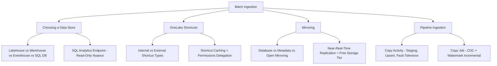

# 06. Batch Ingestion

> **Exam domain:** Domain 2 — Ingest and transform data (30–35%)
> **Source:** `certification/06-batch-ingestion/` — 5 files condensed
> **Why the exam cares:** This is where you decide *where data lands* and *how it gets there*. The exam consistently rewards recognising when **not** to copy data — shortcuts and mirroring exist specifically to avoid the pipelines this same section teaches you to build.

---

## Orientation — the 60-second version

Microsoft Fabric is a single SaaS analytics platform whose storage layer is **OneLake** — one shared data lake for the whole tenant, holding everything in an open table format (Delta/Parquet). Because every Fabric data store writes into that same lake, choosing between them is never about "where the data ends up." It is about **which engine, which language surface, and which consumer** the workload needs.

There are four stores. A **lakehouse** is the Spark workshop: notebooks read and write it, and it also exposes a read-only T-SQL query surface. A **warehouse** is the SQL-only store with full T-SQL DML. An **eventhouse** is the streaming/telemetry engine driven by KQL. A **Fabric SQL database** is a genuine OLTP engine that quietly mirrors itself into OneLake so analysts get the data with no pipeline.

Getting data *in* has three escalating answers. A **shortcut** is a symlink in OneLake — it points at data elsewhere (another Fabric item, S3, ADLS Gen2, on-prem) and makes it appear local without copying a byte. **Mirroring** continuously replicates an operational database into OneLake as Delta tables, zero ETL. Only when neither works — because the data genuinely needs to move, be format-converted, or be upserted/merged — do you build a **pipeline** with **Copy activity**, or its simplified standalone cousin, **Copy job**.

Read every Domain 2 scenario in that order: shortcut → mirror → pipeline. The exam's favourite trap is a candidate building a pipeline where a shortcut would do.

## New terms in this topic

| Term | What it actually is |
| :--- | :--- |
| **OneLake** | The single tenant-wide data lake under all of Fabric. Every store writes here in open table format, so nothing is carried between items. |
| **Delta (Delta Lake) table** | The open table format OneLake stores tables in — Parquet files plus a transaction log. Everything mirrored, shortcut-ed or copied into a Fabric table lands as Delta. |
| **Medallion architecture** | The bronze (raw) → silver (cleaned) → gold (curated) layering convention. Each store has a natural place in it. |
| **Lakehouse** | Fabric item holding files and Delta tables, driven by Spark. For big-data engineering on un/semi/structured data. |
| **SQL analytics endpoint** | T-SQL query surface auto-provisioned over a lakehouse, warehouse, eventhouse, mirrored database or SQL database. Same engine as Fabric Warehouse; **read-only** on everything except a warehouse. |
| **TDS endpoint** | The connection surface SQL client tooling and Power BI use to reach a lakehouse SQL analytics endpoint — reports are built over it, but it stays read-only. |
| **Warehouse** | Fabric's SQL-first relational store with full T-SQL DML and multi-table transactions, for OLAP/enterprise BI. |
| **Eventhouse** | Container for one or more **KQL databases**, built for time-based streaming data — "what is happening right now" over billions of rows. |
| **KQL (Kusto Query Language)** | The native read/write query language of an eventhouse. |
| **Eventstream** | Fabric's no-code streaming ingestion item. Named here as one of the things that lands data directly in an eventhouse (alongside Kafka, Logstash and SDKs). |
| **Fabric SQL database** | Fabric's OLTP engine (same SQL Database Engine as Azure SQL Database) that auto-mirrors into OneLake — an app backend whose data is analysable without ETL. |
| **OneLake availability** | Per-database or per-table eventhouse setting exposing KQL data into OneLake as Delta. Off = KQL-only. |
| **Shortcut** | Pointer object making data stored elsewhere appear as a local OneLake folder, no copy. Behaves like a symbolic link. |
| **Internal vs. external shortcut** | Internal points at another Fabric item; external points at cloud/on-prem storage outside OneLake. |
| **Shortcut caching** | Storing files read through an external shortcut locally in the workspace, to cut cross-cloud egress cost on repeat reads. |
| **On-premises data gateway (OPDG)** | Microsoft agent installed inside a private network so Fabric can reach network-restricted sources. |
| **Direct Lake** | Power BI semantic model mode reading OneLake Delta files directly — no import and no refresh cycle, so reporting is near-real-time. |
| **Delegated identity mode** | Semantic-model/T-SQL setting where the *calling item owner's* identity is used against the target, not the end user's. |
| **Mirroring** | Zero-ETL continuous replication of an operational database into OneLake Delta tables. |
| **Replicator engine** | The Fabric-side process that continuously scans the landing zone for newly published change files and merges them into the target Delta table. |
| **Landing zone** | A OneLake location (with its own URL) that a source system or application publishes change files into, for Fabric to pick up and merge. |
| **Open mirroring** | A public spec plus a landing-zone URL letting *any* application write its own change data into a Fabric mirrored database. |
| **Metadata mirroring** | Syncing only catalog structure (names, schemas, tables) and using shortcuts for the data — no movement at all. |
| **Unity Catalog** | Azure Databricks' governance catalog. The one metadata mirroring source that is GA — Fabric mirrors its structure, the data stays in Databricks storage. |
| **Capacity / CU (capacity unit)** | Purchased compute behind a workspace. F32 = 32 CUs, F64 = 64. Mirroring's free storage scales with CUs. |
| **Copy activity** | Pipeline activity moving data source → sink, with staging, partitioning, fault tolerance and upsert control. |
| **Copy job** | Standalone item (no pipeline canvas) for bulk, watermark-incremental and CDC-based copy, with built-in state tracking. |
| **CDC (change data capture)** | A source-side feature that records every insert, update **and delete**. When the source has it on and the connector supports it, Copy job can replicate deletes — which a date-based watermark cannot. |
| **Watermark (incremental) pattern** | Tracking a high-water mark column (`ROWVERSION`, datetime, date, integer) so each run copies only rows newer than the last successful run. Copy job stores that state for you; a Copy activity needs a hand-built control table. |
| **SCD Type 2** | Slowly Changing Dimension Type 2 — keep history by versioning rows with effective dates instead of overwriting. A Copy job update method (Preview). |
| **Dataflow Gen2** | Fabric's Power Query (M) based, low-code, transformation-first data prep item. |
| **V-Order** | Write-time Parquet layout optimisation making Fabric engines read faster. On by default for Copy activity Parquet writes. |
| **`COPY INTO`** | T-SQL bulk-load statement pulling files from external Azure storage straight into a **Warehouse** table. |

## How the pieces fit

- **OneLake is the floor.** Lakehouse, warehouse, eventhouse and Fabric SQL database are four rooms built on it for different kinds of work.
- **Store choice is a language-surface decision**, not a storage decision — read-only T-SQL vs. full T-SQL DML vs. Spark vs. KQL.
- **The store choice cascades**: pick the store and the transform tool and streaming engine are largely decided for you.
- **Shortcuts avoid a copy.** Use when data already lives somewhere queryable and needs no transformation.
- **Mirroring avoids a pipeline.** Use when a whole supported operational database must stay continuously in sync with OneLake.
- **Pipelines are the tool of last resort** — for real movement, format conversion, or write-behaviour control (insert/upsert/merge/SCD2).
- **Metadata mirroring is built on shortcuts**, so mirroring and shortcuts are not fully separate mechanisms.
- **Mirrored databases are shortcut-able**, so a gold lakehouse can point at a mirror without a copy step.
- **Copy job ⊃ Copy activity for incremental work** (CDC, SCD Type 2, auto-partitioning) but ⊂ Copy activity for orchestration (no control flow).
- **`COPY INTO` is the SQL-team shortcut past pipelines entirely** — Warehouse destination only.



---

## 1. Choosing a Data Store
*Source: `01-choosing-data-store.md`*

Every Fabric data store lands its data in OneLake in an open table format by default. The choice is about engine, language surface and consumer.

- **Lakehouse** — Spark-first big-data engineering; SQL analytics endpoint is **read-only** T-SQL
- **Warehouse** — SQL-first, full T-SQL DML (`INSERT`/`UPDATE`/`DELETE`/`MERGE`), enterprise BI and OLAP
- **Eventhouse** — streaming/telemetry engine, KQL-native, **sub-second to seconds ingestion latency**, T-SQL endpoint is read-only
- **Fabric SQL database** — the OLTP engine of Fabric; full transactional T-SQL, auto-mirrors into OneLake near real time for analytics without a pipeline

### The decision matrix

| Factor | Lakehouse | Warehouse | Eventhouse (KQL DB) | Fabric SQL Database |
| :--- | :--- | :--- | :--- | :--- |
| **Primary workload** | Big data engineering, un/semi/structured data, ML | Enterprise data warehousing, SQL-based BI, OLAP | Streaming/time-series events, telemetry, logs, free-text/semistructured search | Operational (OLTP) transactional applications |
| **Language surface** | Spark (PySpark, Scala, Spark SQL, R) for read/write; T-SQL via SQL analytics endpoint is **read-only** | **Full T-SQL DML** — `INSERT`, `UPDATE`, `DELETE`, `MERGE`, multi-table transactions | KQL native for read/write; T-SQL via SQL endpoint is **read-only** | **Full T-SQL DML**, same SQL Database Engine as Azure SQL Database |
| **Latency profile** | Batch/interactive, minutes-scale for typical Spark jobs | Interactive OLAP queries, batch loads | **Near real-time ingestion** — changes can appear in seconds | Low-latency OLTP transactions (milliseconds), typical of an app backend |
| **Streaming ingestion fit** | Via Spark Structured Streaming (`readStream`/`writeStream`) | Not built for streaming ingestion — batch-oriented `COPY INTO`/pipeline loads | **Purpose-built** — Eventstream, Kafka, SDKs land directly with update policies | Not a streaming ingestion target — OLTP writes are transactional, not stream-shaped |
| **Consumer types** | Data engineers, data scientists (notebooks); T-SQL consumers via read-only endpoint | Data warehouse developers, BI analysts, SQL Server-tooling users | App developers, data scientists, KQL analysts; Power BI DirectQuery over KQL | App developers, database developers/admins; SQL Server-tooling users |
| **Medallion role** | Classic bronze/silver/gold home — most engineering pipelines live here | Typically the curated gold layer, or an end-to-end SQL-only medallion for SQL-skilled teams | Specialised bronze/silver for high-volume streaming telemetry, often feeding a downstream gold via materialised views | Usually **outside** the medallion — an operational source feeding it, or a reverse-ETL sink receiving curated gold data back for apps |

> 🧠 **Mental model —** OneLake is one shared floor; each store is a room built for different work. Lakehouse = the workshop (Spark tools, raw materials). Warehouse = the boardroom (polished, SQL-only, clean answers fast). Eventhouse = the security control room (live feeds, react as it happens). Fabric SQL database = the front desk where the business transacts, with a camera (mirroring) streaming a copy to the shared floor. All four rooms open onto the same floor; nothing needs carrying between them.

> 🔑 **Exam fact —** Warehouse and Fabric SQL database **both** offer full T-SQL DML, so "the team writes `INSERT`/`UPDATE`/`MERGE`" does not separate them on its own. Read the *workload*: a T-SQL-skilled team building a **star-schema BI solution**, running DML against staging tables as part of the load, is describing a **warehouse** — that is what it is purpose-built for. Fabric SQL database is for **OLTP application** workloads, not star-schema BI staging. A lakehouse never qualifies for either: its endpoint is read-only, so a DML requirement would force the team out into Spark.

### The Domain 2 decision spine: store → transform → streaming

The store choice usually **determines** the transform tool and streaming engine, because each store exposes a different native language surface and a different (or absent) streaming role. Exam questions cross these three axes in one scenario.

| Data lands in… | Native transform surface | Streaming role | DML / endpoint |
| :--- | :--- | :--- | :--- |
| Lakehouse | PySpark / Spark SQL (notebook) | Spark Structured Streaming sink | SQL analytics endpoint **read-only** |
| Warehouse | T-SQL | not a streaming target | full T-SQL DML |
| Eventhouse | KQL (update policy / materialised view, native tables only) | Eventstream destination + KQL query engine | T-SQL endpoint **read-only** |
| Fabric SQL DB | T-SQL (OLTP) | not a stream target; auto-mirrors to OneLake | full DML on primary surface |

> 🧠 **Mental model —** Name the data store first and the transform tool and streaming engine are a consequence, not a second free choice. Lakehouse → PySpark. Warehouse → T-SQL. Eventhouse → KQL for both transformation and streaming.

### The SQL analytics endpoint read-only nuance

Every lakehouse, warehouse, eventhouse, mirrored database and SQL database auto-provisions a SQL analytics endpoint — but what it lets you *do* depends on the item.

| Item | SQL analytics endpoint behaviour |
| :--- | :--- |
| **Lakehouse** | **Read-only** — `SELECT` only. Runs on the same engine as Fabric Data Warehouse, but writes require switching to Spark |
| **Eventhouse / KQL database** | **Read-only** — exposed only when **OneLake availability** and schema sync are enabled on the database; native writes happen via KQL ingestion, not T-SQL |
| **Mirrored database** | **Read-only** — the endpoint reflects the continuously-replicated source; you don't write into a mirror through it |
| **Fabric SQL database** | The endpoint itself is still read-only, but the SQL database's own primary T-SQL surface (a different connection target) supports full DML |
| **Warehouse** | Full read/write T-SQL DML through its primary endpoint — the only item where "the SQL surface" and "the analytics endpoint" both support full DML |

Inside a lakehouse's read-only boundary you can still: run `SELECT` (including against shortcut tables), create **views, functions and stored procedures**, apply **row-level and object-level security**, and build Power BI reports over the **TDS endpoint**. To modify underlying data you switch to Spark — the endpoint is a query surface, not a write path.

> ⚠️ **Trap —** Assuming any item with a "SQL analytics endpoint" supports `INSERT`/`UPDATE`/`DELETE` because the label says SQL. The name refers to the *query engine* (same engine as Warehouse), not to write permissions. Only a genuine **Warehouse** item — or the primary T-SQL surface of a **Fabric SQL database** — accepts DML. "Run `UPDATE` against the SQL analytics endpoint of a lakehouse" is a trap: it cannot be done. Fix = switch to Spark, or choose a warehouse.

### Eventhouse: when "time-series + KQL" is the signal

An eventhouse is a container for one or more KQL databases, purpose-built for time-based streaming data — telemetry, logs, IoT signals, security/compliance events, financial tick data. It ingests from **Eventstream, Kafka, Logstash, SDKs and dataflows**, and is tuned to answer "what happened, and when" over **billions of rows in seconds**. Its data is exposed in OneLake in Delta format when **OneLake availability** is enabled at the database or table level, making it queryable from the read-only SQL analytics endpoint or from Spark.

> 🧠 **Mental model —** A warehouse answers "what does the business look like as of last night's load." An eventhouse answers "what is happening right now, and what happened in the last five minutes." Clock measured in **seconds** → eventhouse. Clock measured in **hours or a nightly batch** → warehouse or lakehouse.

Worked signals from the source: 50,000 sensor readings/second with sub-second query latency over a rolling 24 hours plus time-series anomaly functions → eventhouse. 1,000,000 sensor readings/minute (≈16,700 events/second) with a ~5-second dashboard freshness target and SQL-only analysts → still eventhouse, queried through its **read-only** T-SQL analytics endpoint.

### Worked scenario: lakehouse vs. warehouse

40 TB of semi-structured clickstream landing daily requiring custom Python transformation logic; a downstream BI team of 15 analysts who only write `SELECT` and don't know Spark; nobody needs `INSERT`/`UPDATE`/`DELETE` against the curated layer.

**Resolution: Lakehouse.** The ingestion/transformation workload is squarely Spark. The BI team is fully served by the read-only SQL analytics endpoint, so the warehouse's main advantage (full DML) is irrelevant. Choosing a warehouse would force Python-shaped logic into T-SQL.

### Worked scenario: Fabric SQL database sneaking into a DE scenario

An order-management system needs high-concurrency transactional writes with enforced foreign keys, automatic performance tuning without a DBA, and Power BI dashboards over the *same* data in near real time **without an ETL pipeline**.

**Resolution: Fabric SQL database.** It reads like an OLTP requirement — easy to mistake for out-of-scope — but "DE consumes the same data for BI without a pipeline" is exactly what its automatic near-real-time mirroring into OneLake solves. A lakehouse or warehouse would require building an ingestion pipeline from the app database.

> ⚠️ **Trap —** Dismissing Fabric SQL database as "not a real Fabric data store" because it is OLTP. The blueprint explicitly includes it in the data-store decision family; its distinguishing DP-700 trait is that it **auto-mirrors into OneLake**, making it a legitimate zero-ETL source for the medallion architecture even though engineers never query it directly for analytics.

### Distractor patterns to recognise

| Scenario phrase | Trap | Correct read |
| :--- | :--- | :--- |
| "Team needs to run full T-SQL DML against curated data" | Picking lakehouse because "it's in OneLake" | Warehouse (or Fabric SQL database's primary surface) — lakehouse's SQL endpoint is read-only |
| "Time-series telemetry, KQL, sub-second queries" | Picking warehouse because "T-SQL is more familiar" | Eventhouse — purpose-built for this workload and latency |
| "High-concurrency OLTP app with foreign keys, needs analytics without ETL" | Dismissing as out-of-scope, or picking warehouse | Fabric SQL database — OLTP engine that auto-mirrors to OneLake |
| "Data scientists doing ML with unstructured data and Python" | Picking warehouse because of "enterprise" framing | Lakehouse — Spark/Python-first, un/semi-structured data |
| "Everything ends up in OneLake anyway, so store choice doesn't matter" | Treating stores as interchangeable | They share storage *format*, not language surface, latency or write model — the decision still matters |

### Common issues and errors

| Issue | Cause | Resolution |
| :--- | :--- | :--- |
| `UPDATE`/`DELETE` fails against a lakehouse table via the SQL analytics endpoint | The endpoint is read-only by design | Perform the write in Spark, or move the workload to a warehouse if T-SQL DML is a hard requirement |
| External Delta tables written by Spark code don't appear in the SQL analytics endpoint | Tables created outside the lakehouse's `/Tables` folder aren't autodiscovered | Create a shortcut in the `Tables` section pointing at the external Delta location, or write tables directly under `/Tables` |
| A KQL database's data isn't queryable from T-SQL | OneLake availability / schema sync wasn't enabled on the database or table | Enable OneLake availability at the database or table level in eventhouse settings |
| Team picks warehouse for a Python-heavy ML workload and hits a wall | Warehouse has no Spark/Python execution surface | Re-evaluate — lakehouse is correct for Spark-based data engineering and ML |

**Distinctive use cases:** a BI team consuming a curated gold layer purely with `SELECT` and Power BI (lakehouse read-only endpoint is sufficient, avoids warehouse licensing/skillset overhead); a finance team needing multi-table `MERGE` across staging and target in a nightly load (warehouse); a SecOps team on log/telemetry with sub-second freshness (eventhouse); a **translytical** app needing OLTP writes *and* near-real-time analytics on the same data with no pipeline (Fabric SQL database).

---

## 2. OneLake Shortcuts
*Source: `02-onelake-shortcuts.md`*

A **shortcut** is an object in OneLake that points to data stored somewhere else — internal or external to OneLake — and makes it appear as a local folder without copying a single byte.

- Shortcuts behave like **symbolic links** — deleting a shortcut never deletes the target data; moving or deleting the target can break the shortcut
- Internal shortcuts authorise using the **calling user's identity**, not the shortcut creator's
- **Caching** applies only to GCS, S3, S3-compatible and on-premises gateway shortcuts — retention configurable **1–28 days**, files **over 1 GB are never cached**

### Where shortcuts live

Shortcuts appear as folders in OneLake, and any workload or service with OneLake access uses them transparently — **Spark, SQL, Real-Time Intelligence, Analysis Services, and non-Fabric services via the OneLake API**. You create shortcuts inside **lakehouses** and **KQL databases**, either interactively in the Fabric portal or programmatically via the **OneLake REST API**.

In a lakehouse, the **Tables** folder allows shortcuts **only at the top level** (no shortcuts nested inside subdirectories of Tables), and a shortcut pointing at Delta-formatted data there is automatically recognised and synchronised as a table. The **Files** folder has no such restriction — shortcuts can live at any depth pointing at data in any format, but **table discovery doesn't happen there**.

> ⚠️ **Trap —** Naming a shortcut (or its target folder) with a **space character** and expecting it to register as a Delta table. Delta doesn't support table names with spaces, so OneLake won't recognise the shortcut as a Delta table — even if the underlying files are valid Delta.

### Types of shortcuts

Internal shortcuts reference data already inside another Fabric item, same workspace or cross-workspace, and **the item types don't need to match** (a lakehouse shortcut can point at a warehouse's tables).

| Internal target |
| :--- |
| KQL databases |
| Lakehouses |
| Mirrored Azure Databricks catalogs |
| Mirrored databases |
| Semantic models |
| SQL databases |
| Warehouses |

| External target | Notes |
| :--- | :--- |
| **Amazon S3** | Standard AWS object storage |
| **Amazon S3-compatible** | Third-party object stores implementing the S3 API |
| **Azure Data Lake Storage (ADLS) Gen2** | Native Azure hierarchical namespace storage |
| **Azure Blob Storage** | Standard Azure blob containers |
| **Dataverse** | Microsoft's Power Platform data store |
| **Google Cloud Storage (GCS)** | GCP object storage |
| **Iceberg tables** | Apache Iceberg format exposed through OneLake |
| **OneDrive and SharePoint** | Microsoft 365 document sources |
| **On-premises / network-restricted sources** | Via the Fabric on-premises data gateway (OPDG) |

> 🧠 **Mental model —** A shortcut is OneLake's **symlink**: a pointer, not a copy. Deleting the shortcut deletes only the pointer. But delete a file or folder *reached through* the shortcut (with write permission at the target) and it is deleted at the source too — exactly like following a symlink into a real directory and running `rm`. The shortcut has no cascading-delete on its target; only operations that reach *through* it do.

### Permissions delegation model

When a user accesses data through an **internal** shortcut, OneLake authorises using **the calling user's own identity** against the shortcut's target — the user must have permission on the **target location**, not merely on the shortcut object.

> ⚠️ **Trap —** Assuming that once a shortcut exists, anyone who can see it can read the data behind it. Creating a shortcut grants no access to its target. A shortcut with no underlying access for the caller returns an **authorization error**, not silently-broken data.

**The one documented exception, know it cold:** when users access shortcuts through Power BI semantic models using **Direct Lake over SQL**, or T-SQL engines in **Delegated identity mode**, the *calling user's* identity is **not** passed through to the shortcut target — instead the *calling item's owner's* identity is delegated on the user's behalf. For true per-user identity pass-through, switch to **Direct Lake over OneLake** mode for semantic models, or **User identity mode** for T-SQL.

**External** shortcuts (ADLS, S3) delegate authorisation through **cloud connections**. Creating or selecting a connection is a **bind** operation — only users with permission on that connection can perform it. Someone without connection permission can't create a new external shortcut using it, even if they could otherwise browse to the target.

### Shortcut caching

Caching reduces **egress costs on cross-cloud reads** by storing accessed files locally to the Fabric workspace, so repeat reads are served from cache instead of round-tripping to the remote provider.

> 📌 **Remember —** Shortcut caching ≠ **query acceleration**, which is a separate Eventhouse feature for accelerating KQL over shortcuts.

| Detail | Value |
| :--- | :--- |
| **Supported sources** | Google Cloud Storage (GCS), Amazon S3, S3-compatible, on-premises data gateway shortcuts (including on-prem S3 via Microsoft Entra service principal auth) |
| **Not supported** | ADLS Gen2, Azure Blob Storage, Dataverse, internal OneLake shortcuts |
| **Retention period** | Configurable **1–28 days**; every access resets the retention clock |
| **File size limit** | Files **larger than 1 GB are never cached** |
| **Freshness check** | If the remote source has a newer version than the cache, OneLake serves from the remote and refreshes the cache |
| **Where to configure** | **Workspace Settings → OneLake tab** → toggle caching on, set retention period; **Reset cache** clears all cached files for the workspace |

> 🧠 **Mental model —** Caching is a **toll bridge with a memory**: the first crossing costs the full egress toll, but the bridge remembers the file for up to 28 days — every crossing in that window is free and resets the clock. Files over 1 GB, or sources the bridge doesn't recognise (ADLS Gen2, internal shortcuts), pay full price every time.

> ⚠️ **Trap —** Enabling caching for an **ADLS Gen2** shortcut and expecting lower latency/egress. ADLS Gen2 and Azure Blob Storage are **not** supported caching sources (likely because they already sit inside Azure, where the cross-cloud egress problem caching solves doesn't apply). The toggle does **not error** for an unsupported shortcut — it simply has no effect.

> 📌 **Remember —** Enable caching only on sources that support it, and **size the retention window to the read pattern — longer for stable reference data, shorter for frequently-changing sources**. A long window never serves stale data (a newer remote version is always served from the source and refreshes the cache); it only costs storage.

### Shortcuts vs. copying data: when to choose which

| Factor | Favors a shortcut | Favors copying (pipeline/mirroring) |
| :--- | :--- | :--- |
| **Source freshness needs** | Source already updates in place; shortcut always reflects the latest version | Need a stable, versioned snapshot decoupled from source changes |
| **Data ownership** | Data must stay governed and stored at its origin (cross-tenant sharing, compliance) | Data needs to be transformed, reshaped, or fully owned by the target workspace |
| **Storage cost** | Avoids duplicate storage entirely — one copy, referenced everywhere | Some duplication is acceptable or even desired for isolation |
| **Latency/format transformation** | Source format is already query-compatible (Delta, or a format the reading engine handles) | Source format needs conversion (e.g. CSV → Delta) before it's efficiently queryable |
| **Write isolation** | Read-only access is sufficient | Downstream writes must not be able to reach back and mutate the source |

> ⚠️ **Trap —** Reaching for a shortcut when the real requirement is **format conversion or transformation**. A shortcut exposes the source *as-is* — it doesn't convert CSV to Delta, deduplicate rows, or reshape a schema. If the scenario needs any of that, use a pipeline (Copy activity/Copy job) or a Spark notebook.

### Shortcut behaviour across engines

| Engine | Behaviour |
| :--- | :--- |
| **Apache Spark** | Reads shortcuts via relative file paths, or as a managed table with Spark SQL if the shortcut is in the Tables section and Delta-formatted |
| **SQL analytics endpoint** | Reads Tables-section shortcuts through standard T-SQL — subject to the same read-only constraint as any other lakehouse table |
| **KQL / Real-Time Intelligence** | A shortcut in a KQL database is treated as an **external table**; query it with the `external_table()` function |
| **Semantic models (Direct Lake)** | Semantic models built over a lakehouse's Tables-section shortcuts can run in Direct Lake mode, reading directly from the shortcut's underlying files — subject to the delegated-identity caveat above |
| **Non-Fabric services** | Any service that speaks a subset of the ADLS Gen2/Blob API can reach shortcuts through the OneLake API directly |

```python
spark.read.format("delta").load("Tables/MyShortcut")
```

```sql
-- Spark SQL
SELECT * FROM MyLakehouse.MyShortcut;

-- SQL analytics endpoint (read-only)
SELECT TOP (100) * FROM [MyLakehouse].[dbo].[MyShortcut];
```

```kusto
external_table('MyShortcut') | take 100
```

### Common issues and errors

| Issue | Cause | Resolution |
| :--- | :--- | :--- |
| Shortcut appears but querying it returns an authorization error | Caller lacks permission on the shortcut *target*, not just the shortcut object | Grant the calling user (or their group) access to the target location |
| Direct Lake semantic model doesn't reflect per-user row-level security on a shortcut's target | Model is in Direct Lake over SQL / Delegated identity mode, which passes the calling item owner's identity, not the caller's | Switch to Direct Lake over OneLake mode, or T-SQL User identity mode |
| Shortcut isn't recognised as a Delta table | Target folder or shortcut name contains a space character | Rename to remove spaces — Delta doesn't support space-containing table names |
| Caching toggle produces no visible latency or cost improvement | Shortcut source isn't a supported caching type (e.g. ADLS Gen2) | Confirm the source is GCS, S3, S3-compatible or on-prem gateway before expecting caching benefits |
| A file behind a shortcut was unexpectedly deleted at the source | User had write permission on the target and deleted a file/folder *through* the shortcut path, which propagates to the target | Restrict write permissions at the target if shortcuts should be read-only in practice |

**Distinctive use cases:** referencing a partner organisation's ADLS Gen2 data in a joint workspace without duplicating storage or losing source governance; making mirrored Azure Databricks Unity Catalog tables visible in a lakehouse via metadata mirroring's underlying shortcut mechanism; a gold-layer lakehouse shortcutting tables from several domain lakehouses instead of copying and re-syncing; sharing a KQL database's **specific tables, materialised views and functions** with another team via an eventhouse database shortcut without exposing the whole source database.

---

## 3. Mirroring
*Source: `03-mirroring.md`*

Mirroring is Fabric's zero-ETL answer to "I need this operational database continuously available for analytics in OneLake."

- **Database mirroring** replicates entire databases/tables continuously into OneLake as Delta tables
- **Metadata mirroring** (Azure Databricks Unity Catalog, Dremio-preview) syncs only catalog structure and relies on **shortcuts** to reference source data in place — no data movement at all
- **Open mirroring** lets any application or provider write change data into a landing zone via a public API / portal-issued URL, following the open mirroring spec
- Mirroring storage is free up to **1 TB of OneLake storage per purchased capacity unit (CU)**; background replication compute is always free and never consumes capacity

### Types of mirroring

| Mirroring type | What it does | Mechanism |
| :--- | :--- | :--- |
| **Database mirroring** | Replicates entire databases and tables from an external or Fabric-native source into OneLake Delta tables | A replicator engine continuously scans for and merges newly published change files from the source |
| **Metadata mirroring** | Synchronises only metadata (catalog names, schemas, tables) — the data itself stays at the source | Uses **OneLake shortcuts** under the hood to reference source data in place; supports cross-tenant sharing |
| **Open mirroring** | Lets any application write its own change data directly into a mirrored database item | Application/provider writes to a landing zone URL per the open mirroring spec; Fabric merges inserts/updates/deletes into Delta tables |

> 🧠 **Mental model —** **Database mirroring** = a security guard walking a live copy of every document out of the building the moment it's filed (a real physical duplicate, made instantly). **Metadata mirroring** = a museum's shared catalog card system — the card tells you where the artifact lives, but the artifact never leaves its home museum; you get a shortcut to go look at it there. **Open mirroring** = a mailbox with a spec sheet taped to it — any application from any vendor can drop change data in the right format and Fabric takes it from there.

### Current source list

*(This list moves quarterly — verify against Microsoft Learn close to exam day.)*

| Source | Mirroring type | Status |
| :--- | :--- | :--- |
| Azure SQL Database | Database mirroring | GA |
| Azure SQL Managed Instance | Database mirroring | GA |
| Azure Cosmos DB | Database mirroring | GA |
| Azure Database for PostgreSQL | Database mirroring | GA |
| Azure Database for MySQL | Database mirroring | **Preview** |
| SQL Server (2025+) | Database mirroring | GA |
| Snowflake | Database mirroring | GA |
| Oracle | Database mirroring | GA |
| SAP | Database mirroring | GA |
| Google BigQuery | Database mirroring | **Preview** |
| Fabric SQL database | Database mirroring | GA, **automatically configured** — no setup needed |
| Azure Databricks (Unity Catalog) | Metadata mirroring | GA |
| Dremio | Metadata mirroring | **Preview** |
| Open mirrored databases (any provider) | Open mirroring | GA |

> ⚠️ **Trap —** Memorising a mirroring source list once and assuming it's static. The list has changed multiple times across the DP-700 blueprint's lifetime (Oracle, SAP and Google BigQuery were added over time), so spot-check GA-vs-preview labels against the official mirroring overview near exam day.

> 🔑 **Exam fact —** Snowflake is a **database mirroring** source — *not* a shortcut target (shortcuts don't apply to Snowflake as a database engine the way they do to blob-style storage) and *not* a metadata mirroring source (metadata mirroring covers only Azure Databricks Unity Catalog and Dremio). "Snowflake + no ETL pipeline + changes visible within roughly 15 seconds to a few minutes" → database mirroring. A scheduled Copy job would only ever be as fresh as its schedule.

### How database mirroring works

Change data arrives incrementally from the source as Delta files. The change-detection mechanism varies by source — e.g. **SQL Server 2025** scans the source transaction log at high frequency and publishes per-table change files to a Fabric **landing zone**. Inside Fabric a **replicator engine** runs continuously, scanning for newly published files and merging changes into the target Delta table. Changes can be published as fast as **every 15 seconds**, with **backoff logic** that reduces overhead on the source during low-activity periods.

Near-real-time replication latency depends on:

- Source and destination region/location
- Volume and frequency of changes
- Network bandwidth and latency from the source
- Compute resources allocated to the on-premises data gateway (for gateway-routed sources)

### How metadata mirroring works

It synchronises only **catalog structure** — names, schemas, tables — and relies on OneLake shortcuts for the actual data. Because it's shortcut-based it also supports **cross-tenant data sharing**: organisations consume live, governed data from another tenant through shortcuts, no copying, no ETL. When a workspace mirrors an Azure Databricks Unity Catalog, only catalog structure is mirrored — the underlying data stays in Databricks-managed storage and is accessed through shortcuts, so source changes are reflected **instantly**, with no data movement.

### How open mirroring works

Creating an open mirrored database (via the public API or the Fabric portal) provisions a **landing zone URL** in OneLake. Any application — a custom script, a third-party provider's connector — writes change data into that landing zone following the open mirroring specification. Fabric's replication process merges the inserts, updates and deletes into Delta tables, reflecting changes as soon as they're written to the landing zone in the correct format.

> 🧠 **Mental model —** Known **relational/NoSQL platform** (Azure SQL, Snowflake, PostgreSQL, Oracle, SAP, Cosmos DB) → **database mirroring**. Mentions a **catalog** (Unity Catalog, Dremio) → **metadata mirroring**, mechanism is shortcuts, not replication. A **custom app or unsupported source wants to write change data itself** → **open mirroring**.

### Cost of mirroring

| Aspect | Detail |
| :--- | :--- |
| **Storage** | Free up to a capacity-based limit — **1 TB of OneLake storage per purchased capacity unit (CU)**. An F64 capacity gets 64 free TB exclusively for mirroring storage |
| **Beyond the free limit** | Standard OneLake storage rates apply, or when the capacity is paused |
| **Background replication compute** | Always free — doesn't consume capacity |
| **Query compute** | Requests directly to OneLake for mirrored data, and querying via SQL/Power BI/Spark, consume capacity at regular rates |
| **Capacity requirement** | A **running** Fabric capacity is required for mirroring to function at all — a paused or deleted capacity halts replication (though background compute itself doesn't draw from capacity units) |

Worked example: an **F32** capacity = 32 CUs → the first **32 TB** of mirrored OneLake storage is free; growth beyond that, or storage retained while the capacity is paused, is billed at standard OneLake rates. The free tier applies broadly to database mirroring and open mirroring, not exclusively to Fabric SQL database.

### Retention

Mirroring automatically runs a **vacuum** process to remove old Delta files no longer referenced by the transaction log. Retention is configurable:

- Mirrored databases created via the Fabric portal **after mid-June 2025** default to **1 day** of retention
- Older mirrors default to **7 days**
- Adjust in the mirrored database's **Settings → Delta table management** tab, or via the `retentionInDays` property on the public REST API
- Extending retention enables longer Delta **time-travel** windows at the cost of more storage

### Mirrored database → shortcut consumption patterns

Every mirrored database provisions a SQL analytics endpoint, and because its data lands as Delta tables in OneLake it is fully shortcut-able like any other internal Fabric item.

- A gold-layer lakehouse creates an **internal shortcut** into a mirrored database's tables, joining mirrored operational data with engineered fact/dimension tables without a copy step
- Cross-database T-SQL queries reference the mirrored database by its **three-part name** (`MirroredDB.dbo.TableName`) alongside warehouses and lakehouse SQL analytics endpoints in the same query
- Power BI semantic models connect via **Direct Lake** directly to a mirrored database's Delta tables for near-real-time reporting with no import/refresh cycle

```sql
-- Cross-database query joining a mirrored database with a warehouse
SELECT *
FROM ContosoWarehouse.dbo.ContosoSalesTable AS Contoso
INNER JOIN MirroredCrmDb.dbo.Affiliation AS Affiliation
    ON Affiliation.AffiliationId = Contoso.RecordTypeID;
```

> ⚠️ **Trap —** Assuming a mirrored database's SQL analytics endpoint supports DML because "the source database it mirrors supports writes." The mirror is a **read-only replica** in Fabric — writes go to the original source system and appear in the mirror on the next replication cycle. Same read-only nuance as lakehouses and eventhouses.

### Mirroring vs. shortcuts vs. pipeline copy

| Factor | Mirroring | Shortcuts | Copy activity (pipeline) | **Copy job (CDC, Preview)** |
| :--- | :--- | :--- | :--- | :--- |
| **Data movement** | Continuous replication — data *is* copied, automatically and near-real-time | None — a live pointer to data that stays at its source | One-time or scheduled batch movement, on-demand | Scheduled/triggered incremental copy of selected tables, CDC-based, including deletes |
| **Setup effort** | Low — configure a connection, choose tables, done | Low — point-and-click target selection | Higher — design source/sink, mapping, schedule, error handling | Low-to-medium — wizard-driven, no hand-built watermark logic |
| **Freshness** | Near-real-time (as fast as ~15 seconds for database mirroring) | Always current — it's the live source, not a copy | As fresh as the last scheduled/triggered run | As fresh as the last scheduled/triggered run, CDC-driven |
| **Best fit** | An entire operational database needs to be continuously available for analytics | Data is already in a queryable format and doesn't need continuous sync guarantees beyond live access | Data needs transformation, format conversion, or full pipeline orchestration | Selected tables need incremental sync (including deletes) to a chosen destination, without a whole-database OneLake replica |
| **Data ownership/duplication** | Creates a governed duplicate in OneLake (subject to free-tier storage) | No duplication at all | Creates a duplicate, fully owned and often reshaped by the target | Creates a duplicate at the chosen destination — not necessarily OneLake, and not a whole-database replica |

> 📌 **Remember —** Mirroring is a **whole-database**, zero-ETL, near-real-time replica into OneLake. Copy job's CDC mode copies **selected tables** — deletes included — to a chosen destination on a schedule or trigger; it is an ETL job, not a whole-database OneLake replica.

> 🧠 **Mental model — the decision funnel.** Ask in order: (1) Is this an entire supported operational database that needs continuous sync? → mirroring. (2) Is the data already sitting somewhere query-compatible with no transformation needed? → shortcut. (3) Does it need transformation, reshaping, or a source/target combination mirroring and shortcuts don't cover? → pipeline copy (Copy activity or Copy job).

### Common issues and errors

| Issue | Cause | Resolution |
| :--- | :--- | :--- |
| Mirrored data stops updating | Fabric capacity was paused or deleted | Resume or recreate the capacity — mirroring requires a running capacity |
| Unexpected OneLake storage charges for a mirrored database | Mirrored data exceeded the free 1 TB-per-CU allowance | Review capacity size vs. mirrored data volume; scale capacity or reduce retention |
| `UPDATE`/`INSERT` fails against a mirrored database's SQL analytics endpoint | Mirrors are read-only in Fabric | Write to the original source system; changes propagate on the next cycle |
| Databricks Unity Catalog mirror shows stale row counts | Confusing metadata mirroring with database mirroring — metadata mirroring doesn't move data, so "staleness" is really shortcut/source access latency, not replication lag | Check source access performance and shortcut resolution, not a replication delay that doesn't apply here |
| Team can't find a mirroring option for an unsupported source | Source isn't on the current database mirroring list | Use open mirroring if the source can write to a landing zone per spec, or fall back to Copy activity/Copy job |

**Distinctive use cases:** continuously replicating a production Azure SQL Database into OneLake so BI teams query it via Direct Lake without touching the operational system; making a Unity Catalog's tables visible in Fabric without copying petabytes of Databricks-managed data (metadata mirroring); a third-party SaaS vendor building an open mirroring integration so customers' workspaces stay in sync without the vendor learning Fabric pipelines; joining mirrored Snowflake data with native warehouse tables in one cross-database T-SQL query.

---

## 4. Pipeline Ingestion
*Source: `04-pipeline-ingestion.md`*

Pipeline ingestion is the **tool of last resort** in the batch-ingestion decision tree — reach for it only when a shortcut or mirroring genuinely can't do the job, because the data needs real movement, format conversion, or write-behaviour control (upsert, merge, SCD Type 2).

- **Copy activity** — pipeline-embedded, full-control data mover: per-connector source/sink settings, staging, partitioned parallel reads, fault-tolerant row skipping
- **Copy job** — simplified standalone item for bulk, incremental (watermark-based) and CDC-based copy; no hand-built control table
- Data Factory connects to **170+ data sources** overall, though coverage differs by tool: Copy activity and Copy job each cover **50+ sources / 40+ destinations**, Dataflow Gen2 covers **150+**
- **Binary copy** preserves files byte-for-byte with no format awareness; **tabular copy** converts between source and destination schemas through an interim data-type system

### Copy activity — source and sink configuration

Settings vary by connector but the shape is consistent. For a database source like Azure SQL Database:

| Source setting | Purpose |
| :--- | :--- |
| **Table / Query / Stored procedure** | Read a whole table, a custom SQL query, or a stored procedure result (last statement must be `SELECT`) |
| **Isolation level** | Transaction locking behaviour for the read: `None` (default), `ReadCommitted`, `ReadUncommitted`, `RepeatableRead`, `Serializable`, `Snapshot` |
| **Partition option** | `None`, `Physical partitions of table`, or `Dynamic range` |
| **Additional columns** | Inject extra columns (e.g. source file path, a static value) into the copied data |

| Destination (sink) setting | Purpose |
| :--- | :--- |
| **Write behavior** | `Insert`, `Upsert`, or `Stored procedure` |
| **Table option** | `None` or `Auto create table` — creates the destination table from the source schema |
| **Pre-copy script** | A script run before each write, commonly used to truncate/clean staged data |
| **Write batch size / timeout** | Rows per batch insert (auto-tuned by default) and how long a batch write can run before timing out — **default 30 minutes** |

> ⚠️ **Trap —** Assuming every connector exposes the same sink settings. Write behaviour, table auto-creation and partition options are **connector-specific** — a file-based sink (ADLS Gen2, S3) has **no `Write behavior` dropdown at all**, because insert-vs-upsert only makes sense against a row-addressable destination.

### Which sinks support upsert

Database-family sinks expose a **Write behavior** setting with an explicit `Upsert` option — e.g. Azure SQL Database:

- **Insert** — appends every row from the source
- **Upsert** — inserts new rows and updates matched rows, using an **interim table** (a global temp table by default, or a physical table in a specified schema) and configurable **Key columns** for matching. If key columns aren't specified, the **destination table's primary key** is used
- **Stored procedure** — hands each batch to a stored procedure that defines its own insert/update/merge logic

**Lakehouse and Warehouse table sinks, Dataverse**, and several other database-family connectors expose equivalent upsert-style write behaviour. **Pure file-based sinks (ADLS Gen2, S3, Blob Storage) do not** — there is no row-matching key to upsert against a folder of files.

### Staging

Staging copies data through an interim storage location before the final write, useful for source/sink combinations that benefit from (or require) a bulk-load-friendly intermediate format.

| Staging option | Detail |
| :--- | :--- |
| **Workspace (built-in)** | Uses Fabric's own staging storage; requires the pipeline's last-modified user to have at least **Contributor** role in the workspace; **times out after 60 minutes** — long-running jobs should use external staging |
| **External** | An Azure Blob Storage or ADLS Gen2 connection you provide, optionally scoped to a specific storage path; supports compression before staging |

> 🧠 **Mental model —** Staging is a **loading dock between the truck and the warehouse**: instead of the truck backing up to every shelf, everything is dropped at one dock first, then moved into place — faster and more reliable for bulk drops, unnecessary overhead for a quick single-item delivery.

### Partition options and parallel copies

| Partition option | Behaviour |
| :--- | :--- |
| **None** (default) | Single-threaded read — no partitioning |
| **Physical partitions of table** | Auto-detects the table's existing physical partitions and copies by partition — best performance when the table is already partitioned |
| **Dynamic range** | Splits an integer/date/datetime column into ranges for parallel reads; optionally set **Partition column**, **Partition upper bound** and **Partition lower bound**. Bounds set the partition **stride**, not row filtering — every row is still copied |

Actual concurrency is set separately by **Degree of copy parallelism** in the Settings tab. Enabling a partition option is what makes that parallelism apply to the source read; **without it the source is read single-threaded regardless of the parallelism setting**.

> ⚠️ **Trap —** Setting a high **Degree of copy parallelism** while leaving **Partition option** at `None`. Parallelism only helps once the source read is split into partitions — cranking up parallel copies on an unpartitioned read adds overhead without speeding up the read.

Best practice: choose a **distinctive partition column (primary key or unique key)** to avoid data skew across partitions.

### Fault tolerance

| Setting | Behaviour |
| :--- | :--- |
| **Fault tolerance / Skip incompatible rows** (`enableSkipIncompatibleRow`) | Ignores rows that fail to convert or map between source and destination types instead of failing the whole copy |
| **Skip error file** (`skipErrorFile`) | Skips specific file-level failures during the copy: `fileMissing`, `fileForbidden`, `invalidFileName` |
| **Enable logging** | Logs which files/rows were copied vs. skipped, for later review |
| **Data consistency verification** (`validateDataConsistency`) | For tabular data, checks source row count = destination rows written + incompatible rows skipped; for binary files, checks size / last-modified / checksum. Catches silent data loss, at some performance cost |

> 🧠 **Mental model —** Fault tolerance is a **shipping manifest with a "damaged goods" bin**: a handful of malformed items get pulled aside and logged instead of stopping the truck. It is not a substitute for fixing a systematically broken feed — if most rows land in the skipped bin, that's a data-quality problem.

> ⚠️ **Trap —** `Skip incompatible rows` **without** `Enable logging` and `Data consistency verification` is a "runs green, silently loses data" configuration. Example: 2,000,000 CSV rows into a Warehouse, 40 rows have an unparseable date → the 40 are silently skipped, 1,999,960 load, and there is **no record of which rows were skipped and no confirmation the final count is right**. Always pair the three settings when completeness matters.

### Copy job

Copy job is a simplified, standalone Fabric item for data movement — **no pipeline canvas required** — purpose-built for bulk, incremental and CDC-driven copy that would otherwise mean hand-building a watermark control table.

| What Copy job adds over Copy activity | Detail |
| :--- | :--- |
| **Incremental copy — watermark-based** | Native tracking on `ROWVERSION`, datetime, date, integer, or string-interpreted-as-datetime columns; Copy job manages the "last successful run" state automatically |
| **Incremental copy — CDC-based** | **Preview** — when CDC is enabled on the source and supported by the connector, replicates inserts, updates **and deletes** — which a modified-date watermark approach can't provide on its own |
| **Update methods** | `Append` (default, keeps full history), `Merge` (upsert on a key column, defaults to the primary key), `Overwrite` (replace), or `SCD Type 2` (**Preview** — versioned rows with effective dating; deletes become soft deletes under CDC replication) |
| **Automatic table creation + truncation** | Can create destination tables from source schema, and optionally truncate the destination before the first full load |
| **Audit columns** | Optionally appends lineage metadata to every row: extraction time, source path, workspace/job/run IDs, incremental window bounds |
| **Auto-partitioning** | **Preview** — automatically selects a partition column and parallel-read strategy for large tables on supported connectors, no manual tuning |
| **Run options** | Run once, schedule (**multiple independent schedules per job** supported), or event-triggered via a pipeline's copy job activity |
| **Failure recovery** | Always resumes from the end of the last successful run — a failed run doesn't corrupt or advance the tracked state |

> 🧠 **Mental model —** Copy activity is a **fully-equipped moving truck you drive yourself** — you choose the route, the loading order, what happens to a damaged box. Copy job is **hiring movers who already know how to pack a truck** — point them at source and destination, tell them what changed since last time, and they handle incremental tracking and update logic.

> ⚠️ **Trap —** Assuming Copy job is "Copy activity but easier" and therefore always the right default. Copy job has **no pipeline-level transformation or control-flow surface** — no conditional branching, no chaining with notebooks or stored procedures in the same item. When the scenario needs orchestration beyond "move this data, handle deletes, incremental please," that's a pipeline with Copy activity.

Copy job connects through the **on-premises data gateway**, so an on-prem SQL Server with CDC already enabled → Copy job with CDC-based incremental copy is the low-code answer (initial full load, then automatic incremental, no custom watermark code). Note CDC-based incremental copy in Copy job is currently **Preview** — confirm GA status before committing a production design.

### Connectors overview

| Tool | Approximate source coverage | Approximate destination coverage |
| :--- | :--- | :--- |
| **Pipeline Copy activity** | 50+ connectors | 40+ connectors |
| **Copy job** | 50+ connectors | 40+ connectors |
| **Dataflow Gen2** | 150+ connectors (Power Query-based) | Lakehouse, Azure SQL database, Azure Data Explorer, Azure Synapse Analytics |

Many long-tail connectors (**Excel workbook, SharePoint list, Google Analytics**, dozens of SaaS/Power Query connectors) are **Dataflow Gen2-only** — they never appear as Copy activity or Copy job source/sink options at all, because they're Power Query connectors, not pipeline connectors. Conversely, high-throughput database and storage connectors (Azure SQL Database, ADLS Gen2, Snowflake, Oracle, SAP) are supported across all three tools.

> ⚠️ **Trap —** Assuming any connector visible in the Fabric portal works with Copy activity because it works with Dataflow Gen2, or vice versa. A scenario naming a Dataflow Gen2-only connector ("pull data from an Excel workbook via a pipeline") describes something that **can't be built as stated** — the fix is switching to Dataflow Gen2, or converting the source to a pipeline-compatible format first.

### File formats and compression

Copy activity supports these formats for file-based sources/sinks (ADLS Gen2, S3, Blob Storage, Lakehouse Files and others): **Avro, Binary, DelimitedText (CSV/TSV-style), Excel, JSON, ORC, Parquet, XML**.

| Format | Supported compression codecs |
| :--- | :--- |
| **Parquet** | None, gzip, snappy, lzo, Brotli, Zstandard, lz4, lz4frame, bzip2, lz4hadoop — plus an optional **V-Order** write-time optimisation (**on by default**) that tunes the Parquet layout for faster Fabric reads |
| **DelimitedText (CSV)** | None, bzip2, gzip, deflate, ZipDeflate, TarGzip, tar — with a configurable **Optimal** vs. **Fastest** compression level tradeoff |

| Copy type | Behaviour |
| :--- | :--- |
| **Binary copy** | Copies files exactly as-is, byte-for-byte, with no schema awareness or type conversion — fastest when source and destination formats already match and no transformation is needed |
| **Tabular copy** | Converts between source and destination schemas via an interim type system (Boolean, Byte, Datetime, Decimal, GUID, Integer, String and others) — required whenever source and destination formats or column types differ |

> 🧠 **Mental model —** Binary copy is **photocopying a document** — exact, fast, no understanding of content needed. Tabular copy is **translating it into another language** — it must understand structure (columns, types) to produce a correct target, which is more work but is what makes CSV → Delta conversion possible at all.

### Pipeline vs. `COPY INTO` vs. Dataflow Gen2 ingestion

| Factor | Pipeline (Copy activity / Copy job) | T-SQL `COPY INTO` | Dataflow Gen2 |
| :--- | :--- | :--- | :--- |
| **Primary skillset** | ETL, SQL, JSON — low-code/no-code | T-SQL | Power Query (M), low-code |
| **Destination** | Lakehouse, Warehouse, and 40+ other connector destinations | **Warehouse only** — not lakehouse | Lakehouse, Azure SQL database, Azure Data Explorer, Azure Synapse Analytics |
| **Source scope** | Any supported connector, cloud or on-premises via gateway | An external Azure storage account (ADLS Gen2/Blob) holding Parquet, CSV or other supported file formats | 150+ Power Query connectors |
| **Transformation** | Lightweight only (type conversion, column mapping, merge/split files, flatten hierarchy) | None — pure high-throughput bulk load | Rich — **300+ Power Query transformation functions** |
| **Best fit** | Petabyte-scale binary or tabular copy into any Fabric store, historical or incremental, with orchestration | Fast, code-first bulk load straight into a Warehouse table from files already staged in Azure storage | Cleaning, reshaping and profiling data from many sources before landing it, especially for less Spark/code-comfortable teams |

`COPY INTO` (the T-SQL `COPY` statement) is the recommended way to bulk-load a Warehouse table directly from external Azure storage:

```sql
COPY INTO dbo.TaxiTrips
FROM 'https://azureopendatastorage.blob.core.windows.net/nyctlc/yellow'
WITH (
    FILE_TYPE = 'PARQUET'
)
```

`BULK INSERT` remains available in Warehouse as well, mainly for teams porting existing SQL Server / Azure SQL Database code — **`COPY INTO` is the recommended statement for new ingestion work**.

> 🧠 **Mental model — the decision funnel.** (1) Destination must be a Warehouse table, source already in Azure storage, team is SQL-first, no transformation needed? → `COPY INTO`. (2) Data needs real transformation — cleaning, reshaping, joins — by a Power Query-comfortable team? → Dataflow Gen2. (3) Otherwise → pipeline Copy activity (full control, any destination) or Copy job (simplified, incremental/CDC-native) — default to Copy job when the scenario says "incremental," "CDC," or "no pipeline required."

### Common issues and errors

| Issue | Cause | Resolution |
| :--- | :--- | :--- |
| Rows silently missing after a Copy activity run, with no error raised | `Skip incompatible rows` enabled without `Enable logging` or `Data consistency verification` | Turn on logging and consistency verification alongside fault tolerance so skipped rows are visible and counted |
| Increasing `Degree of copy parallelism` has no effect on throughput | `Partition option` is set to `None` — parallelism has nothing to parallelise | Enable `Physical partitions of table` or `Dynamic range` partitioning before increasing parallel copies |
| Duplicate rows appear in a database sink after retries | `Write behavior` was left at `Insert` for a scenario needing upsert semantics | Switch to `Upsert` with the correct key columns, or add a `Pre-copy script` to clean up before re-running |
| Workspace staging fails on a long-running Copy activity | Built-in workspace staging times out at **60 minutes** | Switch to external Azure Blob Storage / ADLS Gen2 staging |
| A needed connector doesn't appear as a Copy activity source/sink option | The connector is Dataflow Gen2 (Power Query)-only, not a pipeline connector | Use Dataflow Gen2 instead, or land the data in a pipeline-compatible intermediate format first |
| `COPY INTO` fails to load into a lakehouse table | `COPY INTO` targets **Warehouse tables only**, not lakehouses | Use a pipeline Copy activity, Copy job, or a Spark notebook to load a lakehouse |

**Distinctive use cases:** loading historical and incremental data from on-premises and multicloud sources into a bronze lakehouse with Copy activity when the team prefers low-code over Spark; replacing a hand-built watermark control table with Copy job's native CDC incremental copy when the source already has CDC enabled; bulk-loading staged Parquet/CSV into a Warehouse table via `COPY INTO` for a T-SQL-first team with no transformation need; upserting changed records into an Azure SQL Database or Lakehouse table sink with Copy activity's `Upsert` write behaviour keyed on a business identifier.

---

## Decision rules — pick the right thing

| Scenario / requirement | Choose | Why |
| :--- | :--- | :--- |
| Team must run `INSERT`/`UPDATE`/`DELETE`/`MERGE` T-SQL against the store | **Warehouse** | Only warehouse's endpoint supports full T-SQL DML for analytics workloads |
| Full T-SQL DML **and** a star-schema BI build with DML against staging tables | **Warehouse**, not Fabric SQL database | Both support full DML; warehouse is the one purpose-built for BI staging, Fabric SQL DB for OLTP apps |
| "Read-only T-SQL" appears in the scenario | **Lakehouse / eventhouse / mirrored DB SQL analytics endpoint** | All three expose read-only endpoints |
| Spark/Python-first engineering, un/semi-structured data, ML | **Lakehouse** | Spark is the native read/write surface |
| Whole team including the load process is SQL-only | **Warehouse** | Avoids forcing Spark on a T-SQL team |
| Freshness measured in **seconds**; telemetry, time-series, KQL, IoT, logs, security events | **Eventhouse** | Purpose-built streaming ingestion, sub-second to seconds latency |
| SQL-only analysts but a seconds-level streaming SLA | **Eventhouse queried via its read-only T-SQL analytics endpoint** | Endpoint gives T-SQL access without needing KQL fluency |
| OLTP characteristics (high concurrency, foreign keys, ACID) **and** zero-pipeline analytics on the same data | **Fabric SQL database** | Auto-mirrors into OneLake near real time |
| Data already lives somewhere queryable and needs no transformation | **Shortcut** | Zero copy, always reflects the live source |
| Cross-workspace or cross-cloud reference without duplicating storage / losing source governance | **Shortcut** | Data stays governed at origin |
| Need a stable, versioned snapshot decoupled from source changes | **Copy (pipeline/mirroring)** | A shortcut always shows the latest source state |
| Source format needs conversion (CSV → Delta), dedup, or reshaping | **Pipeline or Spark notebook, not a shortcut** | Shortcuts expose the source as-is |
| Downstream writes must not be able to mutate the source | **Copy** | Writes through a shortcut propagate to the target |
| Cross-cloud reads from S3 / GCS / on-prem repeated daily, egress cost is the concern | **Enable shortcut caching** | Only these sources are cached; 1–28 day retention |
| Sizing that cache retention window | **Longer for stable reference data, shorter for frequently-changing sources** | Every access resets the clock; a newer remote version is always served from source anyway |
| Repeated reads of an ADLS Gen2 shortcut, hoping for cache | **Nothing — caching won't apply** | ADLS Gen2 / Blob / Dataverse / internal shortcuts are unsupported for caching |
| Per-user identity pass-through required on a Direct Lake model over shortcuts | **Direct Lake over OneLake** (or T-SQL **User identity mode**) | Direct Lake over SQL / Delegated identity uses the item owner's identity |
| An entire supported operational database must be continuously available for analytics, no ETL | **Database mirroring** | Near-real-time, whole-database replication into OneLake |
| Source is a **catalog** — Azure Databricks Unity Catalog or Dremio | **Metadata mirroring** | Syncs catalog structure only, data stays at source via shortcuts |
| Cross-tenant consumption of live governed data with no copying | **Metadata mirroring** (shortcut-based) | Supports cross-tenant data sharing |
| Custom app or unsupported source wants to write its own change data | **Open mirroring** | Landing zone URL + public spec, any provider |
| Fabric SQL database needs its data in OneLake | **Nothing to configure** | Mirroring is GA and automatically configured |
| Selected tables need incremental sync **including deletes** to a chosen (non-OneLake) destination | **Copy job with CDC** (Preview) | Table-level ETL, not a whole-database OneLake replica |
| Low-code wizard, initial full load then automatic CDC incremental, on-prem source via gateway | **Copy job** | Native CDC incremental, no hand-built watermark, gateway-capable |
| Versioned dimension history with effective dating on the copy itself | **Copy job update method `SCD Type 2`** (Preview) | Built-in; deletes become soft deletes under CDC |
| Ingestion needs conditional branching, notebooks or stored procedures in the same flow | **Pipeline with Copy activity** | Copy job has no control-flow surface |
| Bulk-load Parquet/CSV already in Azure storage into a **Warehouse** table, T-SQL team, no transformation | **`COPY INTO`** | Fastest code-first bulk-load path; Warehouse-only |
| Same requirement but the destination is a **lakehouse** | **Copy activity / Copy job / Spark notebook** | `COPY INTO` cannot target a lakehouse |
| Rich cleaning/reshaping/profiling across many sources, Power Query-comfortable team | **Dataflow Gen2** | 300+ Power Query transforms, 150+ connectors |
| Source is Excel workbook, SharePoint list, Google Analytics or similar long-tail SaaS | **Dataflow Gen2 only** | These are Power Query connectors, not pipeline connectors |
| Copy activity expected to run longer than 60 minutes with staging | **External Blob/ADLS Gen2 staging** | Built-in workspace staging times out at 60 minutes |
| Retries producing duplicate rows in a database sink | **Write behavior = `Upsert` with key columns** (or a pre-copy script) | `Insert` appends unconditionally |
| Source table is already physically partitioned and the copy is slow | **Partition option = Physical partitions of table**, then raise Degree of copy parallelism | Parallelism is a no-op without partitioning |

## Numbers, limits and defaults to memorise

| Thing | Value | Note |
| :--- | :--- | :--- |
| Exam weight of this domain | Domain 2 — Ingest and transform data, **30–35%** | Batch ingestion is one of its four topics |
| Eventhouse ingestion latency | Sub-second to seconds | "Near real-time"; changes can appear in seconds |
| Eventhouse query scale | **Billions of rows in seconds** | Tuned for "what happened, and when" |
| Fabric SQL database transaction latency | Milliseconds | OLTP app-backend profile |
| Lakehouse Spark job latency | Minutes-scale | Batch/interactive |
| Shortcuts allowed in a lakehouse `Tables` folder | **Top level only** | No nesting inside Tables subdirectories |
| Shortcuts in a lakehouse `Files` folder | Any depth, any format | No table discovery there |
| Shortcut cache retention | Configurable **1–28 days** | Every access resets the retention clock |
| Shortcut cache file size ceiling | Files **larger than 1 GB are never cached** | No partial caching |
| Shortcut caching supported sources | GCS, S3, S3-compatible, on-prem gateway (incl. on-prem S3 via Entra service principal) | ADLS Gen2, Blob, Dataverse, internal shortcuts unsupported |
| Database mirroring publish cadence | As fast as **every 15 seconds** | With backoff logic during low-activity periods |
| Minimum SQL Server version for mirroring | **SQL Server 2025+** | Scans the source transaction log and publishes per-table change files to the landing zone |
| Mirroring free storage | **1 TB of OneLake storage per purchased CU** | F32 → 32 free TB; F64 → 64 free TB |
| Mirroring background replication compute | Always free | Never consumes capacity |
| Mirroring query compute | Billed at regular capacity rates | OneLake requests, SQL/Power BI/Spark queries |
| Mirror Delta retention default — portal, after mid-June 2025 | **1 day** | Set in Settings → Delta table management, or `retentionInDays` REST property |
| Mirror Delta retention default — older mirrors | **7 days** | Same configuration surface |
| Data Factory total connector count | **170+ data sources** | Coverage differs by tool |
| Copy activity connectors | **50+ sources / 40+ destinations** | Same as Copy job |
| Copy job connectors | **50+ sources / 40+ destinations** | — |
| Dataflow Gen2 connectors | **150+** sources | Destinations: Lakehouse, Azure SQL database, Azure Data Explorer, Azure Synapse Analytics |
| Dataflow Gen2 transformation functions | **300+** Power Query functions | — |
| Copy activity sink write batch timeout | **Default 30 minutes** | Per batch write |
| Workspace (built-in) staging timeout | **60 minutes** | Use external staging beyond this |
| Workspace staging role requirement | Pipeline's last-modified user needs at least **Contributor** | — |
| Copy activity default partition option | `None` (single-threaded read) | Parallelism is a no-op without changing this |
| Copy activity default isolation level | `None` | Others: ReadCommitted, ReadUncommitted, RepeatableRead, Serializable, Snapshot |
| Copy job default update method | `Append` | Others: Merge, Overwrite, SCD Type 2 |
| Copy job Merge default key | The destination table's **primary key** | Overridable with a key column |
| Copy activity Upsert default key | The destination table's **primary key** when key columns aren't specified | Uses an interim table (global temp by default) |
| V-Order on Parquet writes | **On by default** | Write-time layout optimisation for faster Fabric reads |
| Copy activity file formats | **8** — Avro, Binary, DelimitedText, Excel, JSON, ORC, Parquet, XML | For file-based sources/sinks (ADLS Gen2, S3, Blob, Lakehouse Files) |
| Worked example — 50,000 readings/sec, sub-second SLA, 24h window | Eventhouse | Lakehouse Spark latency doesn't fit |
| Worked example — 1,000,000 readings/min (~16,700/sec), ~5s freshness | Eventhouse via read-only T-SQL endpoint | SQL-only analysts still fine |
| Worked example — 40 TB semi-structured clickstream/day, 15 SELECT-only analysts | Lakehouse | Read-only endpoint suffices |
| Worked example — F32 capacity, 50 TB mirrored | First **32 TB** free, remainder billed | 1 TB per CU |
| Worked example — 2,000,000 rows, 40 unparseable | 40 skipped silently with fault tolerance alone | 1,999,960 load; no record without logging |
| Worked example — 200 GB Parquet already in ADLS Gen2 → Warehouse, T-SQL-only team, no transformation | `COPY INTO` from a nightly stored procedure | Beats Dataflow Gen2 (wrong skillset, zero transformation needed) and Copy job (no incremental/CDC requirement stated) |

## Traps and common mistakes

**§1 Choosing a data store**

- A "SQL analytics endpoint" is a *query engine*, not a write path — `INSERT`/`UPDATE`/`DELETE` fail on lakehouse, eventhouse and mirrored-DB endpoints. Only a Warehouse item, or a Fabric SQL database's primary T-SQL surface, accepts DML.
- Delta tables written by Spark **outside** the lakehouse's `/Tables` folder are not autodiscovered by the SQL analytics endpoint.
- A KQL database's data is invisible to T-SQL until **OneLake availability / schema sync** is enabled at database or table level.
- Dismissing Fabric SQL database as "not a real Fabric store" because it's OLTP — its DP-700 trait is automatic OneLake mirroring.
- Picking a warehouse for a Python/ML workload — warehouse has no Spark or Python execution surface.
- Using "full T-SQL DML" alone to separate **warehouse** from **Fabric SQL database** — both have it. Star-schema BI staging → warehouse; OLTP application backend → Fabric SQL database.
- Using "it's all in OneLake anyway" as a tiebreaker — stores share format, not language surface, latency or write model.

**§2 OneLake shortcuts**

- A **space** in the shortcut or target folder name means it will never register as a Delta table.
- Creating a shortcut grants nobody access — the caller needs permission on the **target**, or they get an authorization error.
- **Direct Lake over SQL / Delegated identity mode** silently uses the calling item owner's identity, so per-user RLS on the target doesn't apply. Fix with Direct Lake over OneLake or T-SQL User identity mode.
- Enabling caching for ADLS Gen2, Blob, Dataverse or internal shortcuts: no error, no effect.
- Deleting a file *through* a shortcut, with write permission at the target, deletes it **at the source**.
- Using a shortcut when the requirement is format conversion, dedup or reshaping — shortcuts expose data as-is.
- Nesting a shortcut inside a subdirectory of the lakehouse `Tables` folder — only top level is allowed.

**§3 Mirroring**

- Treating the mirroring source list as static — sources and GA/Preview labels change quarterly.
- Expecting DML on a mirrored database's SQL analytics endpoint — mirrors are **read-only**; write to the source.
- A **paused or deleted capacity halts replication** entirely; mirrored data stops updating.
- Assuming mirroring storage is unconditionally free — beyond 1 TB per CU (or while paused), standard OneLake rates apply.
- Diagnosing "stale row counts" on a Unity Catalog mirror as replication lag — metadata mirroring moves no data, so it's shortcut/source access latency.
- Assuming Copy job CDC and mirroring are interchangeable — mirroring is whole-database into OneLake; Copy job CDC is selected tables to a chosen destination.
- Reaching for a **shortcut** to a database engine like Snowflake — Snowflake is a database mirroring source, not a shortcut target; shortcuts target blob-style storage and Fabric items.

**§4 Pipeline ingestion**

- Expecting the same sink settings on every connector — file-based sinks have no `Write behavior` dropdown at all.
- High **Degree of copy parallelism** with **Partition option = None** — parallelism with nothing to parallelise, pure overhead.
- `Skip incompatible rows` without `Enable logging` and `Data consistency verification` — runs green, silently loses data.
- Leaving `Write behavior` at `Insert` for a retryable load — duplicates on retry.
- Workspace built-in staging on a job that runs past **60 minutes** — it times out; use external staging.
- Assuming a Dataflow Gen2 connector (Excel workbook, SharePoint list, Google Analytics) is available to Copy activity — it is not.
- Treating Copy job as a universal upgrade — it has no conditional branching, no chaining with notebooks or stored procedures.
- Pointing `COPY INTO` at a lakehouse table — it targets Warehouse tables only.

## Exam tips

- "Read-only T-SQL" = lakehouse, eventhouse, or mirrored database SQL analytics endpoint. "Full T-SQL DML" = warehouse, or a Fabric SQL database's primary surface.
- Eventhouse is the answer whenever the scenario mentions KQL, telemetry, time-series, or sub-second/near-real-time streaming query latency.
- Fabric SQL database is the answer whenever a scenario needs OLTP characteristics (foreign keys, high concurrency, ACID transactions) **and** zero-pipeline analytics on the same data.
- All four stores land data in OneLake in open table format — that fact never disqualifies a choice, so don't use "it's all in OneLake anyway" as a deciding factor.
- Match the store to the **language surface and DML requirement first**, then confirm workload/latency fit — that ordering catches the most common traps.
- Internal shortcut targets: KQL database, lakehouse, mirrored Azure Databricks catalog, mirrored database, semantic model, SQL database, warehouse.
- External shortcut targets: ADLS Gen2, Blob Storage, S3, S3-compatible, GCS, Dataverse, Iceberg, OneDrive/SharePoint, on-premises via gateway.
- Caching supports GCS, S3, S3-compatible and on-prem gateway only — retention 1–28 days, files over 1 GB never cached.
- Internal shortcut authorisation uses the calling user's identity against the target, **except** Direct Lake over SQL / Delegated identity mode, which delegates the calling item owner's identity.
- Audit **target** permissions, not just who can see the shortcut.
- Three mirroring flavors: database mirroring (full replication), metadata mirroring (shortcuts; Unity Catalog / Dremio only), open mirroring (any app writes to a landing zone).
- Free mirroring storage = 1 TB of OneLake storage per purchased CU; replication compute always free, query compute billed normally.
- Database mirroring publishes as fast as every 15 seconds — "near-real-time," not instantaneous.
- Mirrors are read-only in Fabric — writes always go to the original source system.
- Verify the mirroring source list close to exam day; Oracle, SAP, BigQuery and MySQL are recent additions and preview labels change.
- Upsert write behavior is a **sink-side** setting on database-family connectors (Azure SQL DB, Warehouse, Lakehouse tables, Dataverse) — file-based sinks don't have it.
- Partition option and Degree of copy parallelism are two separate settings that work together — one without the other under-delivers.
- Copy job's headline additions over Copy activity: native CDC-based incremental copy (including deletes), SCD Type 2 (Preview), auto-partitioning (Preview), no pipeline canvas required.
- `COPY INTO` is Warehouse-only, source must be external Azure storage, zero transformation — "T-SQL-skilled team + Warehouse destination" is the signal. `BULK INSERT` still exists mainly for ported SQL Server code.
- Binary copy = byte-for-byte, no type awareness. Tabular copy = schema-aware conversion via an interim type system.
- Use external staging for anything expected to run over 60 minutes; enable a partition option before raising parallelism; pair fault tolerance with logging and consistency verification.

## Key takeaways

- The data store decision hinges on **language surface (read-only vs. full DML), workload type, latency profile and primary consumer** — not on "where the data lands," because all four land in OneLake.
- Lakehouse and eventhouse both expose a **read-only** SQL analytics endpoint; only warehouse and a Fabric SQL database's primary surface support full T-SQL DML.
- Eventhouse is purpose-built for streaming, time-series, KQL-native workloads with near-real-time query latency; its data reaches OneLake only when **OneLake availability** is enabled.
- Fabric SQL database is Fabric's OLTP engine, distinguished for DP-700 by its automatic, pipeline-free near-real-time mirroring into OneLake.
- Naming the store largely fixes the transform tool and the streaming engine — lakehouse→PySpark, warehouse→T-SQL, eventhouse→KQL, Fabric SQL DB→T-SQL OLTP with auto-mirroring.
- Shortcuts are symbolic-link-like pointers: they eliminate copies but require the **caller** to hold real permission on the **target**.
- Only GCS, S3, S3-compatible and on-prem gateway shortcuts support caching — 1–28 day retention, 1 GB per-file ceiling, configured in Workspace Settings → OneLake.
- Shortcuts don't transform data — reach for a pipeline or mirroring when format conversion or a decoupled snapshot is required.
- Database mirroring replicates entire databases into OneLake Delta tables from a growing GA/preview source list, publishing as fast as every 15 seconds.
- Metadata mirroring (Unity Catalog, Dremio) syncs only catalog structure via shortcuts — no data movement, and it enables cross-tenant sharing.
- Open mirroring lets any application write change data to a landing zone per a public specification.
- Mirroring storage is free to 1 TB per purchased CU; background compute is always free; a running capacity is mandatory.
- Copy activity gives full pipeline control over source/sink settings, staging, partitioned parallel reads and fault-tolerant row/file skipping.
- Copy job trades flexibility for a pipeline-free experience built for incremental and CDC-based copy, replacing hand-built watermark logic — but has no control flow.
- Connector coverage differs by tool — 170+ overall, Copy activity/Copy job 50+/40+, Dataflow Gen2 150+, and they don't fully overlap.
- `COPY INTO` is the fast, code-first bulk-load path into a **Warehouse** table from external Azure storage; Dataflow Gen2 is the transformation-rich Power Query option; pipelines cover everything else.

---

## Scenario Questions

> Attempt all of them before opening any toggle. Answers are hidden until you click.

### Q1. Northwind Freight's dispatch rewrite

Northwind Freight is rebuilding its dispatch application. The new backend needs high-concurrency transactional writes with strictly enforced foreign-key constraints and automatic index tuning, because there is no dedicated DBA. Separately, the analytics team must build Power BI dashboards over the *same* dispatch data with a freshness target of a few minutes, and the programme sponsor has explicitly forbidden building and maintaining any ingestion pipeline for it.

**Which Fabric data store should the dispatch application use?**

- **A.** Lakehouse, and have the analytics team read the Delta tables directly from OneLake
- **B.** Warehouse, because its full T-SQL DML supports the transactional writes the application needs
- **C.** Eventhouse, because dispatch events arrive continuously and need near-real-time analytics
- **D.** Fabric SQL database, because it is an OLTP engine that automatically mirrors into OneLake

<details>
<summary>👉 Show answer</summary>

**Answer: D**

**Why it is right:** High concurrency, enforced foreign keys, ACID transactions and automatic tuning describe an OLTP engine — Fabric SQL database, same SQL Database Engine as Azure SQL Database. Its distinguishing DP-700 trait: database mirroring is GA and **automatically configured** for it, so data appears in OneLake near real time with no pipeline — exactly the stated constraint.

**Why the others are wrong:**
- **A** — Lakehouse is Spark-first, minutes-scale, with no OLTP write model; the app couldn't run on it and the data would still need loading.
- **B** — Warehouse has full T-SQL DML but is an OLAP store, not a high-concurrency app backend, and would still need an ingestion pipeline.
- **C** — Eventhouse ingests time-series telemetry via Eventstream/Kafka/SDKs; OLTP writes are transactional, not stream-shaped, so it is not a streaming ingestion target here.

**Covered in:** §1 Choosing a Data Store

</details>

### Q2. Meridian Analytics' partner data

Meridian Analytics has agreed a data-sharing arrangement with a logistics partner. The partner's daily shipment extracts are already stored as Delta tables in a third-party S3-compatible object store, and the contract requires the data to remain physically stored and governed at the partner's origin. Meridian's engineers want the tables to appear inside their Fabric lakehouse's `Tables` section so Spark notebooks and the SQL analytics endpoint can query them. No reshaping or format conversion is needed.

**What should Meridian build?**

- **A.** An external OneLake shortcut in the lakehouse `Tables` folder, targeting the S3-compatible source
- **B.** An internal OneLake shortcut, since OneLake resolves all storage backends transparently
- **C.** Database mirroring, configured against the partner's object store
- **D.** A Copy job in Append mode on a daily schedule

<details>
<summary>👉 Show answer</summary>

**Answer: A**

**Why it is right:** "Reference in place, no copy, data stays governed at origin" is the textbook shortcut requirement, and **Amazon S3-compatible** storage is an *external* shortcut target. Because the data is Delta and the shortcut sits at the **top level** of the lakehouse `Tables` folder, it is automatically recognised and synchronised as a table, readable by Spark and by the read-only SQL analytics endpoint.

**Why the others are wrong:**
- **B** — Internal shortcuts target **Fabric items** only: KQL databases, lakehouses, mirrored Azure Databricks catalogs, mirrored databases, semantic models, SQL databases, warehouses. A third-party object store is none of these.
- **C** — Mirroring sources are databases or catalogs, not object stores, and it creates a governed duplicate in OneLake — which the contract forbids.
- **D** — A Copy job physically moves the data, precisely what the scenario rules out.

**Covered in:** §2 OneLake Shortcuts

</details>

### Q3. Halden Retail's shortcut cost review (Choose 2)

Halden Retail runs a Fabric workspace with three external shortcuts: one to an Amazon S3 bucket, one to an ADLS Gen2 container, and one to an on-premises file share reached through the on-premises data gateway. Spark jobs re-read the same reference files every morning. Finance has flagged cross-cloud egress charges, so an engineer switches on shortcut caching in Workspace Settings → OneLake and sets retention to 28 days. Several files in the S3 bucket are 3 GB each.

**Which two statements about the outcome are correct? (Choose 2)**

- **A.** Caching will apply to all three shortcuts because it is a workspace-level setting
- **B.** The ADLS Gen2 shortcut will not be cached, and no error is raised — the toggle simply has no effect on it
- **C.** Retention of 28 days is invalid; the maximum configurable retention is 7 days
- **D.** The 3 GB S3 files will be cached but only for the first 1 GB of each file
- **E.** The 3 GB S3 files will never be cached, because files larger than 1 GB are excluded from caching

<details>
<summary>👉 Show answer</summary>

**Answer: B and E**

**Why they are right:** Caching supports only **GCS, Amazon S3, S3-compatible and on-premises gateway** shortcuts. ADLS Gen2 (plus Blob, Dataverse, internal shortcuts) is unsupported, and the toggle does not error — it simply has no effect (B). Files **larger than 1 GB are never cached**, so 3 GB objects are excluded outright (E).

**Why the others are wrong:**
- **A** — The setting is workspace-level but takes effect only on supported source types; the ADLS Gen2 shortcut is unaffected.
- **C** — Retention is configurable **1–28 days**, so 28 is the legal maximum. Every access resets the clock.
- **D** — There is no partial caching — 1 GB is a hard per-file exclusion threshold, not a truncation point.

**Covered in:** §2 OneLake Shortcuts

</details>

### Q4. Alder Bank's Databricks catalog

Alder Bank keeps 3 PB of curated tables in Azure Databricks, governed by Unity Catalog. The Fabric team must make those tables visible and queryable inside Fabric so a gold-layer lakehouse can join them with Fabric-native dimensions. Storage costs are under review, so duplicating the 3 PB into OneLake is not acceptable, and the bank wants source changes reflected without waiting on a replication cycle.

**Which Fabric capability meets the requirement?**

- **A.** Database mirroring against the Databricks workspace, with Delta retention set to 1 day to limit storage
- **B.** Open mirroring, with Databricks writing change files to a Fabric landing zone
- **C.** Metadata mirroring of the Unity Catalog, which syncs catalog structure and uses shortcuts for the data
- **D.** A Copy job with SCD Type 2 update method, scheduled every 15 minutes

<details>
<summary>👉 Show answer</summary>

**Answer: C**

**Why it is right:** Azure Databricks Unity Catalog is a **metadata mirroring** source (GA). Metadata mirroring syncs only catalog structure — names, schemas, tables — and uses **OneLake shortcuts** for the data. Nothing is copied, so the 3 PB stays in Databricks-managed storage, and source changes are reflected instantly because there is no replication cycle. It also enables cross-tenant sharing.

**Why the others are wrong:**
- **A** — Database mirroring replicates into OneLake Delta tables, creating exactly the 3 PB duplicate the bank rejected; Unity Catalog is not a database mirroring source anyway.
- **B** — Open mirroring is for apps/providers writing change data to a landing zone when the source isn't otherwise supported; it still produces a replicated OneLake copy, and Unity Catalog already has a first-class metadata mirroring path.
- **D** — Copy job with SCD Type 2 physically copies selected tables to a destination, duplicating storage, and is only as fresh as its schedule.

**Covered in:** §3 Mirroring

</details>

### Q5. Vantage Group's mirroring bill

Vantage Group runs an **F64** Fabric capacity. They have enabled database mirroring for an Azure SQL Database and an Azure Cosmos DB account; mirrored data in OneLake currently totals 41 TB and is forecast to reach 80 TB within eighteen months. The finance team has also asked whether pausing the capacity overnight would reduce costs.

**Which statement is accurate?**

- **A.** All mirrored storage is free regardless of volume, because mirroring compute and storage are both free
- **B.** The first 64 TB is free; beyond that, and for storage retained while the capacity is paused, standard OneLake storage rates apply — and pausing the capacity also halts replication
- **C.** The free allowance is a flat 1 TB per mirrored database, so Vantage is already 39 TB over
- **D.** Free storage applies only to Fabric SQL database mirrors, so none of Vantage's mirrored data qualifies

<details>
<summary>👉 Show answer</summary>

**Answer: B**

**Why it is right:** Mirroring storage is free up to **1 TB of OneLake storage per purchased CU**, so F64 carries 64 free TB. At 41 TB Vantage is inside the allowance; at 80 TB the excess 16 TB bills at standard OneLake rates. Standard rates also apply to storage retained **while the capacity is paused** — and a running capacity is required for mirroring at all, so pausing halts replication.

**Why the others are wrong:**
- **A** — Only **background replication compute** is always free. Storage is free only to the CU-based allowance, and query compute bills at regular capacity rates.
- **C** — The allowance scales with **capacity units**, not with the number of mirrored databases.
- **D** — The free tier applies broadly to database mirroring and open mirroring, not only to Fabric SQL database mirrors.

**Covered in:** §3 Mirroring

</details>

### Q6. Riverbend Logistics tunes a slow copy

Riverbend Logistics runs a nightly Copy activity that pulls a 900-million-row, physically partitioned Azure SQL Database table into a Fabric Warehouse. The run takes 4 hours. An engineer has been told to raise throughput and to make skipped rows visible, and has been given four candidate actions. Workspace built-in staging is currently enabled.

**Which sequence correctly orders the changes so each one actually takes effect?**

- **A.** Raise Degree of copy parallelism → set Partition option to Physical partitions of table → switch to external staging → enable logging
- **B.** Enable Data consistency verification → raise Degree of copy parallelism → set Partition option to Dynamic range → keep workspace staging
- **C.** Set Partition option to Physical partitions of table → raise Degree of copy parallelism → switch staging from workspace to external → enable logging alongside Skip incompatible rows
- **D.** Switch to external staging → enable Skip incompatible rows → raise Degree of copy parallelism → leave Partition option at None

<details>
<summary>👉 Show answer</summary>

**Answer: C**

**Why it is right:** Partitioning comes first — Degree of copy parallelism applies only once the source read is split, so raising it against `Partition option = None` is pure overhead. The table is already physically partitioned, making `Physical partitions of table` the best-performing choice. Built-in workspace staging **times out after 60 minutes**, which a 4-hour run exceeds, so external Blob/ADLS Gen2 staging is required. And `Skip incompatible rows` must be paired with `Enable logging` for skipped rows to be visible at all.

**Why the others are wrong:**
- **A** — Raising parallelism before enabling a partition option inverts the dependency; the first change does nothing until the second lands.
- **B** — Never fixes the 60-minute workspace staging timeout on a 4-hour job, and `Dynamic range` is weaker when physical partitions already exist.
- **D** — Leaving Partition option at `None` makes the parallelism increase a no-op, and Skip incompatible rows without logging reproduces the silent-data-loss trap.

**Covered in:** §4 Pipeline Ingestion

</details>

### Q7. Calder Foods' ingestion designs

Calder Foods' architecture board has drafted four ingestion designs for review before build starts. Each one is described in a single line, and the board wants to know which is impossible as specified rather than merely suboptimal.

**Which design will FAIL because Fabric does not support it as stated?**

- **A.** Bulk-load Parquet files from an ADLS Gen2 account into a Fabric **lakehouse** table using the T-SQL `COPY INTO` statement
- **B.** Use Copy activity's `Upsert` write behavior into an Azure SQL Database sink, matching on explicitly specified key columns
- **C.** Use Copy job's CDC-based incremental copy against an on-premises SQL Server reached through the on-premises data gateway
- **D.** Create a shortcut in a KQL database and query it with the `external_table()` function

<details>
<summary>👉 Show answer</summary>

**Answer: A**

**Why it is right:** `COPY INTO` (the T-SQL `COPY` statement) targets **Warehouse tables only** — it cannot load a lakehouse table. The fix is a Copy activity, a Copy job, or a Spark notebook.

**Why the others are wrong:**
- **B** — Valid. Database-family sinks such as Azure SQL Database expose `Insert` / `Upsert` / `Stored procedure` write behavior; Upsert uses an interim table and configurable key columns, falling back to the destination primary key.
- **C** — Valid. Copy job connects through the on-premises data gateway and natively supports CDC-based incremental copy including deletes. It is **Preview** — a production-readiness caveat, not a support gap.
- **D** — Valid. A shortcut inside a KQL database is an **external table**, queried with `external_table('MyShortcut') | take 100`.

**Covered in:** §4 Pipeline Ingestion

</details>

### Q8. Trellis Media picks an ingestion tool

Trellis Media's finance team must load 200 GB of Parquet files that already sit in an ADLS Gen2 account into a Fabric Warehouse table every night. The team is entirely T-SQL-skilled — no Spark, no Power Query — the load requires no transformation of any kind, and they already run the nightly job from a T-SQL stored procedure they maintain themselves. Throughput is the primary concern.

**Which ingestion method should they use?**

- **A.** Dataflow Gen2, because it supports 150+ connectors and the widest source coverage
- **B.** Copy job in Overwrite mode, because it is the simplest wizard-driven experience
- **C.** Database mirroring, because the source data already lives in Azure storage
- **D.** `COPY INTO` invoked from the existing nightly stored procedure

<details>
<summary>👉 Show answer</summary>

**Answer: D**

**Why it is right:** Every signal points at `COPY INTO`: T-SQL-only team, **Warehouse** destination, source already staged in external Azure storage in a supported format (Parquet), zero transformation, and an existing stored procedure the team maintains. It is the recommended, fastest code-first bulk-load path for exactly this shape.

**Why the others are wrong:**
- **A** — Dataflow Gen2 is a Power Query (M) transformation-first tool (300+ transform functions). Connector breadth is irrelevant; it forces a Power Query layer onto a team without those skills for a job needing zero transformation.
- **B** — Copy job is reasonable in general but doesn't beat a native T-SQL bulk-load statement for a T-SQL-first team, and nothing here mentions the incremental/CDC requirement where Copy job earns its place.
- **C** — Mirroring replicates supported **operational databases** (or catalogs, or open-mirroring providers). A storage account holding Parquet files is not a mirroring source.

**Covered in:** §4 Pipeline Ingestion

</details>
