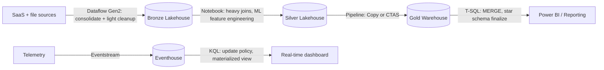

# 07. Batch Transformation

> **Exam domain:** Domain 2 — Ingest and transform data (30–35%)
> **Source:** `certification/07-batch-transformation/` — 6 files condensed
> **Why the exam cares:** The blueprint literally says "transform data by using PySpark, SQL, and KQL" and "handle duplicate, missing, and late-arriving data." So it tests two things: (1) can you pick the right transform surface from a scenario's skillset/volume/data-location signals, and (2) can you write or read the *same* data-quality pattern in three different languages. The pattern is language-agnostic; the syntax is not.

---

## Orientation — the 60-second version

Fabric gives you **four separate places to transform data**, and they are not interchangeable. **Dataflow Gen2** is a low-code, drag-and-drop Power Query experience aimed at analysts — great breadth of connectors, terrible at scale. A **notebook** running **PySpark** is the code-first surface: a Spark cluster, arbitrary Python, and the tool you reach for at terabyte scale or when the logic has no prebuilt equivalent. **T-SQL** runs inside a **Fabric Warehouse** — full DML including `MERGE`, but only against warehouse-resident data. **KQL** runs inside an **Eventhouse** and is built for telemetry and time-series, not general batch ETL.

Underneath, almost everything lands in **OneLake** as **Delta** tables — one storage layer, several engines reading it. That's why the same logical job can be expressed three ways, and why the exam keeps asking "which one, and why."

The second half of the topic is data quality. Four blueprint verbs — denormalize, group and aggregate, deduplicate, and handle missing/late-arriving data — each have one idiomatic solution per language. Deduplication is `dropDuplicates()` in PySpark, `ROW_NUMBER() = 1` in T-SQL, `arg_max()` in KQL. Null filling is `na.fill()`, `COALESCE`, `coalesce()`. Late-arriving *facts* need a watermark; late-arriving *dimensions* need an inferred member. Memorise the three-column mapping and most of Domain 2's transform questions become lookups rather than reasoning.

## New terms in this topic

| Term | What it actually is |
| :--- | :--- |
| **OneLake** | The single storage layer under all of Fabric — one data lake per tenant that every engine reads and writes. Removes the need to copy data between services. |
| **Lakehouse** | A Fabric item holding Delta tables plus raw files in OneLake, queried by Spark for read/write and by a read-only SQL endpoint. |
| **SQL analytics endpoint** | The auto-generated T-SQL front door over a lakehouse. **Read-only** — you can `SELECT`, you cannot run DML through it. |
| **Fabric Warehouse** | A Fabric item exposing a full T-SQL DML/DDL surface over OneLake data. Its T-SQL is a *subset* of SQL Server's. |
| **Dataflow Gen2** | Low-code transformation item built on Power Query. Visual step-by-step transform trail; 150+ connectors, 300+ built-in M functions. |
| **Power Query M** | The functional language behind Dataflow Gen2. No general-purpose scripting escape hatch — if a transform isn't a built-in M function, you can't express it. |
| **Notebook** | The code-first Fabric item running PySpark / Spark SQL / Scala against a Spark pool. Parameterizable, Git-friendly, diff-able cell by cell. |
| **Spark pool** | The cluster of executors a notebook runs on. Billed for cluster time; scales out for TB-scale joins. |
| **Delta table** | Parquet files plus a transaction log. Gives time travel, `MERGE`, and schema enforcement — the default interchange format in Fabric. |
| **Eventhouse** | The Fabric item that hosts KQL databases for high-volume telemetry / time-series. KQL's home; largely always-on compute. |
| **Real-Time Intelligence** | The Fabric workload Eventhouse/Eventstream/KQL live in. KQL's transformation surface is scoped here — never to general lakehouse or warehouse batch ETL. |
| **KQL (Kusto Query Language)** | Eventhouse's native query and transformation language. Rich analytical operators, but not a general-purpose programming language. |
| **Eventstream** | Fabric's streaming ingestion item that feeds data into an Eventhouse and other destinations. |
| **Update policy** | A KQL rule attached to a *target* table: whenever rows land in a named source table, a query runs automatically and writes the result into the target. Transform-on-ingest with zero external orchestration. |
| **Materialized view** | A standing KQL aggregation over a source table that always returns current results by merging a pre-computed part with a not-yet-materialized delta. **GA.** |
| **`lookup` operator** | KQL's purpose-built fact/dimension enrichment join. Automatically broadcasts the small **right**-side table onto the large **left**-side table. |
| **`arg_max()`** | KQL aggregation returning the whole row holding the max value of a column per group — the KQL "keep latest per key" idiom. `arg_min()` is the mirror image. |
| **`take_any()`** | KQL aggregation returning an *arbitrary* row per group. The non-deterministic dedup idiom — and the only shape a materialized view may be built over when stacking one view on another. |
| **Capacity Unit (CU)** | Fabric's consumption billing unit. Dataflow refreshes, warehouse queries, and Eventhouse compute all draw on it. |
| **Pipeline Copy activity** | Data Factory's pure data-*movement* activity — no transformation beyond type conversion and column mapping. Not a transform tool. |
| **Deployment pipeline** | Fabric's built-in dev → test → prod promotion mechanism for workspace items. |
| **Database project** | Schema-as-code for a Fabric Warehouse — individual `.sql` files per object, with build/deploy tooling. |
| **`COPY INTO`** | T-SQL statement that bulk-loads external files straight into a warehouse table. A *load* step, not a transform step. |
| **Distributed `#temp` table** | A session-scoped temp table created `WITH (DISTRIBUTION = ROUND_ROBIN)` that behaves like a normal user table — the recommended flavour in Fabric Warehouse. |
| **Spark connector (to warehouse)** | The path that lets a notebook write into a Fabric Warehouse from Spark. Works, but T-SQL's native `MERGE` usually beats it when the target is warehouse-resident. |
| **Medallion (bronze / silver / gold)** | The layered lakehouse convention: bronze = raw landed, silver = cleaned and conformed, gold = curated star schema for BI. Each layer may legitimately use a different transform tool. |
| **Watermark** | A durable "last successfully processed" marker. Re-captures anything past the last successful read — the fix for late-arriving **facts**. |
| **Inferred member** | A stub dimension row (`IsInferred = 1`) inserted so a fact row referencing a not-yet-existing dimension key still has a valid surrogate key. The fix for late-arriving **dimensions**. |
| **SCD Type 1 / Type 2** | Type 1 overwrites a dimension row in place (no history). Type 2 adds a new versioned row. An inferred-member stub is completed **Type 1**, never versioned as Type 2. |

## How the pieces fit



- **§1** picks the surface: skill profile and data volume eliminate the wrong answer in most scenarios before anything else matters.
- **§2, §3, §4** are the three transformation vocabularies — PySpark, T-SQL, KQL — one per surface.
- **§5** takes five data-quality patterns and shows each one implemented in all three languages back to back.
- KQL sits on its own branch: Eventhouse telemetry rarely feeds back into the batch medallion pipeline except at a reporting layer.
- Different stages of one pipeline legitimately use different tools. That is a design, not a compromise.

---

## 1. Choosing a Transform Tool
*Source: `01-choosing-transform-tool.md`*

Four surfaces shape, clean, and reshape data: Dataflow Gen2, notebooks, KQL, T-SQL. The exam's "choose an appropriate method for performing data transformations" family tests matching a scenario's skillset, data volume, source/sink shape, and DML requirement to the right one.

### The decision matrix

| Factor | Dataflow Gen2 | Notebook (PySpark/Spark SQL) | KQL (Eventhouse) | T-SQL (Warehouse) |
| :--- | :--- | :--- | :--- | :--- |
| **Skill profile** | Low-code — Power Query M; analysts and citizen integrators | Code-first — Python/Scala/Spark SQL; data engineers | KQL syntax; real-time/telemetry analysts, SREs | SQL-first; DBA/BI developers, SQL Server background |
| **Data volume / scale-out** | Low to medium — hundreds of MB to low tens of GB comfortably; **no manual scale-out control** | **Low to high** — scales via the Spark cluster/pool; the tool of choice for TB-scale joins and custom partitioning | Purpose-built for high-volume streaming/time-series ingestion and query, **not** general batch ETL volume | Low to high — scales via warehouse compute; strong for large SQL-shaped batch loads, weak for unstructured data |
| **Source/sink targets** | **150+** Power Query connectors; writes to lakehouse, Azure SQL DB, Azure Data Explorer, Synapse | Any OneLake table, external files, anything reachable from Spark libraries/APIs | Ingests from Eventstream, ADX, storage; queries KQL DB / Eventhouse tables | Reads/writes warehouse tables with full DML; lakehouse SQL analytics endpoint is **read-only** |
| **Transform expressiveness** | Visual, **300+** prebuilt M transformation functions; limited custom code | Full general-purpose language — arbitrary logic, ML, custom libraries, UDFs | Rich analytical operators (`summarize`, `extend`, `parse`) but not a general-purpose programming language | Full T-SQL DML/DDL, window functions, CTEs — set-based, no native procedural loops outside T-SQL scripting |
| **Cost/compute model** | Consumption-based on Dataflow refresh (CU); can get expensive at scale or with frequent refresh | Spark pool consumption — pay for cluster time, autoscale, tunable per job | Eventhouse compute + storage; largely always-on for streaming ingestion | Warehouse compute (CU), billed per warehouse size/query |
| **Reuse / orchestration integration** | Native pipeline "Dataflow" activity; easy to schedule; M code has weaker CI/CD granularity | Notebook pipeline activity; fully parameterizable; strong Git-based source control | Update policies auto-trigger on ingest; scheduled queries via pipeline for batch-style runs | Stored procedures; pipeline "Script"/"Stored procedure" activity; native to CI/CD via database projects |

> 🧠 **Mental model —** Four workers for one renovation. **Dataflow Gen2** = handyman with a pre-fab toolkit: fast for the standard job, no code, not for structural work. **Notebook/Spark** = licensed contractor: full toolbox, builds anything custom, you pay for the time. **KQL** = the live security-camera operator: brilliant at spotting patterns *as they happen*, useless for planning a kitchen remodel. **T-SQL** = the accountant doing the books: everything set-based and ledger-style, and if the team already speaks it there's no reason to hire anyone else.

### Governance and CI/CD fit

Fit with source control and deployment pipelines is itself a decision factor, not an afterthought.

| Factor | Dataflow Gen2 | Notebook | KQL | T-SQL |
| :--- | :--- | :--- | :--- | :--- |
| **Source control granularity** | Weak — M code stored as a single opaque query definition per Dataflow; diffs hard to read | Strong — `.ipynb`/source-format notebooks diff cleanly in Git, cell by cell | Moderate — `.kql` script files diff as plain text, but no cell-level structure | Strong — individual `.sql` files per object via database projects, standard SQL diffing |
| **Unit testability** | Limited — no native unit-test framework for M transformations | Strong — standard Python frameworks (`pytest`) apply to notebook logic extracted into modules | Moderate — KQL queries testable against sample data, but no dedicated test framework | Moderate — `tSQLt` and similar exist, adoption varies |
| **Deployment pipeline fit** | Native Fabric deployment pipeline item; parameterization is UI-driven | Native deployment pipeline item; parameters passed via notebook parameters | Deployed as part of the Eventhouse/database item; scripts often applied via automation outside deployment pipelines | Native to Fabric database projects; schema-as-code with build/deploy tooling |

A scenario emphasising strict CI/CD, code review, and automated testing nudges toward **notebook or T-SQL (via database projects)** over Dataflow Gen2 — not because Dataflow Gen2 can't be deployed, but because low-code makes rigorous review and diffing meaningfully harder.

### Worked resolutions

- **Notebook wins on scale + custom logic.** Nightly join of 10 TB clickstream fact against a 2 TB customer dimension, custom Python session-stitching with no M equivalent, PySpark-fluent engineers wanting Git-based source control. Volume alone is past Dataflow Gen2's comfortable range; Spark's scale-out, broadcast tuning, and Python surface match.
- **Dataflow Gen2 wins on breadth, not raw power.** 45 SaaS marketing tools each producing a small daily extract, none larger than a few hundred MB; analysts must self-serve without a data-engineering backlog; every step must be visually inspectable so a non-engineer can audit what changed. No source justifies Spark; forcing this into a notebook trades a visual trail for code the requesting team can't maintain.
- **T-SQL wins when team and data are both SQL-native.** Star schema already entirely inside a Fabric Warehouse, nightly `MERGE`-based dimension upserts written by SQL Server developers, no appetite for Spark or Power Query. `MERGE` is a first-class GA feature in Fabric Warehouse — re-implementing working T-SQL elsewhere gains nothing.
- **KQL wins on telemetry.** SOC team ingesting high-volume telemetry into an Eventhouse, computing rolling 5-minute aggregations for a live dashboard, already fluent in KQL. T-SQL against an Eventhouse only reaches the **read-only** SQL analytics endpoint, which isn't tuned for sub-minute freshness aggregation. A notebook could do it via Structured Streaming, but that's a heavier lift than native `summarize ... bin()`.

### Hybrid pipelines

A common, exam-relevant chain: Dataflow Gen2 consolidates many small varied sources into a bronze lakehouse → a notebook does the heavy TB-scale joins and custom logic to produce silver → T-SQL finalises the gold-layer star schema in a warehouse where BI's `SELECT`-only consumption and occasional `MERGE` corrections live. KQL stays on its own branch.

> ⚠️ **Trap —** Treating transform-tool choice as a single, pipeline-wide decision. A multi-stage scenario ("ingest from 40 SaaS sources, then apply custom ML scoring, then load into a warehouse for BI") expects **different tools per stage** — Dataflow Gen2, then notebook, then T-SQL — not one tool forced to do everything.

### Distractor patterns

| Scenario phrase | Trap | Correct read |
| :--- | :--- | :--- |
| "Analyst, low-code interface, 50 small sources" | Picking notebook because "it's more powerful" | Dataflow Gen2 — skillset and source-count profile match exactly |
| "10 TB fact joined against 2 TB dimension, custom Python logic" | Picking Dataflow Gen2 because "it's simpler to set up" | Notebook/Spark — volume and custom logic exceed Dataflow Gen2's comfortable range |
| "Telemetry aggregations, rolling time windows, live dashboard" | Picking T-SQL because "the team knows SQL" | KQL — time-series aggregation over Eventhouse data is KQL-native |
| "SQL-first star schema already in the warehouse, `MERGE`-based upserts" | Picking notebook because "engineering owns all transforms" | T-SQL — skillset, data location, and DML requirement all point there |
| "Team wants zero code and doesn't mind a slower refresh" | Assuming Dataflow Gen2 wins whenever low-code is mentioned | Check data volume first — low-code preference doesn't override a TB-scale requirement |

### Recognising the verb

| Verb/phrase in the scenario | Likely tool |
| :--- | :--- |
| "wrangle," "profile," "clean up," "combine sources visually" | Dataflow Gen2 |
| "custom logic," "machine learning," "feature engineering," "arbitrary Python/Scala" | Notebook |
| "aggregate telemetry," "detect anomalies in real time," "rolling window over events" | KQL |
| "upsert," "star schema," "stored procedure," "warehouse-resident" | T-SQL |

The verb is a starting point, not a substitute for checking skillset and volume — a scenario can say "clean up" while describing 800 GB with custom fuzzy logic, in which case volume/expressiveness overrides the verb.

### Frequently confused pairs

- **Dataflow Gen2 vs. Pipeline Copy activity** — both low-code, but Copy activity is pure data *movement* (binary or tabular copy, no transformation beyond type conversion and column mapping); Dataflow Gen2 is data *transformation* with 300+ M functions. "Petabyte-scale raw movement, no transformation" = Copy activity. "Cleaning, wrangling, profiling with a visual interface" = Dataflow Gen2.
- **Notebook vs. T-SQL for warehouse-adjacent work** — a notebook *can* write to a warehouse via the Spark connector, and T-SQL *can* read lakehouse data via the read-only SQL analytics endpoint. The decider is always DML: if you must write/upsert into a warehouse target, T-SQL's native `MERGE` usually wins unless the transformation logic itself demands Spark's expressiveness.
- **KQL `join` vs. KQL `lookup`** — both enrich a fact with dimension columns (detail in §4). At tool-choice level the simpler fact governs: KQL's transformation surface exists specifically for Eventhouse-resident data, so a scenario describing lakehouse or warehouse batch data should never resolve to "use KQL" regardless of operator.

### Common issues & errors

| Issue | Cause | Resolution |
| :--- | :--- | :--- |
| Dataflow Gen2 refresh times out or becomes very slow | Data volume or transformation complexity exceeded Dataflow Gen2's comfortable range | Move the transformation to a notebook, or split the Dataflow into smaller staged steps |
| A KQL query is used to run a general ETL batch job against a lakehouse | KQL is scoped to Eventhouse / Real-Time Intelligence, not general lakehouse batch transformation | Use a notebook or T-SQL for lakehouse/warehouse batch transforms; reserve KQL for Eventhouse workloads |
| A team tries to run `MERGE` against a lakehouse SQL analytics endpoint | The endpoint is **read-only** — DML isn't available there regardless of statement support elsewhere | Run the `MERGE` in a warehouse, or do the upsert in Spark against the Delta table |
| Power Query custom-column logic can't express a required transformation | Needs arbitrary code (custom functions, ML, complex string algorithms) with no M equivalent | Move that step to a notebook, or add a notebook activity after the Dataflow in the pipeline |
| A notebook-based transformation becomes hard to review or roll back | A simple, low-code-appropriate transformation was routed through Spark for team preference only | Reassess against the decision matrix — migrating a genuinely low-code-shaped workload to Dataflow Gen2 cuts maintenance overhead |
| A `COPY INTO`-loaded staging table sits untransformed with no scheduled follow-up | The load step (`COPY INTO`) and the transform step were treated as one job when they're separate statements | Chain a scheduled `INSERT..SELECT`/`MERGE` step immediately after the load in the same pipeline or stored procedure |

---

## 2. PySpark Transformations
*Source: `02-pyspark-transformations.md`*

PySpark is Fabric's code-first transformation surface, running inside notebooks against Spark pools.

### Reading and writing Delta tables

```python
# Read a Delta table by path
df = spark.read.format("delta").load("Tables/sales_bronze")

# Read a managed table registered in the lakehouse metastore
df = spark.read.table("sales_bronze")

# Write as a managed Delta table, overwriting existing data
df.write.format("delta").mode("overwrite").saveAsTable("sales_silver")

# Partition by a low-cardinality column for pruning on read
(df.write.format("delta").mode("overwrite")
   .partitionBy("order_year", "order_month")
   .saveAsTable("sales_silver_partitioned"))

# Append instead of overwrite — for incremental loads
df.write.format("delta").mode("append").saveAsTable("sales_silver")
```

> ⚠️ **Trap —** Partitioning on a **high-cardinality** column (`customer_id`, or a timestamp with second-level precision) creates thousands of tiny partition folders and hurts performance instead of helping. Partition on low-cardinality columns matching common filter predicates — typically date parts (`year`, `month`) or a small category field.

### Select, filter, column transforms, conditional logic

```python
from pyspark.sql.functions import col, upper, round as spark_round, when

result = (df.select("order_id", "customer_id", "amount", "order_date")
            .filter(col("amount") > 0))

result = result.withColumn("amount_rounded", spark_round(col("amount"), 2))
result = result.withColumnRenamed("order_date", "sale_date")   # rename, values unchanged

df = df.withColumn(
    "order_tier",
    when(col("amount") >= 1000, "Platinum")
    .when(col("amount") >= 100, "Gold")
    .otherwise("Standard"),
)
```

Tier boundaries from the worked example: `29.99` → Standard, `150.00` → Gold, `2500.0` → Platinum.

### Joins and the broadcast hint

```python
from pyspark.sql.functions import broadcast

# Standard join — Spark chooses the strategy (shuffle by default for large-large joins)
fact_dim = fact_orders.join(dim_customers, on="customer_id", how="left")

# Broadcast join — force the small dimension to every executor
# use when the right-side table comfortably fits executor memory
# rule of thumb: well under 10 GB
fact_dim = fact_orders.join(broadcast(dim_customers), on="customer_id", how="left")
```

> 🧠 **Mental model —** A shuffle join is two moving trucks meeting mid-country to swap cargo: expensive, network-heavy. A broadcast join hands every warehouse a photocopy of a thin reference binder ahead of time. Broadcast the *binder* (small dimension), never the *warehouse inventory* (large fact) — broadcasting something too large exhausts executor memory and can crash the job.

A 40 MB dimension joined to a 500 GB fact is the textbook broadcast candidate; adding executors treats the symptom, and repartitioning the fact table to 1 partition destroys parallelism.

### Grouping and aggregation

```python
from pyspark.sql.functions import sum as spark_sum, count, avg

summary = (df.groupBy("customer_id", "order_tier")
             .agg(spark_sum("amount").alias("total_amount"),
                  count("order_id").alias("order_count"),
                  avg("amount").alias("avg_amount")))

summary.orderBy(col("total_amount").desc()).show(3)
```

### Window functions

```python
from pyspark.sql.window import Window
from pyspark.sql.functions import row_number, rank, lag

customer_window = Window.partitionBy("customer_id").orderBy(col("sale_date").desc())
ranked = df.withColumn("row_num", row_number().over(customer_window))
ranked = ranked.withColumn("order_rank", rank().over(customer_window))

# lag — compare each row to the previous row's value within the partition
lag_window = Window.partitionBy("customer_id").orderBy("sale_date")
ranked = ranked.withColumn("prev_amount", lag("amount", 1).over(lag_window))
```

The first row of each `lag` partition returns `NULL` for `prev_amount`.

> 🧠 **Mental model —** `row_number().over(Window.partitionBy(key).orderBy(date.desc()))` then `.filter(col("row_num") == 1)` is the single most reused pattern in the whole guide. It is "latest record per key" in PySpark, in T-SQL, and (via `arg_max()`) in KQL. It reappears in dedup, SCD Type 2, and late-arriving-data logic.

### Deduplication

```python
deduped = df.dropDuplicates()                  # exact duplicate rows across all columns
deduped = df.dropDuplicates(["order_id"])      # by business key, arbitrary surviving row
```

> ⚠️ **Trap —** `dropDuplicates(["order_id"])` does **not** guarantee it keeps the most recent or highest-priority row when duplicate keys have different values — it keeps an arbitrary survivor. When "keep the latest" matters (the usual case for late-arriving or re-sent records), use the `row_number()` window pattern filtered to `row_num == 1`.

### Handling missing data

```python
df_filled = df.na.fill({"amount": 0, "order_tier": "Unknown"})  # per-column defaults
df_filled = df.na.fill(0)                       # all numeric-typed nulls → 0
df_clean  = df.na.drop()                        # drop rows where ANY column is null
df_clean  = df.na.drop(subset=["order_id", "customer_id"])  # only these columns checked
df_clean  = df.na.drop(thresh=2)                # keep rows with at least 2 non-null values
```

### Casting and schema handling

```python
from pyspark.sql.types import IntegerType, DecimalType, DateType
from pyspark.sql.functions import to_date

df = df.withColumn("customer_id", col("customer_id").cast(IntegerType()))
df = df.withColumn("amount", col("amount").cast(DecimalType(10, 2)))
df = df.withColumn("sale_date", to_date(col("sale_date_str"), "yyyy-MM-dd"))
df.printSchema()
```

> ⚠️ **Trap —** Join-key type mismatch is a **silent** failure. `"501"` (string) and `501` (int) don't compare equal under Spark's default join semantics in every code path, so the join runs without error and matches nothing. Cast both sides to the same type. `broadcast()` changes join *strategy*, not type compatibility; renaming columns doesn't fix a type mismatch either.

### Common issues & errors

| Issue | Cause | Resolution |
| :--- | :--- | :--- |
| `AnalysisException: cannot resolve column` | Column name typo, or the DataFrame's schema changed upstream (e.g. after `withColumnRenamed`) | `printSchema()` to confirm actual column names before referencing them |
| Join returns far fewer rows than expected | Join-key type mismatch (`string` vs. `int`), or an inner join silently dropping unmatched rows | Cast both keys to the same type; switch to `how="left"` if unmatched rows must be preserved |
| `OutOfMemoryError` during a join | A large table was wrapped in `broadcast()` and exceeded executor memory | Remove the broadcast hint and let Spark choose a shuffle join, or tune `spark.sql.autoBroadcastJoinThreshold` |
| `dropDuplicates` keeps the "wrong" version of a duplicate row | `dropDuplicates` doesn't guarantee which duplicate survives | Use `row_number()`-over-window with an explicit `orderBy` |
| Partitioned write creates thousands of small files | Partitioned on a high-cardinality column | Partition on a low-cardinality column (date parts, category), or skip partitioning for smaller tables |

---

## 3. T-SQL Transformations
*Source: `03-tsql-transformations.md`*

Fabric Warehouse gives SQL-first teams a full T-SQL DML/DDL surface — but it's a **subset** of SQL Server's, and the exam probes exactly where that subset ends. *(All Fabric Warehouse feature-support facts below verified against learn.microsoft.com as of July 2026.)*

### CTAS and INSERT..SELECT

```sql
-- CTAS: create and populate a new gold table; columns/types inferred from the SELECT
CREATE TABLE gold.customer_summary
AS
SELECT c.customer_id, c.customer_name,
       SUM(o.amount) AS total_amount,
       COUNT(o.order_id) AS order_count
FROM silver.orders AS o
JOIN silver.customers AS c ON o.customer_id = c.customer_id
GROUP BY c.customer_id, c.customer_name;

-- INSERT..SELECT: load into an already-existing table with a fixed schema
INSERT INTO gold.customer_summary (customer_id, customer_name, total_amount, order_count)
SELECT c.customer_id, c.customer_name, SUM(o.amount), COUNT(o.order_id)
FROM silver.orders AS o
JOIN silver.customers AS c ON o.customer_id = c.customer_id
GROUP BY c.customer_id, c.customer_name;
```

> 🧠 **Mental model —** CTAS = "build me a brand-new room from this blueprint" — the table doesn't exist yet and its shape comes entirely from the query. `INSERT..SELECT` = "add furniture to a room that's already built" — the target schema is fixed and the query must match it. CTAS for staging/gold rebuilds; `INSERT..SELECT` for incremental loads into a stable schema.

### UPDATE, DELETE, MERGE

```sql
UPDATE gold.customer_summary SET total_amount = total_amount * 1.0 WHERE customer_id = 501;
DELETE FROM gold.customer_summary WHERE order_count = 0;

-- MERGE: upsert dimension changes from a staging table (SCD Type 1 style)
MERGE INTO gold.dim_customer AS target
USING staging.customer_updates AS source
    ON target.customer_id = source.customer_id
WHEN MATCHED THEN
    UPDATE SET target.customer_name = source.customer_name,
               target.email = source.email,
               target.updated_at = SYSUTCDATETIME()
WHEN NOT MATCHED BY TARGET THEN
    INSERT (customer_id, customer_name, email, updated_at)
    VALUES (source.customer_id, source.customer_name, source.email, SYSUTCDATETIME());
```

> 🔑 **Exam fact —** `MERGE` is **generally available (GA)** in Fabric Warehouse. It was a real gap in early Fabric Data Warehouse previews, and the exam may still test it as a "was this always true" trap. Do not mark it unsupported or preview-only.

### GROUP BY, HAVING, window functions

```sql
SELECT customer_id, COUNT(order_id) AS order_count, SUM(amount) AS total_amount
FROM silver.orders
GROUP BY customer_id
HAVING SUM(amount) > 1000;

SELECT order_id, customer_id, order_date, amount,
       ROW_NUMBER() OVER (PARTITION BY customer_id ORDER BY order_date DESC) AS row_num,
       SUM(amount)  OVER (PARTITION BY customer_id) AS customer_total,
       RANK()       OVER (PARTITION BY customer_id ORDER BY amount DESC) AS amount_rank
FROM silver.orders;
```

"Latest row per customer" = a CTE using `ROW_NUMBER() OVER (PARTITION BY customer_id ORDER BY order_date DESC)` filtered to `row_num = 1`. It returns **full rows**, unlike `SELECT DISTINCT customer_id, MAX(order_date)` which returns only the aggregate. `TOP 1` with `GROUP BY` does not express "latest per group"; `MERGE` is for upserting, not selecting.

### Cross-database three-part-name queries

Warehouses and lakehouses inside the **same Fabric workspace** — and **across workspaces with the right permissions** — can be queried together using three-part names.

```sql
SELECT w.order_id, w.amount, l.customer_name
FROM SalesWarehouse.dbo.orders AS w
JOIN SalesLakehouse.dbo.customers AS l ON w.customer_id = l.customer_id;
```

Cross-database queries only work against items in the **same Fabric capacity/region** reachable from the current query session. Any lakehouse side of the join is subject to its SQL analytics endpoint's read-only limitation — you can `SELECT` across the join, but you can't `UPDATE`/`DELETE` the lakehouse side through it.

### #temp tables vs. CTEs

```sql
-- Non-distributed #temp table (default) — mdf-backed
CREATE TABLE #staging_orders (
    order_id INT, customer_id INT, amount DECIMAL(10,2)
);

-- Distributed #temp table — recommended; behaves like a normal user table
CREATE TABLE #staging_orders_dist (
    order_id INT, customer_id INT, amount DECIMAL(10,2)
) WITH (DISTRIBUTION = ROUND_ROBIN);

-- Standard and sequential CTEs are GA; nested CTEs are Preview
WITH recent_orders AS (
    SELECT customer_id, amount, order_date
    FROM silver.orders
    WHERE order_date >= DATEADD(day, -30, GETUTCDATE())
),
customer_totals AS (
    SELECT customer_id, SUM(amount) AS total_amount
    FROM recent_orders GROUP BY customer_id
)
SELECT * FROM customer_totals WHERE total_amount > 500;
```

- Distributed `#temp` tables are **recommended** over the default non-distributed kind: they behave like normal user tables with unlimited storage and full T-SQL operation support.
- Global temp tables (`##table`) are explicitly **not supported**.
- `#temp` tables are **session-scoped** — dropped automatically when the session ends, never persisted across sessions.

> 🧠 **Mental model —** A CTE is a sticky note: it exists only for the one query it's attached to and vanishes when that statement finishes. A `#temp` table is a whiteboard in a shared session room: it persists across multiple statements in the same session, can be queried repeatedly, and is cleaned up only when the session ends.

### Fabric Warehouse data-type and feature differences vs. SQL Server

| SQL Server feature | Fabric Warehouse status | Notes |
| :--- | :--- | :--- |
| `IDENTITY` columns | **Preview only** | `bigint`-only, no custom seed/increment, no `IDENTITY_INSERT`, can't be added to an existing table via `ALTER TABLE` — use CTAS/`SELECT...INTO` instead. GA-safe default remains `ROW_NUMBER()` or a hash-based key |
| `money`, `smallmoney` | Not supported | Use `decimal`; note it doesn't carry a currency unit |
| `datetime`, `smalldatetime`, `datetimeoffset` | Not supported | Use `datetime2` — precision limited to **6** fractional-second digits |
| `nchar`, `nvarchar` | Not supported | Use `char`/`varchar` — Fabric's default UTF-8 collation stores Unicode without a separate `n`-prefixed type |
| `text`, `ntext`, `image` | Not supported | Use `varchar`/`varbinary` |
| `tinyint` | Not supported | Use `smallint` |
| `xml`, `geography`, `geometry`, vector | Not supported | No direct equivalent; store as `varchar`/`varbinary` if a workaround is needed |
| `PRIMARY KEY` / `FOREIGN KEY` / `UNIQUE` | Supported, but **`NOT ENFORCED`** only | Constraints inform the optimizer/documentation but aren't enforced at write time — violating rows can be inserted |
| Collation | Fixed at warehouse creation | Default `Latin1_General_100_BIN2_UTF8` (**case-sensitive**); alternative `Latin1_General_100_CI_AS_KS_WS_SC_UTF8` (case-insensitive) settable **only via REST API at creation time** |
| Triggers, synonyms, indexed views, computed columns | Not supported | No equivalents currently |

> ⚠️ **Trap —** Treating Fabric Warehouse's `IDENTITY` as a drop-in replacement for SQL Server's. It's **Preview, not GA**, `bigint`-only, no custom seed/increment, no `IDENTITY_INSERT`, and can't be retrofitted onto an existing table with `ALTER TABLE` — you'd rebuild via CTAS. For exam and production-safe designs, `ROW_NUMBER()`-based or hash-based keys are still the default answer for surrogate key generation.

```sql
-- Surrogate key with ROW_NUMBER() — the GA-safe pattern
CREATE TABLE gold.dim_customer
AS
SELECT ROW_NUMBER() OVER (ORDER BY (SELECT NULL)) AS customer_key,
       customer_id, customer_name
FROM staging.customers;

-- The Preview IDENTITY alternative (bigint only, no ALTER TABLE add, no custom seed/increment)
CREATE TABLE gold.dim_customer_identity (
    customer_key   BIGINT IDENTITY,
    customer_id    INT NOT NULL,
    customer_name  VARCHAR(100)
);
```

### COPY INTO for load-then-transform

```sql
COPY INTO staging.orders_raw
FROM 'https://mystorageaccount.dfs.core.windows.net/landing/orders/2026/06/'
WITH (
    FILE_TYPE = 'PARQUET',
    CREDENTIAL = (IDENTITY = 'Shared Access Signature', SECRET = '<SAS token>'),
    ERRORFILE = 'https://mystorageaccount.dfs.core.windows.net/errors/orders/',
    MAXERRORS = 10
);

-- Transform immediately after load
INSERT INTO silver.orders
SELECT order_id, customer_id, CAST(amount AS DECIMAL(10,2)), order_date
FROM staging.orders_raw
WHERE order_id IS NOT NULL;
```

- Fabric's `COPY INTO` supports `FILE_TYPE = 'CSV' | 'JSONL' | 'PARQUET'` — **narrower** than the Synapse dedicated-pool version, which also allows `ORC`. Fabric also drops the general `FILE_FORMAT` object parameter.
- Other supported options: `CREDENTIAL`, `ERRORFILE`/`ERRORFILE_CREDENTIAL`, `MAXERRORS`, `COMPRESSION`, `FIELDQUOTE`/`FIELDTERMINATOR`/`ROWTERMINATOR`, `FIRSTROW`, `DATEFORMAT`, `ENCODING`, `PARSER_VERSION`, `MATCH_COLUMN_COUNT`.
- `BULK LOAD` is explicitly **unsupported** in Fabric Warehouse; only `bcp` is available, as a **Preview** feature.

### Common issues & errors

| Issue | Cause | Resolution |
| :--- | :--- | :--- |
| `ALTER TABLE ... ADD CustomerKey BIGINT IDENTITY` fails on an existing table | `IDENTITY` can't be added via `ALTER TABLE` — must be defined at `CREATE TABLE` time, and remains Preview | Rebuild the table with CTAS including the `IDENTITY` column, or generate keys with `ROW_NUMBER()` |
| `CREATE TABLE ... IDENTITY(1,1)` fails with a custom seed/increment | Fabric's Preview `IDENTITY` doesn't support custom seed/increment | Use plain `IDENTITY` (default seed/increment) or a `ROW_NUMBER()`/hash-based key |
| `COPY INTO ... FILE_TYPE = 'ORC'` fails | `ORC` isn't a supported file type for Fabric's `COPY INTO` | Convert source files to Parquet, CSV, or JSONL |
| A `FOREIGN KEY` constraint doesn't prevent an orphaned row from being inserted | All Fabric Warehouse constraints are created `NOT ENFORCED` | Enforce integrity in the load/transform logic itself (validation queries, `MERGE` conditions) |
| Case-sensitive string comparisons fail unexpectedly (`'ABC' <> 'abc'`) | Default collation `Latin1_General_100_BIN2_UTF8` is case-sensitive | Normalise case explicitly (`UPPER()`/`LOWER()`), or create the warehouse with the case-insensitive collation up front — collation can't be changed after creation |
| `nvarchar` column definition fails | `nchar`/`nvarchar` aren't supported data types | Use `char`/`varchar` — the UTF-8 collation already stores Unicode |

---

## 4. KQL Transformations
*Source: `04-kql-transformations.md`*

KQL is Eventhouse's native transformation language, built for shaping, enriching, and aggregating large volumes of semi-structured and time-series data.

### Core shaping operators

```kusto
// summarize: aggregate rows into groups (like GROUP BY)
Orders
| summarize TotalAmount = sum(Amount), OrderCount = count() by CustomerId

// extend: add a computed column, keeping all existing columns
Orders
| extend AmountRounded = round(Amount, 2), IsLargeOrder = Amount > 1000

// project: keep only the specified columns (like SELECT)
Orders
| project OrderId, CustomerId, Amount

// project-away: keep everything EXCEPT the specified columns
Orders
| project-away InternalDebugField, RawPayload
```

> 🧠 **Mental model —** `project` is packing a suitcase by listing exactly what goes in. `project-away` is packing the whole room then pulling out the two things you don't want. Use `project` when the target column set is short and stable; `project-away` when dropping a couple of noisy/internal columns from an otherwise wide table.

### Join kinds and the lookup operator

```kusto
FactOrders | join kind=inner (DimCustomers) on CustomerId       // only matching rows
FactOrders | join kind=leftouter (DimCustomers) on CustomerId   // all left rows
FactOrders | join (DimCustomers) on CustomerId                  // innerunique — the DEFAULT
```

| Join kind | Behavior |
| :--- | :--- |
| `innerunique` *(default)* | Inner join with left-side deduplication — all columns from both tables |
| `inner` | Standard inner join — only matching rows |
| `leftouter` | All rows from the left table; unmatched right-side columns are null |
| `rightouter` / `fullouter` | Right/full outer join equivalents |
| `leftsemi` / `leftanti` | Keep (or exclude) left rows that have a match, without adding right-table columns |

```kusto
// lookup — enrich a large fact table with columns from a small dimension table
FactOrders
| lookup kind=leftouter DimCustomers on CustomerId
```

> ⚠️ **Trap —** `lookup` and `join` do **not** share performance assumptions. `join` assumes the **left** table is the *smaller* one for its default execution plan. `lookup` assumes the exact opposite: the left (`$left`) table is the large fact table and the right (`$right`) table is the small dimension table, which is **automatically broadcast**. If the right side of a `lookup` exceeds a few tens of MB, the query **fails outright**. Only `leftouter` (default) and `inner` are supported `lookup` kinds — no `rightouter`/`fullouter`/semi variants. `lookup` also avoids repeating the join-key columns in the output.

### mv-expand, parse, extract, bin, let

```kusto
// mv-expand turns each element of a dynamic array/property-bag column into its own row
RawEvents | mv-expand Items
RawEvents | mv-expand kind=array Items        // bagexpansion also breaks out property-bag keys

// parse — extract multiple named fields from a semi-structured string in one step
RawLogs | parse RawText with "[" Timestamp "] [" Level "] " Message

// extract — pull a single value using a regular expression
RawLogs | extend UserId = extract(@"userId=(\d+)", 1, RawText)

// bin() rounds a datetime down to the nearest bucket boundary — the basis for time-series summarize
Telemetry | summarize AvgCpu = avg(CpuPercent) by bin(Timestamp, 5m), DeviceId

// let defines a reusable scalar, tabular, or function-like expression for the rest of the query
let lookbackWindow = 7d;
let highValueThreshold = 1000;
Orders
| where Timestamp > ago(lookbackWindow) and Amount > highValueThreshold
| summarize TotalAmount = sum(Amount) by CustomerId
```

### Materialized views

A materialized view exposes an **aggregation query** over a source table, always returning up-to-date results by combining a pre-computed materialized part with a small delta of not-yet-materialized new rows. **GA feature.**

```kusto
// Keep only the latest row per OrderId — the arg_max dedup pattern
.create materialized-view LatestOrders on table Orders
{
    Orders
    | summarize arg_max(IngestionTime, *) by OrderId
}

LatestOrders                              // always fresh: materialized part + delta
materialized_view("LatestOrders")         // materialized part only — faster, may lag slightly
```

**Backfill:** materialized views can be created with `backfill=true` (or via `.create-or-alter` after ingestion) to populate the view retroactively from existing source-table data, rather than starting empty and only capturing new rows going forward.

> 🧠 **Mental model —** A **materialized view** is a standing aggregation Kusto keeps fresh for you automatically — define it once, and querying it is always fast and always current regardless of when you last "refreshed." An **update policy** is a transformation pipeline triggered on every ingest — it doesn't have to aggregate at all, and it writes into whatever target-table shape you define, once, per triggering ingest. Materialized view = "keep a rolled-up aggregate always current and fast to query." Update policy = "reshape/enrich every incoming record automatically as it lands."

### Update policies: transform-on-ingest

```kusto
// 1. Source table: raw, loosely typed
.create table RawOrderEvents (OriginalRecord: string)

// 2. Target table: the well-typed, transformed shape
.create table Orders (
    OrderId: string, CustomerId: string, Amount: real, OrderTimestamp: datetime
)

// 3. A function that performs the transformation
.create function ParseOrderEvents() {
    RawOrderEvents
    | parse OriginalRecord with
        "{orderId:" OrderId "," "customerId:" CustomerId "," "amount:" Amount:real "," "ts:" OrderTimestamp:datetime "}"
    | project OrderId, CustomerId, Amount, OrderTimestamp
}

// 4. Attach the update policy to the TARGET table
.alter table Orders policy update
@'[{ "IsEnabled": true, "Source": "RawOrderEvents", "Query": "ParseOrderEvents()", "IsTransactional": true, "PropagateIngestionProperties": false }]'

// 5. Ingest into the SOURCE — the update policy fires automatically, populating Orders
.set-or-append RawOrderEvents <|
    datatable(OriginalRecord: string)
    ["{orderId:1001,customerId:501,amount:29.99,ts:2026-06-01T10:00:00Z}"]
```

- `IsTransactional: true` ensures that if the transformation query fails, the **source ingestion is rolled back too** — data isn't silently lost in the target table's absence. Its default is `false`.
- Multiple update policies can be attached to one table, and update policies can **cascade** (table A updates B, B updates C). Circular chains are detected and cut at runtime.
- Scoping rules: same database, matching schema.

> ⚠️ **Trap —** Referencing the source table by a **qualified** name (`database("Db").RawOrderEvents`) inside an update policy's query or its referenced function. Fabric requires the **unqualified table name** (`RawOrderEvents`) inside update-policy queries — no `database()`/`cluster()` prefixes — even though qualified references work fine in ad hoc queries.

### T-SQL → KQL translation table

| T-SQL | KQL equivalent |
| :--- | :--- |
| `SELECT col1, col2` | `\| project col1, col2` |
| `SELECT * EXCEPT (col1)` *(the intent, not native T-SQL)* | `\| project-away col1` |
| `WHERE condition` | `\| where condition` |
| `GROUP BY ... SUM()/COUNT()` | `\| summarize sum(...), count() by ...` |
| Computed column in `SELECT` | `\| extend NewCol = expression` |
| `JOIN ... ON` | `\| join kind=inner (...) on ...` |
| `ROW_NUMBER() OVER (PARTITION BY k ORDER BY t DESC) = 1` (latest per key) | `\| summarize arg_max(t, *) by k` |
| `DATEPART`/`DATETRUNC`-style bucketing | `\| summarize ... by bin(Timestamp, 1h)` |
| `CTE` (`WITH x AS (...)`) | `let x = (...);` |
| Trigger / `MERGE`-driven ETL on write | Update policy |
| Indexed view / materialized aggregate | Materialized view |

### Common issues & errors

| Issue | Cause | Resolution |
| :--- | :--- | :--- |
| `lookup` query fails with a size-related error | The right-side (dimension) table exceeds the broadcast size limit — a few tens of MB | Switch to a regular `join`, or pre-filter/aggregate the dimension down |
| Update policy query fails and source data still appears queryable | `IsTransactional` left at its default `false` | Set `IsTransactional: true` if source/target consistency is required |
| Materialized view creation fails with an aggregation error | The view's query lacks a supported aggregation function, or is defined over a non-deduplication materialized view | Use a supported aggregation (`summarize` with `sum`/`count`/`arg_max`, etc.); materialized-view-over-materialized-view requires the source view to be a `take_any(*)` dedup view |
| Update policy references a table with a qualified name and fails validation | Update-policy queries must reference the `Source` table unqualified | Use the bare table name inside the policy's function/query, not `database("Db").TableName` |

---

## 5. Data Quality Patterns
*Source: `05-data-quality-patterns.md`*

The blueprint names four data-quality skills: **denormalize data**, **group and aggregate data**, and **handle duplicate, missing, and late-arriving data**. None are language-specific — each has an idiomatic solution in PySpark, T-SQL, and KQL.

### Deduplication: three languages, one goal

**PySpark:**

```python
from pyspark.sql import Window
from pyspark.sql.functions import row_number, col

# Non-deterministic survivor: fine when duplicates are truly identical
deduped = df.dropDuplicates(["order_id"])

# Deterministic "keep latest": use when duplicate rows differ (e.g. re-sent updates)
w = Window.partitionBy("order_id").orderBy(col("last_modified").desc())
deduped = (df.withColumn("row_num", row_number().over(w))
             .filter(col("row_num") == 1)
             .drop("row_num"))
```

**T-SQL:**

```sql
WITH ranked AS (
    SELECT *,
        ROW_NUMBER() OVER (PARTITION BY order_id ORDER BY last_modified DESC) AS row_num
    FROM staging.orders
)
SELECT * FROM ranked WHERE row_num = 1;

-- DISTINCT only helps when entire rows are exact duplicates (rarely true in practice)
SELECT DISTINCT * FROM staging.orders;
```

**KQL:**

```kusto
Orders | summarize arg_max(LastModified, *) by OrderId   // keep latest
Orders | summarize arg_min(LastModified, *) by OrderId   // mirror image: keep earliest
```

| Language | Non-deterministic dedup | Deterministic "keep latest" dedup |
| :--- | :--- | :--- |
| PySpark | `dropDuplicates(["key"])` | `row_number()` over `Window.partitionBy(key).orderBy(ts.desc())`, filter `== 1` |
| T-SQL | `SELECT DISTINCT` | `ROW_NUMBER() OVER (PARTITION BY key ORDER BY ts DESC)`, filter `row_num = 1` |
| KQL | `summarize take_any(*) by key` | `summarize arg_max(ts, *) by key` |

> ⚠️ **Trap —** Reaching for the non-deterministic idiom (`dropDuplicates()`, `SELECT DISTINCT`, `take_any()`) when the real requirement is "keep the most recent version of each record." All three are correct when duplicate rows are byte-for-byte identical — but the moment duplicates represent the *same key with different values* (the far more common real case), only the deterministic window/`arg_max()` pattern gives a predictable, correct result.

> 📌 **Remember —** `dropDuplicates` is not a KQL operator. If it appears in a KQL answer option, it's a distractor.

### Handling missing data: one substitution logic, three call syntaxes

**PySpark:**

```python
df_filled = df.na.fill({"amount": 0, "region": "Unknown"})
df_clean  = df.na.drop(subset=["order_id", "customer_id"])
```

**T-SQL:**

```sql
-- COALESCE: first non-null argument; ANSI standard, any number of args
SELECT order_id,
       COALESCE(region, 'Unknown') AS region,
       COALESCE(amount, 0) AS amount
FROM staging.orders;

-- ISNULL: T-SQL-specific, exactly two arguments, different type-precedence rules
SELECT order_id, ISNULL(region, 'Unknown') AS region FROM staging.orders;
```

**KQL:**

```kusto
Orders
| extend Region = coalesce(Region, "Unknown"), Amount = coalesce(Amount, 0.0)
```

> 🧠 **Mental model —** `COALESCE` is ANSI-standard, takes **any number** of arguments, and returns the data type with the **highest precedence** among them. `ISNULL` is T-SQL-proprietary, takes **exactly two** arguments, and returns the data type of its **first** argument — which can silently truncate a wider replacement value. Prefer `COALESCE` for portability and predictable typing; it's also the one with a direct KQL and general-SQL equivalent.

Worked case: `ISNULL(discount_pct, 0)` where `discount_pct` is `DECIMAL(5,4)` and the literal `0` implies `INT`. If the literal's implied type had higher precedence than the column's, `ISNULL`'s first-argument-typed behaviour could produce unexpected coercion or truncation. `COALESCE(discount_pct, 0)` follows ANSI type-precedence across all arguments and is safer.

### Handling late-arriving data

**Three** distinct shapes — the exam expects you to tell them apart:

- **Late-arriving facts** — a transactional/event row arrives after the batch window that should have contained it. This is the **watermark** problem: a durable watermark value re-captures anything past the last successful read, regardless of when it actually arrives.
- **Late-arriving dimensions** — a fact row references a dimension key that doesn't exist yet. This is the **inferred member** pattern: insert a stub dimension row (`IsInferred = 1`) so the fact load has a valid key, then update that stub **in place (SCD1-style)** once the real dimension record arrives — not as a new SCD2 version.
- **Late-arriving events in a streaming context** — an event reaches the engine well after its own event timestamp. The fix is neither a watermark nor an inferred member: query on an **ingestion-time-tolerant window** rather than a strict event-time window, so late events are still counted at the next materialization.

All three patterns are language-portable.

**PySpark (inferred member, Delta MERGE):**

```python
from delta.tables import DeltaTable

dim_customer = DeltaTable.forName(spark, "dim.customer")
(dim_customer.alias("target")
   .merge(staging_fact_keys.alias("source"),
          "target.customer_business_key = source.customer_business_key")
   .whenNotMatchedInsert(values={
       "customer_key": "source.generated_key",
       "customer_business_key": "source.customer_business_key",
       "customer_name": "NULL",
       "is_current": "true",
       "is_inferred": "true",
   })
   .execute())
```

**KQL (late-arriving events, ingestion-time tolerant summarize):**

```kusto
// Query with an ingestion-time-tolerant window rather than a strict event-time window,
// so late events are still captured on next materialization
Events
| where ingestion_time() > ago(1h)
| summarize EventCount = count() by bin(EventTimestamp, 5m), DeviceId
```

> 🧠 **Mental model —** A **watermark** is a tide line marking the last-processed *row* — it doesn't care what the row means, only when it was last seen. An **inferred member** is a placeholder *seat* reserved at a table before the guest (the real dimension record) arrives — the fact load has somewhere valid to sit, and the seat gets properly labelled when the guest shows up. Late fact rows need the tide line moved back; late dimension rows need a reserved seat.

Rejecting the fact row to preserve referential integrity, or inserting it with a `NULL` foreign key to be reconciled nightly, are both wrong. Advancing the watermark past the row solves a different problem entirely.

### Denormalization: join-and-flatten in every language

**PySpark:**

```python
from pyspark.sql.functions import broadcast

flat = (fact_orders
        .join(broadcast(dim_customers), on="customer_id", how="left")
        .join(broadcast(dim_products), on="product_id", how="left")
        .select("order_id", "order_date", "amount",
                "customers.customer_name", "products.product_name", "products.category"))
```

**T-SQL:**

```sql
CREATE TABLE gold.orders_flat
AS
SELECT f.order_id, f.order_date, f.amount,
       c.customer_name, p.product_name, p.category
FROM fact.orders AS f
JOIN dim.customers AS c ON f.customer_id = c.customer_id
JOIN dim.products  AS p ON f.product_id  = p.product_id;
```

**KQL:**

```kusto
FactOrders
| lookup kind=leftouter DimCustomers on CustomerId
| lookup kind=leftouter DimProducts on ProductId
| project OrderId, OrderDate, Amount, CustomerName, ProductName, Category
```

| Language | Denormalization primitive | Notes |
| :--- | :--- | :--- |
| PySpark | `.join(broadcast(dim), ...)` | Use `broadcast()` for small dimension tables to avoid shuffling the large fact table |
| T-SQL | `CTAS ... JOIN ... JOIN` | Materializes the flattened result as a new gold table in one statement |
| KQL | `\| lookup kind=leftouter (...) on ...` | Purpose-built fact/dimension enrichment operator, chainable across multiple dimensions |

### Grouping and aggregation, side by side

```python
from pyspark.sql.functions import sum as spark_sum, count, avg

summary = (df.groupBy("region", "product_category")
             .agg(spark_sum("amount").alias("total_amount"),
                  count("order_id").alias("order_count"),
                  avg("amount").alias("avg_order_value")))
```

```sql
SELECT region, product_category,
       SUM(amount) AS total_amount,
       COUNT(order_id) AS order_count,
       AVG(amount) AS avg_order_value
FROM silver.orders
GROUP BY region, product_category
HAVING SUM(amount) > 10000;
```

```kusto
Orders
| summarize TotalAmount = sum(Amount), OrderCount = count(), AvgOrderValue = avg(Amount)
    by Region, ProductCategory
| where TotalAmount > 10000
```

> ⚠️ **Trap —** Filtering an aggregate result with `WHERE` (T-SQL), or with `.filter()` on the pre-aggregated DataFrame in PySpark, instead of the post-aggregation filter each language provides — `HAVING` in T-SQL, `.filter()`/`.where()` chained **after** `.agg()` in PySpark, or `| where` placed **after** `| summarize` in KQL. Filtering *before* aggregation restricts which raw rows are aggregated; filtering *after* restricts which aggregated groups are kept. Not interchangeable.

### Common issues & errors

| Issue | Cause | Resolution |
| :--- | :--- | :--- |
| Deduplication keeps an outdated version of a record | Used a non-deterministic idiom (`dropDuplicates`, `DISTINCT`, `take_any`) instead of deterministic "keep latest" | Switch to `row_number()`/`ROW_NUMBER()`/`arg_max()` with explicit recency ordering |
| A `COALESCE`/`ISNULL` result has unexpected precision loss | `ISNULL` types its result from the first argument only | Use `COALESCE`, which resolves result type via standard precedence across all arguments |
| Fact load fails or blocks entirely when a dimension key is missing | No inferred-member handling in place | Insert an inferred stub dimension row so the fact load always has a valid surrogate key |
| A denormalized gold table join runs extremely slowly | Large table joined without a broadcast hint (PySpark), or `lookup` not used for a fact/dimension shape (KQL) | Add `broadcast()` around the small dimension in PySpark, or switch to `lookup` in KQL |
| An aggregation filter removes the wrong rows | Filter applied before aggregation instead of after, or vice versa | Group-level filters: `HAVING` / post-`agg()` `.filter()` / post-`summarize` `\| where`. Row-level filters: `WHERE` / pre-`agg()` `.filter()` / pre-`summarize` `\| where` |

---

## Decision rules — pick the right thing

| Scenario / requirement | Choose | Why |
| :--- | :--- | :--- |
| Analyst team, no scripting skills, 50 small SaaS sources | Dataflow Gen2 | Skillset + connector breadth (150+) + visual auditable step trail |
| Visual, step-by-step transformation trail a non-engineer must audit | Dataflow Gen2 | Only surface where each step is visually inspectable |
| TB-scale joins, custom Python, ML feature engineering, Git code review | Notebook (PySpark) | Spark scale-out + arbitrary code + cell-level Git diffs |
| Transformation with no built-in M equivalent (fuzzy matching, custom algorithms) | Notebook (PySpark) | Power Query has no general-purpose scripting escape hatch |
| 500 GB/day source, Python-fluent team, Delta lakehouse target | Notebook (PySpark) | Volume past Dataflow Gen2's range; native `saveAsTable`/`write.format("delta")` write path |
| Telemetry, rolling time windows, live dashboard, Eventhouse-resident | KQL | Native `summarize ... by bin()`; the T-SQL endpoint over an Eventhouse is read-only and not tuned for streaming-latency aggregation |
| Warehouse-resident star schema, SQL-only team, `MERGE`-based upserts | T-SQL | `MERGE` is GA in Fabric Warehouse; data and skills already live there |
| Petabyte-scale raw movement, **no** transformation | Pipeline Copy activity | Copy activity is movement-only; Dataflow Gen2 is transformation |
| Must write/upsert into a **warehouse** target | T-SQL `MERGE` | Beats routing through Spark's warehouse connector unless the logic itself demands Spark |
| Strict CI/CD, code review, automated testing mandated | Notebook or T-SQL database projects | Dataflow Gen2's M is one opaque query definition; diffs and review are hard |
| Multi-stage pipeline: many sources → custom ML → BI warehouse | Different tool per stage | Dataflow Gen2 → notebook → T-SQL is a recognised design, not a compromise |
| Low-code preference **but** TB-scale volume | Notebook | Volume/expressiveness outranks skillset comfort |
| Dataflow Gen2 refresh timing out as the source grew from 5 GB to 500 GB | Move to notebook | Revisit the decision as volume grows |
| Join a 500 GB fact to a 40 MB dimension in Spark | `broadcast(dim)` | Avoids shuffling the fact table; small side fits executor memory |
| Broadcasting a large table causing `OutOfMemoryError` | Remove the hint / tune `spark.sql.autoBroadcastJoinThreshold` | Let Spark choose a shuffle join |
| "Latest record per key" in PySpark | `row_number()` over `Window.partitionBy(key).orderBy(ts.desc())`, filter `== 1` | `dropDuplicates` survivor is arbitrary |
| "Latest record per key" in T-SQL | CTE with `ROW_NUMBER() OVER (PARTITION BY key ORDER BY ts DESC)`, filter `= 1` | Returns full rows, unlike `MAX()` aggregation |
| "Latest record per key" in KQL | `summarize arg_max(ts, *) by key` | `take_any(*)` / `distinct` pick an arbitrary survivor |
| Duplicates are byte-for-byte identical | `dropDuplicates()` / `SELECT DISTINCT` / `take_any(*)` | Non-determinism is harmless when rows are identical |
| Generate a surrogate key in Fabric Warehouse | `ROW_NUMBER()` or a hash-based key | `IDENTITY` is Preview-only with real limits |
| Need a surrogate key column added to an **existing** warehouse table | Rebuild via CTAS | `IDENTITY` can't be added by `ALTER TABLE` |
| Stage intermediate results across several statements in one session | Distributed `#temp` table `WITH (DISTRIBUTION = ROUND_ROBIN)` | Behaves like a normal user table, unlimited storage, full T-SQL support |
| Make a single query readable | CTE | Statement-scoped; standard/sequential GA, nested Preview |
| Case-insensitive string comparison required in a warehouse | Choose the CI collation **at creation**, or `UPPER()`/`LOWER()` in queries | Collation is fixed permanently at warehouse creation |
| Bulk-load external Parquet/CSV/JSONL into a warehouse staging table | `COPY INTO`, then a follow-up `INSERT..SELECT`/`MERGE` | Load and transform are separate statements |
| Enrich a 50-billion-row fact with a 2 MB dimension in KQL | `lookup kind=leftouter` | Auto-broadcasts the small right side; cleaner output schema |
| Right-side dimension in KQL exceeds a few tens of MB | Regular `join`, or pre-filter/aggregate the dimension | `lookup` fails outright above the broadcast limit |
| Parse raw text into typed columns on every ingest, no orchestration | Update policy with `IsTransactional: true` | Ingest-triggered transformation; rolls back the source on query failure |
| Always-current rolling aggregate for a live dashboard | Materialized view | Standing aggregation, always fresh, GA |
| Populate a new materialized view from pre-existing source data | `backfill=true` (or `.create-or-alter`) | Otherwise the view starts empty and only captures new rows |
| Maximum query speed and slight staleness acceptable | `materialized_view("Name")` | Skips the delta-merge step |
| Fact row references a dimension key that doesn't exist yet | Inferred member stub, `IsInferred = 1`, later updated SCD1-style in place | Don't block the load, don't leave a `NULL` FK, don't create an SCD2 version |
| A batch missed a row that was updated late | Watermark | Re-captures anything past the last successful read |
| A streamed event arrives long after its own event timestamp | Ingestion-time-tolerant window (`where ingestion_time() > ago(1h)`) | Neither a watermark nor an inferred member; a strict event-time window would drop it |
| Filter groups after aggregation | `HAVING` / post-`agg()` `.filter()` / post-`summarize` `\| where` | Pre-aggregation filters change which rows are aggregated |
| T-SQL null substitution, exam-safe answer | `COALESCE` | ANSI, any arg count, predictable type precedence |

## Numbers, limits and defaults to memorise

| Thing | Value | Note |
| :--- | :--- | :--- |
| Dataflow Gen2 comfortable data volume | Hundreds of MB to low tens of GB | No manual scale-out control |
| Dataflow Gen2 worked example | **45** SaaS marketing sources, none larger than a few hundred MB | Breadth of small sources + self-service is the deciding signal |
| Dataflow Gen2 easy-question example | **50** small SaaS source tables, analyst team, no scripting | Skillset + source-count profile |
| Volume that overrides a "clean up / wrangle" verb | **800 GB** with custom fuzzy logic | Volume/expressiveness outranks the verb-only read |
| Volume growth that forces a re-decision | **5 GB → 500 GB** | A Dataflow Gen2 transform appropriate at 5 GB may need to move to a notebook at 500 GB |
| Eventhouse telemetry freshness requirement | Fresh **to within seconds** (sub-minute) | Rolling **5-minute** aggregations for a live dashboard is the canonical KQL scenario |
| Power Query connectors in Dataflow Gen2 | **150+** | Writes to lakehouse, Azure SQL DB, Azure Data Explorer, Synapse |
| Prebuilt M transformation functions | **300+** | Limited custom code beyond these |
| Broadcast-join rule of thumb (Spark) | Right-side table well under **10 GB** | Must comfortably fit executor memory |
| Worked broadcast example | 500 GB fact joined to a 40 MB dimension | Textbook broadcast candidate |
| Notebook-scale worked example | 10 TB fact + 2 TB dimension nightly join | Past Dataflow Gen2's range |
| Notebook-vs-Dataflow volume signal | 500 GB/day | Well past Dataflow Gen2's comfortable volume |
| `na.drop(thresh=2)` | Keeps rows with **at least 2** non-null values | Distinct from `subset=` |
| `lag("amount", 1)` | Offset of 1 row within the partition | First row of each partition returns `NULL` |
| Order-tier thresholds in the worked example | `>= 1000` Platinum, `>= 100` Gold, else Standard | `when`/`otherwise` chain |
| Rounding / decimal casts in the worked examples | `spark_round(col, 2)`, `cast(DecimalType(10, 2))`, `DECIMAL(10,2)`, KQL `round(Amount, 2)` | 2 decimal places is the money-column convention throughout |
| `to_date` format string | `"yyyy-MM-dd"` | Parses a string column into a `date` type |
| Fabric Warehouse `datetime2` precision | **6** fractional-second digits | `datetime`/`smalldatetime`/`datetimeoffset` unsupported |
| Default warehouse collation | `Latin1_General_100_BIN2_UTF8` — **case-sensitive** | Fixed permanently at warehouse creation |
| Case-insensitive warehouse collation | `Latin1_General_100_CI_AS_KS_WS_SC_UTF8` | Settable **only via REST API at creation time** |
| Fabric Warehouse `IDENTITY` | **Preview**, `bigint`-only, no custom seed/increment, no `IDENTITY_INSERT`, no `ALTER TABLE` add | GA-safe alternative: `ROW_NUMBER()` or hash key |
| Fabric Warehouse constraints | `PRIMARY KEY`/`FOREIGN KEY`/`UNIQUE` are **`NOT ENFORCED`** only | Violating rows can be inserted |
| Distributed `#temp` table clause | `WITH (DISTRIBUTION = ROUND_ROBIN)` | Recommended over the non-distributed default |
| `#temp` table scope | Session-scoped, auto-dropped at session end | Global `##temp` **not supported** |
| CTE support | Standard and sequential **GA**; nested **Preview** | |
| `COPY INTO` `FILE_TYPE` values (Fabric) | `CSV`, `JSONL`, `PARQUET` only | Synapse dedicated pools also allow `ORC`; Fabric drops the `FILE_FORMAT` object parameter |
| `COPY INTO` example `MAXERRORS` | 10 | Paired with an `ERRORFILE` location |
| `bcp` in Fabric Warehouse | **Preview** | `BULK LOAD` is unsupported |
| Cross-database three-part-name queries | Same Fabric **capacity/region** only; same workspace, **or across workspaces with the right permissions** | Lakehouse side is read-only |
| KQL default join kind | `innerunique` | Inner join with left-side deduplication |
| KQL `lookup` supported kinds | `leftouter` (default) and `inner` **only** | No `rightouter`/`fullouter`/semi |
| KQL `lookup` right-side broadcast limit | A few tens of MB — above this the query **fails outright** | Right = small dimension, left = large fact |
| `lookup` worked example | 50-billion-row fact + 2 MB dimension | Ideal `lookup` shape |
| Update policy `IsTransactional` default | `false` | Set `true` to roll back source ingestion on query failure |
| Update-policy table references | Must be **unqualified** | No `database()`/`cluster()` prefixes |
| Materialized view status | **Generally available** | Combines materialized part + not-yet-materialized delta |
| Materialized view over materialized view | Source view must be a `take_any(*)` dedup view | Otherwise creation fails |
| KQL time-bucket examples | `bin(Timestamp, 5m)`, `bin(Timestamp, 1h)` | Basis for time-series `summarize` |
| KQL late-event tolerance example | `where ingestion_time() > ago(1h)` | Ingestion-time-tolerant rather than strict event-time window |
| `let` example values | `lookbackWindow = 7d`, `highValueThreshold = 1000` | Centralise thresholds at the top of a query |
| `COALESCE` vs `ISNULL` | `COALESCE`: any number of args, highest-precedence type. `ISNULL`: exactly **2** args, type of the **first** | `ISNULL` can silently truncate |
| `ISNULL` worked gotcha | `ISNULL(discount_pct, 0)` where the column is `DECIMAL(5,4)` and `0` implies `INT` | Result typed from the first argument — use `COALESCE` instead |
| Rolling-window CTE example | `DATEADD(day, -30, GETUTCDATE())` | 30-day lookback inside a standard CTE |
| Domain 2 exam weight | 30–35% | Ingest and transform data |

## Traps and common mistakes

**§1 Choosing a transform tool**

- Treating transform-tool choice as one pipeline-wide decision when the scenario has multiple stages that each want a different tool.
- Picking notebook because "it's more powerful" when the signals are analyst + low-code + many small sources.
- Picking Dataflow Gen2 because "it's simpler" when the scenario says 10 TB joins and custom Python.
- Picking T-SQL because "the team knows SQL" for telemetry/rolling-window/live-dashboard work — that's KQL.
- Picking notebook because "engineering owns all transforms" when the data is already in a warehouse and the operation is `MERGE`.
- Assuming low-code preference always wins — check volume first.
- Running `MERGE` against a lakehouse **SQL analytics endpoint**: it is read-only, DML is unavailable there.
- Using KQL to run general ETL against a lakehouse — KQL is scoped to Eventhouse / Real-Time Intelligence.
- Confusing Dataflow Gen2 with the pipeline **Copy activity** (movement only, no transformation logic).
- Leaving a `COPY INTO`-loaded staging table with no chained transform step — load and transform are separate statements.

**§2 PySpark**

- Partitioning on a high-cardinality column, creating thousands of tiny partition folders and thousands of small files.
- `dropDuplicates(["key"])` keeping an arbitrary survivor when the requirement is "keep the latest."
- Join-key type mismatch (`string` vs `int`) — the join **silently** returns zero/too-few matches with no error.
- Broadcasting a large table → `OutOfMemoryError`.
- Thinking `broadcast()` fixes type mismatches — it only changes join strategy.
- Confusing `partitionBy()` (physical storage layout for folder pruning) with Spark in-memory partition count control.
- Confusing `thresh=` (minimum non-null count) with `subset=` (which columns to check) in `na.drop()`.
- Referencing a column that was renamed upstream → `AnalysisException: cannot resolve column`.

**§3 T-SQL**

- Marking `MERGE` as unsupported or preview-only in Fabric Warehouse — it is **GA**.
- Treating `IDENTITY` as a SQL Server drop-in: Preview, `bigint`-only, no custom seed/increment, no `IDENTITY_INSERT`, no `ALTER TABLE` add.
- Expecting `FOREIGN KEY`/`PRIMARY KEY`/`UNIQUE` to block bad data — all constraints are `NOT ENFORCED`.
- Being surprised that `'ABC' <> 'abc'` — the default collation is case-sensitive and can't be changed after creation.
- Declaring `nvarchar`/`nchar`, `money`, `datetime`, `tinyint`, `text`, `xml` columns — none are supported.
- Assuming global `##temp` tables work, or that `#temp` tables persist across sessions.
- Carrying `FILE_TYPE = 'ORC'` over from Synapse dedicated pools — unsupported in Fabric `COPY INTO`.
- Reaching for `BULK LOAD` — unsupported; only `bcp`, and only in Preview.

**§4 KQL**

- Assuming `lookup` and `join` share size assumptions — they are **opposite**. `lookup`'s right side must be small or the query fails.
- Expecting `lookup` to support `rightouter`/`fullouter`/semi kinds — only `leftouter` and `inner`.
- Forgetting that the default `join` kind is `innerunique` (left-side dedup), not `inner`.
- Referencing the source table with a **qualified** name inside an update policy's query or function.
- Leaving `IsTransactional` at `false` and then losing target data silently when the transform query fails.
- Using a materialized view for general parsing/reshaping — its query must contain a supported aggregation function.
- Creating a materialized view over a materialized view whose source isn't a `take_any(*)` dedup view.
- Creating a materialized view without `backfill=true` and expecting historical source data to appear.

**§5 Data quality**

- Using non-deterministic dedup (`dropDuplicates`, `DISTINCT`, `take_any`) when duplicates share a key but differ in values.
- Answering a KQL dedup question with `dropDuplicates` — not a KQL operator.
- Using `ISNULL` where `COALESCE` is safer: two-argument limit, result typed from the first argument, possible silent truncation.
- Confusing the three late-arriving shapes: **facts** (watermark), **dimensions** (inferred member), and streaming **events** (ingestion-time-tolerant window).
- Versioning an inferred-member stub as SCD2 when the real record arrives — it should be updated in place, SCD1-style.
- Rejecting a fact row, or inserting it with a `NULL` foreign key, instead of creating an inferred member.
- Filtering aggregate results with `WHERE`/pre-`agg()` `.filter()`/pre-`summarize` `| where` instead of the post-aggregation filter.
- Running a fact/dimension denormalization join without `broadcast()` (PySpark) or without `lookup` (KQL).

## Exam tips

- Decide on **skill profile and data volume first** — those two factors eliminate the wrong answer in the majority of exam scenarios before expressiveness or cost even matter.
- "Low-code, many small sources, analyst" = Dataflow Gen2. "TB-scale, custom code, ML" = notebook/Spark.
- "Telemetry, time-series, rolling windows" = KQL. "SQL-only team, warehouse-resident, `MERGE`/CTAS" = T-SQL.
- A tool being *capable* of a task (Spark can technically do anything) doesn't make it the *best* answer — match skillset and volume, not raw capability.
- When two signals from different tools appear (e.g. "SQL-skilled team" + "500 GB/day custom logic"), the volume/expressiveness requirement usually outranks skillset comfort.
- `broadcast()` is for the *small* side of a join — broadcasting a large table causes memory errors, not speedups.
- `dropDuplicates()` ≠ deterministic "keep latest" — that requires `row_number()` over an ordered window filtered to `1`.
- `na.fill()`/`na.drop()` operate at DataFrame level; know `thresh=` (minimum non-null count) vs. `subset=` (which columns to check).
- `partitionBy()` in `saveAsTable`/`write` is a physical storage optimization (folder pruning), not an in-memory partition count control.
- `MERGE` is GA in Fabric Warehouse — don't mark it unsupported or preview-only.
- `IDENTITY` in Fabric Warehouse is Preview-only, `bigint`-only, no custom seed/increment, no `ALTER TABLE` add — `ROW_NUMBER()` is still the exam-safe answer for "how do you generate a surrogate key."
- `PRIMARY KEY`/`FOREIGN KEY`/`UNIQUE` exist but are always `NOT ENFORCED` — they inform the optimizer, they don't block bad data.
- `COPY INTO`'s `FILE_TYPE` in Fabric is `CSV`/`JSONL`/`PARQUET` only — no `ORC`, unlike the Synapse dedicated-pool version.
- `lookup` broadcasts the **right** (small) table onto the **left** (large fact) table — the opposite assumption from `join`'s default.
- Materialized views solve continuous *aggregation*; update policies solve general transform-on-ingest (aggregation or not).
- Update-policy queries must reference the source table **unqualified** — no `database()`/`cluster()` prefixes.
- `arg_max(Timestamp, *)` inside `summarize` is KQL's "latest record per key" idiom — parallel to `ROW_NUMBER() = 1` in T-SQL and the window pattern in PySpark.
- Every data-quality pattern has three names, one per language: `dropDuplicates`/`ROW_NUMBER()=1`/`arg_max()`; `na.fill`/`COALESCE`/`coalesce()`.
- "Fact row missing its dimension" = inferred member; "batch missed a late-updated row" = watermark; "streamed event arrived long after its event time" = ingestion-time-tolerant window. Three shapes, three fixes — don't conflate them.
- `COALESCE` > `ISNULL` for exam-safe answers — ANSI standard, any argument count, predictable typing.
- Denormalization is always a join — the exam wants the *performance-correct* join primitive per engine: `broadcast()`, plain `JOIN`/CTAS, or `lookup`. On a small-dimension join the difference is often an **order of magnitude**.

**Standing best-practice defaults worth carrying in**

- Prefer Delta-native reads/writes (`spark.read.format("delta")`, `saveAsTable`) over raw file-format APIs — that's what buys the transaction-log benefits: time travel, `MERGE`, and schema enforcement.
- Use `broadcast()` deliberately for known-small dimension tables; otherwise let Spark's cost-based optimizer choose the join strategy.
- Cast types explicitly right after ingest (bronze-to-silver) rather than letting implicit type mismatches propagate downstream.
- Use `MERGE` for warehouse upsert logic instead of hand-rolled `UPDATE`/`INSERT IF NOT EXISTS` pairs — it's GA and less error-prone.
- Verify current T-SQL feature-support status against the official T-SQL surface-area documentation before assuming a SQL Server feature carries over — Fabric's surface expands rapidly.
- Prefer distributed `#temp` tables (`DISTRIBUTION = ROUND_ROBIN`) over the non-distributed default for anything beyond trivial staging.
- Decide the warehouse collation (case-sensitive vs. case-insensitive) **before** creating the warehouse — it can't be changed afterward.
- Use `lookup` instead of `join` whenever the enrichment shape is genuinely fact (large) + dimension (small) — faster *and* a cleaner output schema.
- Always set `IsTransactional: true` on production update policies to avoid silent source/target drift on failure.
- Prefer `materialized_view("Name")` over querying the view by name when a small amount of staleness is acceptable — it skips the delta-merge step.
- Use `let` statements to centralise thresholds and time windows at the top of a KQL query.
- Standardise on the deterministic "keep latest" dedup pattern (window function or `arg_max()`) as the default; treat non-deterministic dedup as an explicit, justified exception.
- Always distinguish late-arriving *facts* (watermark) from late-arriving *dimensions* (inferred member) **before** choosing a pattern.
- Revisit the tool decision as data volume grows — a Dataflow Gen2 transformation that was appropriate at 5 GB may need to move to a notebook at 500 GB.

## Key takeaways

- The transform-tool decision hinges on skill profile, data volume, transformation expressiveness, and where the data already lives — not on which tool is theoretically most powerful.
- Dataflow Gen2 and notebooks both handle general batch transformation; KQL is scoped to Eventhouse/real-time workloads and T-SQL to warehouse-resident SQL-shaped data.
- Custom logic with no built-in equivalent (fuzzy matching, ML, arbitrary Python) is the strongest single signal to choose a notebook over Dataflow Gen2.
- Different pipeline stages legitimately use different tools; forcing one tool end to end is the trap, not the answer.
- `spark.read.format("delta")` / `saveAsTable` / `partitionBy` is the standard Delta read-write-partition vocabulary in Fabric notebooks; partition only on low-cardinality columns.
- `broadcast()` avoids shuffling a large fact table by sending a small dimension to every executor — only for genuinely small tables.
- `Window.partitionBy().orderBy()` with `row_number()` is the reusable pattern behind dedup, "latest record," and SCD Type 2.
- Fabric Warehouse's T-SQL is a real subset of SQL Server's — verify support rather than assume parity, especially for constraints, data types, and temp objects.
- `MERGE`, CTAS, `INSERT..SELECT`, window functions, and three-part-name cross-database queries are all fully supported and exam-relevant.
- `IDENTITY` is Preview-only with real limitations; `ROW_NUMBER()`/hash-based keys remain the GA-safe surrogate-key pattern.
- `COPY INTO` is the standard load-then-transform entry point, with a narrower `FILE_TYPE` list than Synapse dedicated pools.
- `summarize`/`extend`/`project`/`project-away` are KQL's core shaping operators, parallel to `GROUP BY`, computed columns, and `SELECT`.
- `lookup` is a broadcast-optimized fact/dimension join; regular `join` supports more kinds but assumes the opposite size relationship.
- Update policies implement transform-on-ingest with no external orchestration; materialized views implement always-fresh continuous aggregation — different problems, and they can coexist.
- Non-deterministic dedup is only safe for truly identical duplicates; deterministic "keep latest" requires a window function or `arg_max()`.
- Late-arriving facts are a watermark problem; late-arriving dimensions are an inferred-member problem; late-arriving streamed events are an ingestion-time-window problem — three shapes, three different fixes.

---

## Scenario Questions

> Attempt all of them before opening any toggle. Answers are hidden until you click.

### Q1. Northwind Logistics multi-stage pipeline

Northwind Logistics ingests daily extracts from 38 SaaS carrier portals, none larger than 300 MB. A team of business analysts with no scripting experience must own the consolidation and cleanup of those extracts and be able to visually audit each step. The consolidated data then needs a proprietary Python route-clustering algorithm applied across 4 TB of accumulated history, and the final star schema must be upserted nightly into an existing Fabric Warehouse by a SQL Server-background team using `MERGE`.

**Which design correctly assigns transform tools to the three stages?**

- **A.** Dataflow Gen2 for all three stages, because the analysts own the pipeline end to end.
- **B.** Dataflow Gen2 for consolidation, a notebook for the route-clustering, and T-SQL for the warehouse upsert.
- **C.** A notebook for all three stages, because Spark can technically perform every operation described.
- **D.** Dataflow Gen2 for consolidation, KQL for the route-clustering, and T-SQL for the warehouse upsert.

<details>
<summary>👉 Show answer</summary>

**Answer: B**

**Why it is right:** Each stage carries a different decisive signal. Stage one is analyst-owned, low-code, many small sources with a visual audit requirement — Dataflow Gen2's 150+ connectors and 300+ M functions. Stage two is a proprietary Python algorithm over 4 TB, which has no M equivalent and exceeds Dataflow Gen2's comfortable range — notebook/Spark. Stage three is a `MERGE` upsert into warehouse-resident data owned by a SQL team, and `MERGE` is GA in Fabric Warehouse. Matching tools per stage is an explicitly recognised design, not a compromise.

**Why the others are wrong:**
- **A** — Dataflow Gen2 comfortably handles hundreds of MB to low tens of GB and offers no scale-out control; 4 TB with a custom Python algorithm is far outside it, and Power Query has no general-purpose scripting escape hatch.
- **C** — Capability is not the test. Routing the analyst-owned consolidation through Spark trades a visually auditable trail for code the requesting team cannot read or maintain, and re-implements working T-SQL `MERGE` logic for no functional gain.
- **D** — KQL's transformation surface exists for Eventhouse-resident telemetry. There is no Eventhouse here, and KQL is not a general-purpose programming language, so it cannot express a proprietary clustering algorithm.

**Covered in:** §1 Choosing a Transform Tool

</details>

### Q2. Fabrikam Retail's nightly notebook

Fabrikam Retail runs a nightly PySpark notebook that reads a 6 TB `fact_sales` Delta table and enriches it from a 90 MB `dim_store` table. An engineer, trying to speed it up, wrapped **both** DataFrames in `broadcast()` and additionally partitioned the output write by `transaction_timestamp`, which has second-level precision. The job now fails with `OutOfMemoryError`, and on the runs that do complete, the output folder contains hundreds of thousands of tiny files.

**Which pair of corrections addresses both symptoms?**

- **A.** Remove `broadcast()` from both sides and partition the write by `store_id` instead.
- **B.** Keep both broadcast hints but increase executor count, and remove partitioning entirely.
- **C.** Broadcast only `fact_sales`, and partition the write by `transaction_timestamp` truncated to the hour.
- **D.** Broadcast only `dim_store`, and partition the write by low-cardinality date parts such as `order_year` and `order_month`.

<details>
<summary>👉 Show answer</summary>

**Answer: D**

**Why it is right:** `broadcast()` is for the *small* side only — 90 MB is well within the rule-of-thumb limit of comfortably under 10 GB, while broadcasting the 6 TB fact table exhausts executor memory and causes the `OutOfMemoryError`. Separately, partitioning on a second-precision timestamp is a high-cardinality partition column, which creates thousands of tiny partition folders and small files; partitioning on low-cardinality date parts that match common filter predicates is the documented fix.

**Why the others are wrong:**
- **A** — Removing the hint from `dim_store` too throws away a legitimate optimization and leaves Spark shuffling the 6 TB fact table. `store_id` is also higher-cardinality than date parts and is not the recommended partition choice here.
- **B** — Adding executors treats a symptom, not the cause; the broadcast of a 6 TB table still exceeds executor memory regardless of executor count.
- **C** — This inverts the rule: broadcasting the large fact table is precisely what causes the memory error. Hour-level truncation is still high-cardinality relative to year/month.

**Covered in:** §2 PySpark Transformations

</details>

### Q3. Contoso Finance warehouse migration (Choose 2)

Contoso Finance is porting a SQL Server data mart into a Fabric Warehouse. The DDL includes `nvarchar(200)` description columns, a `FOREIGN KEY` from the fact table to the customer dimension that the team relies on to reject orphaned rows, a surrogate key they intend to add to an already-created dimension table with `ALTER TABLE ... ADD CustomerKey BIGINT IDENTITY`, and a nightly `MERGE` upsert. Their loader also uses `COPY INTO` with `FILE_TYPE = 'PARQUET'`.

**Which two statements about this migration are correct? (Choose 2)**

- **A.** The nightly `MERGE` upsert must be rewritten, because `MERGE` is not generally available in Fabric Warehouse.
- **B.** The `nvarchar(200)` columns must be changed to `varchar`, because `nchar`/`nvarchar` are not supported data types in Fabric Warehouse.
- **C.** The `COPY INTO` statement must be rewritten, because `PARQUET` is not a supported `FILE_TYPE` in Fabric Warehouse.
- **D.** The `ALTER TABLE ... ADD ... BIGINT IDENTITY` will not work; the table must be rebuilt via CTAS, or keys generated with `ROW_NUMBER()`.
- **E.** The `FOREIGN KEY` will reject orphaned fact rows exactly as it does in SQL Server.

<details>
<summary>👉 Show answer</summary>

**Answer: B and D**

**Why it is right:** `nchar` and `nvarchar` are on Fabric Warehouse's unsupported data-type list — `char`/`varchar` are used instead, because the default UTF-8 collation already stores Unicode without an `n`-prefixed type. And `IDENTITY` in Fabric Warehouse is Preview-only, `bigint`-only, with no custom seed/increment, no `IDENTITY_INSERT`, and it cannot be added to an existing table via `ALTER TABLE`; the documented workarounds are rebuilding with CTAS/`SELECT...INTO` or generating keys with `ROW_NUMBER()`.

**Why the others are wrong:**
- **A** — `MERGE` is generally available in Fabric Warehouse. It was a gap in early previews, which is exactly why the exam plants this as a stale-knowledge trap.
- **C** — Fabric's `COPY INTO` supports `CSV`, `JSONL`, and `PARQUET`. The unsupported value carried over from Synapse dedicated pools is `ORC`.
- **E** — All Fabric Warehouse `PRIMARY KEY`/`FOREIGN KEY`/`UNIQUE` constraints are created `NOT ENFORCED`. They inform the optimizer and document intent, but violating rows can be inserted; integrity must be enforced in the load/transform logic.

**Covered in:** §3 T-SQL Transformations

</details>

### Q4. Adventure Works telemetry dashboard

Adventure Works streams factory-floor telemetry into an Eventhouse. Two requirements land in the same sprint. First, a wall-mounted dashboard must show a rolling per-device hourly health summary that is always current, with fast query response. Second, a raw JSON staging table must have every incoming record parsed into a strongly typed table the instant it lands, with no external pipeline, schedule, or orchestration, and with a guarantee that the staging ingestion is rolled back if the parse query fails.

**Which combination satisfies both requirements?**

- **A.** A materialized view for the rolling hourly summary; an update policy with `IsTransactional: true` for the parse-on-ingest.
- **B.** An update policy for the rolling hourly summary; a materialized view with `backfill=true` for the parse-on-ingest.
- **C.** A materialized view for both, one aggregating and one parsing.
- **D.** A scheduled pipeline running a KQL script every hour for the summary; a `let` statement wrapping the parse logic.

<details>
<summary>👉 Show answer</summary>

**Answer: A**

**Why it is right:** Materialized views are purpose-built for standing aggregation — the view's query must contain a supported aggregation function, and querying it always returns current results by merging the materialized part with the not-yet-materialized delta. Update policies are the general-purpose transform-on-ingest mechanism: a query fires automatically on ingest into the named `Source` table and writes to the target, with no external orchestration. `IsTransactional: true` is the specific setting that rolls the source ingestion back if the transformation query fails.

**Why the others are wrong:**
- **B** — This is the mapping reversed. An update policy does not maintain a continuously fresh aggregate for querying, and a materialized view cannot perform general parsing/reshaping because its query must contain a supported aggregation.
- **C** — A materialized view whose query lacks a supported aggregation function fails at creation. Parsing raw text into typed columns is not an aggregation.
- **D** — The requirement explicitly excludes external schedules and orchestration, and a `let` statement is scoped to a single query, not a standing automation.

**Covered in:** §4 KQL Transformations

</details>

### Q5. Tailspin Toys re-sent orders

Tailspin Toys' order feed occasionally re-sends the same `order_id` with a corrected `amount` and a newer `last_modified` timestamp. The silver-layer notebook currently calls `df.dropDuplicates(["order_id"])` before writing the curated Delta table. Finance reports that roughly 3% of orders show stale amounts, and the wrong version survives unpredictably from run to run.

**What explains the behaviour, and which fix is correct?**

- **A.** `dropDuplicates` compares only the first column of the DataFrame; add every column to the subset list.
- **B.** The Delta write mode is `append` rather than `overwrite`; switching modes will resolve the duplicates.
- **C.** `dropDuplicates(["order_id"])` keeps an arbitrary surviving row when duplicate keys have different values; replace it with `row_number()` over `Window.partitionBy("order_id").orderBy(col("last_modified").desc())` filtered to `row_num == 1`.
- **D.** The `last_modified` column is nullable; filling nulls with `na.fill()` will make `dropDuplicates` deterministic.

<details>
<summary>👉 Show answer</summary>

**Answer: C**

**Why it is right:** `dropDuplicates` on a business key does not guarantee which duplicate survives — it is documented as keeping an arbitrary row. That is harmless only when duplicates are byte-for-byte identical; here the duplicates share a key but carry different `amount` values, so the survivor must be chosen deterministically. The window pattern — `row_number()` over a partition ordered by recency descending, filtered to 1 — is the deterministic "keep latest" idiom, and it is the same shape as T-SQL's `ROW_NUMBER() = 1` and KQL's `arg_max()`.

**Why the others are wrong:**
- **A** — `dropDuplicates` with a subset compares exactly the listed columns; adding every column would only remove byte-identical rows and would leave both differing versions of the order in place.
- **B** — Write mode governs whether existing data is replaced or added to; it has no bearing on which of two same-key rows survives the dedup step.
- **D** — Null handling does not introduce ordering. `dropDuplicates` has no ordering semantics at all, so filling nulls cannot make it deterministic.

**Covered in:** §5 Data Quality Patterns

</details>

### Q6. Litware Insurance — which one fails?

Litware Insurance's platform team drafts four statements against Fabric. The lakehouse `Sales_LH` holds Delta tables and exposes a SQL analytics endpoint. The warehouse `Sales_WH` is a Fabric Warehouse in the same workspace and capacity.

**Which of the following will FAIL?**

- **A.** A T-SQL query in `Sales_WH` joining `Sales_WH.dbo.orders` to `Sales_LH.dbo.customers` using three-part names.
- **B.** A `MERGE INTO Sales_WH.dbo.dim_customer` statement upserting from a warehouse staging table.
- **C.** A `MERGE INTO Sales_LH.dbo.customers` statement executed through the lakehouse SQL analytics endpoint.
- **D.** A `CREATE TABLE #staging (...) WITH (DISTRIBUTION = ROUND_ROBIN)` statement in a `Sales_WH` session.

<details>
<summary>👉 Show answer</summary>

**Answer: C**

**Why it is right:** The lakehouse SQL analytics endpoint is **read-only**. DML is unavailable there regardless of whether the statement is supported elsewhere in Fabric. The documented resolutions are to run the `MERGE` in a warehouse instead, or to perform the upsert in Spark against the Delta table directly.

**Why the others are wrong:**
- **A** — Cross-database three-part-name queries across a warehouse and a lakehouse endpoint in the same workspace and capacity/region are supported. The read-only limitation only blocks writes to the lakehouse side, not reads.
- **B** — `MERGE` is generally available in Fabric Warehouse; upserting a dimension from a staging table is its canonical use.
- **D** — Distributed `#temp` tables created `WITH (DISTRIBUTION = ROUND_ROBIN)` are supported and are in fact the recommended flavour over the non-distributed default.

**Covered in:** §3 T-SQL Transformations, §1 Choosing a Transform Tool

</details>

### Q7. Woodgrove Bank sets up transform-on-ingest

Woodgrove Bank wants raw payment events landed as a single loosely typed string column to be parsed automatically into a strongly typed `Payments` table in their Eventhouse the moment each batch is ingested, with the source ingestion rolled back on transform failure.

**Which sequence of KQL statements is correct?**

- **A.** Create the source table → attach the update policy to the **source** table → create the target table → create the parsing function → ingest into the source table.
- **B.** Create the source table → create the target table → create the parsing function → attach the update policy to the **target** table with `IsTransactional: true` → ingest into the source table.
- **C.** Create the target table → ingest into the target table → create the parsing function → attach the update policy to the source table → create the source table.
- **D.** Create the parsing function → ingest into the source table → create the source and target tables → attach the update policy to whichever table is queried first.

<details>
<summary>👉 Show answer</summary>

**Answer: B**

**Why it is right:** The documented order is: create the raw source table, create the well-typed target table, create the transformation function, then `.alter table <target> policy update` naming the source in the `Source` property with `IsTransactional: true`, and finally `.set-or-append` into the source so the policy fires automatically and populates the target. The policy is attached to the **target** table and names the source, not the reverse.

**Why the others are wrong:**
- **A** — The update policy is attached to the target table, not the source. It also cannot be attached before the target table and its parsing function exist, since the policy references the function by name.
- **C** — Ingesting into the target directly bypasses the transform-on-ingest mechanism entirely, and a policy cannot reference a source table that has not been created.
- **D** — The function references the source table, so the tables must exist first. There is no "whichever table is queried first" attachment rule — the policy always attaches to the target.

**Covered in:** §4 KQL Transformations

</details>

### Q8. Proseware Retail's missing customer

Proseware Retail's nightly star-schema load receives a sales fact row referencing `CustomerBusinessKey = 'CUST-9042'`, but `dim.Customer` has no row with that business key — the CRM extract that creates it runs two hours later. The load must not block, downstream reports must not show dangling keys, and when the real customer record arrives its attributes must appear against the same surrogate key already referenced by the fact rows.

**Which approach is correct?**

- **A.** Reject the fact row and reprocess it after the CRM extract completes, preserving referential integrity.
- **B.** Insert the fact row with a `NULL` customer foreign key and repair it in a nightly reconciliation job.
- **C.** Advance the watermark past the fact row so the next incremental load picks it up after the dimension exists.
- **D.** Insert an inferred-member stub into `dim.Customer` carrying the business key and a generated surrogate key, flagged `IsInferred = 1`, then update that same row in place SCD1-style when the real record arrives.

<details>
<summary>👉 Show answer</summary>

**Answer: D**

**Why it is right:** This is the textbook late-arriving **dimension** scenario, and the inferred-member pattern is its fix: a minimal stub dimension row gives the fact load a valid surrogate key immediately. Because the stub never represented a genuine known historical state, the correct treatment when real attributes arrive is an in-place SCD1 update of that same row — not a new SCD2 version — which is exactly what keeps the surrogate key already referenced by the fact rows valid.

**Why the others are wrong:**
- **A** — Blocking or rejecting the fact load is precisely what the inferred-member pattern exists to avoid, and the scenario states the load must not block.
- **B** — A `NULL` foreign key is a dangling key: it violates the stated requirement and pushes the problem into a reconciliation job rather than solving it.
- **C** — Watermarks solve late-arriving **facts**, not missing **dimensions**. A watermark tracks the last-processed row; it has no mechanism for creating a dimension member, so it is the wrong pattern for this scenario.

**Covered in:** §5 Data Quality Patterns

</details>
