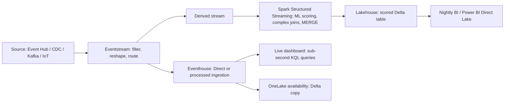

# 08. Streaming Data

> **Exam domain:** Domain 2 — Ingest and transform data (30–35%)
> **Source:** `certification/08-streaming-data/` — 5 files condensed
> **Why the exam cares:** This is the "implement a streaming solution" family of blueprint bullets. It tests whether you can match a scenario's source type, transform complexity, latency requirement and team skillset to the right engine (Eventstream / Spark Structured Streaming / KQL-Eventhouse), then implement the windowing, checkpointing and delivery-guarantee mechanics correctly in whichever surface the scenario names.

---

## Orientation — the 60-second version

Fabric gives you three separate surfaces for streaming data, and they are not competitors — they are stations on one production line.

**Eventstream** is a no-code drag-and-drop canvas. You pick a source connector (30+ of them: Event Hubs, IoT Hub, Kafka, database CDC, Kinesis, Pub/Sub…), optionally drop transformation operators onto the canvas (filter, rename, aggregate, windowed group-by, union, expand, join), and attach one or more destinations. It is a **transform-and-route hub, never a query engine** — the data always has to land somewhere else to be queried.

**Spark Structured Streaming** is the code-first option: a notebook or Spark job definition running `spark.readStream` … `.writeStream`, treating the stream as an unbounded table that rows are appended to. You reach for it when the transform needs actual code — custom joins, UDFs, scoring a Python ML model — or when you need Delta `MERGE` upserts.

**Eventhouse** is Fabric's real-time database, queried with **KQL** (Kusto Query Language). It is the destination you choose when the *end user's query* needs sub-second latency over high-cardinality telemetry. Its own transform mechanisms are **update policies** (transform-on-ingest) and **materialized views** (always-fresh continuous aggregation).

A typical pipeline uses all three: Eventstream lands and lightly filters the raw feed, a derived stream branches off to Spark for ML scoring into a Delta lakehouse table, and another branch lands in Eventhouse for a live dashboard. **Windowing** — tumbling, hopping, sliding, session, snapshot — is the one concept that exists in all three surfaces, with three different syntaxes, and the exam loves testing that mapping.

## New terms in this topic

| Term | What it actually is |
| :--- | :--- |
| **Eventstream** | A Fabric item: a no-code canvas that connects streaming sources → optional transformation operators → one or more destinations. It moves and reshapes events in flight; it does not store or serve queries. |
| **Eventhouse** | Fabric's real-time analytics database (Kusto engine), containing one or more KQL databases. Purpose-built for sub-second interactive queries over high-volume time-series/telemetry data. |
| **KQL database** | The database inside an Eventhouse holding KQL tables. Queried with Kusto Query Language (`summarize`, `extend`, `parse`, `lookup`, `bin`, `arg_max`). |
| **Real-Time hub** | A tenant-wide catalog, auto-provisioned with every Fabric tenant, that automatically lists every eventstream output and every accessible KQL table. A directory for discovering streams — no registration step. |
| **Derived stream** | The transformed version of an eventstream's default stream, created the moment you attach an operator. A first-class routable stream: multiple destinations, own pause/resume, visible in Real-Time hub. |
| **Default stream** | The raw, untransformed output of an eventstream's source before any operator is applied. |
| **Activator** | A Fabric item that watches event data for conditions and fires automated actions — alerts, Power Automate workflows. Available as an eventstream destination. |
| **Kusto** | The engine (and its query language, KQL) underneath an Eventhouse. "Sent directly to Kusto" = written straight into the Eventhouse's own store. |
| **CDC (change data capture)** | A source pattern that streams row-level inserts/updates/deletes out of an operational database as they happen. Eventstream ships **9** database CDC connectors. |
| **Debezium-style JSON** | The nested change-event JSON shape a raw CDC connector emits — old value, new value, operation, metadata. Unreadable as table rows until parsed (or until DeltaFlow reshapes it). |
| **DeltaFlow (preview)** | An Eventstream CDC capability that converts raw Debezium-style nested CDC JSON into analytics-ready tabular columns matching the source table, with automatic schema registration and destination-table management. |
| **Enhanced capabilities** | An eventstream setting (on by default for new eventstreams) that unlocks additional sources and lets transformation operators feed every destination type, not just Lakehouse and Eventhouse. |
| **Custom endpoint** | A generic eventstream source *or* destination that external apps connect to via a Kafka-protocol or connection-string client. |
| **Apache Kafka-compatible endpoint** | The Kafka-protocol connection every eventstream exposes automatically, backed by an Azure Event Hubs namespace Fabric provisions for you. Any Kafka client can produce into or consume from it. |
| **SQL operator (preview)** | An Eventstream operator for code-first stream processing with SQL expressions (windowing, joins, aggregations) — the escape hatch for teams outgrowing the no-code canvas without leaving Eventstream. |
| **OneLake** | Fabric's single, tenant-wide data lake. All Fabric items store their Delta/Parquet data here. |
| **OneLake shortcut** | A pointer from one Fabric item to data that physically lives elsewhere (a lakehouse, ADLS, S3, GCS, a mirrored database) — referenced in place, not duplicated. |
| **Query acceleration** | A **generally available** Eventhouse policy that caches and indexes a OneLake shortcut's data so queries run at native-table speed. Costs extra storage/compute; the shortcut still behaves as an external table for every other purpose. |
| **Hot property** | The setting in a query acceleration policy giving the number of days of data to keep cached. |
| **OneLake availability** | An Eventhouse setting that creates a logical Delta Lake copy of KQL table data in OneLake, so Spark, Warehouse, the SQL analytics endpoint and Power BI Direct Lake can read it with no ETL. |
| **Update policy** | A KQL native-table mechanism that runs a transformation automatically on every ingest, writing the result into a target table. Transform-on-ingest with no orchestration. |
| **Materialized view** | A KQL construct maintaining an always-fresh aggregation (commonly `arg_max` for dedup) over a native table. |
| **Direct ingestion** | Eventhouse-destination mode where events land unprocessed. |
| **Event processing before ingestion** | Eventhouse-destination mode where the eventstream's operators are applied before the data lands. |
| **Streaming ingestion** | An Eventhouse ingestion method that sends data straight into Kusto in the body of a streaming HTTP request. Near-real-time; built for small, frequent writes across many tables. |
| **Queued ingestion** | Eventhouse's **default** ingestion method: data is uploaded to blob storage first, then queued for batch ingestion. Higher throughput and reliability, at seconds-to-low-minutes latency. |
| **Spark Structured Streaming** | Spark's code-first streaming model, which treats a live stream as an unbounded table that rows are continuously appended to. Driven by `spark.readStream` … `df.writeStream` in a notebook or Spark job definition. |
| **Checkpoint (`checkpointLocation`)** | A per-query directory recording source **offsets** and **committed batch IDs**, so a restarted streaming query resumes exactly where it left off. Mandatory for production. |
| **Watermark** | A Spark declaration of how late an event may arrive relative to the latest seen event-time. It bounds how long window/dedup **state** is kept, at the cost of silently excluding data that arrives later. |
| **`foreachBatch`** | A `writeStream` method that hands each micro-batch to your code as an ordinary (non-streaming) DataFrame plus a `batchId`, unlocking any batch API — most importantly Delta `MERGE`. |
| **Optimized Write** | A Delta setting (`spark.databricks.delta.optimizeWrite.enabled`) that automatically merges or splits partitions before writing, so you don't hand-tune `repartition()`/`coalesce()`. |
| **Native Execution Engine (NEE)** | Fabric's vectorized C++ acceleration layer for Spark, enabled at environment/workspace level. Accelerates batch/interactive Spark over Parquet/Delta/CSV. **Never** participates in Structured Streaming. |
| **Spark job definition** | A non-interactive, code-oriented Fabric item for running Spark code in production, with a configurable retry policy. The correct home for always-on streaming jobs (not a notebook). |
| **Monitoring hub** | Fabric's central job-monitoring surface; includes a dedicated **Structured Streaming** tab. |
| **Power BI Direct Lake** | A Power BI storage mode that reads Delta files in OneLake directly, without import or DirectQuery translation. |

## How the pieces fit



- §1 picks **which engine** for which stage — the decision matrix.
- §2 is the **Eventstream** surface: sources (incl. 9 CDC connectors + DeltaFlow), 7 operators, 6 destinations, derived streams, limits, Real-Time hub.
- §3 is the **Spark** surface: `readStream`/`writeStream`, output modes, triggers, checkpoints, watermarks, `foreachBatch`, NEE limitation.
- §4 is the **KQL/Eventhouse** surface: streaming vs queued ingestion, native tables vs shortcuts, query acceleration, update policies/materialized views, OneLake availability.
- §5 is **windowing**, which cuts across §2, §3 and §4 — one concept, three syntaxes.
- Eventstream is almost always the front door (widest connector catalog, least effort); derived streams branch off to Spark; Eventhouse receives whatever needs sub-second query latency. The exam usually describes **one stage's** requirement at a time — the answer is the engine that fits *that* stage.

---

## 1. Choosing a Streaming Engine
*Source: `01-choosing-streaming-engine.md`*

### The three surfaces in one line each

- **Eventstream** = no-code ingestion, transformation and routing hub — the default when no code is wanted.
- **Spark Structured Streaming** = code-first, notebook/Spark-job-based — when transform logic exceeds no-code operators (custom joins, ML scoring, arbitrary Python/Scala).
- **KQL/Eventhouse** = the native real-time query engine — when the *destination* needs sub-second query latency over high-cardinality time-series data.
- They **compose**, they don't compete.

> 🧠 **Mental model —** Three **stations on one factory line**, not three factories. Eventstream = the **conveyor belt with basic sorting arms** (moves, filters, relabels, splits — but can't operate on the contents). Spark = the **workbench with a full toolkit** (arbitrarily complex work on a box you pull off the belt). Eventhouse = the **display case with instant lookup** (once inside, any query finds it in milliseconds).

### The decision matrix

| Factor | Eventstream | Spark Structured Streaming | KQL / Eventhouse |
| :--- | :--- | :--- | :--- |
| **Primary role** | No-code ingestion, in-flight transformation, routing hub | Code-first stream processing in a notebook or Spark job definition | Native real-time query engine; also a streaming *destination* |
| **Source types** | 30+ built-in connectors: Azure Event Hubs, IoT Hub, Event Grid, Service Bus, 9 database CDC connectors, Kafka-compatible clients, Google Pub/Sub, Amazon Kinesis, sample data, and more | Anything with a Spark connector — commonly `eventhubs` (Event Hubs/Kafka protocol), files, or a table already landed by Eventstream | Direct ingestion from Eventstream, or native ingestion clients (streaming/queued) — **not** a general-purpose source connector hub itself |
| **Transform complexity** | 7 no-code operators (filter, manage fields, aggregate, group by/window, union, expand, join) plus a preview SQL operator; **no arbitrary code** | **Unbounded** — full PySpark/Scala/SQL, custom joins, UDFs, ML model scoring, arbitrary business logic | KQL: `summarize`, `extend`, `parse`, `lookup`, update policies, materialized views — powerful but scoped to KQL's operator set |
| **Latency to destination** | Milliseconds to seconds in transit; *query* latency depends on where it lands | Micro-batch by default (seconds), tunable with `trigger()`; not built for sub-second interactive queries | **Sub-second to seconds** query latency once ingested — purpose-built for "what's happening right now" |
| **Skill profile** | No-code / low-code — drag-and-drop canvas, minimal training | Spark/Python/Scala engineers | KQL analysts, time-series/telemetry specialists |
| **Destinations** | Lakehouse, Eventhouse, Fabric Activator, derived stream, custom endpoint, Spark notebook (preview) | Delta tables (lakehouse), any sink `writeStream` supports | Native Eventhouse tables (its own store); can expose data to OneLake via OneLake availability |
| **Windowing support** | Group by operator: tumbling, hopping, sliding, session — no-code, UI-configured | `window()` and `session_window()` inside a `groupBy` — full programmatic control, combinable with watermarks | `bin()` inside `summarize` for tumbling-style buckets; `row_window_session()` for session windows — query-time, not a standing pipeline stage |
| **Scale model** | Managed, auto-scaling within Fabric capacity; throughput governed by capacity SKU | Spark pool sizing — you choose node size/count, autoscale within configured bounds | Eventhouse compute scales with the KQL database's assigned capacity |
| **Delivery guarantee** | At-least-once end to end; effectively-once needs a downstream dedup step | Exactly-once **at the checkpoint-to-Delta-sink relationship**, given a supported idempotent sink; upstream redelivery still needs handling | At-least-once at ingestion; effectively-once via a materialized view (`arg_max`) or query-time dedup |

### Worked scenarios (the shapes the exam uses)

- **Eventstream is enough:** Event Hubs POS events → filter out test stores + rename fields → fan out to a Lakehouse (nightly BI) **and** an Eventhouse (live dashboard). Filter and Manage fields are no-code operators, and one eventstream can attach multiple destinations simultaneously without interference. Spark would work but adds needless code and operational overhead; KQL alone can't ingest from Event Hubs *and* feed a lakehouse without something upstream doing the routing.
- **Eventstream isn't enough:** 50,000 vehicles' GPS pings, joined to a slowly-changing vehicle-assignment reference table, scored by a custom pretrained scikit-learn Python model, written to Delta with exactly-once at the sink. → **Spark Structured Streaming**: `readStream` from the GPS source (directly, or via an Eventstream custom-endpoint hop), a `foreachBatch` or UDF for scoring, `writeStream` to Delta with `checkpointLocation`. Eventstream can still be the ingestion front door for the raw pings and lightweight filtering.
- **KQL/Eventhouse is the only right answer:** SOC ingesting firewall/auth logs at **200,000 events/second**, analysts running ad hoc KQL with sub-second response over the last **7 days** to investigate live incidents. A lakehouse would serve later batch analysis but not sub-second ad hoc latency; Spark is a transform engine, not an interactive query destination at all. Eventstream still typically fronts the pipeline (Direct ingestion or Event processing before ingestion), but the *query* destination — the actual answer to "which engine" — is Eventhouse.
- **Skillset + query cadence decide it:** IoT telemetry needing a 5-minute tumbling average per device, queryable by a Power BI report refreshing **every 10 seconds**, from a team with **no Spark or Python experience** but comfortable with drag-and-drop tools and basic KQL. → **Eventstream Group by (tumbling) → Eventhouse → Power BI**. The skillset rules out Spark as the primary engine, and Eventhouse's sub-second query engine beats a lakehouse Delta table's query-path and file-compaction characteristics for a 10-second dashboard polling cadence. Spark alone would *function*, but is both a skillset mismatch and a weaker query-latency fit.
- **Lowest overhead wins when nothing else is stated:** a two-person team standing up a clickstream pipeline fast — drop bot traffic with a simple field-based filter, land it in a lakehouse for **weekly** reporting, no sub-second query requirement, no custom transform logic. → **Eventstream alone** (Filter operator + Lakehouse destination, no code and no cluster management).

> ⚠️ **Trap —** Choosing an engine for "future growth" or to "future-proof the architecture" when that isn't a stated requirement. Spark and KQL each add operational surface (pool sizing, cluster management, a dedicated Eventhouse) that a filter-only, weekly-reporting scenario doesn't justify. Overengineering against unstated requirements is a trap the exam deliberately plants.

### Cost and operational considerations

| Factor | Eventstream | Spark Structured Streaming | KQL / Eventhouse |
| :--- | :--- | :--- | :--- |
| **Billing model** | Fabric capacity consumption based on data processed/routed | Spark pool compute time (node-hours) | Eventhouse compute + storage (including any query-acceleration cache) |
| **Operational overhead** | Lowest — managed, no cluster/session to size or monitor | Highest — pool sizing, job retries, checkpoint management, monitoring hub | Moderate — ingestion method choice (streaming vs queued) and retention/caching policy tuning |
| **Failure recovery** | Managed by the platform; pause/resume controls on derived streams | Manual: retry policies on Spark job definitions, checkpoint-driven restart | Managed ingestion pipeline; update policies/materialized views recompute automatically as new data lands |

> ⚠️ **Trap —** Picking an engine purely on "which is cheapest" without weighing operational overhead. Eventstream's lower operational burden often outweighs a marginal compute-cost difference for simple transforms; a scenario demanding complex custom logic costs *more* in engineering time force-fitted into no-code operators than just running it in Spark.

### Distractor patterns to recognize

| Scenario phrase | Trap | Correct read |
| :--- | :--- | :--- |
| "Custom ML model scored against every streaming event" | Reaching for Eventstream because "it's the streaming tool" | Spark Structured Streaming — arbitrary code (scikit-learn/PyTorch call) is outside the no-code operator set |
| "Analysts need sub-second query latency over the last hour of telemetry" | Picking a lakehouse because "everything ends up in Delta anyway" | Eventhouse — sub-second interactive query latency is its defining trait, not a lakehouse's |
| "No engineering team, just drag-and-drop this pipeline together" | Defaulting to Spark because it's "more powerful" | Eventstream — no-code is a stated requirement; its 7 operators cover common transforms |
| "Queryable by both Spark notebooks and KQL analysts" | Assuming only one engine can be "the" destination | Multiple destinations from one eventstream (Lakehouse + Eventhouse) is a first-class supported pattern |
| "Eventstream can ingest Kafka, so we don't need Spark at all" | Treating engine choice as all-or-nothing | Engines compose — Eventstream commonly fronts a pipeline that hands off to Spark or KQL |

### Common issues & errors

| Issue | Cause | Resolution |
| :--- | :--- | :--- |
| Complex custom join/enrichment pipeline built entirely in Eventstream hits a wall | No-code operators don't support arbitrary code or complex multi-step business logic | Move the transform into Spark Structured Streaming, optionally fed by an Eventstream derived stream |
| Power BI dashboard on a lakehouse Delta table can't hit a sub-second refresh SLA | Lakehouse/Spark query paths aren't tuned for sub-second interactive latency | Route the data to an Eventhouse destination and query it there |
| Team assumes Eventhouse can replace Eventstream as the ingestion front door for every source type | Eventhouse's native ingestion clients don't cover Eventstream's 30+ connector catalog | Front the ingestion with Eventstream; Eventhouse (Direct ingestion or Event processing before ingestion) as destination |
| Engineers debate "Spark vs KQL" as if only one can be chosen for the whole solution | Treating engine choice as mutually exclusive rather than compositional | Fabric pipelines commonly use two or three together, each for what it does best |
| Spark job chosen because "it's the most powerful engine," then sits idle most of the day on a low-volume simple-filter workload | Over-provisioning engineering complexity relative to the actual transform requirement | Re-evaluate against Eventstream's no-code operators first; reserve Spark for genuine code-level needs |
| Three separate eventstreams built, one per destination, from the same source | Not recognizing one eventstream can fan out to multiple destinations (incl. derived streams for content-based routing) | Consolidate into a single eventstream with multiple destination branches — lower ingestion cost and operational surface |

---

## 2. Eventstreams
*Source: `02-eventstreams.md`*

Eventstream = Fabric's no-code hub for bringing real-time events in, transforming them in flight, and routing them to one or more destinations.

### Sources

**Enhanced capabilities** (enabled by default on new eventstreams) unlock more sources and let transformation operators feed **every** destination type, not just Lakehouse and Eventhouse.

| Category | Representative sources |
| :--- | :--- |
| **Azure messaging services** | Azure Event Hubs, Azure Event Grid (MQTT and non-MQTT), Azure Service Bus (queue or topic subscription), Azure IoT Hub |
| **Database CDC connectors** | Azure SQL Database CDC, Azure SQL Managed Instance CDC, SQL Server on VM CDC, PostgreSQL CDC, MySQL CDC, Azure Cosmos DB CDC, Oracle CDC *(preview)*, MongoDB CDC *(preview)*, Mirrored Database Change Feed *(preview)* |
| **Kafka-compatible platforms** | Apache Kafka, Confluent Cloud for Apache Kafka, Amazon Managed Streaming for Apache Kafka (MSK), Cribl *(preview)*, Solace PubSub+ *(preview)*, MQTT *(preview)* |
| **Other clouds** | Google Cloud Pub/Sub, Amazon Kinesis Data Streams |
| **Fabric and Azure events** | Fabric workspace item events, Fabric OneLake events, Fabric job events, Fabric capacity overview events *(preview)*, Azure Blob Storage events |
| **Custom / generic** | Custom endpoint (Kafka-protocol or connection-string clients), Azure IoT Operations, HTTP *(preview)* |
| **Test / demo** | Sample data (Bicycles, Yellow Taxi, Stock Market, Buses, S&P 500 companies stocks, Semantic Model Logs), Real-time weather, Azure Data Explorer database *(preview)*, Anomaly Detection events *(preview)* |

- **30+ source connectors** in total.
- **Nine database CDC connectors** exist. **Five** support **DeltaFlow (preview)**; DeltaFlow currently covers **Azure SQL Database CDC, Azure SQL Managed Instance CDC, SQL Server on VM CDC, and PostgreSQL Database CDC**.
- **DeltaFlow** transforms raw Debezium-style CDC JSON into an analytics-ready tabular shape matching the source table, with automatic schema registration and destination-table management.

> 🧠 **Mental model —** Without DeltaFlow, a CDC source hands you a **sealed envelope** (nested Debezium JSON you must `parse` open). DeltaFlow **opens the envelope at the door**, laying contents out in columns matching the source table, and keeps relabeling them automatically as the source schema changes.

> ⚠️ **Trap —** Assuming any CDC source connector automatically produces query-ready columns. Without DeltaFlow (or a manual `parse`/`extract` downstream), raw CDC output is nested JSON. A scenario where a team is "struggling to query raw CDC JSON" is fixed by enabling DeltaFlow (where supported) or adding a Manage fields/parsing transform — **not** by switching source connectors.

### The 7 event-processor transformations

The event processing editor is a drag-and-drop, no-code canvas between a stream node and a destination.

| Transformation | Description |
| :--- | :--- |
| **Filter** | Keeps or drops events based on a field's value and condition (`is null`, `is not null`, comparison operators, etc.) |
| **Manage fields** | Adds, removes, renames, or changes the data type of fields; supports built-in string/date-time/math functions for computed fields |
| **Aggregate** | Calculates `sum`/`min`/`max`/`avg` every time a new event occurs over a period, with renaming and dimension-based filtering/slicing; supports multiple aggregations per transform |
| **Group by** | Calculates aggregations across all events within a **time window** (tumbling, hopping, sliding, or session), grouped by one or more fields — the windowing workhorse (see §5) |
| **Union** | Combines two or more streams' shared-name, shared-type fields into one output; non-matching fields are dropped |
| **Expand** | Creates a new row for each value inside an array field |
| **Join** | Combines two streams based on a matching condition — Eventstream's stream-to-stream join |

Plus a **SQL operator (preview)**: code-first stream processing with SQL expressions, including windowing, joins and aggregations, for teams outgrowing the no-code canvas without leaving Eventstream.

> ⚠️ **Trap —** Assuming every operator works with every destination. Only **Lakehouse**, **Eventhouse (event processing before ingestion)**, **Derived stream**, and **Activator** support attaching an operator directly before ingestion. For any other destination (e.g. a custom endpoint), route the transformed output to a **derived stream** first, then attach the destination to that derived stream.

### Apache Kafka endpoint

Every eventstream exposes an **Apache Kafka-compatible endpoint**, backed by an Azure Event Hubs namespace Fabric provisions automatically at eventstream creation — no separate provisioning step. Any Kafka-protocol client can connect with the eventstream's Kafka endpoint connection details, both to **produce** events in (custom endpoint source) and **consume** events out (custom endpoint destination).

> 🧠 **Mental model —** The Kafka endpoint is a **universal adapter plug** — any Kafka-speaking app plugs straight in without knowing it's talking to Fabric.

### Schema management (all preview)

- **Schema Registry (preview)** — register and version schemas centrally, managing schema evolution across eventstreams.
- **Multiple schema inferencing (preview)** — infer and work with multiple schemas within a single eventstream, enabling different transformation paths per inferred schema.
- **Confluent Schema Registry–based deserialization (preview)** — when ingesting from Confluent Cloud for Apache Kafka, deserialize schema-encoded messages using Confluent's own registry.

### Operational and security capabilities

- **Pause and resume** — derived streams support pause/resume, halting processing on one output without affecting other inputs/outputs on the same eventstream; useful when reprocessing history with a **Custom time** starting point.
- **Workspace Private Link (preview)** — select sources and destinations support Private Link for private network access, securing inbound connections to an eventstream.

### The 6 destinations and their delivery guarantees

| Destination | Description | Delivery notes |
| :--- | :--- | :--- |
| **Custom endpoint** | Routes events to an external application or Kafka client via a connection string | At-least-once — the consuming application must handle idempotently |
| **Eventhouse** | Ingests into a KQL database; choose **Direct ingestion** (no processing) or **Event processing before ingestion** (operators applied first) | At-least-once at ingestion; downstream dedup (materialized view `arg_max`, or query-time `arg_max`) is the standard route to effectively-once |
| **Lakehouse** | Converts events to Delta Lake format and writes to lakehouse tables | At-least-once; downstream dedup (`dropDuplicates` + watermark, or a `MERGE`) required for effectively-once, same as any streaming write into Delta |
| **Spark Notebook** *(preview)* | Loads a pre-existing notebook to process the stream via a Spark Structured Streaming job | Delivery semantics inherit from the notebook's own `writeStream` config (checkpointing, sink idempotency) |
| **Derived stream** | The transformed default stream after operators are applied; routable to multiple further destinations and visible in Real-Time hub | Not a terminal sink — a pass-through, transformed view of the stream |
| **Activator** | Connects event data to Fabric Activator for condition monitoring and automated action (alerts, Power Automate workflows) | At-least-once; Activator's own rule evaluation handles repeated/duplicate triggers per its latency/accuracy model |

An eventstream can attach **multiple destinations simultaneously** without interference — e.g. one Eventhouse destination for raw data, a second Eventhouse destination (fed by a Filter operator) for a curated subset, and a Lakehouse destination for aggregated values, all from the same source.

> ⚠️ **Trap —** Describing Fabric eventstream delivery as "exactly-once." Eventstreams guarantee **at-least-once** end to end — a redelivered/retried event can reach a destination twice. Any "exactly-once" claim refers to a downstream sink's own idempotent-write behaviour (Delta's checkpoint-to-sink guarantee, or a KQL materialized view's dedup), **never** to Eventstream's delivery contract.

### Derived streams and content-based routing

A **derived stream** is created the moment you attach one or more operators to the default stream's output. It behaves as a first-class stream: routable to multiple destinations, visible and independently addressable in **Real-Time hub**, with its own pause/resume controls that don't affect other inputs/outputs on the same eventstream.

**Content-based routing** = sending different subsets of one incoming stream to different destinations based on the event's own content — typically a Filter (or a chain of Filter + other operators) feeding separate derived streams, each routed to its own destination. Canonical example: raw events → Eventhouse #1 for archival; a `Filter`-narrowed derived stream → Eventhouse #2 for a curated near-real-time view; an `Aggregate` derived stream → Lakehouse for BI — all three from a single ingested source, without triplicating ingestion.

> 🧠 **Mental model —** The default stream is the **unopened mail truck**. Each derived stream is a **sorted mailbag** pulled off it after applying a rule (filter, reshape, aggregate) — and once a mailbag exists it can go to more than one address, and anyone in the building (Real-Time hub) can see it exists and inspect its contents.

### Throughput and retention limits

| Limit | Value |
| :--- | :--- |
| Maximum message size | 1 MB |
| Maximum retention period of event data | 90 days |
| Event delivery guarantee | At least once |
| Combined sources + destinations (specific types only\*) | Up to 11 |

\* The 11-item combined limit applies **only** when using **Custom endpoint** as a source together with **Custom endpoint** and **Eventhouse with Direct ingestion** as destinations. Other source/destination combinations, and destinations not appended to the default stream, don't count toward it.

Microsoft recommends running eventstreams on **at least an F4 capacity** for production workloads.

### Real-Time hub relationship

**Real-Time hub** is a single, tenant-wide, logical place for discovering, ingesting, managing and consuming all streaming data across an organization. Every Fabric tenant is **automatically provisioned** with it — no setup step. Every running eventstream's outputs (default stream and any derived streams) and every KQL database table the user has access to **appear automatically** — no manual registration. From Real-Time hub you can open the parent eventstream of any listed stream directly in the event-processing editor to add or inspect transformations, or open a KQL database to query its tables.

Real-Time hub also exposes its own connector catalog for **Microsoft sources** (Event Hubs, Service Bus, IoT Hub), **CDC feeds**, **other-cloud streaming** (Google Pub/Sub, Amazon Kinesis), **Kafka clusters**, and **Fabric/Azure events** — creating a stream through Real-Time hub automatically creates the backing eventstream.

> 🧠 **Mental model —** If every eventstream and KQL table is a **shop on a street**, Real-Time hub is the **city's public directory** — it doesn't run the shops, but every shop that opens is automatically listed, and anyone browsing can walk into any shop they have permission to enter.

### Common issues & errors

| Issue | Cause | Resolution |
| :--- | :--- | :--- |
| A pre-ingestion operator can't be attached to a custom-endpoint destination | Custom endpoint doesn't support operators directly before ingestion | Route the operator's output to a derived stream first, then attach the custom endpoint to that derived stream |
| CDC source produces unreadable nested JSON | DeltaFlow isn't enabled (or isn't supported for that connector) and no manual `parse` step exists | Enable DeltaFlow for supported connectors, or add a Manage fields/parsing transform downstream |
| Events silently missing from a destination right after publishing a new source | Data ingestion can start before data routing is fully initialized, especially with CDC initial-snapshot data | Uncheck **Activate ingestion** when adding the source, publish, then manually activate ingestion using a **Custom time** to catch the earlier data |
| Team assumes Eventstream guarantees exactly-once delivery | Fabric eventstreams are at-least-once by design | Add an explicit downstream dedup step (materialized view, `dropDuplicates` + watermark, or `MERGE`) at the destination |
| An eventstream unexpectedly hits the 11-item combined source/destination limit | Using Custom endpoint sources with Custom endpoint and Direct-ingestion Eventhouse destinations together | Reduce combined items, or use destination types/patterns outside the limited set (e.g. Event processing before ingestion) |
| A message is silently dropped, or an ingestion error appears for a large payload | The event exceeds the 1 MB maximum message size | Split the payload upstream, or restructure the source to emit smaller events (per-record instead of per-batch) |
| A team can't find an older event that "should still be there" | Event age exceeds the eventstream's configured or maximum 90-day retention window | Persist anything needed beyond 90 days to a durable destination (Lakehouse, Eventhouse) rather than relying on Eventstream retention |

---

## 3. Spark Structured Streaming
*Source: `03-spark-structured-streaming.md`*

Fabric's code-first streaming engine: a scalable, fault-tolerant model built on Spark that treats a live stream as a table new rows are continuously appended to.

### readStream / writeStream — the core API

```python
import pyspark.sql.functions as F
from pyspark.sql.types import StructType, StructField, StringType, DoubleType, LongType

rawStream = (
    spark.readStream
    .format("eventhubs")          # Event Hubs / Kafka-protocol
    .options(**ehConf)
    .load()
)

eventSchema = StructType([
    StructField("deviceId", StringType(), False),
    StructField("temperature", DoubleType(), True),
    StructField("eventTime", LongType(), True),
])

parsed = (
    rawStream
    .withColumn("bodyAsString", F.col("body").cast("string"))
    .select(F.from_json("bodyAsString", eventSchema).alias("e"))
    .select("e.*")
)

(parsed.writeStream
    .format("delta")
    .option("checkpointLocation", "Files/checkpoints/bronze_devices")
    .outputMode("append")
    .toTable("bronze.device_readings"))
```

- `readStream` returns an unbounded streaming DataFrame — all batch operations (`select`/`filter`/`withColumn`/`groupBy`) apply, plus streaming-only ones like `withWatermark()` and windowed `groupBy`.
- `writeStream` requires an explicit `outputMode`, a `checkpointLocation`, and either `.toTable(...)` (managed Delta table) or `.start("<path>")` (path-based sink) to actually launch the query.
- Natively supported sources: file-based (CSV, JSON, ORC, Parquet) and messaging via connectors — the Azure Event Hubs connector (`eventhubs` format, also usable against Kafka-protocol endpoints such as a Fabric Eventstream custom endpoint) or Apache Kafka directly via the `kafka` format.

### Output modes and sink support

| Output mode | Behavior | Typical sink support |
| :--- | :--- | :--- |
| **append** *(default for non-aggregated queries)* | Only new rows added since the last trigger are written | **Universally supported** — the default for bronze/raw landing and any non-aggregating transform |
| **complete** | The entire updated result table is rewritten every trigger | Requires the query to have an aggregation; supported by sinks that can handle a full-table rewrite each batch (in-memory tables, some file sinks) — not typically used for high-volume Delta writes |
| **update** | Only rows that changed since the last trigger are written | Requires an aggregation; supported by console/memory sinks and, with caveats, Delta — most common for continuously-updated aggregate tables |

> ⚠️ **Trap —** Attaching `outputMode("complete")` or `outputMode("update")` to a query with **no aggregation**. Both require the query to compute an aggregate (a `groupBy(...).agg(...)` or windowed aggregation); Structured Streaming raises an **analysis exception** otherwise. A bronze/raw landing write with no aggregation must use `outputMode("append")`.

> 🔑 **Exam fact —** `append` can never revise a previously emitted row, so it cannot express a running aggregate. `update` emits only changed aggregate rows; `complete` rewrites everything each trigger.

### Triggers

| Trigger | Behavior | Fabric support |
| :--- | :--- | :--- |
| Default (no `.trigger(...)` call) | Micro-batch, starting the next batch immediately after the previous completes | **Fully supported** — out-of-the-box behavior |
| `.trigger(processingTime="1 minute")` | Fixed-interval micro-batch — accumulates data and writes fewer, larger, better-compacted files | **Fully supported** — the standard way to trade a small latency increase for reduced small-file overhead |
| `.trigger(availableNow=True)` | Processes all currently available data as a bounded set of micro-batches, then stops — batch-like "catch up and finish" | **Fully supported** — useful for backfills or scheduled "process what's arrived since last run" jobs |
| Continuous processing mode | Experimental, low-latency mode with a much smaller supported operator set | **Not** the primary documented pattern for Fabric streaming — treat as unsupported/edge-case for exam purposes; default to micro-batch triggers |

```python
(parsed.writeStream
    .format("delta")
    .option("checkpointLocation", "Files/checkpoints/bronze_devices")
    .outputMode("append")
    .trigger(processingTime="1 minute")
    .toTable("bronze.device_readings"))
```

> 🧠 **Mental model —** Default trigger = a **relay runner who starts the next leg the instant they cross the line** (max responsiveness, many small handoffs). `processingTime` = **running each leg on a fixed schedule** (small delay, more ground per leg → larger, better-compacted files). `availableNow` = **running the whole race once, then stopping**.

### Checkpointing

```python
.option("checkpointLocation", "Files/checkpoints/silver_orders")
```

- **Required** for any production streaming write.
- Tracks **offsets** (which source data has been read for each micro-batch) and **committed batch IDs** (which batches were fully, successfully written to the sink).
- Together these allow correct resume after failure/restart — replaying only data not yet durably committed, and recognizing (and skipping) a replayed batch that already succeeded.
- Checkpoints are **per-query**: a checkpoint directory is tied to one specific query's logical plan. Changing the query's structure (adding/removing a `groupBy`, an incompatible schema change) can **invalidate** an existing checkpoint. **Each independent streaming query needs its own dedicated checkpoint path — reusing one location across two queries corrupts both.**

> ⚠️ **Trap —** Omitting `checkpointLocation` "to keep things simple" in development, then using that code in production. Without a checkpoint a restarted query has no memory of what it processed — it either reprocesses everything from the source's earliest retained offset (**duplicates**) or starts from the latest offset and silently skips whatever arrived during the outage (**data loss**), depending on the source's default starting-position behaviour.

### Watermarks and late data

A **watermark** tells Structured Streaming how long to keep state (for dedup or windowed aggregation) before it's safe to expire, based on how late data may arrive relative to the latest seen event-time.

```python
from pyspark.sql import functions as F

deduped = (
    parsed
    .withWatermark("eventTime", "10 minutes")
    .dropDuplicates(["deviceId", "eventTime"])
)
```

Without a watermark, `dropDuplicates` (or a windowed `groupBy`) on an unbounded stream keeps every seen key/window in state **forever** — memory grows without bound. A 10-minute watermark means any event arriving more than 10 minutes late (relative to the max `eventTime` seen so far) is no longer guaranteed to be included in the affected window's result or caught by dedup.

> 🧠 **Mental model —** A watermark is the **tide line marking the last-processed row** — Spark tracks the highest event-time seen, subtracts the tolerance, and treats anything behind that line as safe to forget. Late data isn't rejected outright; it's just no longer guaranteed to be counted, like debris washing ashore after the tide has receded past that point.

> 🔑 **Exam fact —** With `.withWatermark("eventTime", "15 minutes")` on 5-minute tumbling counts, an event arriving 20 minutes behind the latest seen event-time: its window's state has likely already been finalized and dropped, so the event is **silently excluded** — no exception, no new window, no guarantee of inclusion. A longer tolerance would be needed to catch it.

### foreachBatch: upserts from a streaming query

`MERGE INTO` is not a native streaming sink write mode. To upsert from a streaming query, use `foreachBatch` to run a batch `MERGE` against each micro-batch's DataFrame:

```python
from delta.tables import DeltaTable

def upsert_to_delta(microBatchDf, batchId):
    target = DeltaTable.forName(spark, "silver.customer_profile")
    (target.alias("t")
        .merge(microBatchDf.alias("s"), "t.customerId = s.customerId")
        .whenMatchedUpdateAll()
        .whenNotMatchedInsertAll()
        .execute())

(parsed.writeStream
    .foreachBatch(upsert_to_delta)
    .option("checkpointLocation", "Files/checkpoints/silver_customer_profile")
    .trigger(processingTime="1 minute")
    .start())
```

`foreachBatch` receives each micro-batch as a regular (non-streaming) DataFrame plus a `batchId`, so any batch API — Delta `MERGE`, multi-table writes, calls out to another system — is available inside it. Checkpointing still applies at the outer `writeStream` level, so a replayed batch after failure re-runs the same `MERGE` idempotently rather than double-applying it.

> ⚠️ **Trap —** Writing upsert logic directly against the streaming DataFrame with `.writeStream.format("delta")` and expecting `MERGE` semantics. Delta's native streaming sink only supports **append** (and, with restrictions, update/complete for aggregates) — it does **not** perform upserts on write. Any upsert requirement inside a streaming pipeline needs `foreachBatch`.

### Optimizing streaming writes

- **`partitionBy()`** organizes output into subdirectories by column value — choose columns with good cardinality producing well-sized files; avoid columns creating too many tiny partitions or too few enormous ones.
- **`repartition()` / `coalesce()`** control the number of in-memory partitions before a write — `repartition()` does a **full shuffle** to rebalance evenly (can increase or decrease partition count); `coalesce()` **only decreases** partition count, minimizing data movement.
- **Optimized Write** — `spark.conf.set("spark.databricks.delta.optimizeWrite.enabled", True)` automatically merges or splits partitions before writing, maximizing disk throughput without manual `repartition()`/`coalesce()`. `partitionBy()` can still be layered on top for disk-level organization.

```python
rawData = (
    df
    .withColumn("bodyAsString", F.col("body").cast("string"))
    .select(F.from_json("bodyAsString", eventSchema).alias("e"))
    .select("e.*")
    .repartition(48)
    .writeStream
    .format("delta")
    .option("checkpointLocation", "Files/checkpoints/bronze_devices")
    .outputMode("append")
    .partitionBy("region", "deviceType")
    .toTable("bronze.device_readings")
)
```

### Running streaming jobs in production

- Notebooks are for **developing and testing** streaming logic interactively. Production streaming workloads that run continuously should use **Spark job definitions** — non-interactive, code-oriented tasks with greater robustness and availability than an interactive notebook session.
- Infrastructure issues (hardware failure, patching) can stop a running job. A **retry policy** on the Spark job definition restarts it automatically — configurable for a **maximum retry count (up to infinite)** and the **interval between retries**. With a retry policy plus a correct `checkpointLocation`, a streaming job resumes exactly where it left off.
- The **Fabric monitoring hub** has a dedicated **Structured Streaming** tab with metrics: **Input Rate, Process Rate, Input Rows, Batch Duration, Operation Duration** — the primary place to observe a running query's health without custom logging.

> ⚠️ **Trap —** Running a production always-on streaming job from an interactive notebook session and expecting Spark-job-definition reliability. Notebooks are optimized for iterative development; production streaming needs a job definition's retry policy to survive infrastructure interruptions without manual intervention.

### Native Execution Engine: no streaming support

The **Native Execution Engine (NEE)** — Fabric's vectorized C++ acceleration layer for Spark — **does not currently support Structured Streaming at all**. This is not a per-operator fallback situation like JSON/XML or ANSI mode: streaming queries **never engage the native path** and run entirely on the standard JVM Spark engine, regardless of whether NEE is enabled for the environment or workspace. This holds in both **Runtime 1.3 and Runtime 2.0**.

> ⚠️ **Trap —** Enabling NEE at the environment level and expecting a streaming job's write throughput to improve. NEE's gains apply to **batch, ETL and interactive** Spark workloads over Parquet/Delta/CSV. A Structured Streaming query on the same environment sees **no acceleration and no fallback message** — nothing to notice, because NEE doesn't participate in streaming execution at all.

### Common issues & errors

| Issue | Cause | Resolution |
| :--- | :--- | :--- |
| Analysis exception on an aggregating query with `outputMode("append")` | `append` only emits new, never-revised rows; an aggregation revises prior results | Switch to `outputMode("update")` or `outputMode("complete")`, or restructure to avoid the requirement |
| Restarted streaming job either duplicates or loses data | No `checkpointLocation` was configured | Always set `checkpointLocation`, with a unique path per query |
| Dedup state store grows unbounded over days of operation | `dropDuplicates`/windowed `groupBy` used without a preceding `withWatermark` | Add `.withWatermark(<event-time column>, <tolerance>)` before the dedup/aggregation step |
| `MERGE` fails when called directly on a streaming DataFrame | Delta's native streaming sink doesn't support upsert semantics on write | Use `foreachBatch` to run a batch `MERGE` per micro-batch |
| Streaming job shows no performance change after enabling NEE | NEE doesn't support Structured Streaming at all | Expect no acceleration for streaming; NEE benefits apply only to batch/interactive Spark jobs in the same environment |

---

## 4. KQL Real-Time (Eventhouse)
*Source: `04-kql-realtime.md`*

### Ingestion methods: streaming vs queued

| Factor | Streaming ingestion | Queued ingestion *(default)* |
| :--- | :--- | :--- |
| **Path** | Data sent directly to Kusto in the body of a streaming HTTP request | Data uploaded to blob storage first, then queued for batch ingestion |
| **Latency** | **Near-real-time** — typically sub-second to a few seconds | Batched — typically seconds to low minutes, governed by the ingestion batching policy |
| **Best fit** | Small, frequent writes across a large number of tables, where batching would be inefficient | Large-volume tables where throughput and reliability matter more than per-write latency |
| **Cost/throughput tradeoff** | Cheaper for many small, trickling tables; less efficient at very high aggregate volume | More cost-effective and higher-throughput at scale — the recommended default for most production workloads |

Eventstream's **Direct ingestion** and **Event processing before ingestion** modes both ultimately use Eventhouse's own ingestion pipeline underneath. A team ingesting directly with the Kusto ingestion client APIs chooses explicitly between the streaming and queued client patterns.

> 🧠 **Mental model —** Queued ingestion is a **loading dock** (trucks queue and unload in bulk — great throughput, but a truck must fill up or a timer elapse before it leaves). Streaming ingestion is a **pneumatic tube** (a single small item goes straight through immediately — but thousands of constant tubes are less efficient than a few well-loaded trucks at very high volume).

### Native tables vs OneLake shortcuts

| Factor | Native Eventhouse table | OneLake shortcut (unaccelerated) | OneLake shortcut (query-accelerated) |
| :--- | :--- | :--- | :--- |
| **Data location** | Physically ingested and stored inside the Eventhouse | Referenced in place — no duplication; source stays in a lakehouse, ADLS, S3, GCS, or a mirrored database | Referenced, but a caching/indexing layer is added on top |
| **Query performance** | **Fastest** — fully indexed, native storage | Slower — network calls to fetch from storage, no indexes | Comparable to native tables — cached, indexed, same performance class |
| **Storage cost** | Counted as Eventhouse storage | No additional Eventhouse storage — the source owns the storage cost | Adds to Eventhouse storage/SSD consumption (OneLake Premium cache meter) on top of the source's own storage |
| **Update policies / materialized views** | **Fully supported** | **Not supported** (behaves as an external table) | **Not supported** — accelerated shortcuts still behave like external tables with the same limitations |
| **Best fit** | Streaming telemetry needing transform-on-ingest or continuous aggregation | Combining Eventhouse queries with data managed elsewhere, when query performance parity isn't critical | Combining Eventhouse queries with data managed elsewhere when performance parity **is** critical — e.g. joining a large fact stream with dimension data mirrored from another system |

> 🧠 **Mental model —** A native table is **owning the book** (on your shelf, fully indexed, instant). An unaccelerated shortcut is **borrowing the book from the library across town** (readable, but every lookup means a trip). An accelerated shortcut is **photocopying the pages you use most onto your own shelf** (original stays at the library — no duplicated ownership — but your local copy reads as fast as owning it).

> ⚠️ **Trap —** Assuming query acceleration turns a shortcut into a native table in every respect. Acceleration closes the **query performance** gap only; accelerated shortcuts remain **external tables** for every other purpose — materialized views and update policies are still unsupported. "We accelerated our shortcut and now want to add a materialized view on top" is a trap: the fix is either ingesting natively into Eventhouse, or doing the equivalent dedup/aggregation **at query time** (e.g. `arg_max` or `lookup` directly in the query).

### Query acceleration: limitations and billing

Query acceleration is **generally available (GA)**.

> 📌 **Remember —** Query acceleration ≠ shortcut caching. Shortcut caching is a OneLake-wide feature for GCS/S3/S3-compatible/on-prem-gateway shortcuts; query acceleration is an Eventhouse policy.

| Limitation | Detail |
| :--- | :--- |
| Column count | The accelerated external table can't exceed **900 columns** |
| File count | Query performance may degrade past **2.5 million data files** in the accelerated table |
| Parquet file size | Individual Parquet files larger than **6 GB** aren't cached |
| Schema stability assumption | The policy assumes static advanced features (column mapping, partitions); changing them requires disabling, changing, then re-enabling the policy — a breaking schema change can force re-acceleration from scratch |
| Partition pruning | Index-based pruning **isn't supported** for partitions |
| Region | For compliance, the Eventhouse capacity should be in the **same region** as the external table/shortcut source |

**Billing:** accelerated data is charged under the **OneLake Premium cache meter** — the same meter as native Eventhouse table storage. The cached amount is controlled by the **Hot** property (number of days to cache) in the query acceleration policy; a smaller Hot window reduces both storage cost and cache freshness guarantees. Indexing and ingestion activity also contribute to compute (CU) consumption, visible in the Fabric metrics app under the owning Eventhouse.

> 🧠 **Mental model —** The Hot property is a **thermostat for how much history stays warm**. A short Hot window keeps only the most recent slice at native-table speed (cheap, but older queries fall back to unaccelerated shortcut performance); a long Hot window keeps more history fast, at proportionally higher storage cost.

### Update policies and materialized views for streaming transform

- **Update policy** on a native raw-ingestion table: parses/types/enriches every incoming event automatically as it lands — the KQL equivalent of a Spark `foreachBatch` transform step, but triggered per-ingest with **no orchestration**.
- **Materialized view** with an `arg_max`-style aggregation: deduplicates a high-volume streaming table, or maintains an always-fresh rolling aggregate for a live dashboard.
- **Both require the source to be a native table.** Same constraint as accelerated shortcuts above; the blueprint calls out "native tables vs OneLake shortcuts" and "query acceleration" as explicit, separate bullets alongside update policies and materialized views.

### OneLake availability of Eventhouse data

**OneLake availability** creates a logical copy of a KQL database's (or a single table's) data in **Delta Lake format** inside OneLake, making it queryable from **Spark notebooks, the Warehouse engine, the lakehouse SQL analytics endpoint, and Power BI Direct Lake mode** — with no ETL pipeline. It can be turned on at the **database level** (all current and future tables) or the **table level** (just that table), and existing data can be **backfilled** into OneLake retroactively.

Key behaviors:

- An **adaptive batching mechanism** delays writing Parquet files to OneLake until enough data accumulates for an efficiently-sized file — **default up to 3 hours**, or sooner once **~200–256 MB** accumulates. Configurable down to a **5-minute minimum** via **`TargetLatencyInMinutes`** on the table's mirroring policy.
- The resulting Delta files in OneLake are **read-only** and can't be manually optimized after creation.
- The KQL database's own **data retention policy** also governs the OneLake copy — data purged from Eventhouse at the end of its retention period is removed from OneLake too.
- While OneLake availability is on, these operations are **blocked** on the source table: **renaming, altering a column type, applying row-level security, deleting/truncating/purging data**. Turn availability off, perform the operation, turn it back on.

> ⚠️ **Trap —** Expecting Eventhouse data to appear in OneLake the instant it's ingested. Adaptive batching can delay the copy by **up to 3 hours by default**, specifically to avoid many small, inefficient Parquet files. "Data is in the KQL database but not showing up in a Spark notebook reading the OneLake path" is very often this batching delay, not a configuration failure. Check `.show table mirroring operations` for the actual latency, and lower `TargetLatencyInMinutes` (5-minute floor) if faster availability is a hard requirement, accepting smaller, less-optimal files.

### Reading Delta tables directly from a notebook

Once OneLake availability is enabled, a Fabric notebook reads an Eventhouse table's Delta representation with a plain path-based load — no special connector:

```python
delta_table_path = "abfss://<workspaceGuid>@onelake.dfs.fabric.microsoft.com/<eventhouseGuid>/Tables/<tableName>"

df = spark.read.format("delta").load(delta_table_path)
df.show()
```

Same OneLake path pattern as any other Fabric item's Delta tables — Eventhouse data isn't a special case for Spark once OneLake availability exposes it. One storage format, queryable identically from every Fabric compute engine.

### Common issues & errors

| Issue | Cause | Resolution |
| :--- | :--- | :--- |
| Materialized view creation fails on an accelerated OneLake shortcut | Materialized views and update policies aren't supported on external tables, including accelerated shortcuts | Ingest natively into Eventhouse, or perform the dedup/aggregation at query time (`arg_max`/`lookup` in the query) |
| Query over an unaccelerated shortcut is much slower than an equivalent native-table query | Unaccelerated shortcuts incur network calls and lack indexes | Enable query acceleration on the shortcut, or ingest natively if update policies/materialized views are also needed |
| Data ingested into Eventhouse doesn't appear at the expected OneLake path for a while | Adaptive Parquet-file batching delays the write (default up to 3 hours) | Check `.show table mirroring operations` for current latency; lower `TargetLatencyInMinutes` if faster availability is required |
| Attempting to rename a table or alter a column type while OneLake availability is enabled | Certain schema/data operations are blocked while availability is on | Turn off OneLake availability, perform the operation, re-enable it |
| Query acceleration billing is higher than expected | Accelerated data adds to the OneLake Premium cache meter and SSD storage consumption on top of the source's own storage cost | Tune the caching period (**Hot** property) in the query acceleration policy |

---

## 5. Windowing Functions
*Source: `05-windowing-functions.md`*

"Create windowing functions" spans all three streaming surfaces: Eventstream's no-code Group by, KQL's `bin()`/`summarize`/`row_window_session()`, and Spark's `window()`/`session_window()`.

### The five window types, conceptually

| Window type | Definition | Overlap? | Driven by |
| :--- | :--- | :--- | :--- |
| **Tumbling** | Fixed-size, contiguous, non-overlapping intervals — every event belongs to exactly one window | No | Clock (fixed interval) |
| **Hopping** | Fixed-size intervals that advance by a "hop" smaller than the window size, so windows overlap | Yes | Clock (window size + hop size) |
| **Sliding** | Emits a result only at points where its content actually changes (an event enters or exits) | Yes, continuously | Data (event arrival/expiry), not a fixed schedule |
| **Session** | Groups events that arrive close together in time; closes after a defined gap of inactivity | No — but window *boundaries* are data-dependent, not fixed | Data (gaps between events) |
| **Snapshot** | Groups events sharing the exact same timestamp — the simplest, degenerate window | No | Data (timestamp equality) |

> 🧠 **Mental model —** **Tumbling** = a **conveyor belt with marked, back-to-back sections** (every item in exactly one section). **Hopping** = the **same belt with overlapping stencils laid on top** (one item can be in two stencils). **Sliding** = a **spotlight that flashes only when something crosses its beam** (reacts to entry/exit, no schedule). **Session** = a **conversation window** (stays open while people keep talking, closes after silence). **Snapshot** = the **group photo** (everyone shares the exact same instant).

### The comparison table — one concept, three syntaxes

| Window type | Eventstream (Group by, no-code) | KQL | Spark Structured Streaming |
| :--- | :--- | :--- | :--- |
| **Tumbling** | Select **Tumbling** window type; set window size (e.g. 5 minutes) | `summarize <agg> by bin(Timestamp, 5m)` | `.groupBy(window(col("eventTime"), "5 minutes"))` |
| **Hopping** | Select **Hopping** window type; set window size and hop size | **No single built-in operator** — approximate with multiple `bin()` buckets at different offsets, or the SQL operator's Stream-Analytics-style hopping syntax | `.groupBy(window(col("eventTime"), "5 minutes", "1 minute"))` — duration + slide interval |
| **Sliding** | Select **Sliding** window type; emits only on content change | **Not a native standing construct** — approximate at query time with `row_window_session`-style logic or a moving-window `range` query | **Not a distinct Spark API** — closest equivalent is a hopping window with a very small slide interval, or windowed stateful processing |
| **Session** | Select **Session** window type; set timeout (max gap between events) | `row_window_session(Timestamp, MaxDistanceFromFirst, MaxDistanceBetweenNeighbors [, Restart])` | `.groupBy(session_window(col("eventTime"), "10 minutes"))` — gap duration |
| **Snapshot** | Not a dedicated no-code option — approximate with a Group by using a zero-width/exact-match grouping key | `summarize <agg> by Timestamp` (group by the raw timestamp column, no `bin()`) | `.groupBy("eventTime")` (group by the raw event-time column, no `window()`) |

> ⚠️ **Trap —** Assuming every window type exists identically, by name, in all three surfaces. Hopping and sliding are first-class no-code options in Eventstream's Group by, and hopping has a direct Spark equivalent (`window()` with a slide interval; there's no clean Spark *sliding* equivalent) — but **KQL has no dedicated hopping or sliding window operator**. Both are approximated with `bin()` variations or `row_window_session`-style logic at query time. If a scenario asks for a KQL hopping-window construct by name, the trap is inventing a nonexistent operator; KQL achieves the same *result* through composition, not a single named function.

### Worked example — the same 5-minute tumbling aggregate, three ways

All three compute average temperature per device in 5-minute tumbling windows.

**Eventstream (Group by operator, no-code)** — four settings in the operator's configuration pane, no code written:

1. Add a **Group by** operator after the source (or after a Filter/Manage fields operator)
2. **Window type**: Tumbling, **Window size**: 5 minutes
3. **Group by**: `deviceId`
4. Aggregation: `avg(temperature)` renamed to `avgTemperature`

**KQL**

```kusto
Telemetry
| summarize avgTemperature = avg(temperature) by deviceId, bin(eventTime, 5m)
```

`bin(eventTime, 5m)` rounds each event's timestamp down to the nearest 5-minute boundary; `summarize ... by deviceId, bin(...)` groups and aggregates within each bucket — KQL's tumbling-window idiom.

**Spark Structured Streaming**

```python
from pyspark.sql import functions as F

windowedAvg = (
    parsed
    .withWatermark("eventTime", "10 minutes")
    .groupBy(
        F.window(F.col("eventTime"), "5 minutes"),
        F.col("deviceId")
    )
    .agg(F.avg("temperature").alias("avgTemperature"))
)

(windowedAvg.writeStream
    .format("delta")
    .option("checkpointLocation", "Files/checkpoints/gold_device_avg")
    .outputMode("update")
    .toTable("gold.device_avg_temperature"))
```

`F.window(col, "5 minutes")` produces a `window` struct column (with `start`/`end` fields) that `groupBy` treats as the tumbling bucket — identical in concept to Eventstream's Group by window and KQL's `bin()`.

> 🧠 **Mental model —** "5-minute tumbling average" is **one requirement wearing three different outfits**, not three requirements. If a question names the engine, pick the matching snippet shape. If it doesn't, pick the right *engine* first (§1), and the windowing syntax follows.

### Choosing a window type per scenario

| Scenario signal | Window type | Typical real-world use |
| :--- | :--- | :--- |
| "Compute a metric every fixed N minutes, no overlap" | Tumbling | Fixed-interval reporting metrics — "average temperature every 5 minutes" |
| "Compute a rolling N-minute average, updated every M minutes, where M < N" | Hopping | Fast-reacting rolling metrics needing updates more often than a tumbling window closes — **fraud / anomaly detection** |
| "Emit a result the instant the window's contents change" | Sliding | Event-driven emission where any entry or exit must immediately revise the result |
| "Group events by bursts of activity, closing after a period of silence" | Session | User- or device-activity grouping where the natural boundary is a gap, not a clock — **web session analysis, equipment duty cycles** |
| "Group events that happened at literally the same instant" | Snapshot | Deduplicating or aggregating events that share an exact source timestamp |
| "Wait a bounded time for stragglers before finalizing a window" | *(not a window type)* | Watermarks (Spark) or late-arrival tolerance (Eventstream) |

### Windows vs triggers vs checkpoints — don't conflate

| Concept | Question it answers | Configured with |
| :--- | :--- | :--- |
| **Window** | *How should events be grouped by time for aggregation?* | `window()` / `session_window()` inside `groupBy` |
| **Trigger** | *How often should a micro-batch actually execute?* | `.trigger(processingTime=... / availableNow=True)` |
| **Checkpoint** | *How does the query resume correctly after a restart?* | `.option("checkpointLocation", ...)` |

All three are independently configurable in the same query, and a scenario naming one implies nothing about the others.

> ⚠️ **Trap —** Assuming a shorter trigger interval changes the *window* size, or that a window definition controls how *often* results are emitted. A 5-minute tumbling window with a `processingTime="30 seconds"` trigger **still groups by 5-minute buckets** — it just checks for and emits updated (partial, in-progress) results for the currently open window every 30 seconds, rather than only once the full 5 minutes elapse.

### Late data and watermarks

Every windowing mechanism answers the same question: **how late can an event arrive and still be counted in the correct window?**

| Surface | Late-data mechanism |
| :--- | :--- |
| **Eventstream** | Group by operator supports a configurable **late-arrival tolerance**, allowing events within tolerance to still be included in an already-open window before it's finalized |
| **KQL** | **No standing watermark concept** — a `bin()`-based query re-evaluates against whatever data exists in the table at query time, so "late" data simply gets included the next time the query runs, as long as it landed before that run (ingestion-time/update-policy timing determines whether it made an earlier materialized-view refresh) |
| **Spark Structured Streaming** | `.withWatermark(<event-time column>, <tolerance>)` explicitly bounds how long window state is retained; data arriving later than the tolerance relative to the max seen event-time is **not guaranteed** to be reflected in its window's result |

> ⚠️ **Trap —** Assuming a watermark **rejects** late data outright. A watermark causes no error and doesn't drop the event from the stream — it just means the *window's state* may already have been finalized and cleared by the time the late event arrives, so that specific window's aggregate silently won't reflect it. The event isn't lost from the source; it's excluded from an already-closed aggregation window. Watermarks bound state for **both** dedup and windowed aggregation.

> 🔑 **Exam fact —** 5-minute tumbling counts with `.withWatermark("eventTime", "5 minutes")` + a batch of events 6 minutes behind the latest seen event-time → their target window's state has very likely already been finalized and cleared, so they're excluded from that window's result, without being rejected from the stream.

### Common issues & errors

| Issue | Cause | Resolution |
| :--- | :--- | :--- |
| Expecting a KQL `hopping()` or `sliding()` function that doesn't exist | KQL has no dedicated hopping/sliding window operators | Compose the equivalent with `bin()` variations or `row_window_session`-style logic at query time |
| A Spark windowed aggregate silently omits a batch of legitimately late data | The watermark tolerance was shorter than the actual lateness of the data | Widen `.withWatermark(...)`'s tolerance if the business requires catching later stragglers, accepting larger retained state |
| Eventstream Group by output looks wrong for a "rolling, frequently updated" metric | Tumbling window type selected when Hopping was the actual requirement | Switch the Group by operator's window type to Hopping and set an appropriate hop size |
| A `session_window`/`row_window_session` result looks wrong because rows weren't ordered first | Session-window functions require a **serialized (sorted)** row set to compute correctly | Sort or `serialize` the input by the grouping key and timestamp before applying the session function |

---

## Decision rules — pick the right thing

| Scenario / requirement | Choose | Why |
| :--- | :--- | :--- |
| "No-code", "drag-and-drop", "minimal engineering effort" | **Eventstream** | 7 no-code operators + widest connector catalog; lowest operational overhead |
| "Custom code", "ML model scored per event", "complex multi-source join logic" | **Spark Structured Streaming** | Arbitrary PySpark/Scala/UDFs are outside Eventstream's operator set |
| "Sub-second query latency", "KQL", "telemetry/time-series investigation" | **KQL / Eventhouse** | Purpose-built sub-second interactive query over high-cardinality time series |
| Data must reach both a lakehouse (nightly BI) and an Eventhouse (live dashboard) | **One Eventstream with multiple destinations** | An eventstream fans out to multiple destinations simultaneously without interference |
| Different subsets of one stream must go to different destinations | **Filter → derived stream per branch** | Content-based routing from a single ingestion point; avoids duplicate eventstreams |
| Destination doesn't support a pre-ingestion operator (e.g. custom endpoint) | **Route through a derived stream first** | Only Lakehouse, Eventhouse (event processing before ingestion), Derived stream and Activator accept a pre-ingestion operator |
| Eventhouse destination needs filtering/aggregation applied first | **Event processing before ingestion** | Direct ingestion applies no processing |
| Eventhouse destination needs a raw/archival copy | **Direct ingestion** | No operators applied; the raw event lands as-is |
| Capture row-level changes from a database that has a purpose-built connector | **That CDC connector** — not a custom endpoint | A custom endpoint would work but throws away the connector's initial-snapshot + change-tracking behaviour for no reason |
| CDC source and analysts want table-shaped columns, not nested JSON | **CDC connector + DeltaFlow (preview)** | Shapes CDC output to match the source table, with automatic schema registration and destination-table management |
| CDC source where DeltaFlow isn't supported | **Manage fields / parsing transform downstream** | The only alternative to manual `parse` of nested Debezium JSON |
| Streaming write with no aggregation | **`outputMode("append")`** | `update`/`complete` require an aggregation or raise an analysis exception |
| Streaming aggregate where only changed rows should be rewritten | **`outputMode("update")`** | Emits only aggregate rows revised in the micro-batch |
| Streaming aggregate where the entire result table must be rewritten each trigger | **`outputMode("complete")`** | Full-table rewrite per batch; only for sinks that can take it |
| Bounded "catch up on everything that arrived, then stop" run | **`.trigger(availableNow=True)`** | Processes all available data as bounded micro-batches, then stops |
| Reduce small-file overhead on a streaming Delta write | **`.trigger(processingTime="1 minute")`** | Fewer, larger, better-compacted files for a small latency cost |
| Upsert into a Delta table from a streaming query | **`foreachBatch` + Delta `MERGE`** | Delta's native streaming sink doesn't perform upserts on write |
| Bound state growth for dedup / windowed aggregation | **`.withWatermark(col, tolerance)`** | Without it, state grows unbounded forever |
| Production always-on streaming job | **Spark job definition with a retry policy** | More robust and available than an interactive notebook session |
| Rebalance partitions evenly before a write | **`repartition()`** | Full shuffle; can increase or decrease partition count |
| Only reduce partition count with minimal movement | **`coalesce()`** | Decrease-only, no full shuffle |
| Automatic partition sizing before writing | **Optimized Write** | Merges/splits partitions automatically; `partitionBy()` still layerable on top |
| Faster streaming performance from the Native Execution Engine | **Not available** | NEE never participates in Structured Streaming |
| Small, frequent writes across many (e.g. 200) KQL tables | **Streaming ingestion** | Batching wastes latency budget when each table trickles |
| High-volume telemetry tables where throughput/reliability matter most | **Queued ingestion (the default)** | Blob-staged batching is more cost-effective and higher-throughput at scale |
| Query data that lives elsewhere, performance parity not critical | **Unaccelerated OneLake shortcut** | No duplication, no added Eventhouse storage cost |
| Query data that lives elsewhere at native-table speed (e.g. dimension join for a dashboard) | **Query-accelerated OneLake shortcut** | Cached + indexed; same performance class as native |
| Need update policies or materialized views | **Native Eventhouse table** | Both are unsupported on external tables, accelerated or not |
| Dedup or standing aggregation needed but the data is a shortcut | **Do it at query time (`arg_max` / `lookup`)** — or ingest natively | Materialized views can't be created on an external table |
| Transform every event automatically as it lands, no orchestration | **Update policy** on a native table | Per-ingest trigger; the KQL analogue of a `foreachBatch` transform step |
| Always-fresh rolling aggregate or dedup for a live dashboard | **Materialized view** (`arg_max`) on a native table | Continuously maintained |
| Eventhouse data must be readable from Spark / Warehouse / SQL analytics endpoint / Direct Lake | **Turn on OneLake availability** | Creates a Delta Lake logical copy in OneLake with no ETL |
| OneLake copy needs to appear faster than the default | **Lower `TargetLatencyInMinutes`** (5-minute floor) | Trades faster availability for smaller, less-optimal Parquet files |
| Expose most/all Eventhouse tables broadly | **Enable OneLake availability at the database level** | Covers all current and future tables |
| Expose one table deliberately | **Enable at the table level** | Narrower, intentional exposure |
| Fixed N-minute metric, no overlap | **Tumbling window** | Every event in exactly one window |
| Rolling N-minute metric updated every M minutes (M < N) | **Hopping window** | Window size + smaller hop |
| Emit a result the instant window contents change | **Sliding window** | Data-driven emission, not a schedule |
| Group by bursts of activity, closing after silence | **Session window** | Boundaries driven by inactivity gap |
| Group events sharing the exact same timestamp | **Snapshot window** | Group by the raw timestamp column |
| Effectively-once at a Lakehouse destination | **`dropDuplicates` + watermark, or a `MERGE`** | Eventstream delivery is at-least-once |
| Effectively-once at an Eventhouse destination | **Materialized view `arg_max`, or query-time `arg_max`** | Eventstream delivery is at-least-once |

## Numbers, limits and defaults to memorise

| Thing | Value | Note |
| :--- | :--- | :--- |
| Eventstream source connectors | **30+** | Azure services, CDC, Kafka-compatible, other clouds, Fabric/Azure events, test/demo |
| Database CDC connectors | **9** | 3 of them preview: Oracle, MongoDB, Mirrored Database Change Feed |
| CDC connectors supporting DeltaFlow (preview) | **5 supported; 4 currently covered** | Azure SQL DB, Azure SQL MI, SQL Server on VM, PostgreSQL |
| No-code event-processor transformations | **7** | Filter, Manage fields, Aggregate, Group by, Union, Expand, Join (+ SQL operator, preview) |
| Eventstream destinations | **6** | Custom endpoint, Eventhouse, Lakehouse, Spark Notebook (preview), Derived stream, Activator |
| Destinations supporting a pre-ingestion operator | **4** | Lakehouse, Eventhouse (event processing before ingestion), Derived stream, Activator |
| Eventstream maximum message size | **1 MB** | Larger payloads are silently dropped or raise an ingestion error |
| Eventstream maximum event retention | **90 days** | Persist beyond this to Lakehouse/Eventhouse |
| Eventstream delivery guarantee | **At least once** | Never exactly-once |
| Combined sources + destinations limit | **Up to 11** | Only for Custom endpoint source with Custom endpoint + Direct-ingestion Eventhouse destinations |
| Minimum recommended production capacity for eventstreams | **F4** | Microsoft's recommendation |
| Spark retry policy maximum retry count | Configurable **up to infinite** | Plus a configurable interval between retries |
| Structured Streaming monitoring-hub metrics | **Input Rate, Process Rate, Input Rows, Batch Duration, Operation Duration** | Dedicated Structured Streaming tab |
| Example fixed-interval trigger | `.trigger(processingTime="1 minute")` | The worked value for trading latency against small-file overhead |
| Trigger interval used in the window-vs-trigger trap | **30 seconds** | `processingTime="30 seconds"` on a **5-minute** tumbling window — buckets stay 5 minutes; only emission frequency changes |
| Example watermark tolerance | `.withWatermark("eventTime", "10 minutes")` | Events >10 min late (vs max seen event-time) not guaranteed to be included |
| Watermark exam pair #1 | **15-minute** tolerance vs an event **20 minutes** late | Window state likely already finalized and dropped — silently excluded, no exception |
| Watermark exam pair #2 | **5-minute** tolerance vs events **6 minutes** late | Same outcome — excluded from that window's aggregate, not rejected from the stream |
| Example `repartition` value in the source write | **48** | `.repartition(48)` before a partitioned Delta streaming write |
| Query acceleration status | **Generally available (GA)** | Not preview |
| Accelerated external table column cap | **900 columns** | Hard limit |
| Accelerated table file-count degradation threshold | **2.5 million data files** | Performance may degrade past this |
| Parquet file size not cached | **> 6 GB** | Individual files above this aren't cached |
| Query acceleration cache window | **Hot** property = number of days to cache | Smaller = cheaper, less cache freshness guarantee |
| Query acceleration billing meter | **OneLake Premium cache meter** | Same meter as native Eventhouse storage; indexing/ingestion also consume CU |
| OneLake availability default batching delay | **Up to 3 hours** | Or sooner once **~200–256 MB** accumulates |
| `TargetLatencyInMinutes` minimum | **5 minutes** | On the table's mirroring policy |
| Streaming ingestion latency | **Sub-second to a few seconds** | Near-real-time |
| Queued ingestion latency | **Seconds to low minutes** | Governed by the ingestion batching policy |
| Window types | **5** | Tumbling, hopping, sliding, session, snapshot |
| Worked-example window size | **5 minutes** (`bin(eventTime, 5m)`, `window(..., "5 minutes")`) | Same aggregate in three syntaxes |
| Spark hopping example | `window(col, "5 minutes", "1 minute")` | Duration + slide interval |
| Spark session example | `session_window(col, "10 minutes")` | Gap duration |
| Worked SOC scenario volume | **200,000 events/second**, **7 days** of data | The "Eventhouse only" signal set |
| Worked logistics scenario volume | **50,000 vehicles** | The "Spark only" signal set |
| Worked multi-tenant KQL scenario | **200 separate KQL tables** | The "streaming ingestion" signal set |
| Worked IoT-dashboard refresh cadence | Power BI report refreshing **every 10 seconds** | The "Eventstream Group by (tumbling) → Eventhouse" signal set — a lakehouse Delta table is the weaker query-latency fit at this cadence |
| Worked Eventstream threshold scenario | **10-minute** Group by window on failed logins per user | Group by (window + count) → Filter (count > threshold) → derived stream → custom endpoint |

## Traps and common mistakes

**§1 Choosing a streaming engine**

- Picking an engine purely on cheapest compute, ignoring operational overhead and engineering time.
- Treating engine choice as mutually exclusive — production pipelines compose two or three engines.
- Building a complex custom join/enrichment entirely in Eventstream and hitting the no-code wall.
- Expecting a lakehouse Delta table to serve a sub-second dashboard refresh SLA.
- Assuming Eventhouse's native ingestion clients can replace Eventstream's 30+ connector catalog.
- Choosing Spark because it's "most powerful" for a low-volume, simple-filter workload.
- Choosing an engine to "future-proof" against requirements the scenario never states — overengineering against unstated needs is a planted trap.
- Confusing which engine *ingests* the data with which engine the end user *queries* — one pipeline routinely uses different engines for each stage, and the question usually describes only one stage.
- Ignoring the stated team skillset ("no Spark or Python experience", "comfortable with drag-and-drop") — it is a hard constraint, not colour.
- Building three eventstreams (one per destination) instead of one with multiple destination branches.

**§2 Eventstreams**

- Assuming any CDC connector produces query-ready columns — without DeltaFlow the output is nested Debezium JSON.
- Assuming every transformation operator works with every destination — only 4 destinations accept a pre-ingestion operator; everything else needs a derived stream hop.
- Calling Eventstream delivery "exactly-once" — it is **at-least-once**, always.
- Events silently missing right after publishing a new source (ingestion starts before routing is initialized, especially with CDC initial snapshots) — uncheck **Activate ingestion**, publish, then activate with a **Custom time**.
- Hitting the 11-item combined source/destination limit without realizing it only applies to that specific combination.
- Payloads over 1 MB are silently dropped or error out.
- Relying on Eventstream's own retention past 90 days.

**§3 Spark Structured Streaming**

- `outputMode("complete")` or `("update")` on a query with no aggregation → analysis exception.
- Omitting `checkpointLocation` → restart causes duplicates or silent data loss, depending on the source's default starting position.
- Reusing one checkpoint location across two different queries → corrupts both. Changing a query's structure can invalidate its checkpoint.
- `dropDuplicates`/windowed `groupBy` with no `withWatermark` → state grows unbounded forever.
- Calling `MERGE` directly on a streaming DataFrame → Delta's native streaming sink doesn't upsert; use `foreachBatch`.
- Running a production always-on streaming job from an interactive notebook instead of a Spark job definition with a retry policy.
- Enabling the Native Execution Engine and expecting streaming acceleration — NEE never engages for streaming, with **no fallback message** to notice.

**§4 KQL Real-Time**

- Assuming query acceleration makes a shortcut a native table in every respect — materialized views and update policies are still unsupported on accelerated shortcuts.
- Expecting Eventhouse data in OneLake instantly — adaptive batching delays it up to 3 hours by default.
- Renaming a table, altering a column type, applying RLS, or deleting/truncating/purging while OneLake availability is on — those operations are blocked.
- Surprise query-acceleration billing — accelerated data hits the OneLake Premium cache meter on top of the source's own storage.
- Confusing query acceleration with OneLake shortcut caching (a different, OneLake-wide feature).
- Assuming an unaccelerated shortcut queries at native speed — it incurs network calls and has no indexes.

**§5 Windowing**

- Inventing a KQL `hopping()` or `sliding()` function — KQL has neither; compose with `bin()` variations or `row_window_session`-style logic.
- Assuming a shorter trigger interval changes the window size, or that a window controls emission frequency.
- Assuming a watermark **rejects** late data — it silently excludes it from an already-finalized window instead.
- Selecting Tumbling when the requirement was a rolling, frequently updated metric (Hopping).
- Applying a session-window function to unsorted rows — `session_window`/`row_window_session` need a serialized (sorted) row set.
- Confusing window (grouping) with trigger (execution cadence) and checkpoint (safe restart).

## Exam tips

- "No-code," "drag-and-drop," "minimal engineering effort" → **Eventstream**. "Custom code," "ML model," "complex multi-source join logic" → **Spark Structured Streaming**. "Sub-second query latency," "KQL," "telemetry/time-series investigation" → **KQL/Eventhouse**.
- The three engines are not mutually exclusive — a multi-stage scenario can have more than one "correct" engine, one per stage.
- Eventstream is a transform-and-route hub, **not a query engine** — the query destination is always a separate item (lakehouse, Eventhouse, custom endpoint).
- Separate "which engine **ingests** the data" from "which engine the end user **queries**" — a single pipeline can use different engines for each, and the correct answer is the engine that fits the stage the question is actually asking about.
- The stated team skillset is a constraint, not scenery — "no Spark or Python experience" rules Spark out as the primary engine even when Spark would technically work.
- Revisit the engine choice as a pipeline's requirements grow — a workload that starts as simple Eventstream filtering can outgrow the no-code operators as business logic accretes.
- Check Real-Time hub **before** building a new eventstream from scratch — the source, or a similar transformed stream, may already exist.
- Nine database CDC connectors exist; DeltaFlow (preview) currently covers Azure SQL DB, Azure SQL MI, SQL Server on VM, and PostgreSQL CDC.
- The seven no-code operators are Filter, Manage fields, Aggregate, Group by, Union, Expand, Join — **Group by is the windowed one**.
- Only Lakehouse, Eventhouse (event processing before ingestion), Derived stream and Activator support a pre-ingestion operator — everything else needs a derived stream as an intermediate hop.
- Delivery is **at-least-once** everywhere in Eventstream — "exactly-once" only ever describes a downstream sink's idempotent-write behaviour.
- Every eventstream output and every accessible KQL table shows up in Real-Time hub automatically — no manual registration.
- `append` = no revisions, no aggregation required; `update`/`complete` = require an aggregation, differing in "only changed rows" vs "full rewrite."
- `checkpointLocation` is mandatory for production; it tracks offsets and committed batch IDs, enabling safe restart and exactly-once-at-the-sink.
- `availableNow=True` is the batch-like "catch up and stop" trigger; continuous processing mode is not the primary Fabric pattern.
- `MERGE` requires `foreachBatch` — Delta's native streaming sink doesn't upsert directly.
- The Native Execution Engine **never** accelerates Structured Streaming — no per-operator fallback nuance, it simply doesn't apply.
- Streaming ingestion = near-real-time, small/frequent writes across many tables; queued ingestion = default, higher throughput, blob-staged batches.
- Query acceleration is **generally available** and closes the shortcut-vs-native performance gap — but accelerated shortcuts still can't host materialized views or update policies.
- Update policies and materialized views require **native tables** — the same constraint tested from two angles (KQL transformation mechanics, and streaming architecture).
- OneLake availability's adaptive batching can delay data appearing in OneLake by design (up to 3 hours default) — `TargetLatencyInMinutes` tunes this down to a 5-minute floor.
- OneLake availability blocks table rename, column-type changes, row-level security, and delete/truncate/purge while it's enabled.
- Tumbling = fixed, no overlap; hopping = fixed, overlapping (size + smaller hop); sliding = emits on content change; session = activity-gap-driven; snapshot = same-timestamp grouping.
- Eventstream Group by supports tumbling/hopping/sliding/session natively as UI options; KQL's dedicated constructs are `bin()` (tumbling) and `row_window_session()` (session) — **no native hopping/sliding function**.
- Spark: `window(col, size)` = tumbling; `window(col, size, slide)` = hopping; `session_window(col, gap)` = session.
- A watermark doesn't reject late data — it bounds how long window/dedup **state** is retained, so very late data is silently excluded from an already-finalized window.
- "5-minute tumbling aggregate" is one requirement with three syntaxes — identify the engine first, then apply the matching snippet shape.
- Don't confuse a *window* (time-based grouping) with a *checkpoint* or a *trigger* (execution cadence and restart safety, not grouping).

## Key takeaways

- Eventstream, Spark Structured Streaming and KQL/Eventhouse solve different parts of a pipeline: no-code transform-and-route, code-first complex transform, and sub-second query destination. They compose; they don't compete.
- Deciding factors are source-connector breadth, transform complexity, query-latency requirement and team skillset — not raw ingestion capability, which all three share to varying degrees.
- Eventstream: 30+ connectors, 9 CDC connectors (DeltaFlow easing the JSON-to-table gap on 4 of them), 7 no-code operators, 6 destinations, 1 MB messages, 90-day retention, at-least-once, F4 minimum for production.
- Only 4 of the 6 destinations support a pre-ingestion operator; derived streams bridge the gap for the rest and are the mechanism behind content-based routing.
- Every eventstream output and every accessible KQL table appears automatically in the tenant-wide Real-Time hub.
- `readStream`/`writeStream` mirror the batch DataFrame API, with `checkpointLocation` and an explicit `outputMode` as the two mandatory streaming-specific settings.
- Output mode depends on whether the query aggregates: append (no aggregation), update (changed rows), complete (full rewrite). `update`/`complete` on a non-aggregating query raise an analysis exception.
- Watermarks bound state growth for dedup and windowed aggregation, at the cost of dropping data arriving beyond the tolerance — silently, not with an error.
- `foreachBatch` is the standard bridge between streaming ingestion and Delta `MERGE`-based upserts.
- The Native Execution Engine has **zero** involvement in Structured Streaming — plan performance expectations accordingly.
- Production streaming belongs in a Spark job definition with a retry policy, monitored via the monitoring hub's Structured Streaming tab.
- Streaming vs queued ingestion trades latency against throughput/reliability — choose on table count, write frequency and latency tolerance.
- Native tables → unaccelerated shortcuts → accelerated shortcuts form a spectrum from "owned and fastest" to "referenced and slowest," with GA query acceleration closing most of the performance gap without duplicating storage.
- Update policies and materialized views are **native-table-only** — accelerated shortcuts remain external tables for that purpose.
- OneLake availability exposes Eventhouse data as Delta for Spark/Warehouse/SQL analytics endpoint/Power BI Direct Lake, governed by adaptive batching (3 hours default, 5-minute floor) and the KQL database's own retention.
- Five window types (tumbling, hopping, sliding, session, snapshot) differ by clock- vs data-driven boundaries and whether windows overlap; the same aggregate is expressible in Eventstream Group by, KQL `bin()`, and Spark `window()` once the engine is chosen.

---

## Scenario Questions

> Attempt all of them before opening any toggle. Answers are hidden until you click.

### Q1. Northwind Logistics — enriching GPS pings

Northwind Logistics streams GPS pings from 50,000 delivery vehicles into Fabric. Each ping must be joined against a slowly-changing vehicle-assignment reference table, then scored by a pretrained scikit-learn anomaly-detection model written in Python. The scored output must land in a Delta table with exactly-once semantics at the sink. The platform team has three Spark engineers and already runs an eventstream that lands the raw pings.

**Which engine should own the enrichment-and-scoring stage of this pipeline?**

- **A.** Eventstream's Join operator followed by the Aggregate operator, keeping the whole pipeline no-code
- **B.** An Eventhouse update policy on the raw ingestion table, invoking the Python model per ingest
- **C.** Eventstream's SQL operator (preview), which supports code-first stream processing
- **D.** Spark Structured Streaming, reading from the source (directly or via an Eventstream custom-endpoint hop) and writing to Delta with `checkpointLocation` set

<details>
<summary>👉 Show answer</summary>

**Answer: D**

**Why it is right:** Scoring events against a custom Python ML model is arbitrary code, which is entirely outside Eventstream's no-code operator set. Spark Structured Streaming is unbounded in transform complexity (full PySpark/Scala, UDFs, ML scoring) and provides exactly-once at the checkpoint-to-Delta-sink relationship when `checkpointLocation` is set. Eventstream can remain the ingestion front door.

**Why the others are wrong:**
- **A** — Eventstream's Join can combine two streams, but no combination of Filter/Join/Aggregate can call a scikit-learn model; the operator set has no arbitrary-code escape hatch.
- **B** — Update policies run KQL transformations on ingest into a native Eventhouse table. KQL's operator set (`summarize`, `extend`, `parse`, `lookup`) cannot execute a Python scikit-learn model, and the required sink here is a Delta table.
- **C** — The SQL operator (preview) supports **SQL expressions** — windowing, joins, aggregations — not arbitrary Python or model invocation.

**Covered in:** §1 Choosing a Streaming Engine

</details>

### Q2. Fabrikam Retail — one source, three consumers

Fabrikam Retail ingests point-of-sale events through a single eventstream. Requirements: (1) every raw event archived untouched in Eventhouse A; (2) only events where `amount > 500` routed to Eventhouse B for a live fraud dashboard; (3) 5-minute aggregated totals written to a lakehouse for nightly BI. An engineer proposes standing up three separate eventstreams, one per requirement.

**Which two statements about the proposed design are correct? (Choose 2)**

- **A.** Three eventstreams are required because an eventstream can attach only one destination at a time
- **B.** A single eventstream can attach all three destinations simultaneously without interference, so three eventstreams triplicate ingestion cost and operational surface for no benefit
- **C.** The `amount > 500` branch and the aggregation branch should each be built as a derived stream produced by an operator (Filter, Group by) on the default stream
- **D.** The archival copy must use **Event processing before ingestion** so that the raw event is preserved exactly as received
- **E.** Group by is a routing operator and can select which Eventhouse a raw event lands in

<details>
<summary>👉 Show answer</summary>

**Answer: B and C**

**Why it is right:** An eventstream can attach multiple destinations simultaneously without interference — the canonical content-based-routing pattern is one ingestion point with different processing paths feeding different destinations. Each processed branch (Filter for the fraud subset, Group by for the 5-minute aggregate) creates a derived stream, which is a first-class routable stream visible in Real-Time hub.

**Why the others are wrong:**
- **A** — Factually wrong: multiple simultaneous destinations are a first-class supported pattern.
- **D** — Backwards. **Direct ingestion** is the mode that applies no processing and preserves the raw event; **Event processing before ingestion** applies operators first.
- **E** — Group by is a windowed **aggregation** operator, not a routing filter. Routing by content is done with Filter feeding derived streams.

**Covered in:** §2 Eventstreams

</details>

### Q3. Contoso Telemetry — the running store total

Contoso runs a Spark Structured Streaming job that computes a running order count per store with `groupBy("storeId").count()`. The destination Delta table must always reflect each store's current total, and only stores whose totals changed in a given micro-batch should be rewritten. The engineer initially wrote `outputMode("append")` and the job failed at start-up.

**Which output mode is correct, and why did `append` fail?**

- **A.** `complete` — `append` fails because Delta sinks always require a full-table rewrite
- **B.** `append` was correct; the failure was caused by a missing `checkpointLocation`
- **C.** `update` — `append` raises an analysis exception on an aggregating query because it only emits new rows and can never revise a previously emitted aggregate
- **D.** `continuous` — the running total requires continuous processing mode

<details>
<summary>👉 Show answer</summary>

**Answer: C**

**Why it is right:** `append` can only add new, never-revised rows, which is fundamentally incompatible with a continuously updating aggregate; Structured Streaming raises an analysis exception. `update` is purpose-built for the "emit only what changed" aggregate pattern — exactly the "only changed stores rewritten" requirement.

**Why the others are wrong:**
- **A** — `complete` would technically work but wastefully rewrites every store's total on every trigger, violating the "only changed rows" requirement; and Delta sinks do not always require full rewrites.
- **B** — A missing `checkpointLocation` causes duplicate or lost data on restart, not a start-up analysis exception; and `append` is genuinely invalid for an aggregating query.
- **D** — `continuous` is not an output mode at all; continuous processing is an experimental **trigger** mode with a much smaller operator set, and is not the primary Fabric pattern.

**Covered in:** §3 Spark Structured Streaming

</details>

### Q4. Adventure Works Security — the accelerated shortcut

Adventure Works streams clickstream data natively into an Eventhouse. A small "customer tier" dimension table is mirrored from their CRM into OneLake, and the team creates a query-accelerated OneLake shortcut to it so the join runs at native-table speed for a live dashboard. They then attempt to create a materialized view over the joined result on top of that accelerated shortcut.

**Which of the following will FAIL?**

- **A.** Creating the query-accelerated OneLake shortcut to the mirrored dimension table
- **B.** Creating the materialized view on top of the accelerated shortcut
- **C.** Running the join at query time using `lookup` against the accelerated shortcut
- **D.** Deduplicating the clickstream at query time with `arg_max` in the KQL query

<details>
<summary>👉 Show answer</summary>

**Answer: B**

**Why it is right:** Query acceleration closes only the **query performance** gap. An accelerated shortcut is still an external table for every other purpose, and materialized views and update policies are **not supported** on external tables. Any standing aggregation must either move to a native table or be done at query time.

**Why the others are wrong:**
- **A** — Query acceleration on a OneLake shortcut is generally available and is exactly the right tool for this scenario: small, high-value dimension data joined against a native fact stream with native-table-class performance.
- **C** — `lookup` at query time is precisely the documented workaround for the missing materialized-view capability on an external table.
- **D** — Query-time `arg_max` is the standard effectively-once/dedup pattern against Eventhouse data and works regardless of table type.

**Covered in:** §4 KQL Real-Time (Eventhouse)

</details>

### Q5. Litware Manufacturing — the 200-table trickle

Litware ingests small configuration-change events into 200 separate KQL tables, one per tenant. Each tenant produces only a handful of events per minute, so batching means most tables sit waiting far longer than the business latency target. Ops has left everything on Eventhouse's default settings.

**Which ingestion method should Litware use, and why?**

- **A.** Streaming ingestion — data is sent directly to Kusto in the body of a streaming HTTP request, which is designed for small, frequent writes across many tables where batching is inefficient
- **B.** Queued ingestion — it is the default and is recommended for most production workloads
- **C.** Direct ingestion via Eventstream only, because native Kusto ingestion clients do not support this pattern
- **D.** A materialized view per tenant, because materialized views can absorb ingestion directly

<details>
<summary>👉 Show answer</summary>

**Answer: A**

**Why it is right:** Streaming ingestion writes straight into Kusto with near-real-time (sub-second to a few seconds) latency and is explicitly the right fit for small, frequent writes across a large number of tables — exactly this shape. Queued ingestion's blob-staged batching works against the pattern here.

**Why the others are wrong:**
- **B** — Queued ingestion is indeed the default and is more cost-effective at high aggregate volume, but its latency is seconds to low minutes governed by the batching policy, which is what is causing the problem.
- **C** — Native Kusto ingestion clients absolutely support choosing explicitly between the streaming and queued client patterns; Eventstream is not the only route in.
- **D** — Materialized views are a query/transformation mechanism over data that has **already been ingested**, not an ingestion method.

**Covered in:** §4 KQL Real-Time (Eventhouse)

</details>

### Q6. Woodgrove Devices — building the windowed pipeline

Woodgrove needs a Spark Structured Streaming job that computes a 5-minute tumbling average temperature per device, tolerates events up to 10 minutes late, writes only changed aggregate rows to a Delta table, and survives restarts without duplicating or losing data.

**Which sequence of configuration steps is correct?**

- **A.** `readStream` → `.groupBy(window(...))` → `.withWatermark(...)` → `.outputMode("append")` → `.option("checkpointLocation", ...)` → `.toTable(...)`
- **B.** `readStream` → `.trigger(processingTime="5 minutes")` to create the 5-minute window → `.outputMode("update")` → `.toTable(...)`, with the checkpoint added only if the job later proves unstable
- **C.** `readStream` → `.groupBy("eventTime")` → `.outputMode("complete")` → `.foreachBatch(...)` → `.start()`
- **D.** `readStream` → `.withWatermark("eventTime", "10 minutes")` → `.groupBy(window(col("eventTime"), "5 minutes"), col("deviceId")).agg(...)` → `writeStream` with `.outputMode("update")` and `.option("checkpointLocation", ...)` → `.toTable(...)`

<details>
<summary>👉 Show answer</summary>

**Answer: D**

**Why it is right:** `withWatermark` must be applied **before** the windowed aggregation so state retention is bounded for that aggregation; `window(col, "5 minutes")` is the tumbling bucket; `update` is the mode that writes only changed aggregate rows; and `checkpointLocation` on the `writeStream` is what makes restart safe and enables exactly-once at the sink.

**Why the others are wrong:**
- **A** — The order is wrong (watermark applied after the `groupBy`) and `append` raises an analysis exception on a query that revises aggregate results.
- **B** — A trigger controls how *often* a micro-batch runs, not how events are *grouped* by time; a 5-minute trigger creates no window at all. Deferring the checkpoint is the classic development-to-production trap that causes duplicates or silent data loss on restart.
- **C** — `groupBy("eventTime")` is a snapshot (same-timestamp) grouping, not a 5-minute tumbling window; `complete` rewrites the whole result table rather than only changed rows; and `foreachBatch` is the upsert bridge, not needed here.

**Covered in:** §5 Windowing Functions, §3 Spark Structured Streaming

</details>

### Q7. Tailspin Traders — the CDC pipeline that "lost" data

Tailspin connects a PostgreSQL CDC source to a new eventstream and publishes it. Analysts report two problems: the change events that existed before the source was published never appeared at the destination, and the events that did arrive are unreadable nested JSON rather than table-shaped rows.

**Which two actions resolve these problems? (Choose 2)**

- **A.** Increase the eventstream's maximum message size above 1 MB to accommodate the CDC payload
- **B.** Enable DeltaFlow on the PostgreSQL CDC source, which shapes CDC output into analytics-ready columns matching the source table
- **C.** Extend the eventstream retention period beyond 90 days so the earlier snapshot data is retained
- **D.** Re-add the source with **Activate ingestion** unchecked, publish, then manually activate ingestion using a **Custom time** to pick up the earlier data
- **E.** Switch to the Mirrored Database Change Feed connector, which is the only CDC connector that produces tabular output

<details>
<summary>👉 Show answer</summary>

**Answer: B and D**

**Why it is right:** PostgreSQL CDC is one of the four connectors DeltaFlow (preview) currently covers, and DeltaFlow converts raw Debezium-style nested JSON into a tabular shape matching the source table, with automatic schema registration. Separately, data ingestion can start before data routing is fully initialized — especially with CDC initial-snapshot data — and the documented fix is unchecking **Activate ingestion** when adding the source, publishing, then activating manually with a **Custom time**.

**Why the others are wrong:**
- **A** — 1 MB is a fixed platform maximum message size, not a tunable setting, and nothing in the scenario indicates oversized payloads.
- **C** — 90 days is the maximum retention period; the missing data is a routing-initialization timing issue, not an expiry issue.
- **E** — Mirrored Database Change Feed is a preview CDC connector and is **not** in the DeltaFlow-supported set; PostgreSQL CDC is. Switching connectors is the wrong fix.

**Covered in:** §2 Eventstreams

</details>

### Q8. Proseware Analytics — no speed-up after enabling NEE

Proseware enables the Native Execution Engine on the workspace environment, hoping to speed up both their nightly batch ETL notebook and their always-on Structured Streaming ingestion job that writes to a bronze Delta table. After the change the batch ETL is noticeably faster; the streaming job's throughput is identical, and no fallback message appears anywhere in the logs.

**What explains the streaming job's behaviour?**

- **A.** NEE fell back to JVM Spark for specific unsupported operators in the streaming query; rewriting those operators would restore acceleration
- **B.** NEE requires Runtime 2.0 for streaming; the workspace is on Runtime 1.3
- **C.** NEE does not support Structured Streaming at all — streaming queries never engage the native path and always run on standard JVM Spark, so there is no per-operator fallback to report
- **D.** NEE accelerates only writes to Eventhouse, not to Delta tables

<details>
<summary>👉 Show answer</summary>

**Answer: C**

**Why it is right:** The Native Execution Engine does not currently support Structured Streaming at all. This is not a per-operator fallback situation like JSON/XML or ANSI mode — the native path never engages, so there is nothing to log. Its gains apply to batch, ETL and interactive Spark workloads over Parquet/Delta/CSV, which is why the batch notebook did speed up.

**Why the others are wrong:**
- **A** — There is no partial fallback to fix; NEE never participates in streaming execution, so no operator rewrite changes anything.
- **B** — The absence of streaming support holds in both Runtime 1.3 and Runtime 2.0; it is not a runtime-version gate.
- **D** — NEE's supported scope is batch/interactive Spark over Parquet/Delta/CSV — Delta writes are within its scope for batch work; the exclusion is streaming, not the Delta format.

**Covered in:** §3 Spark Structured Streaming

</details>
