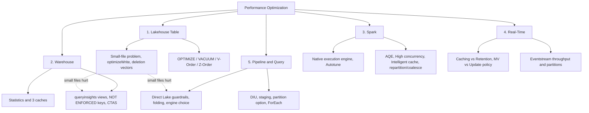

# 11. Performance Optimization

> **Exam domain:** Domain 3 — Monitor and optimize an analytics solution (30–35%)
> **Source:** `certification/11-performance-optimization/` — 5 subtopic files + section index condensed
> **Why the exam cares:** This is the blueprint's **"Optimize performance"** bullet, which names six surfaces by name: lakehouse table, pipeline, data warehouse, Eventstreams and Eventhouses, Spark, and query performance generally. Where topic 10 (Error Resolution) asks "what broke," this asks "it works — make it faster or cheaper." Questions are symptom-to-lever: given a slowdown, pick the one setting, command or design change that fixes it, and know which features are already on by default so you don't waste the answer "enable it."

---

## Orientation — the 60-second version

Microsoft Fabric is a SaaS analytics platform where every workload — Spark notebooks, T-SQL warehouses, KQL real-time stores, Power Query dataflows, data pipelines and Power BI — runs on one shared purchased compute pool (a **capacity**) and reads/writes one shared tenant-wide data lake (**OneLake**). Because every engine ultimately touches the same storage, performance tuning in Fabric splits into two halves: **how the data is physically laid out on disk**, and **how each engine is configured to read it**.

The layout half is almost entirely about Delta Lake file health. Tables accumulate too many small files; `OPTIMIZE` compacts them, `Z-Order` colocates values inside them, `V-Order` re-encodes them for faster reads, and `VACUUM` deletes the leftovers. Get this wrong and the damage shows up everywhere at once — slow Spark scans, slow SQL endpoint queries, and Power BI Direct Lake models that fall back to a slower mode or refuse to refresh at all.

The engine half is five separate toolboxes that do not transfer. A slow Spark job wants partition tuning, the native execution engine, or high concurrency. A slow Warehouse query wants statistics, caching and `NOT ENFORCED` constraints. A slow KQL query wants a time filter and the right caching policy. A slow pipeline wants DIUs, staging, or a set-based redesign instead of a per-row loop. A slow semantic model wants Direct Lake guardrails respected.

The single most exam-relevant pattern: **Fabric's defaults lean toward write throughput and safety, not maximum read speed.** V-Order is off in new workspaces, autotune is off, adaptive target file size is off, auto compaction is off. But AQE, intelligent cache, in-memory/disk caching, automatic statistics and deletion vectors are all **on** — so "enable it" is the wrong answer as often as it is the right one.

## New terms in this topic

| Term | What it actually is |
| :--- | :--- |
| **OneLake** | Fabric's single tenant-wide data lake. Every workspace and item writes into it, so engines read each other's data without copying. |
| **Capacity / SKU / CU** | The purchased compute pool (F2, F4, F64…). All workloads compete for its Capacity Units. Eventstreams need a minimum of **F4**. |
| **Lakehouse** | A Fabric item holding Delta Lake tables plus unstructured files in OneLake, readable by Spark and by a read-only T-SQL endpoint. |
| **SQL analytics endpoint** | The auto-provisioned read-only T-SQL surface over a lakehouse's Delta tables. Shares the Warehouse query engine, statistics, caching and `queryinsights`. |
| **Fabric Warehouse** | The full read/write T-SQL warehouse item. Physical layout (distribution, indexes) is engine-managed — no manual knobs. |
| **`OPTIMIZE`** | Delta command that bin-compacts many small Parquet files into fewer large ones. Solves the small-file problem after the fact. |
| **V-Order** | A Fabric write-time Parquet optimization (VertiPaq-style sort + encode + compress) that stays open-source Parquet compliant. Trades ~15% slower writes for much faster reads. |
| **Z-Order** | Delta clustering that colocates rows with similar values in the chosen columns into the same files, so file-skipping works for multi-column filters. |
| **Liquid clustering** | Newer Delta clustering specified as a table option. Only applies its clustering when `OPTIMIZE` runs — plain writes never cluster. |
| **`VACUUM`** | Delta command that physically deletes files no longer referenced by the transaction log and older than the retention threshold. Bounds time travel. |
| **Deletion vectors** | Row-level tombstones that mark rows deleted/updated without rewriting the whole Parquet file. On by default from Runtime 2.0. |
| **Optimize write** | Pre-write bin-packing: shuffles data into well-sized bins *before* Parquet is written, so small files are never created. |
| **Auto compaction** | Post-write check that synchronously runs `OPTIMIZE` on a partition when it looks too fragmented. |
| **Adaptive target file size** | Heuristic that picks the `OPTIMIZE` target size from table size (128 MB → 1 GB) instead of a fixed value. |
| **Resource profile** | A workspace-level bundle that flips V-Order + optimize write together: `writeHeavy` (default, new workspaces), `readHeavyForSpark`, `readHeavyForPBI`. |
| **Lakehouse Maintenance activity** | A Fabric Data Factory pipeline activity (preview) that runs `OPTIMIZE`/`VORDER`/`VACUUM` on a schedule instead of manual portal clicks. |
| **Monitoring hub** | The portal surface listing item runs across the workspace. Table-maintenance runs appear here as `TableMaintenance` activity entries. |
| **Statistics** | Optimizer objects describing column distribution/cardinality. Fabric creates and refreshes them automatically at query time; manual `CREATE STATISTICS` still exists. |
| **Result-set caching** | Caches the *final output* of a qualifying `SELECT` so repeats skip execution entirely. Long disqualification list; currently disabled tenant-wide. |
| **Query Insights (`queryinsights`)** | A built-in schema of views holding 30 days of query execution history — the primary Warehouse performance-diagnosis surface. |
| **`NOT ENFORCED` constraint** | The only form of `PRIMARY KEY`/`UNIQUE`/`FOREIGN KEY` Fabric Warehouse supports. Helps the optimizer and BI tools; the engine never validates it. |
| **Native execution engine** | Velox + Gluten vectorized C++ execution path for Spark. Preview. Silently falls back to the JVM engine for unsupported operators. |
| **Autotune** | Fabric ML-driven Spark config tuner. Off by default; tunes exactly three configs per query shape. |
| **AQE (Adaptive Query Execution)** | Open-source Spark runtime re-optimization (coalesce partitions, convert to broadcast join, split skew). **On by default in all Fabric runtimes.** |
| **High concurrency mode** | Lets multiple notebooks share one running Spark session instead of each cold-starting its own. |
| **Intelligent cache** | Automatic node-SSD cache of OneLake/ADLS Gen2 file reads. On by default at 50% of node cache size. |
| **Spark Advisor** | Built-in in-notebook advisor that raises a real-time alert when the native execution engine falls back to the JVM. |
| **Environment** | The Fabric item holding Spark pool settings, libraries and Spark properties that notebooks/jobs attach to. |
| **Starter pool / custom pool** | Starter pools are pre-warmed nodes for near-instant session starts; custom pools are your own sized/configured pool, provisioned on demand. A startup-latency-vs-configuration-control tradeoff. |
| **REPL core** | The per-notebook code interpreter each workload gets inside a shared high-concurrency session, keeping execution state isolated between notebooks. |
| **Eventhouse / KQL database** | Fabric's real-time store for event/time-series data, queried with KQL. Data is stored in **extents**. |
| **Caching policy (hot cache)** | Eventhouse policy deciding how much history stays on fast local SSD. Query-**speed** lever. Default 3,650 days. |
| **Retention policy** | Eventhouse policy (`SoftDeletePeriod`) deciding how long data **exists** at all. Default 3,650 days, max 36,500. |
| **Update policy** | KQL mechanism that transforms each ingested batch synchronously as part of ingest. Cost lands per event. |
| **Materialized view** | KQL continuously-maintained aggregation (e.g. `arg_max` dedup). Costs standing background CU; readers get pre-aggregated results. |
| **Partitioning policy** | Opt-in Eventhouse policy grouping extents by a non-time key, trading ingestion/indexing cost for faster filtered queries at very high scale. |
| **Eventstream** | Fabric's no-code streaming pipeline item (source → processor → destination). Has a Low/Medium/High event throughput setting. |
| **OneLake availability** | Eventhouse setting that mirrors KQL data into OneLake as Delta, using adaptive batching (up to 3 h default, 5 min floor). |
| **Query acceleration** | Caches an external/OneLake shortcut's data so it queries at near-native Eventhouse speed. |
| **Copy activity / DIU** | The pipeline data-movement activity. **Data Integration Units** are its unit of compute (CPU + memory + network), 4–256, default Auto. |
| **Staging** | An intermediate store a Copy activity writes through. Required for Fabric Warehouse sinks; optionally used to compress before a slow network hop. |
| **Direct Lake** | Power BI storage mode that reads Delta Parquet in OneLake directly — Import-like speed with no Import refresh, *if* guardrails hold. |
| **Dataflow Gen2 / query folding** | Power Query-based low-code transform item. **Folding** pushes steps back to the source engine; losing it silently makes refreshes much slower. |

## How the pieces fit



- **Every engine trades write cost for read speed somewhere.** V-Order (~15% slower writes, faster reads), result-set caching (background eviction cost, near-instant repeat reads), materialized views (continuous background CU, instant aggregate reads). Optimization is choosing which side of the trade your workload needs.
- **Small files are the root cause behind more symptoms than they get credit for** — slow SQL endpoint queries, Direct Lake guardrail fallback/failure, expensive deletion-vector purges, and degraded Spark parallelism all trace back to file-size health. That is why lakehouse maintenance sits first.
- **Most Fabric performance features default toward safety or write-throughput, not maximum read speed.** Verify the *current* default before assuming a feature is helping.
- **Statistics and caching are automatic almost everywhere.** The exam angle is "know when a manual override is worth it," not "remember to turn caching on."
- **"It's slow" needs a different playbook per engine.** Match the symptom to the right engine before reaching for a fix.

---

## 1. Lakehouse Optimization
*Source: `01-lakehouse-optimization.md`*

Delta tables in a lakehouse accumulate small files and stale versions like any append-heavy storage, and query performance degrades predictably. This section covers `OPTIMIZE`, V-Order, Z-Order and `VACUUM`, the small-file problem they exist to solve, partitioning guidance, the maintenance UI, SQL endpoint statistics, and deletion vectors.

### 1.1 OPTIMIZE and bin-compaction

`OPTIMIZE` groups small files into target-sized bins and rewrites them, reducing file count and metadata overhead on every subsequent read.

```sql
OPTIMIZE dbo.table_name
```

| Property | Description | Default | Session config |
| :--- | :--- | :--- | :--- |
| `minFileSize` | Files smaller than this are grouped and rewritten | 1 GB (`1073741824`) | `spark.databricks.delta.optimize.minFileSize` |
| `maxFileSize` | Target size produced by `OPTIMIZE` | 1 GB (`1073741824`) | `spark.databricks.delta.optimize.maxFileSize` |

`OPTIMIZE` is idempotent by design, but an oversized `minFileSize` causes **write amplification** — a 900 MB file gets rewritten again after even a small extra write, because it is still "small" relative to a 1 GB threshold. Two mitigations exist, both **opt-in**:

- **Fast optimize** (`spark.microsoft.delta.optimize.fast.enabled`) skips bins unlikely to reach a meaningfully compacted size, evaluated against `minNumFiles` (default **50**) and a `parquetCoefficient` (default **1.3**) that accounts for compression gains when merging files. **Not applicable to Z-Order or liquid clustering runs.**
- **File-level compaction targets** (`spark.microsoft.delta.optimize.fileLevelTarget.enabled`) skip recompacting files that already met at least **half** the target size when last compacted, protecting prior compaction work as the adaptive target grows.

```sql
OPTIMIZE dbo.table_name ZORDER BY (column1, column2) VORDER
```

When both clauses are present, Spark applies them in a fixed order: **bin compaction → Z-Order → V-Order**. Z-Order is fully supported in Fabric — it colocates rows with similar values in the Z-Order columns into the same files, improving file-skipping for queries filtering on those columns together (e.g. `date` + `customer_id`). **Liquid clustering**, specified as a table option, works similarly but only applies its clustering policy **when `OPTIMIZE` runs** — regular writes never cluster data, so a compaction schedule (auto compaction or manual `OPTIMIZE`) is required to realize any benefit.

> 🧠 **Mental model —** Three independent layers on the same rewrite: **bin-compaction** decides *how many files* exist (fewer, bigger); **Z-Order** decides *what is colocated inside* them; **V-Order** decides *how each file is internally encoded*. Use one, two or all three — they are not alternatives.

### 1.2 V-Order: write cost vs read benefit

V-Order is a write-time Parquet optimization (VertiPaq-style sorting, encoding, compression) that stays fully open-source Parquet-compliant and composes with Z-Order and standard Delta operations (compaction, vacuum, time travel).

| Aspect | Detail |
| :--- | :--- |
| Where it helps | Read-heavy patterns: dashboarding, interactive analytics, repeated scans |
| Write-time cost | **~15% slower writes** on average |
| Read benefit | Up to **50% more compression**; **40–60% faster cold-cache Power BI Direct Lake queries**; **~10% faster** SQL analytics endpoint / Warehouse reads |
| Scope | File-level — applies per Parquet file, compatible with Z-Order |
| Current default (new workspaces) | **Disabled** — `spark.sql.parquet.vorder.default = false` |

| Level | Mechanism | Notes |
| :--- | :--- | :--- |
| Session | `spark.sql.parquet.vorder.default` (default `false`) | Applies to *all* Parquet writes in the session, including non-Delta Parquet and even Delta tables whose table property is explicitly `false` |
| Table | `TBLPROPERTIES("delta.parquet.vorder.enabled")` (unset by default) | Durable per-table default across sessions; `INSERT`/`UPDATE`/`MERGE` apply it once set |
| Write operation | DataFrame writer option `parquet.vorder.enabled` (unset) | Per-write override, useful for a one-off job against a write-heavy table |

Precedence at write time: **session > table property**. A session with V-Order on will still V-Order-write a table whose property says `false`. Toggling the table property affects **future writes only** — existing Parquet files keep their ordering until the next `OPTIMIZE ... VORDER` or full rewrite.

```sql
-- Enable V-Order for a session (read-heavy workload)
SET spark.sql.parquet.vorder.default = TRUE;

-- Enable V-Order as a durable table default
ALTER TABLE person SET TBLPROPERTIES("delta.parquet.vorder.enabled" = "true");
```

Fabric also exposes **resource profiles** that flip V-Order and optimize write together: `readHeavyForSpark` and `readHeavyForPBI` (V-Order on, optimize write on with a **1 GB bin size** for the PBI profile). New workspaces default to `writeHeavy` (V-Order off, optimize write effectively off for non-partitioned tables).

> ⚠️ **Trap —** Assuming V-Order is on by default because older blog posts say so. **New workspaces default to V-Order disabled** (`writeHeavy` profile) to protect write-heavy ingestion. Read-optimized workloads must opt in explicitly. Check `spark.conf.get('spark.sql.parquet.vorder.default')` before assuming either way.

### 1.3 VACUUM and retention

`VACUUM` removes files no longer referenced by the Delta transaction log and older than the retention threshold — cleanup from `OPTIMIZE` rewrites, overwrites and deletes.

- **Default retention: 7 days.**
- Fabric portal and API maintenance requests **fail by default** for retention intervals under 7 days — a deliberate safety guard, not a bug.
- Shorter intervals require `spark.databricks.delta.retentionDurationCheck.enabled = false` in the Spark environment's properties.

Retention directly bounds time travel — you cannot query a version whose files have been vacuumed away. Shortening below 7 days reduces how far back `RESTORE`, `DESCRIBE HISTORY`, and version/timestamp time travel reach, and can break concurrent long-running readers/writers whose files get removed mid-operation.

> ⚠️ **Trap —** Treating the 7-day retention-check failure as a bug to work around reflexively. The portal/API fail *on purpose*; a shorter window is a real tradeoff against time travel and concurrent-operation safety. Only disable the check after confirming no reader/writer needs that history.

### 1.4 The small-file problem

Small files hurt from two directions: task/scheduling overhead (more file handles to open, plan and process) and metadata overhead (more Delta log entries, more file-skipping decisions). Delta uses file-level metadata for partition pruning and data skipping, so file *size* directly affects skipping efficiency.

| Mechanism | When it acts | What it does | Default |
| :--- | :--- | :--- | :--- |
| **Optimize write** | Before the write lands | Shuffles in-memory data into optimally sized bins before writing Parquet, so fewer/larger files are produced in the first place | Profile-dependent — **off** for non-partitioned tables under default `writeHeavy`; **on (128 MB bins)** for partitioned tables; **on with 1 GB bins** under `readHeavyForPBI` |
| **Auto compaction** | Immediately after a write commits | Evaluates partition health post-write; if fragmentation is excessive, **synchronously** triggers `OPTIMIZE` on just that partition | **Off** by default (`spark.databricks.delta.autoCompact.enabled`, or table property `delta.autoOptimize.autoCompact`) |
| **Adaptive target file size** | At `OPTIMIZE` time (and CTAS/overwrite writes) | Estimates ideal target size from table-size heuristics — **128 MB for tables under 10 GB, scaling linearly up to 1 GB for tables over 10 TB** — instead of a fixed size | **Not enabled** by default; Microsoft recommends enabling `spark.microsoft.delta.targetFileSize.adaptive.enabled` |

Optimize write's bin size is tunable via `spark.databricks.delta.optimizeWrite.binSize`. A durable per-table target unifying `OPTIMIZE`, auto compaction and optimize write is available via the `delta.targetFileSize` table property (byte string, e.g. `256m`).

Auto compaction defaults: `maxFileSize` **128 MB**, `minNumFiles` **50** files below the size threshold before it triggers. From **Runtime 2.0**, `onCheckpointOnly` mode defers the fragmentation evaluation to log-checkpoint time (**roughly every 10 commits**) instead of every write, reducing per-commit overhead.

> 🧠 **Mental model —** Optimize write is a **bouncer at the door** (bad files never get written); auto compaction and scheduled `OPTIMIZE` are **cleanup crews** (fix files afterwards). Optimize write costs a shuffle on every write; post-write compaction costs a rewrite later. Streaming/micro-batch ingestion usually wants auto compaction; large batch jobs that tolerate a shuffle usually want optimize write.

### 1.5 Partitioning: when and at what cardinality

Partitioning creates a separate physical folder per distinct value, letting filtered queries skip entire folders rather than individual files.

| Choose | When |
| :--- | :--- |
| **Partitioning** | Low-cardinality column (dozens to low thousands of distinct values), queries frequently filter on it alone, each partition holds enough data to produce reasonably sized files |
| **Z-Order** | Higher-cardinality columns, or queries filter on *combinations* of two or more columns together, and coarse folder-level pruning is not selective enough |
| **Neither** | Table is small enough that full scans are already fast, or filter columns change too often to commit to a physical layout |

Over-partitioning (high cardinality, or a long tail of rarely-queried values) recreates the small-file problem one level up — too few rows per partition to produce a well-sized file, plus partition-folder metadata overhead. Write-side syntax is `.write.partitionBy(...)`.

### 1.6 Table maintenance UI and SQL endpoint statistics

From **Lakehouse Explorer**, right-click a table (or use the ellipsis) → **Maintenance** opens the **Run maintenance commands** dialog:

- **Optimize** toggle — compacts small files; when on, an **Apply V-Order** checkbox applies V-Order in the same rewrite
- **Vacuum** toggle — runs `VACUUM` with the retention behaviour above
- A third toggle merges transactions into Parquet files and removes obsolete deletion-vector files, reclaiming space from accumulated row-level tombstones

Maintenance applies to **Delta tables only** — legacy Hive tables (Parquet/ORC/AVRO/CSV without Delta) are **not supported**. Runs are trackable via the **Notifications** pane or **Monitoring hub**, filtering for `TableMaintenance` activity entries. For recurring maintenance, the **Lakehouse Maintenance activity** (a Fabric Data Factory pipeline activity, **in preview**) exposes the same `OPTIMIZE`/`VORDER`/`VACUUM` options and can be chained with data loads and a **Refresh SQL Endpoint** activity in one pipeline.

The lakehouse **SQL analytics endpoint shares the Warehouse statistics engine** (§2.1): statistics are **automatically created and refreshed at query time** for columns used in `GROUP BY`, `JOIN`, `WHERE` and `ORDER BY`, with no manual step. Manual `CREATE STATISTICS`/`UPDATE STATISTICS` is also supported against the endpoint, to pre-warm ahead of a known heavy workload rather than pay the cost synchronously on first query.

### 1.7 Deletion vectors

Deletion vectors mark rows as deleted (or updated-away) without rewriting the whole Parquet file — a lightweight row-level tombstone. **Enabled by default starting in Fabric Spark Runtime 2.0 (Delta 4.1).**

- **Benefit:** `DELETE`, `UPDATE` and `MERGE` touching a small fraction of rows in a large file skip the full rewrite.
- **Maintenance:** `OPTIMIZE` automatically purges files where **more than 5%** of records are referenced by deletion vectors, folding cleanup into routine compaction.
- **File-size interaction:** oversized files make deletion-vector cleanup *more* expensive — a poorly sized file accumulates more tombstoned rows before its 5% purge threshold triggers a full rewrite. The 128 MB–1 GB adaptive target matters more, not less, once deletion vectors are active.

### 1.8 Common issues — lakehouse

| Issue | Cause | Resolution |
| :--- | :--- | :--- |
| Nightly ingestion job slowed down after no code changes | V-Order enabled at session or table level, adding ~15% write cost | Disable V-Order for the ingestion session/table; apply it later via a scheduled `OPTIMIZE ... VORDER` pass |
| `VACUUM` fails with a retention-interval error | Requested retention under the 7-day default with the safety check still enabled | Use 7+ days, or set `spark.databricks.delta.retentionDurationCheck.enabled = false` after confirming no reader/writer needs the history |
| Query performance degrades gradually on a frequently-updated table, no schema changes | Small-file accumulation from frequent small writes | Enable optimize write and/or auto compaction, or schedule `OPTIMIZE` |
| `MERGE`/`UPDATE` latency climbing on a large table | Files far outside the adaptive target size range, inflating any full-file rewrite including deletion-vector purges | Run `OPTIMIZE` to bring files into the 128 MB–1 GB adaptive range |
| Time travel to a version from 10 days ago fails | Default 7-day `VACUUM` retention (or a shortened custom one) already removed the files | Query within the active retention window; increase retention going forward if longer time travel is required |

---

## 2. Warehouse Optimization
*Source: `02-warehouse-optimization.md`*

Fabric Data Warehouse — and the lakehouse SQL analytics endpoint, which shares the same query engine — optimizes automatically in more places than most engineers expect. This section covers what is automatic, what is still manually tunable, how to read performance history through Query Insights, and the table-design choices that influence the optimizer.

### 2.1 Statistics: automatic and manual

The optimizer estimates plan cost using statistics — objects describing distribution and cardinality. Whenever a query needs statistics the optimizer does not have, Fabric creates them **synchronously as part of that query's execution**, so the first query touching a "cold" column pays extra latency while stats are built. Auto-generated statistics come in three types, all visible in `sys.stats`:

| Type | Trigger | Naming |
| :--- | :--- | :--- |
| Histogram statistics | Column referenced in `GROUP BY`, `JOIN`, `DISTINCT`, `WHERE` or `ORDER BY` | `_WA_Sys_` prefix |
| Average column length | `VARCHAR` column wider than **100 characters** | `ACE-AverageColumnLength_` prefix |
| Table cardinality | Row-count estimate needed for a table | `ACE-Cardinality` |

Two built-in optimizations keep them fresh cheaply:

- **Incremental statistics refresh** — for large, mostly-`INSERT` tables, only rows added since the last refresh are sampled and merged into the existing histogram, instead of rescanning the whole column.
- **Proactive statistics refresh** — a fully managed process that frontloads refreshes after data changes, to avoid a `SELECT` stalling on a synchronous refresh. **Enabled by default**, configurable via `ALTER DATABASE`.

`CREATE STATISTICS`, `UPDATE STATISTICS` and `DROP STATISTICS` are supported for **single-column, histogram-based** statistics only — **multi-column statistics are not supported**.

```sql
-- Create statistics with a full scan on a heavily filtered/joined column
CREATE STATISTICS DimCustomer_CustomerKey_FullScan
ON dbo.DimCustomer (CustomerKey) WITH FULLSCAN;

-- Manually refresh after a large data change
UPDATE STATISTICS dbo.DimCustomer (DimCustomer_CustomerKey_FullScan) WITH FULLSCAN;
```

Prioritize manual statistics on columns heavily used in `GROUP BY`, `ORDER BY`, filters and joins — especially right after a bulk load, where paying the `FULLSCAN` cost once deliberately beats the first production query paying a synchronous auto-create cost.

> 🧠 **Mental model —** Automatic statistics are a **smoke detector** (reactive, fires exactly when needed). Manual statistics are a **fire drill** (you choose the timing, so the cost lands when convenient rather than when a user is waiting).

### 2.2 Caching: in-memory, disk and result-set

| Cache | Scope | Configurable? | Persists across |
| :--- | :--- | :--- | :--- |
| **In-memory cache** | Transcoded, compressed columnar data from the most recently accessed files | **No** — always on, fully transparent | Session boundaries, until evicted (LRU-style) |
| **Disk (SSD) cache** | Overflow extension of the in-memory cache for datasets too large to fit in memory | **No** — always on | Longer than in-memory; data demoted from memory lands here before being re-read from remote storage |
| **Result-set caching** | Final result sets of qualifying `SELECT` queries | **Yes** — item-level and query-level | Up to **24 hours of inactivity**; invalidated **immediately** on any change to referenced tables |

In-memory and disk caching apply **regardless of data origin** — warehouse tables, OneLake shortcuts, and even shortcuts to non-Azure sources are all cached the same way. Eviction and DML consistency are fully automatic, with **no user-facing clear or disable control**.

> ⚠️ **Trap —** As of **2026-02-16**, Microsoft **disabled result-set caching tenant-wide** as a known issue (a bug could return stale results). Everything below is how the feature is *documented* to behave, but it is not currently live for any tenant. Check the known-issues page (`aka.ms/fabricdwrscki`) before assuming a `result_cache_hit = 0` means a disqualified query rather than the feature being off entirely.

Documented behaviour: **enabled by default at the item level** for both Warehouse and lakehouse SQL analytics endpoints; disable per item or per query.

```sql
-- Check current setting
SELECT name, is_result_set_caching_on FROM sys.databases WHERE database_id = db_id();

-- Disable at the item level
ALTER DATABASE <Fabric_item_name> SET RESULT_SET_CACHING OFF;
```

```sql
-- Disable for a single query (debugging or A/B testing)
SELECT ... OPTION ( USE HINT ('DISABLE_RESULT_SET_CACHE') );
```

Check usage via `result_cache_hit` in `queryinsights.exec_requests_history`: **`2` = cache hit, `1` = this run created the cache, `0` = not applicable.**

**Disqualifying query shapes** — a query commonly fails to qualify if it:

- Is not a pure `SELECT` (CTAS, `SELECT INTO`, any DML)
- References **fewer than 100,000 rows** in every table, or is estimated to return **more than 10,000 result rows**
- Uses runtime constants (`GETDATE()`, `CURRENT_USER`), non-deterministic functions, or window/ordered aggregate functions
- Uses `VARCHAR(MAX)`/`VARBINARY(MAX)` output, or a `CAST`/`CONVERT` involving **date** or **sql_variant**
- Uses row-level security, dynamic data masking, or other security features; uses time travel; is a cross-database query
- Runs inside an explicit transaction or a `WHILE` loop, or has session-level `SET` options at non-default values

> ⚠️ **Trap —** Assuming result-set caching applies to any repeated query. A report query returning 15,000 rows, or one including `GETDATE()` for a "last refreshed" column, **silently never qualifies**. Verify with `sys.databases.is_result_set_caching_on` for your own item rather than assuming the documented default is live for you.

### 2.3 Query Insights

The `queryinsights` schema (visible under **Schemas → queryinsights → Views** in Fabric Explorer) holds historical, per-user query execution data for **30 days**. Completed queries can take **up to 15 minutes** to appear — longer under heavy concurrent load.

| View | Purpose |
| :--- | :--- |
| `queryinsights.exec_requests_history` | Per-completed-query details: CPU time, data scanned (memory/disk/remote), `result_cache_hit`, query text, `query_hash` |
| `queryinsights.exec_sessions_history` | Per-completed-session details |
| `queryinsights.long_running_queries` | Queries aggregated by execution time |
| `queryinsights.frequently_run_queries` | Queries aggregated by run frequency |
| `queryinsights.sql_pool_insights` | Pool-level resource allocation, configuration changes and pressure indicators |

Queries are aggregated by **query shape** via `query_hash` — same structure, different literal predicate values count as the same query. Useful for spotting a parameterized report query that is slow across every filter value.

> 📌 **Remember —** Use `queryinsights.frequently_run_queries` and `queryinsights.long_running_queries` **together** to prioritize tuning effort. A moderately slow query that runs 1,000 times a day usually matters more than a rare, very slow one — neither view alone tells you that.

```sql
-- Top CPU consumers
SELECT TOP 100 distributed_statement_id, query_hash, allocated_cpu_time_ms, label, command
FROM queryinsights.exec_requests_history
ORDER BY allocated_cpu_time_ms DESC;

-- Cache-vs-remote-storage read comparison
SELECT distributed_statement_id, query_hash, data_scanned_remote_storage_mb,
       data_scanned_memory_mb, data_scanned_disk_mb, label, command
FROM queryinsights.exec_requests_history
ORDER BY data_scanned_remote_storage_mb DESC;
```

> 📌 **Remember —** `data_scanned_*` values show **`0` for `COPY INTO` statements**, and do not necessarily account for data moved during intermediate query stages. A large gap between reported scan size and observed runtime points to intermediate shuffle cost, not storage I/O.

### 2.4 Clustering, distribution and load patterns

Fabric Warehouse does **not** expose the manual distribution/index knobs of a classic dedicated SQL pool (hash/round-robin distribution, clustered columnstore tuning) — physical layout is engine-managed. The remaining levers are architectural:

- **CTAS (`CREATE TABLE AS SELECT`)** — the preferred bulk transform-and-load pattern: fully parallel, produces a fresh optimizer-friendly layout in one pass. Use for large rebuilds, dimension reloads, or transformations cheaper to reconstruct wholesale than to patch.
- **`INSERT ... SELECT`** — incremental, set-based appends: still parallel, does not rewrite existing data. Right when only new rows need to land.
- **Row-by-row `INSERT`** (one statement per record, typically from an external orchestration loop) **does not scale** in a distributed, set-based engine. It is the same anti-pattern as `ForEach`-wrapped per-row pipeline activities (§5.5).

> 🧠 **Mental model —** CTAS is **pouring a fresh concrete slab** (brand-new optimal layout, whole thing rebuilt). `INSERT ... SELECT` is **adding a room onto an existing house** (faster for small additions, but existing layout inefficiencies stay). CTAS when logic changed or layout degraded; `INSERT` for routine incremental loads.

### 2.5 NOT ENFORCED constraints

Fabric Warehouse supports `PRIMARY KEY`, `UNIQUE` and `FOREIGN KEY` constraints **only in `NOT ENFORCED` form**:

| Constraint | Required modifiers |
| :--- | :--- |
| `PRIMARY KEY` | `NONCLUSTERED` **and** `NOT ENFORCED` |
| `UNIQUE` | `NONCLUSTERED` **and** `NOT ENFORCED` |
| `FOREIGN KEY` | `NOT ENFORCED` |

Constraints can only be added via `ALTER TABLE` — **never inline in `CREATE TABLE`**.

```sql
CREATE TABLE PrimaryKeyTable (c1 INT NOT NULL, c2 INT);

ALTER TABLE PrimaryKeyTable
  ADD CONSTRAINT PK_PrimaryKeyTable PRIMARY KEY NONCLUSTERED (c1) NOT ENFORCED;
```

The engine never validates uniqueness or referential integrity at write time — duplicate keys and orphaned foreign keys can exist without error. Two reasons to declare them anyway:

- **Query optimizer hints** — a declared (even unenforced) key relationship gives the optimizer extra cardinality and join-elimination information, improving plan quality for joins across those tables.
- **Downstream BI tooling** — Power BI and other semantic-layer tools use declared relationships to infer joins and cardinality automatically, avoiding manual relationship configuration.

> ⚠️ **Trap —** Declaring a `NOT ENFORCED` primary key on a column that is not actually unique, then wondering why join results look wrong. Bad data silently violates it, and an optimizer that trusts the declared uniqueness for cardinality estimation can produce a plan — or results — assuming uniqueness that does not hold. The performance benefit depends on the declaration being **true**, not just present.

### 2.6 Table design for performance

- **Choose data types that match the domain** — a `VARCHAR(20)` for a fixed-format code is cheaper to store, compare and build statistics on than a habitual `VARCHAR(MAX)`.
- **Avoid `VARCHAR(MAX)`/`VARBINARY(MAX)` unless genuinely needed** — beyond storage cost, these types **disqualify a query from result-set caching entirely**.
- **Watch average-column-length statistics** on wide `VARCHAR` columns (>100 characters) — a table full of oversized text columns generates more statistics overhead than a normalized design would.

### 2.7 Common issues — warehouse

| Issue | Cause | Resolution |
| :--- | :--- | :--- |
| First query against a newly loaded table is unexpectedly slow | Synchronous automatic statistics creation on cold columns | Expected one-time cost; pre-warm with `CREATE STATISTICS ... WITH FULLSCAN` after bulk loads |
| A qualifying-looking `SELECT` never shows a result-set cache hit | Query trips a documented disqualifier (row count, runtime constants, wide types, security features…) | Check `queryinsights.exec_requests_history.result_cache_hit` against the disqualification list |
| Fact-to-dimension join produces unexpected duplicate rows | A `NOT ENFORCED` primary/unique key declared but the data is not actually unique | Fix the data quality issue; the constraint will not catch it |
| Query plan badly misestimates row counts on a large text column | Missing or stale average-column-length statistics on a wide `VARCHAR` | `UPDATE STATISTICS` on the column, or reduce column width if `MAX`/oversized types are unnecessary |
| Row-by-row `INSERT` loop from an external orchestrator is far slower than expected | Fabric Warehouse is a distributed, set-based engine — single-row inserts do not parallelize | Replace with CTAS or set-based `INSERT ... SELECT` |

---

## 3. Spark Optimization
*Source: `03-spark-optimization.md`*

Spark performance in Fabric is shaped at three levels — session/query config, pool/environment settings, and workspace-wide resource profiles — plus four Fabric-specific accelerators layered on open-source Spark.

### 3.1 Native execution engine

- **What it is:** Velox + Gluten vectorized C++ execution path that offloads supported operators off the JVM.
- **Status:** **preview**, supported on **Runtime 1.3 (Spark 3.5)** and **Runtime 2.0 (Spark 4.1)**; requires **no code changes**.
- **Enable:** environment-level via the **Acceleration** tab toggle (all jobs/notebooks inherit it), or session-level via `spark.native.enabled = true` in the first notebook cell / Spark Job Definition.
- **When it helps most:** computationally intensive queries over Parquet/Delta with complex transformations and aggregations — **not** simple or I/O-bound queries.
- **Fallback:** automatic and **silent** by default — an unsupported operator or expression reverts to the JVM engine with no interruption. **Fabric Spark Advisor** raises a real-time alert in the notebook cell when a fallback happens, and Spark UI query plans show *Transformer*/`NativeFileScan`/`VeloxColumnarToRowExec`-suffixed nodes (**green** in the Query Execution Graph) for anything the native engine actually handled.
- **Unsupported (falls back):** structured streaming, JSON/XML, ANSI mode.

> 🧠 **Mental model —** A **fast lane on a highway**. Supported operators get routed onto it automatically; unsupported ones merge back into the regular lane without you doing anything. The question is never "did I route traffic correctly," it is "how much of my traffic *can* use the fast lane" — which the Spark UI node colouring answers.

### 3.2 Autotune

| Aspect | Detail |
| :--- | :--- |
| Status | **Preview**, available in all production regions |
| Default | **Off** — `spark.ms.autotune.enabled = false` |
| Enable | Environment-level (all jobs inherit) or single-session: `spark.conf.set('spark.ms.autotune.enabled', 'true')` |
| Best for | Repetitive queries, long-running queries (**>15 seconds**), Spark **SQL API** (not RDD API) |
| Incompatible with | **Runtime versions after 1.2**, **high concurrency mode**, **private endpoints** |

Autotune tunes exactly **three** configs:

| Config | Purpose | Default |
| :--- | :--- | :--- |
| `spark.sql.shuffle.partitions` | Partition count for shuffles during joins/aggregations | **200** |
| `spark.sql.autoBroadcastJoinThreshold` | Max table size to broadcast during a join | **10 MB** |
| `spark.sql.files.maxPartitionBytes` | Max bytes packed per partition when reading files (Parquet/JSON/ORC) | **128 MB** |

It works iteratively: start from defaults → generate candidate configurations around a baseline → predict the best candidate with a model trained on prior runs → apply and execute → feed results back. Built-in **regression detection** skips tuning when a run looks anomalous (unusually large data volume, for example). Convergence typically takes **20–25 iterations**. Driver logs prefixed `[Autotune]` show per-query recommendations and status codes (`AUTOTUNE_DISABLED`, `QUERY_DURATION_TOO_SHORT`, `QUERY_TUNING_SUCCEED`, etc.).

> ⚠️ **Trap —** Enabling autotune and expecting immediate gains on a one-off query. It needs a *repeated query shape* and ~20–25 iterations to converge. It is also **silently incompatible** with high concurrency mode and any runtime past 1.2 — enabling it on an incompatible session does nothing and **produces no error** to flag the mismatch.

### 3.3 Pool startup latency and executor sizing

**Starter pools** are pre-warmed for near-instant session starts; **custom pools** provision on demand unless a session-sharing mechanism (high concurrency mode) is in play. The choice is a **startup-latency-vs-configuration-control** tradeoff, not a raw compute-performance one.

### 3.4 Adaptive Query Execution (AQE)

AQE re-optimizes a query plan at runtime using statistics from completed shuffle/broadcast stages — information not available at compile time. **AQE is enabled by default in all Fabric runtimes.**

At runtime AQE:

- **Coalesces post-shuffle partitions** — merges small shuffle partitions to avoid excessive task overhead
- **Converts sort-merge joins to broadcast joins** when runtime statistics show one side is small enough
- **Detects and splits skewed partitions** (`spark.sql.adaptive.skewJoin.enabled`) so one oversized partition does not bottleneck a stage

The native execution engine **preserves AQE, cost-based rewrites, column pruning and predicate pushdown** when it offloads operators — these optimizer behaviours stay active regardless of which engine executes an operator.

> ⚠️ **Trap —** Treating a question about "enabling AQE" as requiring an action. AQE ships **on by default**. A skew-slowness scenario usually wants you to recognize `spark.sql.adaptive.skewJoin.enabled` (already on) or reason about *why* AQE is not fully absorbing the skew (extreme skew beyond dynamic partition splitting, needing manual salting) — not to "turn AQE on."

### 3.5 Broadcast joins and hints

`spark.sql.autoBroadcastJoinThreshold` (**default 10 MB**) controls the max size Spark will automatically broadcast to every worker instead of shuffling both sides. When the optimizer's size estimate is wrong (common after a filter not reflected in stale statistics), force it:

```python
from pyspark.sql.functions import broadcast
result = large_df.join(broadcast(small_df), "join_key")
```

AQE's runtime join-conversion reduces how often a manual hint is needed — it can promote sort-merge to broadcast mid-query once real shuffle statistics exist, even when the compile-time estimate said no.

### 3.6 Caching: DataFrame cache vs intelligent cache

| Mechanism | Layer | Scope | Manual control |
| :--- | :--- | :--- | :--- |
| `df.cache()` / `df.persist()` | Spark DataFrame/RDD | A specific DataFrame reused multiple times in one job/session | **Yes** — explicit, and must be unpersisted when no longer needed |
| **Intelligent cache** | Spark node (SSD) | Any file read from OneLake or ADLS Gen2 via shortcut | **No** — on by default, self-managing |

Intelligent cache is **enabled by default for all Spark pools** with **50% of node cache size** allocated, and reports up to a **60% performance improvement** on subsequent reads of already-cached files. It automatically detects source-file staleness (comparing remote storage tags) and refreshes, and evicts least-recently-read data when the allocation fills — no code change required.

`df.cache()`/`persist()` remains the right tool when a DataFrame is the *result of an expensive transformation* (not just a raw file read) reused multiple times downstream in the same job — intelligent cache only helps at the file-read layer, not for materializing intermediate computed results.

> 🧠 **Mental model —** Intelligent cache is a **library keeping popular books on the front shelf** (no request needed). `df.cache()` is **checking a book out onto your desk** — a deliberate choice for a specific expensive-to-recompute result.

### 3.7 Partition tuning: repartition() vs coalesce()

`spark.sql.shuffle.partitions` (**default 200**, autotune-adjustable) sets the partition count Spark targets after a shuffle (join, `groupBy`, wide aggregation).

| Method | Shuffle? | Direction | Use when |
| :--- | :--- | :--- | :--- |
| `repartition(n)` | **Full shuffle** | Increase or decrease, evenly rebalanced | Data is skewed across current partitions, or you need *more* partitions for parallelism before a wide operation |
| `coalesce(n)` | **No full shuffle** (merges adjacent partitions) | **Decrease only** | Reducing partition count after a filter that dropped most rows, especially right before a write, to avoid a small-file explosion |

`coalesce()` is cheaper because it avoids a full shuffle, but it cannot fix skew or increase partition count. Common pattern: filter a large DataFrame to a small result, then `coalesce(1)` (or a small number) before writing.

### 3.8 optimizeWrite and bin-size configs

The Delta-side small-file mechanics (`optimizeWrite`, `optimizeWrite.binSize`, adaptive target file size, resource profiles) are in §1.4. The Spark angle: these are `spark.conf.set(...)` **session properties** (or environment-level Spark properties) exactly like every other knob here, so they compose with `shuffle.partitions`, autotune and resource profiles in the same session.

### 3.9 High-concurrency session reuse

High concurrency mode lets compatible Spark workloads share one running session instead of each starting its own.

- **Session sharing requires:** single-user boundary, same default Lakehouse, same Spark compute settings.
- **Session start can be up to 36x faster** for custom pools in high concurrency mode, because subsequent workloads join an already-running session.
- Each workload gets its own **REPL core** (a per-notebook code interpreter) with isolated execution state; executors are allocated via **FAIR scheduling** across REPL cores to reduce starvation.
- **Default sharing limit: 5 notebooks per session**; tunable up to **50** via `spark.highConcurrency.max` on the shared Environment.
- **Only the initiating notebook/pipeline activity is billed** for Spark compute — subsequent shared sessions are not billed separately.

| Scenario | Recommended action |
| :--- | :--- |
| Large-scale parallel pipelines with many notebook activities | Increase `spark.highConcurrency.max` to reduce session fragmentation |
| Peak-load interactive workloads, many concurrent users | Increase the limit to improve session acquisition time |
| Cost-sensitive workloads where dense packing helps | Tune the limit to match concurrency requirements |
| Strict isolation requirements | Keep the default limit of 5 or lower |

### 3.10 Spark symptom → lever

| Symptom | Most likely lever | Why |
| :--- | :--- | :--- |
| Notebook slow but correct, heavy joins/aggregations over Parquet/Delta | Native execution engine | Vectorized C++ path speeds up exactly this pattern; verify offload via Spark UI |
| Same recurring query shape keeps needing manual `shuffle.partitions`/broadcast tuning | Autotune | Built for repetitive, long-running queries; converges over ~20–25 iterations |
| One partition/task runs far longer than its peers in the same stage | AQE skew-join handling (**already on**) | Investigate why AQE is not absorbing the skew — extreme skew may need manual salting |
| Join slow despite one side being small | Broadcast threshold or hint | Force with `broadcast()`, or trust AQE's runtime join conversion |
| Many small output files after a heavy filter | `coalesce()` before write | Cheaper than `repartition()`, avoids a full shuffle |
| Repeated session-start latency across many parallel notebooks | High concurrency + `spark.highConcurrency.max` | Session sharing avoids cold starts; up to 36x faster |
| Repeated reads of the same OneLake/ADLS shortcut files still slow | Confirm intelligent cache is actually on for the pool | On by default, but a custom pool policy could have altered it |

> 🧠 **Mental model —** The four accelerators **stack**, they are not alternatives. A notebook can run on a high-concurrency shared session, with intelligent cache handling file reads, AQE re-optimizing shuffles, and the native execution engine offloading operators, all at once. Troubleshooting means checking which layer is *not* engaged, not picking one to enable.

### 3.11 Common issues — Spark

| Issue | Cause | Resolution |
| :--- | :--- | :--- |
| Native execution engine shows no improvement | Query uses unsupported operators/formats (structured streaming, JSON/XML, ANSI mode) and silently falls back to JVM | Check Spark UI for *Transformer*/`NativeFileScan` nodes, or Fabric Spark Advisor alerts, to confirm actual offload |
| Autotune enabled but no tuning applied | Session uses high concurrency mode, a private endpoint, or a runtime past 1.2 — all incompatible | Disable the incompatible feature for that session, or accept manual tuning |
| Write produces hundreds of tiny files after a heavy filter | Original partition count (e.g. 500) carried into a much smaller result set | `coalesce()` to a small partition count before the write |
| Join unexpectedly slow despite one side being small | Compile-time size estimate exceeded `autoBroadcastJoinThreshold` due to stale statistics | Force with an explicit `broadcast()` hint, or rely on AQE runtime join conversion |
| Parallel pipeline notebooks queue waiting for session capacity | Default high-concurrency sharing limit (5) reached | Increase `spark.highConcurrency.max` up to 50 on the shared Environment |

---

## 4. Real-Time Optimization
*Source: `04-realtime-optimization.md`*

Eventhouse and Eventstream tuning revolves around two independent policy knobs (caching and retention), an ingestion-path tradeoff (streaming vs queued), and a few capacity/scaling settings most workloads never touch.

### 4.1 Caching policy vs retention policy

Both are configured from the same **Manage → Data policies** screen on a KQL database and both default to the same number — but they control entirely different things.

| Policy | Controls | Default | Effect when data ages past the threshold |
| :--- | :--- | :--- | :--- |
| **Caching policy** | Which data stays on local SSD ("hot cache") for fast query access | **3,650 days** | Data moves to **cold storage** (cheaper, reliable, slower) — still queryable, just slower |
| **Retention policy** | How long data exists in the table/materialized view at all (`SoftDeletePeriod`) | **3,650 days** (max **36,500 days**) | Data is **permanently removed** — no longer queryable at any speed |

Both are set per-database (or per-table) via `.alter-merge` policy commands or the portal's Data policies UI, and both can be set to **Unlimited**.

> 🧠 **Mental model —** Caching policy is a **thermostat** (how much history stays warm vs goes cold). Retention policy is a **shredder** (how much history exists at all). You can have a short cache window and long retention — recent data fast, old data slow-but-queryable, cost-optimized for occasional historical lookups. The reverse never makes sense: once retention purges data there is nothing left to cache.

If dashboards only query the last 7 days but the caching policy sits at the 3,650-day default, you are paying SSD cost to keep years of rarely-queried data hot for no latency benefit. **Right-sizing the caching policy to actual query patterns is the performance lever; shrinking retention is a data-lifecycle decision, not a performance one.**

> ⚠️ **Trap —** Shortening the **retention** policy to speed up queries. Retention does not control query speed at all. Trimming retention to 30 days leaves last-week queries unaffected (already fast, already in hot cache) while permanently destroying everything older than 30 days for zero performance gain.

### 4.2 Streaming vs queued ingestion

| Ingestion mode | Latency | Throughput | Per-event overhead | Best fit |
| :--- | :--- | :--- | :--- | :--- |
| **Streaming** | Sub-second to low seconds | Lower ceiling | **Higher** — each small batch committed individually | Low-to-moderate event rates where latency matters more than raw throughput |
| **Queued** | Seconds to minutes (batched) | **Much higher ceiling** | **Lower** — batching amortizes commit overhead across many events | High-volume ingestion where a small latency tax is acceptable for efficiency at scale |

Decision rule: as event volume grows, queued ingestion's batching efficiency matters more than streaming's latency advantage. A table ingesting a handful of events per second rarely justifies streaming's overhead tradeoff at scale.

### 4.3 Materialized views vs update policies — cost profile

| Mechanism | When it runs | Where the cost lands | Typical use |
| :--- | :--- | :--- | :--- |
| **Update policy** | Once per ingested batch, **synchronously as part of ingest** | Folded into the ingestion path — every event pays a small transform cost | Parsing, typing, enriching raw events as they land (no aggregation state to maintain) |
| **Materialized view** | Continuously, as a **background aggregation process** | Dedicated, ongoing background CU consumption, **independent of query volume** | Deduplication (`arg_max`) or a rolling aggregate many queries read repeatedly, so paying the aggregation once beats every querier re-aggregating raw data |

> 🧠 **Mental model —** An update policy is **tipping per delivery** (small predictable cost on every event). A materialized view is **a subscription** (standing background cost whether or not anyone queries, justified because it saves *every* querier the same work).

**Both mechanisms require the source to be a native table.** You cannot apply an update policy or materialized view directly against an accelerated OneLake shortcut, so a hybrid architecture (native ingestion table feeding a shortcut-backed archive) needs its transform/aggregation layer built on the native side.

### 4.4 Partitioning policy

An Eventhouse table's partitioning policy controls how the engine organizes **extents** (the underlying storage unit) beyond the default time-based grouping that happens automatically from ingestion order. Configured via `.alter-merge table policy partitioning`, it groups extents by a specified key (commonly a high-cardinality identifier used in frequent point-lookup or filter queries), trading extra ingestion/indexing overhead for faster filtered queries at very high scale.

- **Default:** no explicit partitioning policy — extents are grouped primarily by **ingestion time**, and time-range filters already prune effectively with zero configuration.
- **When to add one:** very high-scale tables where queries filter heavily on a specific **non-time** column (tenant ID, device ID) and time-based pruning alone is not selective enough.
- **Cost:** additional indexing work at ingestion time — not a free win, reserved for tables where the query-side benefit clearly outweighs it.

Most exam scenarios rely on the *default* time-based extent organization — treat an explicit partitioning policy as a targeted, high-scale optimization, never a default recommendation.

### 4.5 KQL query best practices

- **Filter early on `ingestion_time` or the table's timestamp column.** Extents carry implicit time-range metadata from ingestion order, so a time-bounded filter early lets the engine skip whole extents before scanning any rows — **the single highest-leverage query optimization available, with zero configuration.**
- **Avoid unbounded time ranges.** No time filter (or an extremely wide one) forces a scan across the entire retention window's extents.
- **Avoid cross-cluster/cross-database queries where possible.** Federated queries move data across the network to a coordinating node before processing, inherently more expensive than a single-database query.
- **Push aggregation into materialized views** for repeated dashboard queries rather than re-aggregating raw data on every refresh.
- **Project only the columns the query needs, as early as possible.** Columnar storage makes unreferenced columns cheap to skip, but only if the query does not carry them through intermediate steps first.

```kql
// Good: time filter first, then narrow columns, then the business filter
Events
| where Timestamp between (ago(1h) .. now())
| project Timestamp, DeviceId, Value
| where DeviceId == "sensor-042"
```

> ⚠️ **Trap —** Filtering on a business column (`customer_id == "X"`) with **no time-range filter**, assuming the engine will infer the window. Without an explicit time filter KQL has no basis to skip extents by time — it scans the full retention window before the non-time filter is even applied.

### 4.6 OneLake availability — performance cost

Enabling OneLake availability does **not** slow ingestion into the Eventhouse itself. The **adaptive batching** mechanism that delays the OneLake Delta copy (**up to 3 hours by default, configurable down to a 5-minute floor via `TargetLatencyInMinutes`**) runs asynchronously specifically to avoid producing many small, inefficient Parquet files in OneLake. The tradeoff is entirely on the **consumption** side: a shorter `TargetLatencyInMinutes` gets fresher data into OneLake sooner, at the cost of smaller, less-optimal Parquet files for anything reading that copy (Spark, SQL endpoint, Direct Lake) — the same small-file tradeoff as §1.4.

### 4.7 Query acceleration — recap

Query acceleration caches an external shortcut's data at native-table speed. Its documented constraints: a **900-column limit**, a **2.5-million-file degradation threshold**, a **6 GB per-file cache exclusion**, and a **Hot-property billing model**. The performance framing: query acceleration is the lever when a workload needs native-table query speed against data that must physically live outside the Eventhouse (a OneLake shortcut or external source). Without it, shortcut-backed tables query at the underlying source's native speed, not Eventhouse-native speed.

### 4.8 Eventstream throughput units and scaling

Fabric recommends a **minimum of F4 capacity** for eventstreams workloads. Scaling is governed by the **event throughput setting (Low/Medium/High)**, which optimizes performance for the eventstream's sources and destinations, combined with automatic CU autoscaling as traffic grows.

For the **Eventstream Processor**, CU consumption correlates with three factors together: event traffic throughput, transform/processing logic complexity, and the **input data's partition count**. At the **Low** throughput setting, the processor's CU rate starts at **one-third of a base rate (0.778 CU-hours)** and autoscales upward through **two-thirds base (1.555)**, **one base (2.333)**, **two bases**, and **four bases** as load increases.

| Source type | Throughput ceiling |
| :--- | :--- |
| Generic streaming connector sources | Up to **30 MB/s** |
| Azure Event Hubs, source partition count **< 4** | **Bottlenecked by partition count**, regardless of the selected throughput level |
| Azure Event Hubs, source partition count **4 / 16 / 32** | Throughput depends on the selected level (Low/Medium/High) |

> ⚠️ **Trap —** Raising the Eventstream's throughput level to fix low ingestion speed from an Azure Event Hubs source with fewer than 4 partitions. Below 4 source partitions, **partition count is the bottleneck** — increasing the throughput setting does nothing until the Event Hub itself is repartitioned to 4 or more partitions.

### 4.9 Processor operator efficiency and destination batching

- **Processor operator efficiency:** every added transform operator (filters, aggregations, enrichments) in an Eventstream's processing pipeline increases CU consumption on top of the base throughput-driven rate. Keep the operator graph as simple as the use case allows, and align input partition count to actual throughput needs, so CU cost stays proportional to genuine processing work rather than pipeline complexity.
- **Destination batching:** Eventstream destinations (Eventhouse, Lakehouse, Warehouse, etc.) **batch incoming events before committing them**, for the same reason Delta's optimize write batches records — fewer, larger writes instead of many small ones. Same small-write-avoidance pattern as §1.4, applied at the streaming-destination layer.

### 4.10 Real-time symptom → lever

| Symptom | Most likely lever | Why |
| :--- | :--- | :--- |
| Recent-data queries fast, old-data queries slow but still returning results | Caching policy too short for the query pattern | Old data fell to cold storage; widen the caching window if that history is queried often |
| Data older than expected is simply gone | Retention policy | Retention permanently purges past its threshold — not a query-speed issue |
| Same aggregation re-computed on every dashboard refresh | Materialized view | Moves aggregation cost to a continuous background process instead of every query |
| High per-event ingest cost with simple parsing/enrichment logic | Update policy (already the right tool) | Confirm the transform logic is not doing more work than necessary per event |
| KQL query scans much more data than expected | Missing or late time-range filter | Lead the query with the tightest reasonable time bound |
| Eventstream throughput plateaus despite raising the throughput level | Event Hubs source partition count < 4 | Partition count bottlenecks throughput below the throughput-level ceiling |
| High-cardinality non-time filter queries slow at very large table scale | Missing Eventhouse partitioning policy | Consider an explicit partitioning policy, weighing added ingestion/indexing cost |

### 4.11 Common issues — real-time

| Issue | Cause | Resolution |
| :--- | :--- | :--- |
| Dashboard performance unchanged after shortening retention policy | Retention controls data existence, not query speed | Adjust the caching policy instead |
| Dashboard re-runs full deduplication on every refresh, high latency and cost | No materialized view backing a repeated aggregation | Create a materialized view for the deduplicated/aggregated result |
| Eventstream ingestion throughput plateaus despite raising throughput level | Azure Event Hubs source has fewer than 4 partitions | Increase Event Hubs source partition count |
| KQL query scans far more data than expected | No time-range filter, or filter applied late in the pipeline | Lead the query with the tightest reasonable time-range filter |
| OneLake copy of Eventhouse data lags behind ingestion | Adaptive batching's default up-to-3-hour delay, by design | Lower `TargetLatencyInMinutes` if fresher availability is required, accepting smaller/less-optimal Parquet files |

---

## 5. Pipeline and Query Optimization
*Source: `05-pipeline-query-optimization.md`*

Two related surfaces: tuning a pipeline's Copy activity, and choosing the right compute/consumption mode for a query workload.

### 5.1 Copy activity parallelism

Fabric Data Factory pipelines share the same copy engine and terminology as Azure Data Factory, so **Data Integration Units (DIUs)** remain the unit of Copy activity compute power (a combination of CPU, memory and network allocation), applicable when using the Azure integration runtime.

| Setting | Range | Default | Behavior |
| :--- | :--- | :--- | :--- |
| **DIUs** | **4–256** | **Auto** | Service dynamically applies the optimal DIU setting based on the source-sink pair and data pattern unless explicitly overridden |
| **Degree of copy parallelism** | Configurable in the **Settings** tab | **Auto** | Maximum number of threads within the copy activity; the service's auto-determined parallelism (based on source-sink pair, data pattern and DIU count) usually gives the best throughput |

> 🧠 **Mental model —** Both work like an **automatic transmission** — Auto already picks a near-optimal gear for the road it detects. Manual override exists for edge cases, not as the first lever when a copy feels slow.

### 5.2 Staging: required vs beneficial

- **Required:** staging is required when the Copy activity's sink is a **Fabric Warehouse**, because the Warehouse does not accept every source type through a direct high-throughput write path.
- **Time limit:** workspace-managed staging **times out after 60 minutes** — long-running Copy jobs exceeding this should use **external storage** for staging instead.
- **Beneficial (not required) elsewhere:** staged copy can **compress data at the source** before moving it to the staging store, reducing transfer time across slow or bandwidth-limited links (on-premises to cloud) even when the sink does not require staging.

### 5.3 Partition option on sources

For relational sources, the Copy activity's **partition option** splits a single large table read into multiple parallel sub-reads by a **dynamic range on a partitioning column**, instead of reading the whole table through one connection. This is the source-side analog to increasing DIUs/parallelism — for very large source tables, partitioned reads are frequently the difference between a copy that scales and one bottlenecked on a single connection's throughput no matter how much compute is added.

### 5.4 Binary vs parsed copies

| Copy type | What happens | When to use |
| :--- | :--- | :--- |
| **Binary copy** | Raw bytes copied directly, **no schema/type translation** | File-to-file moves with no transformation need — fastest, skips all parsing overhead |
| **Parsed (format-aware) copy** | Source and sink datasets require type conversion, delimited parsing or schema mapping | Any copy involving a schema change, format conversion or column-level transformation |

Choosing binary copy when no transformation is genuinely needed avoids paying parsing overhead for nothing — a common miss when a pipeline defaults to a format-aware dataset pair out of habit.

### 5.5 ForEach tuning and avoiding per-row activities

`ForEach` activities execute **sequentially by default**. Setting `isSequential = false` enables parallel execution, controlled by `batchCount` (up to a documented maximum of concurrent iterations).

> ⚠️ **Trap —** Wrapping a Copy or Web activity inside a `ForEach` to process one row (or one file, one API call) at a time when a single set-based operation could do the work. A `ForEach` over 100,000 rows — even with `batchCount` tuned up — pays per-iteration activity overhead 100,000 times. The scalable fix is a single set-based Copy activity, a notebook processing the full dataset in one pass, or a Warehouse CTAS/`INSERT ... SELECT` — the same anti-pattern as row-by-row `INSERT` in §2.4.

Increasing `batchCount` helps when `ForEach` is genuinely the right tool (iterating a small, bounded list of distinct sub-tasks — different file paths, different API endpoints) but does not fix the scalability problem when the real issue is a per-row pattern applied to row-scale data.

### 5.6 Direct Lake vs Import vs DirectQuery — performance traps

| Mode | Behavior | Performance profile |
| :--- | :--- | :--- |
| **Import** | Data copied and compressed into the semantic model at refresh time | Fast queries always, but refresh latency scales with data volume; data is only as fresh as the last refresh |
| **DirectQuery** | Every visual/query passes through live to the source engine | Always fresh, but every query pays source-engine latency directly |
| **Direct Lake** | Reads Delta Parquet files directly, without a full Import copy | Import-like query speed *when conditions hold*; can silently degrade or block depending on the variant |

Direct Lake queries stay in **DirectLakeOnly** mode (best performance) only when **all** of these hold:

- No SQL **row-level security (RLS)**, **dynamic data masking (DDM)** or **object-level security (OLS)** defined on referenced tables at the SQL analytics endpoint
- No table is based on an **unmaterialized SQL view**
- No table exceeds capacity **guardrail limits** (including **Parquet file count**)

| Direct Lake variant | Fallback behavior when guardrails are exceeded |
| :--- | :--- |
| **Direct Lake on OneLake** | **No DirectQuery fallback exists** — behaves like Import mode: refresh **fails**, and the model cannot be queried until the Delta tables are optimized back within guardrail limits |
| **Direct Lake on SQL** | Falls back to **DirectQuery** mode (if fallback is enabled) — refresh succeeds **with a warning**, queries still return results, but at DirectQuery's slower per-query latency |

> 🧠 **Mental model —** Guardrails are a **credit limit**. Under it you get Import-mode speed with no Import refresh. Cross it and the consequence depends on which card you hold: Direct Lake on OneLake **freezes the account** (refresh fails until you run `OPTIMIZE`/`VACUUM`); Direct Lake on SQL **downgrades your rate** (falls back to DirectQuery — usable, just slower and more expensive per query).

This is exactly why §1 matters beyond raw Spark/SQL speed: a table accumulating small files from skipped `OPTIMIZE` runs can push past the Parquet-file-count guardrail and force a Direct Lake table into fallback or failure — a semantic-model problem whose root cause and fix live entirely in lakehouse table maintenance.

### 5.7 SQL endpoint query tuning — recap

The SQL analytics endpoint shares its statistics engine, in-memory/disk caching, result-set caching and `queryinsights` views with Fabric Warehouse (§2). The addition worth noting: because the endpoint sits directly on the same Delta tables Direct Lake and Spark read, **file-size health affects SQL endpoint query speed too** — a well-maintained file layout benefits every consuming engine simultaneously.

### 5.8 Dataflow Gen2 query folding — performance framing

Query folding pushes Power Query transformation steps **back to the source system** (SQL pushdown, for example) instead of pulling all rows into the mashup engine and transforming locally. Losing folding **does not fail the refresh** — it just makes it much slower, with no error in refresh history. So preserving folding is a **design-time performance decision**, not an error to chase afterwards.

Folding-preservation guidance:

- Keep **filtering and column-selection steps early**, before custom columns or type transformations that may have no source-side equivalent
- **Avoid mixing data from two different connections/sources** in one query if the combined query needs to stay foldable
- Be deliberate about **`Table.Buffer`** — it intentionally materializes a table and **stops folding from that point forward**, sometimes necessary (to fix step ordering) but always terminal for the rest of the query
- Treat **staging** as part of the same design decision: a staged Dataflow Gen2 query writes intermediate results to a Lakehouse before downstream queries reference them — those downstream queries read from OneLake (not re-folding against the original source), so folding loss **upstream of staging** and **downstream of staging** are two separate performance questions

### 5.9 Choosing compute per query pattern

| Query pattern | Best-fit engine | Why |
| :--- | :--- | :--- |
| Interactive BI dashboard, sub-second expectation | **Direct Lake** (within guardrails) | Import-like speed without a refresh cycle, as long as file health and security settings keep it in DirectLakeOnly mode |
| Ad hoc heavy transformation, custom logic, large scale | **Spark notebook** | Native execution engine, AQE and intelligent cache all apply; full programmatic control |
| Repeated analytical SQL queries, reporting workload | **Warehouse / SQL endpoint** | Automatic statistics, in-memory/disk caching and result-set caching all apply transparently |
| Sub-second filters over recent time-series/event data | **Eventhouse (KQL)** | Extent-level time pruning and (optionally) materialized views give the fastest path for this shape |
| High-volume streaming ingestion needing immediate simple transforms | **Eventstream processor + Eventhouse update policy** | Cost lands per-event, avoiding a separate orchestrated batch step |
| Business-user-authored, no-code transformation | **Dataflow Gen2** (fold-preserving design) | Accessible authoring, but only performant when steps stay foldable to the source |

> 🧠 **Mental model —** The recurring trap is picking a **familiar** engine instead of the one matching the query's actual shape. A sub-second dashboard should not sit on DirectQuery out of habit if Direct Lake guardrails are achievable; a genuinely complex large-scale transform should not be forced into Dataflow Gen2 just because it is low-code, if folding cannot hold.

### 5.10 Pipeline/query symptom → lever

| Symptom | Most likely lever | Why |
| :--- | :--- | :--- |
| Copy throughput lower than expected on a large relational source | Partition option on the source | Splits a single-connection read into parallel range-based sub-reads |
| Pipeline takes hours iterating a `ForEach` over a large record set | Redesign to a set-based operation | Per-row activity overhead multiplies at row-scale; `batchCount` tuning only helps marginally |
| File-to-file copy with no transformation slower than expected | Switch to binary copy | Skips schema/type parsing overhead entirely |
| Direct Lake on OneLake model refresh fails on a guardrail error | Run `OPTIMIZE`/`VACUUM` on the source lakehouse table | Guardrail is file-count/size based, **not capacity based** |
| Direct Lake on SQL model queries got slower with no error | Identify the DirectQuery fallback trigger (RLS/DDM/OLS, unmaterialized view, guardrail) | Fallback succeeds but runs at DirectQuery latency |
| Dataflow Gen2 refresh duration creeping up with no error message | Redesign the query to preserve folding | Folding loss degrades performance silently, it does not fail the refresh |
| Long-running Copy job intermittently times out | Workspace staging's **60-minute** limit | Move to external storage for staging on long jobs |

### 5.11 Common issues — pipeline and query

| Issue | Cause | Resolution |
| :--- | :--- | :--- |
| Copy activity to a Fabric Warehouse fails without staging configured | Warehouse sink requires staging for many source types | Enable staging on the Copy activity |
| Long-running Copy job fails around the 60-minute mark | Workspace-managed staging timeout | Use external storage for staging on long-running jobs |
| `ForEach`-based pipeline takes hours over a large record set | Per-row activity pattern at row-scale data volume | Replace with a set-based Copy/notebook/CTAS operation |
| Direct Lake on OneLake refresh fails on a guardrail error | Table exceeded Parquet file-count guardrail from unmaintained small-file accumulation | Run `OPTIMIZE`/`VACUUM` on the underlying table, then retry |
| Direct Lake on SQL model suddenly slower but still returning results | Fallback to DirectQuery triggered by RLS/DDM/OLS, an unmaterialized view, or a guardrail breach | Remove the specific fallback trigger, or accept DirectQuery latency |
| Dataflow Gen2 refresh duration creeping upward with no error | Query folding silently lost partway through | Redesign to keep filtering/selection steps foldable before non-foldable custom logic |

---

## Decision rules — pick the right thing

| Scenario / requirement | Choose | Why |
| :--- | :--- | :--- |
| Read-heavy table: Direct Lake dashboards, SQL endpoint reporting | **V-Order on** (session, table property, or `readHeavyForPBI`/`readHeavyForSpark` profile) | 40–60% faster Direct Lake cold reads, ~10% faster SQL endpoint reads, up to 50% more compression |
| Write-heavy nightly ingestion | **V-Order off** (`writeHeavy`, the new-workspace default) | V-Order costs ~15% write time; apply it later via scheduled `OPTIMIZE ... VORDER` |
| Compact small files **and** apply read encoding in one statement | `OPTIMIZE tbl VORDER` | Bin-compaction and V-Order encoding in the same rewrite |
| Queries filter on **combinations** of 2+ columns, higher cardinality | **Z-Order** | Colocates similar values in the same files for multi-column file-skipping |
| Queries filter on **one low-cardinality column** (dozens–low thousands of values) | **Partitioning** | Folder-level pruning skips whole directories |
| Table is small, or filter columns change often | **Neither partitioning nor Z-Order** | Full scans are already fast; do not commit to a physical layout |
| Streaming/micro-batch ingestion producing many small writes | **Auto compaction** | Fixes fragmentation right after each commit without a per-write shuffle |
| Large controlled batch loads that can tolerate a shuffle | **Optimize write** | Prevents small files being written at all |
| Do not want to hand-tune `delta.targetFileSize` per table | **Adaptive target file size** (`spark.microsoft.delta.targetFileSize.adaptive.enabled`) | Scales 128 MB → 1 GB with table size; Microsoft-recommended |
| Recurring, scheduled `OPTIMIZE`/`VACUUM` | **Lakehouse Maintenance pipeline activity** (preview) | Same options as the portal dialog, chainable with loads and Refresh SQL Endpoint |
| When to run a full-table `OPTIMIZE` (with Z-Order where selective multi-column filters justify it) | **During a quiet window, never during peak ingestion** | The rewrite competes with the ingest path for the same capacity |
| Need shorter `VACUUM` retention than 7 days | Set `spark.databricks.delta.retentionDurationCheck.enabled = false` | Portal/API refuse <7 days otherwise; only after confirming no time-travel dependency |
| First query after a bulk load must not pay statistics cost | **Manual `CREATE STATISTICS ... WITH FULLSCAN`** after the load | Moves the synchronous auto-create cost to a convenient moment |
| Need multi-column statistics in Warehouse | **Not possible** — single-column histogram statistics only | Documented limitation |
| Full rebuild of a large Warehouse table / changed transformation logic | **CTAS** | Fully parallel, fresh optimizer-friendly layout in one pass |
| Routine incremental Warehouse append | **`INSERT ... SELECT`** (set-based) | Parallel, does not rewrite existing data |
| Loading one row at a time from an orchestrator | **Never** — redesign to set-based | Distributed engine; per-row writes do not parallelize |
| Want optimizer join/cardinality hints and Power BI auto-relationships | **Declare `NOT ENFORCED` PK/UNIQUE/FK** (only where data genuinely satisfies them) | Engine never validates; benefit depends on the declaration being true |
| Compute-intensive Spark joins/aggregations over Parquet/Delta | **Native execution engine** (`spark.native.enabled`, or Environment → Acceleration) | Vectorized C++ path targets exactly that shape |
| Simple or I/O-bound Spark query | **Not the native execution engine** | It helps computationally intensive work, not I/O-bound scans |
| Recurring, repetitive, >15 s Spark SQL query needing config tuning | **Autotune** | Converges over ~20–25 iterations of the same query shape |
| Ad hoc exploratory Spark query, or a high-concurrency/private-endpoint/Runtime >1.2 session | **Not autotune** | Needs repetition to converge; silently incompatible with those sessions |
| Skewed Spark stage | **AQE skew-join (already on)**; extreme skew needs manual salting | AQE is on by default in all Fabric runtimes |
| Join slow, one side small, stale stats | **`broadcast()` hint** or trust AQE runtime conversion | Compile-time estimate exceeded the 10 MB threshold |
| Reduce partition count after a heavy filter, before a write | **`coalesce(n)`** | No full shuffle; decrease only |
| Rebalance skew or increase partitions before a wide operation | **`repartition(n)`** | Full shuffle, evenly rebalanced |
| Expensive intermediate DataFrame reused several times in one job | **`df.cache()` / `persist()`** (unpersist after) | Intelligent cache only helps at the file-read layer |
| Repeated reads of the same OneLake/ADLS shortcut files | **Intelligent cache (already on)** | 50% of node cache, up to 60% faster repeat reads |
| Many parallel notebook activities cold-starting sessions | **High concurrency + raise `spark.highConcurrency.max`** (5 → up to 50) | Up to 36x faster session start |
| Strict isolation requirement between notebooks | **Keep high-concurrency limit at 5 or lower** | Session sharing requires single-user, same Lakehouse, same compute settings |
| Old KQL data queries slow but still return rows | **Widen the caching policy** | Data fell to cold storage |
| Old KQL data needs to stop existing | **Shorten the retention policy** | `SoftDeletePeriod` — a lifecycle decision, not a performance one |
| Low-to-moderate event rate, latency matters most | **Streaming ingestion** | Sub-second to low-seconds latency, higher per-event overhead |
| High-volume ingestion, small latency tax acceptable | **Queued ingestion** | Batching amortizes commit overhead; much higher throughput ceiling |
| Parse/type/enrich each event as it lands | **Update policy** | Cost folds into the ingestion path, per batch |
| Same aggregation/dedup (`arg_max`) read repeatedly by dashboards | **Materialized view** | Standing background CU beats every querier re-aggregating raw data |
| Transform/aggregate data held in an accelerated OneLake shortcut | **Not possible directly** — build the layer on a native table | Update policies and materialized views require native tables |
| Very high-scale table filtered heavily on a non-time column | **Explicit Eventhouse partitioning policy** | Weigh added ingestion/indexing cost against query benefit |
| Any KQL query | **Lead with the tightest time filter** | Extent-level time pruning; the highest-leverage zero-config win |
| Need native-table query speed on data that must live outside the Eventhouse | **Query acceleration** | Otherwise shortcut-backed tables query at the source's native speed |
| Event Hubs source ingesting slowly with <4 partitions | **Repartition the Event Hub to 4+** | Throughput-level setting is irrelevant below 4 partitions |
| Copy activity feels slow, no specific observed bottleneck | **Leave DIUs and parallelism on Auto** | Auto is near-optimal for the detected source-sink pair |
| Very large relational source table read bottlenecked on one connection | **Source partition option** (dynamic range) | Parallel sub-reads; compute alone will not fix a single-connection ceiling |
| Copy sink is a Fabric Warehouse | **Staging required** | Warehouse does not accept every source type through a direct write path |
| Slow/constrained network hop (on-prem → cloud) | **Staged copy with compression** | Compresses before crossing the bottleneck link |
| Copy job runs longer than 60 minutes | **External storage for staging** | Workspace-managed staging times out at 60 minutes |
| File-to-file move with no transformation | **Binary copy** | Skips all parsing overhead |
| Any schema change, format conversion, or column transformation | **Parsed (format-aware) copy** | Type/schema mapping required |
| `ForEach` over a small bounded list of distinct sub-tasks | **`isSequential = false` + tune `batchCount`** | Legitimate use of ForEach |
| `ForEach` over row-scale data (tens of thousands of records) | **Redesign as set-based** | Per-iteration overhead multiplies; batchCount only helps marginally |
| Direct Lake on OneLake refresh fails on guardrails | **`OPTIMIZE`/`VACUUM` the source table** | No DirectQuery fallback exists for this variant; scaling capacity does not raise per-table guardrails |
| Direct Lake on SQL got slower with no error | **Find the fallback trigger:** RLS/DDM/OLS, unmaterialized view, or guardrail breach | Fallback succeeds at DirectQuery latency |
| Dataflow Gen2 refresh slowly creeping up, no error | **Redesign for folding** — filter/select early, avoid mixed sources, be deliberate with `Table.Buffer` | Folding loss is silent, never an error |

## Numbers, limits and defaults to memorise

| Thing | Value | Note |
| :--- | :--- | :--- |
| `OPTIMIZE` `minFileSize` default | **1 GB** (`1073741824`) | `spark.databricks.delta.optimize.minFileSize` |
| `OPTIMIZE` `maxFileSize` default | **1 GB** (`1073741824`) | `spark.databricks.delta.optimize.maxFileSize` |
| Fast optimize `minNumFiles` | **50** | `spark.microsoft.delta.optimize.fast.enabled`; not applicable to Z-Order/liquid clustering |
| Fast optimize `parquetCoefficient` | **1.3** | Accounts for compression gains when merging files |
| File-level compaction target skip threshold | Files already at **≥ half** the target size when last compacted | `spark.microsoft.delta.optimize.fileLevelTarget.enabled` |
| `OPTIMIZE` combined order of operations | **bin compaction → Z-Order → V-Order** | Fixed order when clauses are combined |
| V-Order write cost | **~15% slower writes** | Average |
| V-Order compression benefit | Up to **50% more compression** | |
| V-Order Direct Lake read benefit | **40–60% faster** cold-cache Power BI Direct Lake queries | |
| V-Order SQL endpoint/Warehouse read benefit | **~10% faster** | |
| V-Order default (new workspaces) | **`false`** | `spark.sql.parquet.vorder.default`, `writeHeavy` profile |
| `readHeavyForPBI` optimize write bin size | **1 GB** | Resource profile |
| `VACUUM` default retention | **7 days** | Portal/API fail below this by default |
| Retention-check override | `spark.databricks.delta.retentionDurationCheck.enabled = false` | Set in Spark environment properties |
| Optimize write bin size for partitioned tables (default profile) | **128 MB** | Off for non-partitioned under `writeHeavy` |
| Auto compaction `maxFileSize` | **128 MB** | Default threshold |
| Auto compaction `minNumFiles` | **50** files below the size threshold | Trigger threshold |
| `onCheckpointOnly` evaluation interval | Log checkpoint time, **roughly every 10 commits** | Runtime 2.0 |
| Adaptive target file size range | **128 MB** (<10 GB tables) → **1 GB** (>10 TB tables), scaling linearly | `spark.microsoft.delta.targetFileSize.adaptive.enabled`, not on by default |
| Deletion vectors default-on from | **Runtime 2.0 (Delta 4.1)** | |
| Deletion-vector purge threshold | **>5%** of records referenced | `OPTIMIZE` purges automatically |
| Average-column-length statistics trigger | `VARCHAR` wider than **100 characters** | `ACE-AverageColumnLength_` |
| Result-set cache lifetime | Up to **24 hours of inactivity** | Invalidated immediately on any referenced-table change |
| Result-set caching disqualifier — table size | References **fewer than 100,000 rows** in every table | |
| Result-set caching disqualifier — result size | Estimated to return **more than 10,000 rows** | |
| `result_cache_hit` values | **2** = hit, **1** = created cache, **0** = not applicable | `queryinsights.exec_requests_history` |
| Result-set caching tenant-wide status | **Disabled since 2026-02-16** (known issue: stale results) | `aka.ms/fabricdwrscki` |
| `queryinsights` retention | **30 days** | |
| `queryinsights` ingestion lag | Up to **15 minutes**, longer under heavy concurrency | |
| `data_scanned_*` for `COPY INTO` | **0** | Also excludes intermediate-stage data movement |
| Native execution engine runtimes | **Runtime 1.3 (Spark 3.5)** and **Runtime 2.0 (Spark 4.1)** | Preview |
| Autotune default | **Off** — `spark.ms.autotune.enabled = false` | Preview, all production regions |
| Autotune minimum query duration | **>15 seconds** | Spark SQL API, not RDD |
| Autotune convergence | **20–25 iterations** | |
| `spark.sql.shuffle.partitions` default | **200** | Autotune-adjustable |
| `spark.sql.autoBroadcastJoinThreshold` default | **10 MB** | Autotune-adjustable |
| `spark.sql.files.maxPartitionBytes` default | **128 MB** | Autotune-adjustable |
| Autotune incompatibilities | Runtime **after 1.2**, **high concurrency mode**, **private endpoints** | Fails silently |
| High concurrency default sharing limit | **5 notebooks per session** | |
| High concurrency max sharing limit | **50** via `spark.highConcurrency.max` on the Environment | |
| High concurrency session-start improvement | Up to **36x faster** for custom pools | Only the initiating notebook/activity is billed |
| Intelligent cache allocation | **50%** of node cache size | On by default for all Spark pools |
| Intelligent cache benefit | Up to **60%** faster repeat reads | |
| Eventhouse caching policy default | **3,650 days** | Query-speed lever |
| Eventhouse retention policy default | **3,650 days**, max **36,500 days** | `SoftDeletePeriod`; data existence |
| OneLake availability batching default | Up to **3 hours** | `TargetLatencyInMinutes` |
| OneLake availability minimum latency | **5-minute floor** | Shorter = smaller, less-optimal Parquet files |
| Query acceleration column limit | **900 columns** | |
| Query acceleration file degradation threshold | **2.5 million files** | |
| Query acceleration per-file cache exclusion | **6 GB** | Hot-property billing model |
| Eventstream minimum recommended capacity | **F4** | |
| Eventstream Processor CU rate (Low) | Starts at **one-third base (0.778 CU-hours)**, autoscaling to two-thirds base (**1.555**), one base (**2.333**), two bases, four bases | Driven by throughput, transform complexity, input partition count |
| Generic streaming connector throughput ceiling | Up to **30 MB/s** | |
| Event Hubs partition bottleneck threshold | **< 4 partitions** = partition-bottlenecked regardless of throughput level | 4/16/32 partitions scale with the level |
| Copy activity DIU range | **4–256**, default **Auto** | Azure integration runtime |
| Degree of copy parallelism default | **Auto** | Based on source-sink pair, data pattern, DIU count |
| Workspace-managed staging timeout | **60 minutes** | Use external storage beyond that |
| `ForEach` default execution | **Sequential**; `isSequential = false` + `batchCount` for parallel | Documented max concurrent iterations |

## Traps and common mistakes

**§1 Lakehouse**

- Assuming V-Order is on by default — **new workspaces default it off** (`writeHeavy`). Check `spark.conf.get('spark.sql.parquet.vorder.default')`.
- Reflexively disabling the `VACUUM` 7-day retention check. The failure is deliberate; shorter retention destroys time-travel history and can break concurrent readers/writers.
- Setting `minFileSize` too high, causing **write amplification** (a 900 MB file rewritten again after a tiny write).
- Expecting liquid clustering to cluster on ordinary writes — it only applies its policy **when `OPTIMIZE` runs**.
- Setting the V-Order table property and expecting existing files to change — **only future writes** are affected.
- Forgetting session config beats table property: a V-Order-on session V-Orders a table whose property says `false`.
- Over-partitioning on a high-cardinality column — recreates the small-file problem at folder level.
- Running maintenance on a legacy Hive (Parquet/ORC/AVRO/CSV, non-Delta) table — **not supported**.
- Assuming deletion vectors make file size irrelevant — oversized files make the 5% purge rewrite far more expensive.

**§2 Warehouse**

- Assuming result-set caching applies to any repeated query. A 15,000-row result or a `GETDATE()` column **silently** never qualifies.
- Forgetting result-set caching is **disabled tenant-wide since 2026-02-16** — `result_cache_hit = 0` right now means the feature is off, not that a disqualifier fired.
- Trying to disable or clear in-memory/disk caching — there is **no control**; it is always on.
- Declaring a `NOT ENFORCED` PK/UNIQUE on data that is not actually unique — nothing validates it, and the optimizer trusts it, producing wrong plans or results.
- Trying to declare constraints inline in `CREATE TABLE` — only `ALTER TABLE` is allowed, and `NONCLUSTERED`+`NOT ENFORCED` (PK/UNIQUE) or `NOT ENFORCED` (FK) are mandatory.
- Expecting multi-column statistics — **single-column only**.
- Reaching for hash/round-robin distribution or columnstore index tuning — **not exposed** in Fabric Warehouse.
- Using `VARCHAR(MAX)` out of habit — it disqualifies result-set caching entirely.
- Reading a slow first-query-after-load as a bug — it is synchronous automatic statistics creation.
- Wrapping single-row `INSERT`s in an external loop.

**§3 Spark**

- Thinking AQE needs enabling — **on by default in all Fabric runtimes**.
- Expecting autotune to help a one-off query, or enabling it on a high-concurrency / private-endpoint / Runtime >1.2 session where it **does nothing and raises no error**.
- Assuming the native execution engine is helping without verifying — fallback to the JVM is **automatic and silent** (check Spark UI green nodes or Spark Advisor).
- Expecting the native execution engine to help simple or I/O-bound queries.
- Using `repartition()` where `coalesce()` suffices — pays an unnecessary full shuffle.
- Trying `coalesce()` to increase partitions or fix skew — it can only decrease and merge.
- Relying on intelligent cache to materialize an expensive computed DataFrame — it caches file reads only.
- Leaving high concurrency at the default 5 for a 20-way parallel notebook fan-out.

**§4 Real-Time**

- Shortening the **retention** policy to make queries faster — retention controls existence, not speed. The caching policy is the lever.
- Writing a KQL query with a business-column filter and **no time filter** — no extent pruning, full retention-window scan.
- Raising the Eventstream throughput level on an Event Hubs source with **<4 partitions** — partition count is the bottleneck.
- Trying to attach an update policy or materialized view to an accelerated OneLake shortcut — **native tables only**.
- Adding an explicit partitioning policy by default — it is an opt-in, high-scale optimization with real ingestion cost.
- Assuming streaming ingestion is always better — its per-event overhead loses to queued batching at volume.
- Lowering `TargetLatencyInMinutes` without accounting for the smaller, less-optimal Parquet files it creates downstream.

**§5 Pipeline and Query**

- Tuning `batchCount` on a `ForEach` that should not exist — per-row activity overhead at row-scale needs a **set-based redesign**.
- Scaling the capacity SKU to fix a Direct Lake guardrail breach — guardrails are **file-count/size based, not capacity based**.
- Enabling V-Order to fix a file-count guardrail — V-Order changes **encoding**, not file **count**.
- Assuming Direct Lake always falls back to DirectQuery — **Direct Lake on OneLake has no fallback; the refresh fails**.
- Treating a Dataflow Gen2 slowdown as an error to find in refresh history — folding loss produces **no error at all**.
- Using `Table.Buffer` casually — it terminates folding for the rest of the query.
- Running a Copy job over 60 minutes on workspace-managed staging — it times out.
- Defaulting to a format-aware copy for a pure file-to-file move.
- Overriding Auto DIUs/parallelism before observing an actual source-sink bottleneck.

## Exam tips

- **V-Order:** property `spark.sql.parquet.vorder.default`, default **`false`** in new workspaces (`writeHeavy` profile). ~15% slower writes, up to 50% more compression, 40–60% faster Direct Lake cold reads, ~10% faster SQL endpoint reads. Session config **beats** table property.
- **`VACUUM`:** default retention **7 days**; shorter requires `spark.databricks.delta.retentionDurationCheck.enabled = false`.
- **Adaptive target file size:** **128 MB** under 10 GB → **1 GB** over 10 TB.
- **`OPTIMIZE` combined order:** bin compaction → Z-Order → V-Order.
- **Deletion vectors:** on by default from **Runtime 2.0 (Delta 4.1)**; `OPTIMIZE` auto-purges files with **>5%** deletion-vector-referenced rows.
- **Automatic statistics types:** histogram (`_WA_Sys_`), average column length (`ACE-AverageColumnLength_`), table cardinality (`ACE-Cardinality`) — all in `sys.stats`. Manual statistics are **single-column only**.
- **Result-set caching:** item-level (`ALTER DATABASE ... SET RESULT_SET_CACHING OFF`) and query-level (`OPTION (USE HINT('DISABLE_RESULT_SET_CACHE'))`); check hits via `result_cache_hit` (0/1/2).
- **In-memory/disk caching:** always on, cannot be disabled or manually cleared.
- **`queryinsights`:** **30 days** of history, up to **15-minute** ingestion lag, aggregated by `query_hash`.
- **Constraints:** `PRIMARY KEY`/`UNIQUE` need `NONCLUSTERED` + `NOT ENFORCED`; `FOREIGN KEY` needs `NOT ENFORCED`; none are validated; `ALTER TABLE` only.
- **Native execution engine:** preview, Runtime 1.3/2.0, `spark.native.enabled`, automatic **silent** JVM fallback.
- **Autotune:** off by default; tunes `shuffle.partitions` (200), `autoBroadcastJoinThreshold` (10 MB), `files.maxPartitionBytes` (128 MB); ~20–25 iterations; incompatible with high concurrency, private endpoints, Runtime >1.2.
- **AQE is on by default** — no enablement step. Treat "enable AQE" distractors with suspicion.
- **`repartition()`** = full shuffle, increase or decrease. **`coalesce()`** = no full shuffle, decrease only.
- **High concurrency:** default **5** notebooks/session, up to **50** via `spark.highConcurrency.max`, up to **36x** faster session start.
- **Intelligent cache:** on by default, **50%** of node cache, up to **60%** faster repeat reads.
- **Caching policy = query speed; retention policy = data existence.** Both default to **3,650 days**, independently configurable.
- **Materialized views** = continuous background CU, best for repeated-read aggregations. **Update policies** = per-ingest cost, best for per-event transforms. Both need **native tables**.
- **Eventstream:** CU autoscales by throughput level, transform complexity and **input partition count**; Event Hubs sources with **<4 partitions** are partition-bottlenecked regardless of level.
- **KQL's biggest free win:** filter on time first, exploiting extent-level pruning.
- **Eventhouse partitioning policy** is an **opt-in, high-scale** optimization layered on top of the default time-based extent grouping — never a default recommendation. Most scenarios rely on the default.
- **DIUs:** **4–256**, default **Auto**; degree of copy parallelism also Auto and usually best.
- **Staging** is **required** for Fabric Warehouse sinks; workspace staging **times out at 60 minutes**.
- **`ForEach`** is sequential by default; the real fix for row-scale slowness is eliminating the per-row pattern, not tuning `batchCount`.
- **Direct Lake on OneLake** exceeding guardrails → **refresh fails, no fallback**. **Direct Lake on SQL** → **falls back to DirectQuery** (if enabled), slower but functional.
- **Query folding loss** is a **performance** symptom (slow, no error), not a refresh failure.

## Key takeaways

- Fabric's defaults lean **write-heavy and safe**: V-Order off, autotune off, auto compaction off, adaptive target file size off. But AQE, intelligent cache, in-memory/disk caching, automatic statistics and deletion vectors are **on** — half the exam's value is knowing which is which.
- The small-file problem has a **pre-write** defence (optimize write) and **post-write** defences (auto compaction, scheduled `OPTIMIZE`). Choose based on whether the write path can absorb a shuffle.
- `OPTIMIZE`, Z-Order and V-Order are **three independent layers of the same rewrite**, applied in that order — never alternatives.
- `VACUUM`'s 7-day default is a deliberate boundary tied to time-travel history, not an arbitrary number.
- Partitioning suits low-cardinality single-column filters; Z-Order suits higher-cardinality or multi-column selective filters.
- Warehouse statistics are mostly automatic (proactive + incremental refresh); manual `CREATE STATISTICS ... WITH FULLSCAN` is a **pre-warming** tool after bulk loads.
- In-memory/disk caching is unconditional; result-set caching is conditional on a long disqualification list — **and is currently disabled tenant-wide**.
- `NOT ENFORCED` constraints trade validation for optimizer and BI-tool benefit — they only help if the declared relationship is **actually true**.
- CTAS for full rebuilds, set-based `INSERT ... SELECT` for incremental loads; per-row loops are the anti-pattern in both Warehouse and pipelines.
- Spark's four accelerators — native execution engine, autotune, high concurrency, intelligent cache — **stack**; troubleshooting means finding which layer is not engaged.
- `coalesce()` vs `repartition()` is a **shuffle-cost** decision, not just a partition-count one.
- Caching and retention policies share a UI and a default (3,650 days) but are completely different levers — retention **never** improves query speed.
- Materialized-view-vs-update-policy and streaming-vs-queued are **cost/throughput** tradeoffs, not correctness questions — both work; one costs more at a given scale.
- Eventstream throughput is gated by **source partition count** as much as by the throughput-level setting.
- Copy activity DIUs, parallelism and staging are **Auto-first** — manual tuning is a targeted override, not a default step.
- Direct Lake guardrail behaviour differs by variant (**OneLake fails, SQL falls back to DirectQuery**), and both ultimately trace back to lakehouse table maintenance.

---

## Scenario Questions

> Attempt all of them before opening any toggle. Answers are hidden until you click.

### Q1. Contoso Retail's nightly load slows down

Contoso Retail runs a Spark ingestion job that writes 200 GB into a lakehouse table every night in a 3-hour window. A Power BI Direct Lake report queries the same table all day. Nothing in the notebook code has changed, but the nightly job now overruns its window by roughly 25 minutes. A data engineer confirms file counts are stable, `VACUUM` last ran successfully 2 days ago, and the SQL analytics endpoint reports no failing queries.

**What is the most likely cause of the slowdown, and the right remedy?**

- **A.** `VACUUM` retention was shortened below 7 days, so ingestion is competing with file deletion.
- **B.** V-Order is enabled at session or table level, adding roughly 15% write cost; disable it for the ingestion session and apply `OPTIMIZE ... VORDER` on a schedule instead.
- **C.** Stale SQL analytics endpoint statistics are slowing the Spark write path; run `UPDATE STATISTICS`.
- **D.** Auto compaction is disabled, so file counts have grown unbounded and every write scans more metadata.

<details>
<summary>👉 Show answer</summary>

**Answer: B**

**Why it is right:** V-Order's documented tradeoff is exactly ~15% slower writes in exchange for up to 50% more compression and 40–60% faster Direct Lake cold-cache reads. A write-heavy nightly job does not need V-Order applied during ingestion; disable it for the ingestion session (or move the table to `writeHeavy`) and capture the Direct Lake benefit later with a scheduled `OPTIMIZE ... VORDER` pass.

**Why the others are wrong:**
- **A** — `VACUUM` retention affects time-travel reach and file deletion, not Spark write throughput; the scenario also says the last run succeeded.
- **C** — SQL endpoint statistics serve the T-SQL optimizer. They have no effect on the Spark write path.
- **D** — Auto compaction being off would show as growing file counts, but the engineer confirmed file counts are stable.

**Covered in:** §1.2 V-Order: write cost vs read benefit

</details>

### Q2. Fabrikam's dashboard never hits the result cache (Choose 2)

Fabrikam's finance dashboard runs a plain `SELECT` against a Fabric Warehouse fact table holding 8 million rows. The query joins to a dimension, aggregates, and returns approximately 40,000 rows. It also selects `GETDATE()` into a "data as of" column. There is no row-level security, no dynamic data masking, no time travel, and it is a same-database query. Every run, `queryinsights.exec_requests_history` shows `result_cache_hit = 0`.

**Which two documented disqualifiers is this query tripping? (Choose 2)**

- **A.** The query is estimated to return more than 10,000 result rows.
- **B.** The fact table has no `NOT ENFORCED` primary key declared.
- **C.** Statistics have not been created on the joined columns.
- **D.** The query references a runtime constant (`GETDATE()`).
- **E.** Result-set caching is only available on the lakehouse SQL analytics endpoint, not on Warehouse.

<details>
<summary>👉 Show answer</summary>

**Answer: A and D**

**Why it is right:** The documented disqualification list includes queries estimated to return more than **10,000 result rows** and queries using runtime constants such as `GETDATE()` or `CURRENT_USER`. Both are present here, and either one alone is enough to produce `result_cache_hit = 0` — so removing only one would not restore caching.

**Why the others are wrong:**
- **B** — Constraint declarations affect optimizer plan quality and BI-tool relationship inference; they are not on the result-set caching disqualification list.
- **C** — Missing statistics affect plan quality and can make the first query slow, but they have nothing to do with cache eligibility.
- **E** — Result-set caching is documented as enabled by default at the item level for **both** Warehouse and lakehouse SQL analytics endpoints.

**Covered in:** §2.2 Caching: in-memory, disk and result-set

</details>

### Q3. Northwind's 20-way notebook fan-out

Northwind runs a nightly pipeline that fans out to 20 notebook activities in parallel. All 20 run as the same user, against the same default Lakehouse, with identical Spark compute settings, on a custom pool with high concurrency mode already enabled. Activities still spend several minutes each waiting for session capacity, and the pipeline's total wall-clock time is dominated by session acquisition rather than query execution.

**What should the engineer change?**

- **A.** Switch the workspace from custom pools to starter pools so sessions are pre-warmed.
- **B.** Enable autotune at the Environment level so session acquisition is optimized per query shape.
- **C.** Raise `spark.highConcurrency.max` on the shared Environment, up to 50.
- **D.** Disable high concurrency mode so each activity provisions its own dedicated session.

<details>
<summary>👉 Show answer</summary>

**Answer: C**

**Why it is right:** High concurrency mode's default sharing limit is **5 notebooks per session**, tunable up to **50** via `spark.highConcurrency.max` on the shared Environment. With 20 activities and a limit of 5, the extra activities queue for capacity. Raising the limit lets them all join shared sessions, which is where the up-to-36x faster session start comes from.

**Why the others are wrong:**
- **A** — Starter pools change startup latency characteristics but do not change the high-concurrency sharing limit, which is what is capping this workload.
- **B** — Autotune tunes three query-level Spark configs (`shuffle.partitions`, `autoBroadcastJoinThreshold`, `files.maxPartitionBytes`). It does nothing for session sharing, and it is explicitly **incompatible with high concurrency mode** anyway.
- **D** — Disabling high concurrency makes it worse: all 20 activities would then cold-start their own sessions.

**Covered in:** §3.9 High-concurrency session reuse

</details>

### Q4. Tailwind Traders' historical KQL queries crawl

Tailwind Traders runs an Eventhouse holding 3 years of device telemetry. Its KQL database has a caching policy of 30 days and the default retention policy of 3,650 days. Operations dashboards querying the last 7 days respond in under a second. A new compliance report querying a 6-month-old window returns correct results, but takes far longer.

**What explains the difference?**

- **A.** The retention policy has already purged the 6-month-old data, so the query scans empty extents before returning.
- **B.** The table needs a materialized view before historical windows can be queried efficiently.
- **C.** The table needs a `ZORDER BY` on the timestamp column to enable extent pruning.
- **D.** The 6-month-old data has aged out of the 30-day hot cache and is being read from cold storage.

<details>
<summary>👉 Show answer</summary>

**Answer: D**

**Why it is right:** This is the caching-versus-retention distinction. A 30-day caching policy keeps only the most recent 30 days on fast local SSD; the 3,650-day retention policy means 6-month-old data still **exists** and is still queryable, but it comes from cold storage, which is slower. Widening the caching policy is the lever if that history is queried often.

**Why the others are wrong:**
- **A** — If retention had purged the data, the query would return **no rows**, not slower rows. Retention is a soft-delete horizon, not a speed control.
- **B** — Materialized views address repeated-aggregation cost, not raw cold-storage read latency for a one-off compliance report.
- **C** — `ZORDER BY` is a Delta Lake / Spark construct. It does not exist in KQL or Eventhouse.

**Covered in:** §4.1 Caching policy vs retention policy

</details>

### Q5. Which statement will FAIL in Fabric Warehouse?

A data modeller at Adventure Works is scripting a new Fabric Warehouse dimension table and wants declared keys so Power BI infers relationships automatically and the optimizer gets join-elimination hints.

**Which of the following statements will FAIL?**

- **A.** `CREATE TABLE dbo.DimProduct (ProductKey INT NOT NULL PRIMARY KEY NONCLUSTERED NOT ENFORCED, Name VARCHAR(50));`
- **B.** `ALTER TABLE dbo.DimProduct ADD CONSTRAINT PK_DimProduct PRIMARY KEY NONCLUSTERED (ProductKey) NOT ENFORCED;`
- **C.** `ALTER TABLE dbo.FactSales ADD CONSTRAINT FK_FactSales_Product FOREIGN KEY (ProductKey) REFERENCES dbo.DimProduct(ProductKey) NOT ENFORCED;`
- **D.** `CREATE STATISTICS DimProduct_ProductKey ON dbo.DimProduct (ProductKey) WITH FULLSCAN;`

<details>
<summary>👉 Show answer</summary>

**Answer: A**

**Why it is right:** Constraints in Fabric Warehouse can only be added via `ALTER TABLE` — **never inline in `CREATE TABLE`**. Statement A declares the primary key inline, so it fails regardless of having the correct `NONCLUSTERED` and `NOT ENFORCED` modifiers.

**Why the others are wrong:**
- **B** — Correct form: `ALTER TABLE`, with both required modifiers `NONCLUSTERED` and `NOT ENFORCED` on the primary key.
- **C** — Correct form: foreign keys are added via `ALTER TABLE` and require only `NOT ENFORCED`.
- **D** — Valid. Manual single-column histogram statistics with `WITH FULLSCAN` are supported and are the recommended pre-warming step after a bulk load.

**Covered in:** §2.5 NOT ENFORCED constraints, §2.1 Statistics

</details>

### Q6. Ordering — what OPTIMIZE actually does

Woodgrove Bank schedules a nightly maintenance job on a 4 TB lakehouse table that serves a Direct Lake report. The job runs a single statement: `OPTIMIZE dbo.fact_transactions ZORDER BY (branch_id, txn_date) VORDER`.

**Which sequence correctly describes the order in which Spark applies the three operations within that single rewrite?**

- **A.** V-Order encoding → Z-Order colocation → bin compaction
- **B.** Z-Order colocation → bin compaction → V-Order encoding
- **C.** Bin compaction → Z-Order colocation → V-Order encoding
- **D.** Bin compaction → V-Order encoding → Z-Order colocation

<details>
<summary>👉 Show answer</summary>

**Answer: C**

**Why it is right:** When the clauses are combined, Spark applies them in a fixed documented order: **bin compaction → Z-Order → V-Order**. First decide how many files exist, then what is colocated inside them, then how each resulting file is encoded.

**Why the others are wrong:**
- **A** — Reverses the order entirely; encoding files before deciding which files exist is not how the rewrite works.
- **B** — Z-Order cannot colocate values across files before compaction has determined the file set.
- **D** — Places V-Order encoding before Z-Order colocation; V-Order is always the last layer applied, operating on the already-colocated file contents.

**Covered in:** §1.1 OPTIMIZE and bin-compaction

</details>

### Q7. Litware's Direct Lake model stops refreshing

Litware's semantic model uses **Direct Lake on OneLake** over a lakehouse table fed by a streaming Eventstream destination. The table has received frequent small writes for 11 weeks with no scheduled maintenance. This morning the model's refresh failed with an error referencing exceeded storage guardrails, and report users cannot query the model at all. The table has not been resized or restructured.

**What is the correct fix?**

- **A.** Increase the Fabric capacity SKU from F16 to F64 to raise the guardrail limits.
- **B.** Run `OPTIMIZE` (and `VACUUM` as appropriate) on the lakehouse table to compact accumulated small files, then retry the refresh.
- **C.** Enable V-Order on the table so the Parquet files compress and fall back under the guardrail.
- **D.** Convert the model to Direct Lake on SQL so it falls back to DirectQuery instead of failing.

<details>
<summary>👉 Show answer</summary>

**Answer: B**

**Why it is right:** Eleven weeks of frequent small streaming writes with no maintenance is textbook small-file accumulation, and the guardrails include **Parquet file count**. Compaction with `OPTIMIZE` brings the table back within the guardrail so the refresh can be retried. Note the variant matters: Direct Lake on OneLake has **no DirectQuery fallback**, which is why the refresh fails outright rather than degrading.

**Why the others are wrong:**
- **A** — Guardrails are per-table file-count and size based, **not capacity based**. Scaling the SKU does not change them.
- **C** — V-Order changes how each Parquet file is **encoded**, not how many files exist. It does not reduce file count.
- **D** — Switching variants changes fallback *behaviour* (queries would degrade to DirectQuery rather than fail) but does not fix the underlying file-count problem, and requires a model rebuild.

**Covered in:** §5.6 Direct Lake vs Import vs DirectQuery, §1.4 The small-file problem

</details>

### Q8. Proseware's on-prem copy and creeping dataflow (Choose 2)

Proseware runs two problem workloads. First, a Copy activity moves a 900 GB SQL Server table from an on-premises data centre to a Fabric Warehouse over a bandwidth-constrained link; it currently runs for 75 minutes and intermittently fails near the end. Second, a Dataflow Gen2 that refreshes hourly has crept from 4 minutes to 26 minutes over two months, with no errors anywhere in refresh history.

**Which two actions address these two problems? (Choose 2)**

- **A.** Set the Copy activity's DIUs to the maximum of 256 and disable staging to avoid an extra hop.
- **B.** Use external storage for staging on the Copy activity rather than workspace-managed staging.
- **C.** Add `Table.Buffer` early in the Dataflow Gen2 query to materialize the source and stabilize refresh time.
- **D.** Convert the Copy activity to a binary copy so it skips type conversion between SQL Server and the Warehouse.
- **E.** Redesign the Dataflow Gen2 query to preserve folding — keep filter and column-selection steps before non-foldable custom logic.

<details>
<summary>👉 Show answer</summary>

**Answer: B and E**

**Why it is right:** **B** — workspace-managed staging **times out after 60 minutes**, which matches a 75-minute job failing near the end; long-running Copy jobs should stage to external storage. (Staging itself cannot simply be removed: a Fabric Warehouse sink **requires** it.) **E** — a refresh that gets steadily slower with **no error at all** is the signature of silently lost query folding; the fix is design-time, keeping filtering and column selection foldable before custom logic.

**Why the others are wrong:**
- **A** — Disabling staging is not an option for a Fabric Warehouse sink, and maxing DIUs tunes compute, not the 60-minute staging timeout or the constrained network link.
- **C** — `Table.Buffer` deliberately materializes a table and **stops folding from that point forward**. Adding it early would make the refresh slower, not faster.
- **D** — Binary copy skips parsing but only suits file-to-file moves with no transformation; a typed SQL Server source landing in a Warehouse is not a binary-copy scenario.

**Covered in:** §5.2 Staging: required vs beneficial, §5.8 Dataflow Gen2 query folding

</details>
